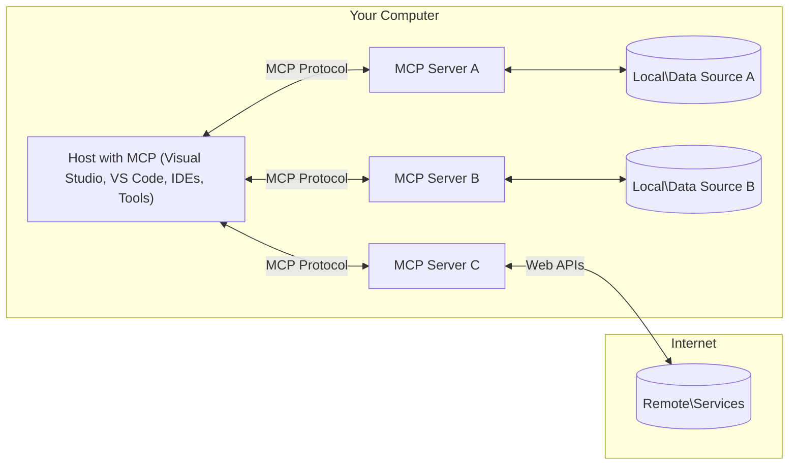

<!--
CO_OP_TRANSLATOR_METADATA:
{
  "original_hash": "904b59de1de9264801242d90a42cdd9d",
  "translation_date": "2025-09-05T11:28:50+00:00",
  "source_file": "01-CoreConcepts/README.md",
  "language_code": "cs"
}
-->
# MCP Základní koncepty: Ovládnutí Model Context Protocol pro integraci AI

[](https://youtu.be/earDzWGtE84)

_(Klikněte na obrázek výše pro zhlédnutí videa této lekce)_

[Model Context Protocol (MCP)](https://github.com/modelcontextprotocol) je výkonný, standardizovaný rámec, který optimalizuje komunikaci mezi velkými jazykovými modely (LLMs) a externími nástroji, aplikacemi a datovými zdroji. 
Tento průvodce vás provede základními koncepty MCP. Naučíte se o jeho architektuře klient-server, klíčových komponentách, mechanismech komunikace a osvědčených postupech implementace.

- **Explicitní souhlas uživatele**: Veškerý přístup k datům a operace vyžadují explicitní schválení uživatelem před provedením. Uživatelé musí jasně rozumět tomu, jaká data budou přístupná a jaké akce budou provedeny, s podrobnou kontrolou oprávnění a autorizací.

- **Ochrana soukromí dat**: Uživatelská data jsou zpřístupněna pouze s explicitním souhlasem a musí být chráněna robustními kontrolami přístupu po celou dobu interakce. Implementace musí zabránit neoprávněnému přenosu dat a udržovat přísné hranice soukromí.

- **Bezpečnost provádění nástrojů**: Každé spuštění nástroje vyžaduje explicitní souhlas uživatele s jasným pochopením funkcionality nástroje, parametrů a potenciálního dopadu. Robustní bezpečnostní hranice musí zabránit nechtěnému, nebezpečnému nebo škodlivému spuštění nástroje.

- **Bezpečnost transportní vrstvy**: Všechny komunikační kanály by měly používat vhodné šifrovací a autentizační mechanismy. Vzdálené připojení by mělo implementovat bezpečné transportní protokoly a správu přihlašovacích údajů.

#### Pokyny k implementaci:

- **Správa oprávnění**: Implementujte detailní systémy oprávnění, které umožní uživatelům kontrolovat, které servery, nástroje a zdroje jsou přístupné.
- **Autentizace a autorizace**: Používejte bezpečné metody autentizace (OAuth, API klíče) s řádnou správou tokenů a jejich expirací.  
- **Validace vstupů**: Validujte všechny parametry a vstupy dat podle definovaných schémat, aby se zabránilo útokům typu injekce.
- **Auditní logování**: Udržujte komplexní záznamy všech operací pro monitorování bezpečnosti a dodržování předpisů.

## Přehled

Tato lekce zkoumá základní architekturu a komponenty, které tvoří ekosystém Model Context Protocol (MCP). Naučíte se o architektuře klient-server, klíčových komponentách a mechanismech komunikace, které pohánějí interakce MCP.

## Klíčové cíle učení

Na konci této lekce budete:

- Rozumět architektuře klient-server MCP.
- Identifikovat role a odpovědnosti Hostů, Klientů a Serverů.
- Analyzovat klíčové funkce, které dělají z MCP flexibilní integrační vrstvu.
- Naučit se, jak informace proudí v ekosystému MCP.
- Získat praktické poznatky prostřednictvím ukázek kódu v .NET, Java, Python a JavaScript.

## Architektura MCP: Podrobný pohled

Ekosystém MCP je postaven na modelu klient-server. Tato modulární struktura umožňuje AI aplikacím efektivně komunikovat s nástroji, databázemi, API a kontextovými zdroji. Pojďme si rozdělit tuto architekturu na její základní komponenty.

V jádru MCP sleduje architekturu klient-server, kde hostitelská aplikace může připojit více serverů:



- **MCP Hosté**: Programy jako VSCode, Claude Desktop, IDE nebo AI nástroje, které chtějí přistupovat k datům prostřednictvím MCP.
- **MCP Klienti**: Protokoloví klienti, kteří udržují 1:1 připojení k serverům.
- **MCP Servery**: Lehký software, který poskytuje specifické schopnosti prostřednictvím standardizovaného Model Context Protocol.
- **Lokální datové zdroje**: Soubory, databáze a služby vašeho počítače, ke kterým mohou MCP servery bezpečně přistupovat.
- **Vzdálené služby**: Externí systémy dostupné přes internet, ke kterým se MCP servery mohou připojit prostřednictvím API.

Protokol MCP je vyvíjející se standard používající verzování založené na datu (formát YYYY-MM-DD). Aktuální verze protokolu je **2025-06-18**. Nejnovější aktualizace specifikace protokolu najdete na [protocol specification](https://modelcontextprotocol.io/specification/2025-06-18/).

### 1. Hosté

V Model Context Protocol (MCP) jsou **Hosté** AI aplikace, které slouží jako primární rozhraní, prostřednictvím kterého uživatelé interagují s protokolem. Hosté koordinují a spravují připojení k více MCP serverům tím, že vytvářejí dedikované MCP klienty pro každé připojení k serveru. Příklady Hostů zahrnují:

- **AI aplikace**: Claude Desktop, Visual Studio Code, Claude Code.
- **Vývojová prostředí**: IDE a editory kódu s integrací MCP.  
- **Vlastní aplikace**: Speciálně vytvoření AI agenti a nástroje.

**Hosté** jsou aplikace, které koordinují interakce AI modelů. Provádějí:

- **Orchestraci AI modelů**: Spouštění nebo interakci s LLMs za účelem generování odpovědí a koordinace AI pracovních postupů.
- **Správu klientských připojení**: Vytváření a udržování jednoho MCP klienta na každé připojení k MCP serveru.
- **Kontrolu uživatelského rozhraní**: Řízení toku konverzace, interakcí uživatele a prezentace odpovědí.  
- **Zajištění bezpečnosti**: Kontrola oprávnění, bezpečnostních omezení a autentizace.
- **Správu souhlasu uživatele**: Řízení schválení uživatele pro sdílení dat a spuštění nástrojů.

### 2. Klienti

**Klienti** jsou klíčové komponenty, které udržují dedikované jedno-na-jedno připojení mezi Hosty a MCP servery. Každý MCP klient je vytvořen Hostem pro připojení ke konkrétnímu MCP serveru, což zajišťuje organizované a bezpečné komunikační kanály. Více klientů umožňuje Hostům připojit se k více serverům současně.

**Klienti** jsou konektorové komponenty v hostitelské aplikaci. Provádějí:

- **Komunikaci protokolu**: Posílání JSON-RPC 2.0 požadavků na servery s výzvami a instrukcemi.
- **Vyjednávání schopností**: Vyjednávání podporovaných funkcí a verzí protokolu se servery během inicializace.
- **Spouštění nástrojů**: Správa požadavků na spuštění nástrojů od modelů a zpracování odpovědí.
- **Aktualizace v reálném čase**: Zpracování notifikací a aktualizací v reálném čase od serverů.
- **Zpracování odpovědí**: Zpracování a formátování odpovědí serverů pro zobrazení uživatelům.

### 3. Servery

**Servery** jsou programy, které poskytují kontext, nástroje a schopnosti MCP klientům. Mohou být spuštěny lokálně (na stejném zařízení jako Host) nebo vzdáleně (na externích platformách) a jsou odpovědné za zpracování požadavků klientů a poskytování strukturovaných odpovědí. Servery poskytují specifickou funkcionalitu prostřednictvím standardizovaného Model Context Protocol.

**Servery** jsou služby, které poskytují kontext a schopnosti. Provádějí:

- **Registraci funkcí**: Registraci a zpřístupnění dostupných primitiv (zdrojů, výzev, nástrojů) klientům.
- **Zpracování požadavků**: Přijímání a provádění volání nástrojů, požadavků na zdroje a výzev od klientů.
- **Poskytování kontextu**: Poskytování kontextových informací a dat pro zlepšení odpovědí modelu.
- **Správu stavu**: Udržování stavu relace a zpracování stavových interakcí, pokud je to potřeba.
- **Notifikace v reálném čase**: Posílání notifikací o změnách schopností a aktualizacích připojeným klientům.

Servery mohou být vyvíjeny kýmkoliv za účelem rozšíření schopností modelu o specializovanou funkcionalitu a podporují jak lokální, tak vzdálené scénáře nasazení.

### 4. Primitivy serveru

Servery v Model Context Protocol (MCP) poskytují tři základní **primitivy**, které definují základní stavební bloky pro bohaté interakce mezi klienty, hosty a jazykovými modely. Tyto primitivy specifikují typy kontextových informací a akcí dostupných prostřednictvím protokolu.

MCP servery mohou zpřístupnit libovolnou kombinaci následujících tří základních primitiv:

#### Zdroje

**Zdroje** jsou datové zdroje, které poskytují kontextové informace AI aplikacím. Reprezentují statický nebo dynamický obsah, který může zlepšit porozumění modelu a rozhodování:

- **Kontextová data**: Strukturované informace a kontext pro spotřebu AI modelu.
- **Znalostní báze**: Repozitáře dokumentů, články, manuály a výzkumné práce.
- **Lokální datové zdroje**: Soubory, databáze a informace o lokálním systému.  
- **Externí data**: Odpovědi API, webové služby a data vzdálených systémů.
- **Dynamický obsah**: Data v reálném čase, která se aktualizují na základě externích podmínek.

Zdroje jsou identifikovány pomocí URI a podporují objevování prostřednictvím metod `resources/list` a získávání prostřednictvím `resources/read`:

```text
file://documents/project-spec.md
database://production/users/schema
api://weather/current
```

#### Výzvy

**Výzvy** jsou opakovaně použitelné šablony, které pomáhají strukturovat interakce s jazykovými modely. Poskytují standardizované vzory interakcí a šablonované pracovní postupy:

- **Interakce založené na šablonách**: Předem strukturované zprávy a zahájení konverzace.
- **Šablony pracovních postupů**: Standardizované sekvence pro běžné úkoly a interakce.
- **Few-shot příklady**: Šablony založené na příkladech pro instrukce modelu.
- **Systémové výzvy**: Základní výzvy, které definují chování modelu a kontext.
- **Dynamické šablony**: Šablony s parametry, které se přizpůsobují specifickým kontextům.

Výzvy podporují substituci proměnných a mohou být objeveny prostřednictvím `prompts/list` a získány pomocí `prompts/get`:

```markdown
Generate a {{task_type}} for {{product}} targeting {{audience}} with the following requirements: {{requirements}}
```

#### Nástroje

**Nástroje** jsou spustitelné funkce, které mohou AI modely vyvolat k provedení specifických akcí. Reprezentují "slovesa" ekosystému MCP, umožňující modelům interakci s externími systémy:

- **Spustitelné funkce**: Diskrétní operace, které modely mohou vyvolat s konkrétními parametry.
- **Integrace externích systémů**: Volání API, dotazy na databáze, operace se soubory, výpočty.
- **Jedinečná identita**: Každý nástroj má jedinečný název, popis a schéma parametrů.
- **Strukturované I/O**: Nástroje přijímají validované parametry a vracejí strukturované, typované odpovědi.
- **Akční schopnosti**: Umožňují modelům provádět reálné akce a získávat aktuální data.

Nástroje jsou definovány pomocí JSON Schema pro validaci parametrů a objeveny prostřednictvím `tools/list` a spuštěny pomocí `tools/call`:

```typescript
server.tool(
  "search_products", 
  {
    query: z.string().describe("Search query for products"),
    category: z.string().optional().describe("Product category filter"),
    max_results: z.number().default(10).describe("Maximum results to return")
  }, 
  async (params) => {
    // Execute search and return structured results
    return await productService.search(params);
  }
);
```

## Primitivy klienta

V Model Context Protocol (MCP) mohou **klienti** zpřístupnit primitivy, které umožňují serverům požadovat další schopnosti od hostitelské aplikace. Tyto primitivy na straně klienta umožňují bohatší, interaktivnější implementace serverů, které mohou přistupovat ke schopnostem AI modelů a interakcím uživatelů.

### Sampling

**Sampling** umožňuje serverům požadovat dokončení jazykového modelu od AI aplikace klienta. Tento primitiv umožňuje serverům přístup ke schopnostem LLM bez nutnosti vlastních závislostí na modelech:

- **Přístup nezávislý na modelu**: Servery mohou požadovat dokončení bez zahrnutí SDK LLM nebo správy přístupu k modelu.
- **Serverem iniciované AI**: Umožňuje serverům autonomně generovat obsah pomocí AI modelu klienta.
- **Rekurzivní interakce LLM**: Podporuje složité scénáře, kde servery potřebují AI asistenci pro zpracování.
- **Dynamické generování obsahu**: Umožňuje serverům vytvářet kontextové odpovědi pomocí modelu hostitele.

Sampling je iniciován prostřednictvím metody `sampling/complete`, kde servery posílají požadavky na dokončení klientům.

### Elicitation  

**Elicitation** umožňuje serverům požadovat další informace nebo potvrzení od uživatelů prostřednictvím rozhraní klienta:

- **Požadavky na vstup uživatele**: Servery mohou požádat o další informace, pokud jsou potřebné pro spuštění nástroje.
- **Dialogy potvrzení**: Požadavek na schválení uživatele pro citlivé nebo významné operace.
- **Interaktivní pracovní postupy**: Umožňuje serverům vytvářet krok za krokem interakce s uživatelem.
- **Dynamické shromažďování parametrů**: Shromažďování chybějících nebo volitelných parametrů během spuštění nástroje.

Požadavky na elicitation jsou prováděny pomocí metody `elicitation/request` pro sběr vstupů uživatele prostřednictvím rozhraní klienta.

### Logging

**Logging** umožňuje serverům posílat strukturované logovací zprávy klientům pro ladění, monitorování a viditelnost operací:

- **Podpora ladění**: Umožňuje serverům poskytovat podrobné logy provádění pro odstraňování problémů.
- **Monitorování operací**: Posílání aktualizací stavu a výkonových metrik klientům.
- **Hlášení chyb**: Poskytování podrobného kontextu chyb a diagnostických informací.
- **Auditní stopy**: Vytváření komplexních záznamů operací serveru a rozhodnutí.

Logovací zprávy jsou posílány klientům, aby poskytly transparentnost operací serveru a usnadnily ladění.

## Tok informací v MCP

Model Context Protocol (MCP) definuje strukturovaný tok informací mezi hosty, klienty, servery a modely. Porozumění tomuto toku pomáhá objasnit, jak jsou uživatelské požadavky zpracovány a jak jsou externí nástroje a data integrovány do odpovědí modelu.

- **Host iniciuje připojení**  
  Hostitelská aplikace (například IDE nebo chatovací rozhraní) naváže připojení k MCP serveru, obvykle prostřednictvím STDIO, WebSocket nebo jiného podporovaného transportu.

- **Vyjednávání schopností**  
  Klient (vložený v hostiteli) a server si vyměňují informace o svých podporovaných funkcích, nástrojích, zdrojích a verzích protokolu. To zajišťuje, že obě strany rozumí dostupným schopnostem pro relaci.

- **Požadavek uživatele**  
  Uživatel
- **JSON-RPC 2.0 Protokol**: Veškerá komunikace využívá standardizovaný formát zpráv JSON-RPC 2.0 pro volání metod, odpovědi a oznámení  
- **Správa životního cyklu**: Zajišťuje inicializaci spojení, vyjednávání schopností a ukončení relace mezi klienty a servery  
- **Serverové primitivy**: Umožňuje serverům poskytovat základní funkce prostřednictvím nástrojů, zdrojů a šablon  
- **Klientské primitivy**: Umožňuje serverům požadovat vzorkování od LLM, získávat vstupy od uživatelů a odesílat logovací zprávy  
- **Oznámení v reálném čase**: Podporuje asynchronní oznámení pro dynamické aktualizace bez nutnosti dotazování  

#### Klíčové vlastnosti:

- **Vyjednávání verze protokolu**: Používá verzování založené na datu (YYYY-MM-DD) pro zajištění kompatibility  
- **Objevování schopností**: Klienti a servery si během inicializace vyměňují informace o podporovaných funkcích  
- **Stavové relace**: Udržuje stav spojení napříč více interakcemi pro zachování kontextu  

### Transportní vrstva

**Transportní vrstva** spravuje komunikační kanály, rámcování zpráv a autentizaci mezi účastníky MCP:

#### Podporované transportní mechanismy:

1. **STDIO Transport**:
   - Používá standardní vstupní/výstupní proudy pro přímou komunikaci mezi procesy  
   - Optimální pro lokální procesy na stejném zařízení bez síťové režie  
   - Běžně používané pro lokální implementace MCP serverů  

2. **Streamovatelné HTTP Transport**:
   - Používá HTTP POST pro zprávy od klienta k serveru  
   - Volitelné Server-Sent Events (SSE) pro streamování od serveru ke klientovi  
   - Umožňuje komunikaci s vzdálenými servery přes sítě  
   - Podporuje standardní HTTP autentizaci (bearer tokeny, API klíče, vlastní hlavičky)  
   - MCP doporučuje OAuth pro bezpečnou autentizaci založenou na tokenech  

#### Abstrakce transportu:

Transportní vrstva abstrahuje detaily komunikace od datové vrstvy, což umožňuje použití stejného formátu zpráv JSON-RPC 2.0 napříč všemi transportními mechanismy. Tato abstrakce umožňuje aplikacím bezproblémově přepínat mezi lokálními a vzdálenými servery.

### Bezpečnostní aspekty

Implementace MCP musí dodržovat několik klíčových bezpečnostních principů, aby zajistily bezpečné, důvěryhodné a zabezpečené interakce napříč všemi operacemi protokolu:

- **Souhlas a kontrola uživatele**: Uživatelé musí poskytnout explicitní souhlas před přístupem k datům nebo provedením operací. Měli by mít jasnou kontrolu nad tím, jaká data jsou sdílena a jaké akce jsou autorizovány, podpořenou intuitivním uživatelským rozhraním pro přezkoumání a schválení aktivit.

- **Ochrana soukromí dat**: Uživatelská data by měla být zpřístupněna pouze s explicitním souhlasem a musí být chráněna vhodnými přístupovými kontrolami. Implementace MCP musí zabránit neoprávněnému přenosu dat a zajistit, že soukromí je zachováno během všech interakcí.

- **Bezpečnost nástrojů**: Před použitím jakéhokoliv nástroje je vyžadován explicitní souhlas uživatele. Uživatelé by měli mít jasné pochopení funkcionality každého nástroje a musí být zajištěny robustní bezpečnostní hranice, aby se zabránilo neúmyslnému nebo nebezpečnému spuštění nástroje.

Dodržováním těchto bezpečnostních principů MCP zajišťuje důvěru uživatelů, ochranu soukromí a bezpečnost napříč všemi interakcemi protokolu, zatímco umožňuje výkonné integrace AI.

## Příklady kódu: Klíčové komponenty

Níže jsou uvedeny příklady kódu v několika populárních programovacích jazycích, které ilustrují, jak implementovat klíčové komponenty MCP serveru a nástrojů.

### Příklad .NET: Vytvoření jednoduchého MCP serveru s nástroji

Zde je praktický příklad kódu v .NET, který demonstruje, jak implementovat jednoduchý MCP server s vlastními nástroji. Tento příklad ukazuje, jak definovat a registrovat nástroje, zpracovávat požadavky a připojit server pomocí Model Context Protocol.

```csharp
using System;
using System.Threading.Tasks;
using ModelContextProtocol.Server;
using ModelContextProtocol.Server.Transport;
using ModelContextProtocol.Server.Tools;

public class WeatherServer
{
    public static async Task Main(string[] args)
    {
        // Create an MCP server
        var server = new McpServer(
            name: "Weather MCP Server",
            version: "1.0.0"
        );
        
        // Register our custom weather tool
        server.AddTool<string, WeatherData>("weatherTool", 
            description: "Gets current weather for a location",
            execute: async (location) => {
                // Call weather API (simplified)
                var weatherData = await GetWeatherDataAsync(location);
                return weatherData;
            });
        
        // Connect the server using stdio transport
        var transport = new StdioServerTransport();
        await server.ConnectAsync(transport);
        
        Console.WriteLine("Weather MCP Server started");
        
        // Keep the server running until process is terminated
        await Task.Delay(-1);
    }
    
    private static async Task<WeatherData> GetWeatherDataAsync(string location)
    {
        // This would normally call a weather API
        // Simplified for demonstration
        await Task.Delay(100); // Simulate API call
        return new WeatherData { 
            Temperature = 72.5,
            Conditions = "Sunny",
            Location = location
        };
    }
}

public class WeatherData
{
    public double Temperature { get; set; }
    public string Conditions { get; set; }
    public string Location { get; set; }
}
```

### Příklad Java: Komponenty MCP serveru

Tento příklad demonstruje stejný MCP server a registraci nástrojů jako výše uvedený příklad v .NET, ale implementovaný v Javě.

```java
import io.modelcontextprotocol.server.McpServer;
import io.modelcontextprotocol.server.McpToolDefinition;
import io.modelcontextprotocol.server.transport.StdioServerTransport;
import io.modelcontextprotocol.server.tool.ToolExecutionContext;
import io.modelcontextprotocol.server.tool.ToolResponse;

public class WeatherMcpServer {
    public static void main(String[] args) throws Exception {
        // Create an MCP server
        McpServer server = McpServer.builder()
            .name("Weather MCP Server")
            .version("1.0.0")
            .build();
            
        // Register a weather tool
        server.registerTool(McpToolDefinition.builder("weatherTool")
            .description("Gets current weather for a location")
            .parameter("location", String.class)
            .execute((ToolExecutionContext ctx) -> {
                String location = ctx.getParameter("location", String.class);
                
                // Get weather data (simplified)
                WeatherData data = getWeatherData(location);
                
                // Return formatted response
                return ToolResponse.content(
                    String.format("Temperature: %.1f°F, Conditions: %s, Location: %s", 
                    data.getTemperature(), 
                    data.getConditions(), 
                    data.getLocation())
                );
            })
            .build());
        
        // Connect the server using stdio transport
        try (StdioServerTransport transport = new StdioServerTransport()) {
            server.connect(transport);
            System.out.println("Weather MCP Server started");
            // Keep server running until process is terminated
            Thread.currentThread().join();
        }
    }
    
    private static WeatherData getWeatherData(String location) {
        // Implementation would call a weather API
        // Simplified for example purposes
        return new WeatherData(72.5, "Sunny", location);
    }
}

class WeatherData {
    private double temperature;
    private String conditions;
    private String location;
    
    public WeatherData(double temperature, String conditions, String location) {
        this.temperature = temperature;
        this.conditions = conditions;
        this.location = location;
    }
    
    public double getTemperature() {
        return temperature;
    }
    
    public String getConditions() {
        return conditions;
    }
    
    public String getLocation() {
        return location;
    }
}
```

### Příklad Python: Vytvoření MCP serveru

Tento příklad používá fastmcp, ujistěte se, že jej nejprve nainstalujete:

```python
pip install fastmcp
```  
Ukázka kódu:

```python
#!/usr/bin/env python3
import asyncio
from fastmcp import FastMCP
from fastmcp.transports.stdio import serve_stdio

# Create a FastMCP server
mcp = FastMCP(
    name="Weather MCP Server",
    version="1.0.0"
)

@mcp.tool()
def get_weather(location: str) -> dict:
    """Gets current weather for a location."""
    return {
        "temperature": 72.5,
        "conditions": "Sunny",
        "location": location
    }

# Alternative approach using a class
class WeatherTools:
    @mcp.tool()
    def forecast(self, location: str, days: int = 1) -> dict:
        """Gets weather forecast for a location for the specified number of days."""
        return {
            "location": location,
            "forecast": [
                {"day": i+1, "temperature": 70 + i, "conditions": "Partly Cloudy"}
                for i in range(days)
            ]
        }

# Register class tools
weather_tools = WeatherTools()

# Start the server
if __name__ == "__main__":
    asyncio.run(serve_stdio(mcp))
```

### Příklad JavaScript: Vytvoření MCP serveru

Tento příklad ukazuje vytvoření MCP serveru v JavaScriptu a jak zaregistrovat dva nástroje související s počasím.

```javascript
// Using the official Model Context Protocol SDK
import { McpServer } from "@modelcontextprotocol/sdk/server/mcp.js";
import { StdioServerTransport } from "@modelcontextprotocol/sdk/server/stdio.js";
import { z } from "zod"; // For parameter validation

// Create an MCP server
const server = new McpServer({
  name: "Weather MCP Server",
  version: "1.0.0"
});

// Define a weather tool
server.tool(
  "weatherTool",
  {
    location: z.string().describe("The location to get weather for")
  },
  async ({ location }) => {
    // This would normally call a weather API
    // Simplified for demonstration
    const weatherData = await getWeatherData(location);
    
    return {
      content: [
        { 
          type: "text", 
          text: `Temperature: ${weatherData.temperature}°F, Conditions: ${weatherData.conditions}, Location: ${weatherData.location}` 
        }
      ]
    };
  }
);

// Define a forecast tool
server.tool(
  "forecastTool",
  {
    location: z.string(),
    days: z.number().default(3).describe("Number of days for forecast")
  },
  async ({ location, days }) => {
    // This would normally call a weather API
    // Simplified for demonstration
    const forecast = await getForecastData(location, days);
    
    return {
      content: [
        { 
          type: "text", 
          text: `${days}-day forecast for ${location}: ${JSON.stringify(forecast)}` 
        }
      ]
    };
  }
);

// Helper functions
async function getWeatherData(location) {
  // Simulate API call
  return {
    temperature: 72.5,
    conditions: "Sunny",
    location: location
  };
}

async function getForecastData(location, days) {
  // Simulate API call
  return Array.from({ length: days }, (_, i) => ({
    day: i + 1,
    temperature: 70 + Math.floor(Math.random() * 10),
    conditions: i % 2 === 0 ? "Sunny" : "Partly Cloudy"
  }));
}

// Connect the server using stdio transport
const transport = new StdioServerTransport();
server.connect(transport).catch(console.error);

console.log("Weather MCP Server started");
```

Tento příklad v JavaScriptu demonstruje, jak vytvořit MCP klienta, který se připojí k serveru, odešle výzvu a zpracuje odpověď včetně jakýchkoliv volání nástrojů, která byla provedena.

## Bezpečnost a autorizace

MCP zahrnuje několik vestavěných konceptů a mechanismů pro správu bezpečnosti a autorizace v rámci protokolu:

1. **Kontrola oprávnění nástrojů**:  
   Klienti mohou specifikovat, které nástroje může model během relace používat. To zajišťuje, že jsou přístupné pouze explicitně autorizované nástroje, což snižuje riziko neúmyslných nebo nebezpečných operací. Oprávnění lze dynamicky konfigurovat na základě preferencí uživatele, organizačních politik nebo kontextu interakce.

2. **Autentizace**:  
   Servery mohou vyžadovat autentizaci před poskytnutím přístupu k nástrojům, zdrojům nebo citlivým operacím. To může zahrnovat API klíče, OAuth tokeny nebo jiné autentizační schémata. Správná autentizace zajišťuje, že pouze důvěryhodní klienti a uživatelé mohou využívat schopnosti serveru.

3. **Validace**:  
   Validace parametrů je vynucována pro všechna volání nástrojů. Každý nástroj definuje očekávané typy, formáty a omezení pro své parametry a server validuje příchozí požadavky odpovídajícím způsobem. To zabraňuje chybnému nebo škodlivému vstupu, aby dosáhl implementace nástrojů, a pomáhá udržovat integritu operací.

4. **Omezení rychlosti**:  
   Aby se zabránilo zneužití a zajistilo spravedlivé využití serverových zdrojů, MCP servery mohou implementovat omezení rychlosti pro volání nástrojů a přístup ke zdrojům. Omezení rychlosti lze aplikovat na uživatele, relaci nebo globálně a pomáhá chránit proti útokům typu denial-of-service nebo nadměrnému využívání zdrojů.

Kombinací těchto mechanismů MCP poskytuje bezpečný základ pro integraci jazykových modelů s externími nástroji a datovými zdroji, přičemž uživatelům a vývojářům poskytuje jemně odstupňovanou kontrolu nad přístupem a využitím.

## Zprávy protokolu a tok komunikace

Komunikace MCP využívá strukturované **JSON-RPC 2.0** zprávy k usnadnění jasných a spolehlivých interakcí mezi hostiteli, klienty a servery. Protokol definuje specifické vzory zpráv pro různé typy operací:

### Základní typy zpráv:

#### **Inicializační zprávy**
- **`initialize` Požadavek**: Navazuje spojení a vyjednává verzi protokolu a schopnosti  
- **`initialize` Odpověď**: Potvrzuje podporované funkce a informace o serveru  
- **`notifications/initialized`**: Signalizuje, že inicializace je dokončena a relace je připravena  

#### **Zprávy pro objevování**
- **`tools/list` Požadavek**: Zjišťuje dostupné nástroje ze serveru  
- **`resources/list` Požadavek**: Uvádí dostupné zdroje (datové zdroje)  
- **`prompts/list` Požadavek**: Získává dostupné šablony výzev  

#### **Zprávy pro provádění**  
- **`tools/call` Požadavek**: Spouští konkrétní nástroj s poskytnutými parametry  
- **`resources/read` Požadavek**: Získává obsah z konkrétního zdroje  
- **`prompts/get` Požadavek**: Načítá šablonu výzvy s volitelnými parametry  

#### **Zprávy na straně klienta**
- **`sampling/complete` Požadavek**: Server požaduje dokončení LLM od klienta  
- **`elicitation/request`**: Server požaduje vstup uživatele prostřednictvím klientského rozhraní  
- **Logovací zprávy**: Server odesílá strukturované logovací zprávy klientovi  

#### **Oznamovací zprávy**
- **`notifications/tools/list_changed`**: Server informuje klienta o změnách nástrojů  
- **`notifications/resources/list_changed`**: Server informuje klienta o změnách zdrojů  
- **`notifications/prompts/list_changed`**: Server informuje klienta o změnách šablon výzev  

### Struktura zpráv:

Všechny zprávy MCP dodržují formát JSON-RPC 2.0 s:  
- **Požadavkové zprávy**: Obsahují `id`, `method` a volitelné `params`  
- **Odpovědní zprávy**: Obsahují `id` a buď `result` nebo `error`  
- **Oznamovací zprávy**: Obsahují `method` a volitelné `params` (neobsahují `id` ani nevyžadují odpověď)  

Tato strukturovaná komunikace zajišťuje spolehlivé, sledovatelné a rozšiřitelné interakce podporující pokročilé scénáře jako dynamické aktualizace, řetězení nástrojů a robustní zpracování chyb.

## Klíčové poznatky

- **Architektura**: MCP využívá architekturu klient-server, kde hostitelé spravují více klientských připojení k serverům  
- **Účastníci**: Ekosystém zahrnuje hostitele (AI aplikace), klienty (protokolové konektory) a servery (poskytovatele schopností)  
- **Transportní mechanismy**: Komunikace podporuje STDIO (lokální) a Streamovatelné HTTP s volitelným SSE (vzdálené)  
- **Základní primitivy**: Servery zpřístupňují nástroje (spustitelné funkce), zdroje (datové zdroje) a šablony (výzvy)  
- **Klientské primitivy**: Servery mohou požadovat vzorkování (LLM dokončení), získávání vstupů (uživatelské vstupy) a logování od klientů  
- **Základ protokolu**: Postaven na JSON-RPC 2.0 s verzováním založeným na datu (aktuální: 2025-06-18)  
- **Schopnosti v reálném čase**: Podporuje oznámení pro dynamické aktualizace a synchronizaci v reálném čase  
- **Bezpečnost na prvním místě**: Explicitní souhlas uživatele, ochrana soukromí dat a zabezpečený transport jsou klíčové požadavky  

## Cvičení

Navrhněte jednoduchý MCP nástroj, který by byl užitečný ve vašem oboru. Definujte:  
1. Jak by se nástroj jmenoval  
2. Jaké parametry by přijímal  
3. Jaký výstup by vracel  
4. Jak by model mohl tento nástroj použít k řešení problémů uživatele  

---

## Co dál

Další: [Kapitola 2: Bezpečnost](../02-Security/README.md)

---

**Prohlášení**:  
Tento dokument byl přeložen pomocí služby pro automatický překlad [Co-op Translator](https://github.com/Azure/co-op-translator). I když se snažíme o co největší přesnost, mějte prosím na paměti, že automatické překlady mohou obsahovat chyby nebo nepřesnosti. Původní dokument v jeho původním jazyce by měl být považován za závazný zdroj. Pro důležité informace doporučujeme profesionální lidský překlad. Neodpovídáme za žádná nedorozumění nebo nesprávné výklady vyplývající z použití tohoto překladu.