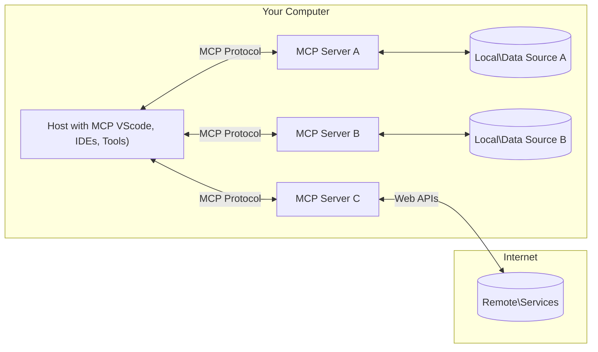

<!--
CO_OP_TRANSLATOR_METADATA:
{
  "original_hash": "b3b4a6ad10c3c0edbf7fa7cfa0ec496b",
  "translation_date": "2025-07-02T07:30:55+00:00",
  "source_file": "01-CoreConcepts/README.md",
  "language_code": "cs"
}
-->
# 📖 MCP Základní koncepty: Ovládnutí Model Context Protocol pro AI integraci

[Model Context Protocol (MCP)](https://github.com/modelcontextprotocol) je výkonný, standardizovaný rámec, který optimalizuje komunikaci mezi velkými jazykovými modely (LLM) a externími nástroji, aplikacemi a zdroji dat. Tento SEO-optimalizovaný průvodce vás provede základními koncepty MCP, abyste porozuměli jeho klient-server architektuře, klíčovým komponentám, mechanikám komunikace a osvědčeným postupům implementace.

## Přehled

Tato lekce zkoumá základní architekturu a komponenty, které tvoří ekosystém Model Context Protocol (MCP). Naučíte se o klient-server architektuře, klíčových součástech a komunikačních mechanismech, které umožňují interakce v rámci MCP.

## 👩‍🎓 Hlavní cíle učení

Na konci této lekce budete:

- Rozumět klient-server architektuře MCP.
- Identifikovat role a odpovědnosti Hosts, Clients a Servers.
- Analyzovat klíčové vlastnosti, díky nimž je MCP flexibilní integrační vrstva.
- Pochopit, jak informace proudí v ekosystému MCP.
- Získat praktické poznatky prostřednictvím ukázek kódu v .NET, Java, Python a JavaScriptu.

## 🔎 Architektura MCP: Podrobnější pohled

Ekosystém MCP je postaven na modelu klient-server. Tato modulární struktura umožňuje AI aplikacím efektivně komunikovat s nástroji, databázemi, API a kontextovými zdroji. Pojďme si tuto architekturu rozebrat na základní komponenty.

V jádru MCP následuje klient-server architekturu, kde hostitelská aplikace může navázat spojení s více servery:



- **MCP Hosts**: Programy jako VSCode, Claude Desktop, IDE nebo AI nástroje, které chtějí získávat data přes MCP
- **MCP Clients**: Protokoloví klienti, kteří udržují 1:1 spojení se servery
- **MCP Servers**: Lehká aplikace, která vystavuje specifické funkce prostřednictvím standardizovaného Model Context Protocol
- **Lokální zdroje dat**: Soubory, databáze a služby ve vašem počítači, ke kterým MCP servery mohou bezpečně přistupovat
- **Vzdálené služby**: Externí systémy dostupné přes internet, ke kterým se MCP servery mohou připojit přes API.

MCP protokol je vyvíjející se standard, nejnovější aktualizace najdete v [specifikaci protokolu](https://modelcontextprotocol.io/specification/2025-06-18/)

### 1. Hosts

V Model Context Protocol (MCP) hrají Hosts klíčovou roli jako hlavní rozhraní, přes které uživatelé interagují s protokolem. Hosts jsou aplikace nebo prostředí, které zahajují spojení s MCP servery, aby získaly přístup k datům, nástrojům a promptům. Příklady Hosts zahrnují integrovaná vývojová prostředí (IDE) jako Visual Studio Code, AI nástroje jako Claude Desktop nebo na míru vytvořené agenty určené pro konkrétní úkoly.

**Hosts** jsou LLM aplikace, které zahajují spojení. Provádějí:

- Spouštění nebo interakci s AI modely pro generování odpovědí.
- Navazují spojení s MCP servery.
- Řídí tok konverzace a uživatelské rozhraní.
- Kontrolují oprávnění a bezpečnostní omezení.
- Zajišťují souhlas uživatele se sdílením dat a spouštěním nástrojů.

### 2. Clients

Clients jsou zásadní komponenty, které usnadňují interakci mezi Hosts a MCP servery. Klienti fungují jako prostředníci, kteří umožňují Hosts přístup a využití funkcí poskytovaných MCP servery. Hrají důležitou roli při zajišťování hladké komunikace a efektivní výměny dat v rámci architektury MCP.

**Clients** jsou konektory uvnitř hostitelské aplikace. Provádějí:

- Odesílání požadavků na servery s promptem/instrukcemi.
- Vyjednávání schopností se servery.
- Řízení požadavků na spuštění nástrojů od modelů.
- Zpracování a zobrazování odpovědí uživatelům.

### 3. Servers

Servers jsou odpovědné za zpracování požadavků od MCP klientů a poskytování vhodných odpovědí. Řídí různé operace, jako je získávání dat, spouštění nástrojů a generování promptů. Servery zajišťují, že komunikace mezi klienty a Hosts je efektivní a spolehlivá a udržují integritu procesu interakce.

**Servers** jsou služby, které poskytují kontext a funkce. Provádějí:

- Registraci dostupných funkcí (zdroje, prompty, nástroje)
- Přijímání a vykonávání volání nástrojů od klienta
- Poskytování kontextových informací pro lepší odpovědi modelu
- Vrácení výstupů zpět klientovi
- Udržování stavu během interakcí, pokud je to potřeba

Servery může vyvíjet kdokoliv, kdo chce rozšířit schopnosti modelu o specializované funkce.

### 4. Funkce serverů

Servery v Model Context Protocol (MCP) poskytují základní stavební bloky, které umožňují bohaté interakce mezi klienty, hosts a jazykovými modely. Tyto funkce jsou navrženy tak, aby rozšiřovaly schopnosti MCP nabídkou strukturovaného kontextu, nástrojů a promptů.

MCP servery mohou nabízet některou z následujících funkcí:

#### 📑 Zdroje

Zdroje v Model Context Protocol (MCP) zahrnují různé typy kontextu a dat, které mohou uživatelé nebo AI modely využívat. Patří sem:

- **Kontextová data**: Informace a kontext, které mohou uživatelé nebo AI modely využít pro rozhodování a plnění úkolů.
- **Znalostní báze a dokumentové repozitáře**: Sbírky strukturovaných i nestrukturovaných dat, jako jsou články, manuály a výzkumné práce, které poskytují cenné informace.
- **Lokální soubory a databáze**: Data uložená lokálně na zařízeních nebo v databázích, přístupná pro zpracování a analýzu.
- **API a webové služby**: Externí rozhraní a služby, které nabízejí další data a funkce, umožňující integraci s různými online zdroji a nástroji.

Příklad zdroje může být databázové schéma nebo soubor, ke kterému lze přistupovat takto:

```text
file://log.txt
database://schema
```

### 🤖 Prompty

Prompty v Model Context Protocol (MCP) zahrnují různé předdefinované šablony a vzory interakce, navržené k usnadnění pracovních postupů uživatelů a zlepšení komunikace. Patří sem:

- **Šablonované zprávy a pracovní postupy**: Předstrukturované zprávy a procesy, které uživatele vedou specifickými úkoly a interakcemi.
- **Předdefinované vzory interakce**: Standardizované sekvence akcí a odpovědí, které podporují konzistentní a efektivní komunikaci.
- **Specializované šablony konverzací**: Přizpůsobitelné šablony určené pro specifické typy konverzací, zajišťující relevantní a kontextově vhodné interakce.

Šablona promptu může vypadat například takto:

```markdown
Generate a product slogan based on the following {{product}} with the following {{keywords}}
```

#### ⛏️ Nástroje

Nástroje v Model Context Protocol (MCP) jsou funkce, které může AI model spustit k provedení konkrétních úkolů. Tyto nástroje jsou navrženy tak, aby rozšiřovaly schopnosti AI modelu poskytováním strukturovaných a spolehlivých operací. Klíčové vlastnosti zahrnují:

- **Funkce, které může AI model spouštět**: Nástroje jsou spustitelné funkce, které může AI model vyvolat pro různé úkoly.
- **Jedinečný název a popis**: Každý nástroj má jedinečný název a podrobný popis, který vysvětluje jeho účel a funkčnost.
- **Parametry a výstupy**: Nástroje přijímají specifické parametry a vrací strukturované výstupy, což zajišťuje konzistentní a předvídatelné výsledky.
- **Diskrétní funkce**: Nástroje vykonávají konkrétní funkce, jako jsou webové vyhledávání, výpočty nebo dotazy do databáze.

Příklad nástroje může vypadat takto:

```typescript
server.tool(
  "GetProducts",
  {
    pageSize: z.string().optional(),
    pageCount: z.string().optional()
  }, () => {
    // return results from API
  }
)
```

## Funkce klientů

V Model Context Protocol (MCP) klienti nabízejí serverům několik klíčových funkcí, které zvyšují celkovou funkčnost a interakci v rámci protokolu. Jednou z významných funkcí je Sampling.

### 👉 Sampling

- **Agentní chování iniciované serverem**: Klienti umožňují serverům autonomně zahajovat specifické akce nebo chování, čímž se rozšiřují dynamické schopnosti systému.
- **Rekurzivní interakce s LLM**: Tato funkce umožňuje rekurzivní interakce s velkými jazykovými modely (LLM), což umožňuje složitější a iterativní zpracování úkolů.
- **Požadování dalších dokončení modelu**: Servery mohou požadovat další dokončení od modelu, aby byly odpovědi komplexní a kontextově relevantní.

## Tok informací v MCP

Model Context Protocol (MCP) definuje strukturovaný tok informací mezi hosts, clients, servers a modely. Porozumění tomuto toku pomáhá objasnit, jak jsou zpracovávány uživatelské požadavky a jak jsou externí nástroje a data integrovány do odpovědí modelu.

- **Host zahajuje spojení**  
  Hostitelská aplikace (například IDE nebo chatovací rozhraní) naváže spojení s MCP serverem, obvykle přes STDIO, WebSocket nebo jiný podporovaný přenos.

- **Vyjednávání schopností**  
  Klient (vloženy v hostu) a server si vymění informace o podporovaných funkcích, nástrojích, zdrojích a verzích protokolu. To zajistí, že obě strany rozumí dostupným schopnostem pro danou relaci.

- **Uživatelský požadavek**  
  Uživatel interaguje s hostem (například zadá prompt nebo příkaz). Host shromáždí tento vstup a předá ho klientovi ke zpracování.

- **Použití zdroje nebo nástroje**  
  - Klient může požádat server o další kontext nebo zdroje (například soubory, záznamy v databázi nebo články ze znalostní báze), aby obohatil porozumění modelu.
  - Pokud model určí, že je potřeba nástroj (například pro získání dat, výpočet nebo volání API), klient odešle požadavek na spuštění nástroje serveru, specifikující název nástroje a parametry.

- **Vykonání serverem**  
  Server obdrží požadavek na zdroj nebo nástroj, provede potřebné operace (například spustí funkci, dotáže se databáze nebo načte soubor) a vrátí výsledky klientovi ve strukturovaném formátu.

- **Generování odpovědi**  
  Klient integruje odpovědi serveru (data ze zdrojů, výstupy nástrojů atd.) do probíhající interakce s modelem. Model využívá tyto informace k vytvoření komplexní a kontextově relevantní odpovědi.

- **Prezentace výsledku**  
  Host obdrží konečný výstup od klienta a zobrazí ho uživateli, často včetně jak textu generovaného modelem, tak výsledků ze spuštěných nástrojů nebo vyhledávání ve zdrojích.

Tento tok umožňuje MCP podporovat pokročilé, interaktivní a kontextově uvědomělé AI aplikace tím, že bezproblémově propojuje modely s externími nástroji a zdroji dat.

## Detaily protokolu

MCP (Model Context Protocol) je postaven na [JSON-RPC 2.0](https://www.jsonrpc.org/), který poskytuje standardizovaný, jazykově nezávislý formát zpráv pro komunikaci mezi hosts, clients a servers. Tento základ umožňuje spolehlivé, strukturované a rozšiřitelné interakce napříč různými platformami a programovacími jazyky.

### Klíčové vlastnosti protokolu

MCP rozšiřuje JSON-RPC 2.0 o další konvence pro volání nástrojů, přístup ke zdrojům a správu promptů. Podporuje více transportních vrstev (STDIO, WebSocket, SSE) a umožňuje bezpečnou, rozšiřitelnou a jazykově nezávislou komunikaci mezi komponentami.

#### 🧢 Základní protokol

- **Formát zpráv JSON-RPC**: Všechny požadavky a odpovědi používají specifikaci JSON-RPC 2.0, což zajišťuje konzistentní strukturu pro volání metod, parametry, výsledky a zpracování chyb.
- **Stavová spojení**: MCP relace udržují stav přes více požadavků, podporují probíhající konverzace, akumulaci kontextu a správu zdrojů.
- **Vyjednávání schopností**: Během navazování spojení si klienti a servery vyměňují informace o podporovaných funkcích, verzích protokolu, dostupných nástrojích a zdrojích. To zajišťuje, že obě strany rozumí schopnostem té druhé a mohou se přizpůsobit.

#### ➕ Další nástroje

Níže jsou uvedeny některé další nástroje a rozšíření protokolu, které MCP poskytuje pro lepší vývojářský zážitek a pokročilé scénáře:

- **Konfigurační možnosti**: MCP umožňuje dynamickou konfiguraci parametrů relace, jako jsou oprávnění nástrojů, přístup ke zdrojům a nastavení modelu, přizpůsobené každé interakci.
- **Sledování průběhu**: Dlouhotrvající operace mohou hlásit aktualizace průběhu, což umožňuje responzivní uživatelská rozhraní a lepší uživatelský zážitek při složitých úkolech.
- **Zrušení požadavků**: Klienti mohou zrušit probíhající požadavky, což umožňuje uživatelům přerušit operace, které již nejsou potřeba nebo trvají příliš dlouho.
- **Hlásení chyb**: Standardizované chybové zprávy a kódy pomáhají diagnostikovat problémy, elegantně zvládat selhání a poskytovat užitečnou zpětnou vazbu uživatelům a vývojářům.
- **Logování**: Klienti i servery mohou emitovat strukturované logy pro audit, ladění a monitorování interakcí protokolu.

Díky těmto vlastnostem MCP zajišťuje robustní, bezpečnou a flexibilní komunikaci mezi jazykovými modely a externími nástroji či zdroji dat.

### 🔐 Bezpečnostní aspekty

Implementace MCP by měly dodržovat několik klíčových bezpečnostních zásad, aby byla zajištěna bezpečná a důvěryhodná interakce:

- **Souhlas a kontrola uživatele**: Uživatelé musí dát výslovný souhlas před tím, než jsou data přístupná nebo operace provedeny. Měli by mít jasnou kontrolu nad tím, jaká data sdílejí a jaké akce autorizují, podpořeno intuitivními uživatelskými rozhraními pro revizi a schvalování činností.

- **Ochrana soukromí dat**: Data uživatelů by měla být zpřístupněna pouze s výslovným souhlasem a chráněna vhodnými přístupovými kontrolami. Implementace MCP musí zabránit neoprávněnému přenosu dat a zajistit ochranu soukromí během všech interakcí.

- **Bezpečnost nástrojů**: Před spuštěním jakéhokoliv nástroje je vyžadován výslovný souhlas uživatele. Uživatelé by měli jasně rozumět funkčnosti každého ná

**Prohlášení o vyloučení odpovědnosti**:  
Tento dokument byl přeložen pomocí AI překladatelské služby [Co-op Translator](https://github.com/Azure/co-op-translator). Přestože usilujeme o přesnost, mějte prosím na paměti, že automatizované překlady mohou obsahovat chyby nebo nepřesnosti. Původní dokument v jeho mateřském jazyce by měl být považován za autoritativní zdroj. Pro důležité informace se doporučuje profesionální lidský překlad. Nejsme odpovědní za jakékoli nedorozumění nebo nesprávné výklady vyplývající z použití tohoto překladu.