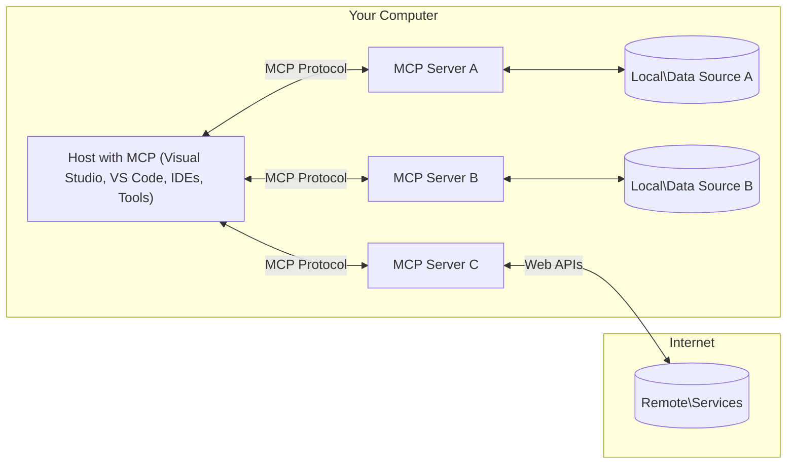

<!--
CO_OP_TRANSLATOR_METADATA:
{
  "original_hash": "88b863a69b4f18b15e82da358ffd3489",
  "translation_date": "2025-08-21T13:39:27+00:00",
  "source_file": "01-CoreConcepts/README.md",
  "language_code": "cs"
}
-->
# Základní koncepty MCP: Ovládnutí protokolu Model Context Protocol pro integraci AI

[](https://youtu.be/earDzWGtE84)

_(Klikněte na obrázek výše pro zhlédnutí videa této lekce)_

[Model Context Protocol (MCP)](https://github.com/modelcontextprotocol) je výkonný, standardizovaný rámec, který optimalizuje komunikaci mezi velkými jazykovými modely (LLMs) a externími nástroji, aplikacemi a datovými zdroji. Tento průvodce vás provede základními koncepty MCP. Naučíte se o jeho architektuře klient-server, klíčových komponentech, mechanismech komunikace a osvědčených postupech implementace.

- **Výslovný souhlas uživatele**: Veškerý přístup k datům a operace vyžadují před provedením výslovné schválení uživatelem. Uživatelé musí jasně rozumět tomu, k jakým datům bude přistupováno a jaké akce budou provedeny, s možností detailního nastavení oprávnění a autorizací.

- **Ochrana soukromí dat**: Uživatelská data jsou zpřístupněna pouze s výslovným souhlasem a musí být chráněna robustními kontrolami přístupu po celou dobu interakce. Implementace musí zabránit neoprávněnému přenosu dat a udržovat přísné hranice soukromí.

- **Bezpečnost spouštění nástrojů**: Každé spuštění nástroje vyžaduje výslovný souhlas uživatele s jasným pochopením funkčnosti nástroje, parametrů a možného dopadu. Robustní bezpečnostní hranice musí zabránit neúmyslnému, nebezpečnému nebo škodlivému spuštění nástroje.

- **Zabezpečení transportní vrstvy**: Všechny komunikační kanály by měly používat vhodné šifrovací a autentizační mechanismy. Vzdálená připojení by měla implementovat bezpečné transportní protokoly a správu přihlašovacích údajů.

#### Pokyny k implementaci:

- **Správa oprávnění**: Implementujte detailní systémy oprávnění, které umožní uživatelům kontrolovat, ke kterým serverům, nástrojům a zdrojům mají přístup.
- **Autentizace a autorizace**: Používejte bezpečné metody autentizace (OAuth, API klíče) s odpovídající správou tokenů a jejich expirací.  
- **Validace vstupů**: Validujte všechny parametry a vstupy dat podle definovaných schémat, abyste předešli útokům typu injection.
- **Auditní logování**: Udržujte komplexní záznamy všech operací pro monitorování bezpečnosti a zajištění souladu.

## Přehled

Tato lekce zkoumá základní architekturu a komponenty, které tvoří ekosystém Model Context Protocol (MCP). Dozvíte se o architektuře klient-server, klíčových komponentech a komunikačních mechanismech, které pohánějí interakce MCP.

## Klíčové cíle učení

Na konci této lekce budete:

- Rozumět architektuře klient-server MCP.
- Identifikovat role a odpovědnosti Hostů, Klientů a Serverů.
- Analyzovat klíčové funkce, díky nimž je MCP flexibilní integrační vrstvou.
- Pochopit, jak informace proudí v ekosystému MCP.
- Získat praktické poznatky prostřednictvím ukázek kódu v .NET, Java, Python a JavaScript.

## Architektura MCP: Detailní pohled

Ekosystém MCP je postaven na modelu klient-server. Tato modulární struktura umožňuje AI aplikacím efektivně interagovat s nástroji, databázemi, API a kontextovými zdroji. Pojďme si tuto architekturu rozdělit na její základní komponenty.

V jádru MCP následuje architekturu klient-server, kde hostitelská aplikace může být připojena k více serverům:



- **Hostitelé MCP**: Programy jako VSCode, Claude Desktop, IDE nebo AI nástroje, které chtějí přistupovat k datům prostřednictvím MCP.
- **Klienti MCP**: Protokoloví klienti, kteří udržují 1:1 připojení k serverům.
- **Servery MCP**: Lehkoprogramy, které poskytují specifické schopnosti prostřednictvím standardizovaného Model Context Protocol.
- **Lokální datové zdroje**: Soubory, databáze a služby na vašem počítači, ke kterým mohou servery MCP bezpečně přistupovat.
- **Vzdálené služby**: Externí systémy dostupné přes internet, ke kterým se servery MCP mohou připojit prostřednictvím API.

Protokol MCP je vyvíjející se standard používající verzování založené na datu (formát YYYY-MM-DD). Aktuální verze protokolu je **2025-06-18**. Nejnovější aktualizace specifikace protokolu naleznete na [protokolové specifikaci](https://modelcontextprotocol.io/specification/2025-06-18/).

### 1. Hostitelé

V Model Context Protocol (MCP) jsou **Hostitelé** AI aplikace, které slouží jako primární rozhraní, skrze které uživatelé interagují s protokolem. Hostitelé koordinují a spravují připojení k více serverům MCP vytvořením dedikovaných klientů MCP pro každé připojení k serveru. Příklady Hostitelů zahrnují:

- **AI aplikace**: Claude Desktop, Visual Studio Code, Claude Code.
- **Vývojová prostředí**: IDE a editory kódu s integrací MCP.  
- **Vlastní aplikace**: Speciálně vytvoření AI agenti a nástroje.

**Hostitelé** jsou aplikace, které koordinují interakce AI modelů. Provádějí:

- **Orchestrace AI modelů**: Spouštění nebo interakce s LLM pro generování odpovědí a koordinaci AI pracovních toků.
- **Správa připojení klientů**: Vytváření a udržování jednoho klienta MCP na jedno připojení k serveru MCP.
- **Ovládání uživatelského rozhraní**: Řízení toku konverzace, uživatelských interakcí a prezentace odpovědí.  
- **Zajištění bezpečnosti**: Kontrola oprávnění, bezpečnostních omezení a autentizace.
- **Správa souhlasu uživatele**: Řízení schválení uživatele pro sdílení dat a spouštění nástrojů.

### 2. Klienti

**Klienti** jsou klíčové komponenty, které udržují dedikovaná spojení 1:1 mezi Hostiteli a servery MCP. Každý klient MCP je vytvořen Hostitelem pro připojení ke konkrétnímu serveru MCP, čímž je zajištěna organizovaná a bezpečná komunikační cesta. Více klientů umožňuje Hostitelům připojit se k více serverům současně.

**Klienti** jsou konektorové komponenty v hostitelské aplikaci. Provádějí:

- **Komunikace protokolu**: Odesílání JSON-RPC 2.0 požadavků na servery s výzvami a instrukcemi.
- **Vyjednávání schopností**: Vyjednávání podporovaných funkcí a verzí protokolu se servery během inicializace.
- **Spouštění nástrojů**: Správa požadavků na spouštění nástrojů od modelů a zpracování odpovědí.
- **Aktualizace v reálném čase**: Zpracování notifikací a aktualizací v reálném čase od serverů.
- **Zpracování odpovědí**: Zpracování a formátování odpovědí serverů pro zobrazení uživatelům.

### 3. Servery

**Servery** jsou programy, které poskytují kontext, nástroje a schopnosti klientům MCP. Mohou být spuštěny lokálně (na stejném zařízení jako Hostitel) nebo vzdáleně (na externích platformách) a jsou odpovědné za zpracování požadavků klientů a poskytování strukturovaných odpovědí. Servery zpřístupňují specifickou funkcionalitu prostřednictvím standardizovaného Model Context Protocol.

**Servery** jsou služby, které poskytují kontext a schopnosti. Provádějí:

- **Registrace funkcí**: Registrace a zpřístupnění dostupných primitiv (zdrojů, výzev, nástrojů) klientům.
- **Zpracování požadavků**: Přijímání a provádění výzev nástrojů, požadavků na zdroje a výzev od klientů.
- **Poskytování kontextu**: Poskytování kontextových informací a dat pro zlepšení odpovědí modelu.
- **Správa stavu**: Udržování stavu relace a zpracování stavových interakcí, pokud je to potřeba.
- **Notifikace v reálném čase**: Odesílání notifikací o změnách schopností a aktualizacích připojeným klientům.

Servery mohou být vyvíjeny kýmkoli, kdo chce rozšířit schopnosti modelu o specializovanou funkcionalitu, a podporují jak lokální, tak vzdálené scénáře nasazení.
- **JSON-RPC 2.0 Protokol**: Veškerá komunikace využívá standardizovaný formát zpráv JSON-RPC 2.0 pro volání metod, odpovědi a notifikace  
- **Správa životního cyklu**: Zajišťuje inicializaci spojení, vyjednávání schopností a ukončení relace mezi klienty a servery  
- **Serverové primitivy**: Umožňuje serverům poskytovat základní funkce prostřednictvím nástrojů, zdrojů a šablon  
- **Klientské primitivy**: Umožňuje serverům požadovat vzorkování od LLM, získávat vstupy od uživatelů a odesílat logovací zprávy  
- **Notifikace v reálném čase**: Podporuje asynchronní notifikace pro dynamické aktualizace bez nutnosti dotazování  

#### Klíčové vlastnosti:

- **Vyjednávání verze protokolu**: Používá verzování založené na datu (YYYY-MM-DD) pro zajištění kompatibility  
- **Objevování schopností**: Klienti a servery si během inicializace vyměňují informace o podporovaných funkcích  
- **Stavové relace**: Udržuje stav spojení napříč více interakcemi pro zachování kontextu  

### Transportní vrstva

**Transportní vrstva** spravuje komunikační kanály, rámcování zpráv a autentizaci mezi účastníky MCP:

#### Podporované transportní mechanismy:

1. **STDIO Transport**:
   - Používá standardní vstupní/výstupní proudy pro přímou komunikaci mezi procesy  
   - Optimální pro lokální procesy na stejném zařízení bez síťové režie  
   - Běžně používané pro lokální implementace MCP serverů  

2. **Streamovatelný HTTP Transport**:
   - Používá HTTP POST pro zprávy od klienta k serveru  
   - Volitelné Server-Sent Events (SSE) pro streamování od serveru ke klientovi  
   - Umožňuje vzdálenou komunikaci serverů přes sítě  
   - Podporuje standardní HTTP autentizaci (bearer tokeny, API klíče, vlastní hlavičky)  
   - MCP doporučuje OAuth pro bezpečnou autentizaci založenou na tokenech  

#### Abstrakce transportu:

Transportní vrstva abstrahuje detaily komunikace od datové vrstvy, což umožňuje použití stejného formátu zpráv JSON-RPC 2.0 napříč všemi transportními mechanismy. Tato abstrakce umožňuje aplikacím bezproblémově přepínat mezi lokálními a vzdálenými servery.

### Bezpečnostní aspekty

Implementace MCP musí dodržovat několik klíčových bezpečnostních principů, aby zajistily bezpečné, důvěryhodné a zabezpečené interakce napříč všemi operacemi protokolu:

- **Souhlas a kontrola uživatele**: Uživatelé musí poskytnout výslovný souhlas před přístupem k jakýmkoli datům nebo provedením operací. Měli by mít jasnou kontrolu nad tím, jaká data jsou sdílena a jaké akce jsou autorizovány, podpořenou intuitivním uživatelským rozhraním pro kontrolu a schvalování aktivit.

- **Ochrana soukromí dat**: Uživatelova data by měla být zpřístupněna pouze s výslovným souhlasem a musí být chráněna odpovídajícími přístupovými kontrolami. Implementace MCP musí zabránit neoprávněnému přenosu dat a zajistit ochranu soukromí během všech interakcí.

- **Bezpečnost nástrojů**: Před použitím jakéhokoli nástroje je vyžadován výslovný souhlas uživatele. Uživatelé by měli mít jasné pochopení funkcionality každého nástroje a musí být zajištěny robustní bezpečnostní hranice, aby se předešlo neúmyslnému nebo nebezpečnému použití nástroje.

Dodržováním těchto bezpečnostních principů MCP zajišťuje důvěru uživatelů, ochranu soukromí a bezpečnost napříč všemi interakcemi protokolu a zároveň umožňuje výkonné integrace AI.

## Příklady kódu: Klíčové komponenty

Níže jsou uvedeny příklady kódu v několika populárních programovacích jazycích, které ilustrují, jak implementovat klíčové komponenty a nástroje MCP serveru.

### Příklad v .NET: Vytvoření jednoduchého MCP serveru s nástroji

Zde je praktický příklad kódu v .NET, který ukazuje, jak implementovat jednoduchý MCP server s vlastními nástroji. Tento příklad demonstruje, jak definovat a registrovat nástroje, zpracovávat požadavky a připojit server pomocí Model Context Protocol.

```csharp
using System;
using System.Threading.Tasks;
using ModelContextProtocol.Server;
using ModelContextProtocol.Server.Transport;
using ModelContextProtocol.Server.Tools;

public class WeatherServer
{
    public static async Task Main(string[] args)
    {
        // Create an MCP server
        var server = new McpServer(
            name: "Weather MCP Server",
            version: "1.0.0"
        );
        
        // Register our custom weather tool
        server.AddTool<string, WeatherData>("weatherTool", 
            description: "Gets current weather for a location",
            execute: async (location) => {
                // Call weather API (simplified)
                var weatherData = await GetWeatherDataAsync(location);
                return weatherData;
            });
        
        // Connect the server using stdio transport
        var transport = new StdioServerTransport();
        await server.ConnectAsync(transport);
        
        Console.WriteLine("Weather MCP Server started");
        
        // Keep the server running until process is terminated
        await Task.Delay(-1);
    }
    
    private static async Task<WeatherData> GetWeatherDataAsync(string location)
    {
        // This would normally call a weather API
        // Simplified for demonstration
        await Task.Delay(100); // Simulate API call
        return new WeatherData { 
            Temperature = 72.5,
            Conditions = "Sunny",
            Location = location
        };
    }
}

public class WeatherData
{
    public double Temperature { get; set; }
    public string Conditions { get; set; }
    public string Location { get; set; }
}
```

### Příklad v Javě: Komponenty MCP serveru

Tento příklad demonstruje stejný MCP server a registraci nástrojů jako výše uvedený příklad v .NET, ale implementovaný v Javě.

```java
import io.modelcontextprotocol.server.McpServer;
import io.modelcontextprotocol.server.McpToolDefinition;
import io.modelcontextprotocol.server.transport.StdioServerTransport;
import io.modelcontextprotocol.server.tool.ToolExecutionContext;
import io.modelcontextprotocol.server.tool.ToolResponse;

public class WeatherMcpServer {
    public static void main(String[] args) throws Exception {
        // Create an MCP server
        McpServer server = McpServer.builder()
            .name("Weather MCP Server")
            .version("1.0.0")
            .build();
            
        // Register a weather tool
        server.registerTool(McpToolDefinition.builder("weatherTool")
            .description("Gets current weather for a location")
            .parameter("location", String.class)
            .execute((ToolExecutionContext ctx) -> {
                String location = ctx.getParameter("location", String.class);
                
                // Get weather data (simplified)
                WeatherData data = getWeatherData(location);
                
                // Return formatted response
                return ToolResponse.content(
                    String.format("Temperature: %.1f°F, Conditions: %s, Location: %s", 
                    data.getTemperature(), 
                    data.getConditions(), 
                    data.getLocation())
                );
            })
            .build());
        
        // Connect the server using stdio transport
        try (StdioServerTransport transport = new StdioServerTransport()) {
            server.connect(transport);
            System.out.println("Weather MCP Server started");
            // Keep server running until process is terminated
            Thread.currentThread().join();
        }
    }
    
    private static WeatherData getWeatherData(String location) {
        // Implementation would call a weather API
        // Simplified for example purposes
        return new WeatherData(72.5, "Sunny", location);
    }
}

class WeatherData {
    private double temperature;
    private String conditions;
    private String location;
    
    public WeatherData(double temperature, String conditions, String location) {
        this.temperature = temperature;
        this.conditions = conditions;
        this.location = location;
    }
    
    public double getTemperature() {
        return temperature;
    }
    
    public String getConditions() {
        return conditions;
    }
    
    public String getLocation() {
        return location;
    }
}
```

### Příklad v Pythonu: Vytvoření MCP serveru

V tomto příkladu ukazujeme, jak vytvořit MCP server v Pythonu. Jsou zde také ukázány dva různé způsoby, jak vytvořit nástroje.

```python
#!/usr/bin/env python3
import asyncio
from mcp.server.fastmcp import FastMCP
from mcp.server.transports.stdio import serve_stdio

# Create a FastMCP server
mcp = FastMCP(
    name="Weather MCP Server",
    version="1.0.0"
)

@mcp.tool()
def get_weather(location: str) -> dict:
    """Gets current weather for a location."""
    # This would normally call a weather API
    # Simplified for demonstration
    return {
        "temperature": 72.5,
        "conditions": "Sunny",
        "location": location
    }

# Alternative approach using a class
class WeatherTools:
    @mcp.tool()
    def forecast(self, location: str, days: int = 1) -> dict:
        """Gets weather forecast for a location for the specified number of days."""
        # This would normally call a weather API forecast endpoint
        # Simplified for demonstration
        return {
            "location": location,
            "forecast": [
                {"day": i+1, "temperature": 70 + i, "conditions": "Partly Cloudy"}
                for i in range(days)
            ]
        }

# Instantiate the class to register its tools
weather_tools = WeatherTools()

# Start the server using stdio transport
if __name__ == "__main__":
    asyncio.run(serve_stdio(mcp))
```

### Příklad v JavaScriptu: Vytvoření MCP serveru

Tento příklad ukazuje vytvoření MCP serveru v JavaScriptu a jak zaregistrovat dva nástroje související s počasím.

```javascript
// Using the official Model Context Protocol SDK
import { McpServer } from "@modelcontextprotocol/sdk/server/mcp.js";
import { StdioServerTransport } from "@modelcontextprotocol/sdk/server/stdio.js";
import { z } from "zod"; // For parameter validation

// Create an MCP server
const server = new McpServer({
  name: "Weather MCP Server",
  version: "1.0.0"
});

// Define a weather tool
server.tool(
  "weatherTool",
  {
    location: z.string().describe("The location to get weather for")
  },
  async ({ location }) => {
    // This would normally call a weather API
    // Simplified for demonstration
    const weatherData = await getWeatherData(location);
    
    return {
      content: [
        { 
          type: "text", 
          text: `Temperature: ${weatherData.temperature}°F, Conditions: ${weatherData.conditions}, Location: ${weatherData.location}` 
        }
      ]
    };
  }
);

// Define a forecast tool
server.tool(
  "forecastTool",
  {
    location: z.string(),
    days: z.number().default(3).describe("Number of days for forecast")
  },
  async ({ location, days }) => {
    // This would normally call a weather API
    // Simplified for demonstration
    const forecast = await getForecastData(location, days);
    
    return {
      content: [
        { 
          type: "text", 
          text: `${days}-day forecast for ${location}: ${JSON.stringify(forecast)}` 
        }
      ]
    };
  }
);

// Helper functions
async function getWeatherData(location) {
  // Simulate API call
  return {
    temperature: 72.5,
    conditions: "Sunny",
    location: location
  };
}

async function getForecastData(location, days) {
  // Simulate API call
  return Array.from({ length: days }, (_, i) => ({
    day: i + 1,
    temperature: 70 + Math.floor(Math.random() * 10),
    conditions: i % 2 === 0 ? "Sunny" : "Partly Cloudy"
  }));
}

// Connect the server using stdio transport
const transport = new StdioServerTransport();
server.connect(transport).catch(console.error);

console.log("Weather MCP Server started");
```

Tento příklad v JavaScriptu demonstruje, jak vytvořit MCP klienta, který se připojí k serveru, odešle výzvu a zpracuje odpověď včetně jakýchkoli provedených volání nástrojů.

## Bezpečnost a autorizace

MCP zahrnuje několik vestavěných konceptů a mechanismů pro správu bezpečnosti a autorizace v rámci protokolu:

1. **Kontrola oprávnění nástrojů**:  
   Klienti mohou specifikovat, které nástroje může model během relace používat. To zajišťuje, že jsou přístupné pouze výslovně autorizované nástroje, čímž se snižuje riziko neúmyslných nebo nebezpečných operací. Oprávnění lze dynamicky konfigurovat na základě preferencí uživatele, organizačních politik nebo kontextu interakce.

2. **Autentizace**:  
   Servery mohou vyžadovat autentizaci před udělením přístupu k nástrojům, zdrojům nebo citlivým operacím. To může zahrnovat API klíče, OAuth tokeny nebo jiné autentizační schémata. Správná autentizace zajišťuje, že přístup k serverovým schopnostem mají pouze důvěryhodní klienti a uživatelé.

3. **Validace**:  
   Validace parametrů je vynucována pro všechny volání nástrojů. Každý nástroj definuje očekávané typy, formáty a omezení pro své parametry a server odpovídajícím způsobem validuje příchozí požadavky. To zabraňuje tomu, aby se k implementacím nástrojů dostaly chybné nebo škodlivé vstupy, a pomáhá udržovat integritu operací.

4. **Omezení rychlosti**:  
   Aby se předešlo zneužití a zajistilo spravedlivé využití serverových zdrojů, mohou MCP servery implementovat omezení rychlosti pro volání nástrojů a přístup ke zdrojům. Omezení rychlosti lze aplikovat na uživatele, relace nebo globálně a pomáhají chránit před útoky typu denial-of-service nebo nadměrným využíváním zdrojů.

Kombinací těchto mechanismů poskytuje MCP bezpečný základ pro integraci jazykových modelů s externími nástroji a zdroji dat, přičemž uživatelům a vývojářům nabízí jemně odstupňovanou kontrolu nad přístupem a využitím.

## Zprávy protokolu a tok komunikace

Komunikace MCP využívá strukturované zprávy **JSON-RPC 2.0** pro usnadnění jasných a spolehlivých interakcí mezi hostiteli, klienty a servery. Protokol definuje specifické vzory zpráv pro různé typy operací:

### Základní typy zpráv:

#### **Inicializační zprávy**
- **`initialize` Požadavek**: Navazuje spojení a vyjednává verzi protokolu a schopnosti  
- **`initialize` Odpověď**: Potvrzuje podporované funkce a informace o serveru  
- **`notifications/initialized`**: Signalizuje, že inicializace je dokončena a relace je připravena  

#### **Zprávy pro objevování**
- **`tools/list` Požadavek**: Zjišťuje dostupné nástroje ze serveru  
- **`resources/list` Požadavek**: Vypisuje dostupné zdroje (datové zdroje)  
- **`prompts/list` Požadavek**: Získává dostupné šablony výzev  

#### **Zprávy pro provádění**  
- **`tools/call` Požadavek**: Spouští konkrétní nástroj s poskytnutými parametry  
- **`resources/read` Požadavek**: Získává obsah z konkrétního zdroje  
- **`prompts/get` Požadavek**: Načítá šablonu výzvy s volitelnými parametry  

#### **Zprávy na straně klienta**
- **`sampling/complete` Požadavek**: Server požaduje dokončení LLM od klienta  
- **`elicitation/request`**: Server požaduje uživatelský vstup prostřednictvím klientského rozhraní  
- **Logovací zprávy**: Server odesílá strukturované logovací zprávy klientovi  

#### **Notifikační zprávy**
- **`notifications/tools/list_changed`**: Server upozorňuje klienta na změny nástrojů  
- **`notifications/resources/list_changed`**: Server upozorňuje klienta na změny zdrojů  
- **`notifications/prompts/list_changed`**: Server upozorňuje klienta na změny šablon  

### Struktura zpráv:

Všechny zprávy MCP dodržují formát JSON-RPC 2.0 s:  
- **Požadavky**: Obsahují `id`, `method` a volitelné `params`  
- **Odpovědi**: Obsahují `id` a buď `result`, nebo `error`  
- **Notifikace**: Obsahují `method` a volitelné `params` (bez `id` nebo očekávané odpovědi)  

Tato strukturovaná komunikace zajišťuje spolehlivé, sledovatelné a rozšiřitelné interakce podporující pokročilé scénáře, jako jsou aktualizace v reálném čase, řetězení nástrojů a robustní zpracování chyb.

## Klíčové poznatky

- **Architektura**: MCP využívá architekturu klient-server, kde hostitelé spravují více klientských připojení k serverům  
- **Účastníci**: Ekosystém zahrnuje hostitele (AI aplikace), klienty (protokolové konektory) a servery (poskytovatele schopností)  
- **Transportní mechanismy**: Komunikace podporuje STDIO (lokální) a Streamovatelný HTTP s volitelným SSE (vzdálený)  
- **Základní primitivy**: Servery zpřístupňují nástroje (spustitelné funkce), zdroje (datové zdroje) a šablony (výzvy)  
- **Klientské primitivy**: Servery mohou požadovat vzorkování (LLM dokončení), získávání vstupů (uživatelský vstup) a logování od klientů  
- **Základ protokolu**: Postaven na JSON-RPC 2.0 s verzováním založeným na datu (aktuální: 2025-06-18)  
- **Funkce v reálném čase**: Podporuje notifikace pro dynamické aktualizace a synchronizaci v reálném čase  
- **Bezpečnost na prvním místě**: Výslovný souhlas uživatele, ochrana soukromí dat a zabezpečený transport jsou klíčovými požadavky  

## Cvičení

Navrhněte jednoduchý MCP nástroj, který by byl užitečný ve vašem oboru. Definujte:  
1. Jak by se nástroj jmenoval  
2. Jaké parametry by přijímal  
3. Jaký výstup by vracel  
4. Jak by model mohl tento nástroj využít k řešení uživatelských problémů  

---

## Co dál

Další: [Kapitola 2: Bezpečnost](../02-Security/README.md)  

**Upozornění**:  
Tento dokument byl přeložen pomocí služby pro automatický překlad [Co-op Translator](https://github.com/Azure/co-op-translator). I když se snažíme o co největší přesnost, mějte prosím na paměti, že automatické překlady mohou obsahovat chyby nebo nepřesnosti. Původní dokument v jeho původním jazyce by měl být považován za závazný zdroj. Pro důležité informace doporučujeme profesionální lidský překlad. Neodpovídáme za žádná nedorozumění nebo nesprávné výklady vyplývající z použití tohoto překladu.