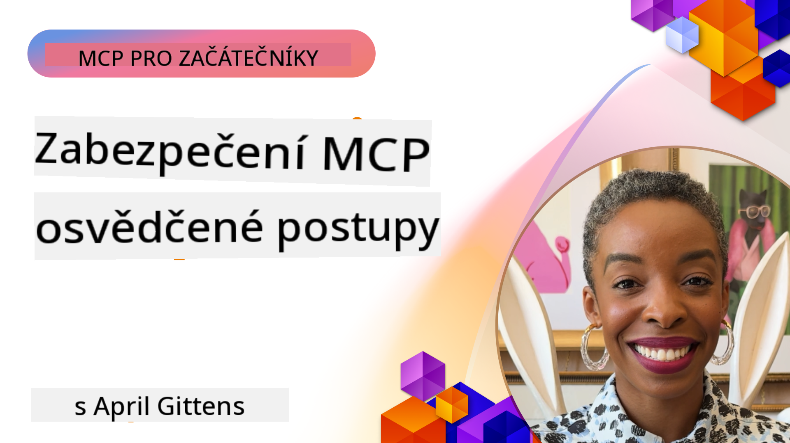

<!--
CO_OP_TRANSLATOR_METADATA:
{
  "original_hash": "1c767a35642f753127dc08545c25a290",
  "translation_date": "2025-08-19T15:37:01+00:00",
  "source_file": "02-Security/README.md",
  "language_code": "cs"
}
-->
# MCP Bezpečnost: Komplexní ochrana pro AI systémy

_(Klikněte na obrázek výše pro zhlédnutí videa této lekce)_

Bezpečnost je základním kamenem návrhu AI systémů, a proto ji zařazujeme jako druhou sekci. To odpovídá principu Microsoftu **Secure by Design** z [Secure Future Initiative](https://www.microsoft.com/security/blog/2025/04/17/microsofts-secure-by-design-journey-one-year-of-success/).

Model Context Protocol (MCP) přináší nové výkonné možnosti pro aplikace poháněné AI, ale zároveň představuje unikátní bezpečnostní výzvy, které přesahují tradiční softwarová rizika. MCP systémy čelí jak zavedeným bezpečnostním problémům (bezpečné kódování, princip nejmenších oprávnění, bezpečnost dodavatelského řetězce), tak novým hrozbám specifickým pro AI, jako jsou injekce promptů, otrava nástrojů, únos relací, útoky zmateného zástupce, zranitelnosti při předávání tokenů a dynamické úpravy schopností.

Tato lekce se zaměřuje na nejkritičtější bezpečnostní rizika při implementaci MCP—včetně autentizace, autorizace, nadměrných oprávnění, nepřímé injekce promptů, bezpečnosti relací, problémů zmateného zástupce, správy tokenů a zranitelností dodavatelského řetězce. Naučíte se praktická opatření a osvědčené postupy pro zmírnění těchto rizik a využití řešení Microsoftu, jako jsou Prompt Shields, Azure Content Safety a GitHub Advanced Security, k posílení nasazení MCP.

## Cíle učení

Na konci této lekce budete schopni:

- **Identifikovat hrozby specifické pro MCP**: Rozpoznat unikátní bezpečnostní rizika v MCP systémech, včetně injekce promptů, otravy nástrojů, nadměrných oprávnění, únosu relací, problémů zmateného zástupce, zranitelností při předávání tokenů a rizik dodavatelského řetězce
- **Aplikovat bezpečnostní opatření**: Implementovat účinné zmírňující kroky, včetně robustní autentizace, přístupu s nejmenšími oprávněními, bezpečné správy tokenů, kontrol bezpečnosti relací a ověřování dodavatelského řetězce
- **Využít bezpečnostní řešení Microsoftu**: Porozumět a nasadit Microsoft Prompt Shields, Azure Content Safety a GitHub Advanced Security pro ochranu MCP pracovních zátěží
- **Ověřit bezpečnost nástrojů**: Rozpoznat důležitost ověřování metadat nástrojů, monitorování dynamických změn a obrany proti nepřímým injekcím promptů
- **Integrovat osvědčené postupy**: Kombinovat zavedené bezpečnostní základy (bezpečné kódování, zpevnění serverů, zero trust) s opatřeními specifickými pro MCP pro komplexní ochranu

# Architektura a opatření MCP bezpečnosti

Moderní implementace MCP vyžadují vrstvené bezpečnostní přístupy, které řeší jak tradiční softwarovou bezpečnost, tak hrozby specifické pro AI. Rychle se vyvíjející specifikace MCP nadále zdokonaluje své bezpečnostní kontroly, což umožňuje lepší integraci s podnikovými bezpečnostními architekturami a zavedenými osvědčenými postupy.

Výzkum z [Microsoft Digital Defense Report](https://aka.ms/mddr) ukazuje, že **98 % hlášených narušení by bylo možné předejít robustními bezpečnostními návyky**. Nejúčinnější ochranná strategie kombinuje základní bezpečnostní postupy s opatřeními specifickými pro MCP—osvědčená základní bezpečnostní opatření zůstávají nejúčinnější při snižování celkového bezpečnostního rizika.

## Současná bezpečnostní situace

> **Poznámka:** Tyto informace odrážejí bezpečnostní standardy MCP k datu **18. srpna 2025**. Specifikace MCP se rychle vyvíjí a budoucí implementace mohou zavést nové autentizační vzory a vylepšené kontroly. Vždy se odkazujte na aktuální [Specifikaci MCP](https://spec.modelcontextprotocol.io/), [MCP GitHub repozitář](https://github.com/modelcontextprotocol) a [dokumentaci osvědčených bezpečnostních postupů](https://modelcontextprotocol.io/specification/2025-06-18/basic/security_best_practices) pro nejnovější pokyny.

### Vývoj autentizace MCP

Specifikace MCP se významně vyvinula ve svém přístupu k autentizaci a autorizaci:

- **Původní přístup**: Rané specifikace vyžadovaly, aby vývojáři implementovali vlastní autentizační servery, přičemž MCP servery fungovaly jako OAuth 2.0 Authorization Servery, které přímo spravovaly autentizaci uživatelů
- **Současný standard (2025-06-18)**: Aktualizovaná specifikace umožňuje MCP serverům delegovat autentizaci na externí poskytovatele identity (např. Microsoft Entra ID), což zlepšuje bezpečnostní postoj a snižuje složitost implementace
- **Transport Layer Security**: Vylepšená podpora bezpečných transportních mechanismů s odpovídajícími autentizačními vzory pro lokální (STDIO) i vzdálená (Streamable HTTP) připojení

## Bezpečnost autentizace a autorizace

### Současné bezpečnostní výzvy

Moderní implementace MCP čelí několika výzvám v oblasti autentizace a autorizace:

### Rizika a vektory hrozeb

- **Chybně nakonfigurovaná logika autorizace**: Chybná implementace autorizace v MCP serverech může vystavit citlivá data a nesprávně aplikovat přístupové kontroly
- **Kompromitace OAuth tokenů**: Krádež tokenů lokálního MCP serveru umožňuje útočníkům vydávat se za servery a přistupovat ke službám
- **Zranitelnosti při předávání tokenů**: Nesprávná manipulace s tokeny vytváří obcházení bezpečnostních kontrol a mezery v odpovědnosti
- **Nadměrná oprávnění**: MCP servery s příliš velkými oprávněními porušují princip nejmenších oprávnění a rozšiřují útočné plochy

#### Předávání tokenů: Kritický anti-vzor

**Předávání tokenů je výslovně zakázáno** v aktuální specifikaci autorizace MCP kvůli závažným bezpečnostním důsledkům:

##### Obcházení bezpečnostních kontrol
- MCP servery a downstream API implementují kritické bezpečnostní kontroly (omezení rychlosti, validace požadavků, monitorování provozu), které závisí na správné validaci tokenů
- Přímé použití tokenů klientem vůči API obchází tyto zásadní ochrany, což podkopává bezpečnostní architekturu

##### Výzvy v oblasti odpovědnosti a auditu  
- MCP servery nemohou rozlišit mezi klienty používajícími tokeny vydané upstream, což narušuje auditní stopy
- Logy downstream serverů ukazují zavádějící původ požadavků místo skutečných prostředníků MCP serverů
- Vyšetřování incidentů a audity souladu se stávají výrazně obtížnějšími

##### Rizika exfiltrace dat
- Nevalidované nároky tokenů umožňují škodlivým aktérům s ukradenými tokeny používat MCP servery jako proxy pro exfiltraci dat
- Porušení hranic důvěry umožňuje neoprávněné přístupové vzory, které obcházejí zamýšlené bezpečnostní kontroly

##### Útočné vektory mezi službami
- Kompromitované tokeny akceptované více službami umožňují laterální pohyb napříč propojenými systémy
- Předpoklady důvěry mezi službami mohou být porušeny, pokud nelze ověřit původ tokenů

### Bezpečnostní opatření a zmírnění

**Kritické bezpečnostní požadavky:**

> **POVINNÉ**: MCP servery **NESMÍ** přijímat žádné tokeny, které nebyly výslovně vydány pro MCP server

#### Opatření pro autentizaci a autorizaci

- **Důkladná revize autorizace**: Proveďte komplexní audity logiky autorizace MCP serverů, abyste zajistili, že pouze zamýšlení uživatelé a klienti mohou přistupovat k citlivým zdrojům
  - **Průvodce implementací**: [Azure API Management jako autentizační brána pro MCP servery](https://techcommunity.microsoft.com/blog/integrationsonazureblog/azure-api-management-your-auth-gateway-for-mcp-servers/4402690)
  - **Integrace identity**: [Použití Microsoft Entra ID pro autentizaci MCP serverů](https://den.dev/blog/mcp-server-auth-entra-id-session/)

- **Bezpečná správa tokenů**: Implementujte [osvědčené postupy Microsoftu pro validaci a životní cyklus tokenů](https://learn.microsoft.com/en-us/entra/identity-platform/access-tokens)
  - Validujte nároky tokenů, aby odpovídaly identitě MCP serveru
  - Implementujte správné politiky rotace a expirace tokenů
  - Zabraňte útokům na opakované použití tokenů a neoprávněnému použití

- **Chráněné úložiště tokenů**: Zabezpečte úložiště tokenů šifrováním jak v klidu, tak během přenosu
  - **Osvědčené postupy**: [Pokyny pro bezpečné úložiště a šifrování tokenů](https://youtu.be/uRdX37EcCwg?si=6fSChs1G4glwXRy2)

#### Implementace přístupových kontrol

- **Princip nejmenších oprávnění**: Udělujte MCP serverům pouze minimální oprávnění potřebná pro zamýšlenou funkčnost
  - Pravidelné revize a aktualizace oprávnění, aby se zabránilo jejich rozšiřování
  - **Dokumentace Microsoftu**: [Zabezpečený přístup s nejmenšími oprávněními](https://learn.microsoft.com/entra/identity-platform/secure-least-privileged-access)

- **Role-Based Access Control (RBAC)**: Implementujte jemně odstupňované přiřazení rolí
  - Role omezte na konkrétní zdroje a akce
  - Vyhněte se širokým nebo zbytečným oprávněním, která rozšiřují útočné plochy

- **Nepřetržité monitorování oprávnění**: Implementujte průběžné audity a monitorování přístupu
  - Sledujte vzory používání oprávnění pro anomálie
  - Okamžitě napravte nadměrná nebo nepoužívaná oprávnění
- **Generování bezpečných relací**: Používejte kryptograficky bezpečné, nedeterministické ID relací generované pomocí bezpečných generátorů náhodných čísel  
- **Vazba na uživatele**: Spojte ID relací s informacemi specifickými pro uživatele pomocí formátů jako `<user_id>:<session_id>` pro prevenci zneužití relací mezi uživateli  
- **Správa životního cyklu relací**: Implementujte správné vypršení platnosti, rotaci a zneplatnění relací pro omezení zranitelností  
- **Bezpečnost přenosu**: Povinné použití HTTPS pro veškerou komunikaci, aby se zabránilo odposlechu ID relací  

### Problém zmateného zástupce

**Problém zmateného zástupce** nastává, když servery MCP fungují jako autentizační proxy mezi klienty a službami třetích stran, což vytváří příležitosti pro obcházení autorizace prostřednictvím zneužití statických ID klientů.

#### **Mechanika útoků a rizika**

- **Obcházení souhlasu pomocí cookies**: Předchozí autentizace uživatele vytváří souhlasové cookies, které útočníci zneužívají prostřednictvím škodlivých požadavků na autorizaci s upravenými URI přesměrování  
- **Krádež autorizačního kódu**: Existující souhlasové cookies mohou způsobit, že autorizační servery přeskočí obrazovky souhlasu a přesměrují kódy na koncové body kontrolované útočníkem  
- **Neoprávněný přístup k API**: Ukradené autorizační kódy umožňují výměnu tokenů a vydávání se za uživatele bez explicitního schválení  

#### **Strategie zmírnění rizik**

**Povinné kontroly:**
- **Požadavek na explicitní souhlas**: Proxy servery MCP používající statické ID klientů **MUSÍ** získat souhlas uživatele pro každého dynamicky registrovaného klienta  
- **Implementace bezpečnostních opatření OAuth 2.1**: Dodržujte aktuální bezpečnostní postupy OAuth, včetně PKCE (Proof Key for Code Exchange) pro všechny požadavky na autorizaci  
- **Přísná validace klientů**: Implementujte důkladnou validaci URI přesměrování a identifikátorů klientů, aby se zabránilo zneužití  

### Zranitelnosti při předávání tokenů  

**Předávání tokenů** představuje explicitní anti-vzor, kdy servery MCP přijímají tokeny klientů bez řádné validace a předávají je downstream API, což porušuje specifikace autorizace MCP.

#### **Bezpečnostní důsledky**

- **Obcházení kontrol**: Přímé použití tokenů klientů vůči API obchází klíčové kontroly, jako je omezení rychlosti, validace a monitorování  
- **Narušení auditní stopy**: Tokeny vydané upstream znemožňují identifikaci klientů, což narušuje schopnosti vyšetřování incidentů  
- **Proxy pro exfiltraci dat**: Nevalidované tokeny umožňují škodlivým aktérům používat servery jako proxy pro neoprávněný přístup k datům  
- **Porušení hranic důvěry**: Předpoklady důvěry downstream služeb mohou být porušeny, pokud nelze ověřit původ tokenů  
- **Rozšíření útoků na více služeb**: Kompromitované tokeny přijímané napříč více službami umožňují laterální pohyb  

#### **Požadované bezpečnostní kontroly**

**Nepostradatelné požadavky:**
- **Validace tokenů**: Servery MCP **NESMÍ** přijímat tokeny, které nebyly explicitně vydány pro server MCP  
- **Ověření audience**: Vždy ověřujte, že audience tokenů odpovídá identitě serveru MCP  
- **Správný životní cyklus tokenů**: Implementujte krátkodobé přístupové tokeny s bezpečnými postupy rotace  

## Bezpečnost dodavatelského řetězce pro AI systémy

Bezpečnost dodavatelského řetězce se rozšířila za hranice tradičních softwarových závislostí a zahrnuje celý ekosystém AI. Moderní implementace MCP musí důkladně ověřovat a monitorovat všechny komponenty související s AI, protože každá z nich představuje potenciální zranitelnost, která by mohla ohrozit integritu systému.

### Rozšířené komponenty dodavatelského řetězce AI

**Tradiční softwarové závislosti:**
- Open-source knihovny a frameworky  
- Obrazové soubory kontejnerů a základní systémy  
- Vývojové nástroje a buildovací pipeline  
- Infrastrukturní komponenty a služby  

**AI-specifické prvky dodavatelského řetězce:**
- **Základní modely**: Předtrénované modely od různých poskytovatelů vyžadující ověření původu  
- **Embeddingové služby**: Externí služby pro vektorizaci a sémantické vyhledávání  
- **Poskytovatelé kontextu**: Datové zdroje, znalostní báze a repozitáře dokumentů  
- **API třetích stran**: Externí AI služby, ML pipeline a koncové body pro zpracování dat  
- **Artefakty modelů**: Váhy, konfigurace a varianty modelů upravené na míru  
- **Zdroje tréninkových dat**: Datové sady použité pro trénink a doladění modelů  

### Komplexní strategie bezpečnosti dodavatelského řetězce

#### **Ověření komponent a důvěra**
- **Ověření původu**: Ověřte původ, licencování a integritu všech AI komponent před jejich integrací  
- **Bezpečnostní hodnocení**: Provádějte skenování zranitelností a bezpečnostní přezkumy modelů, datových zdrojů a AI služeb  
- **Analýza reputace**: Hodnoťte bezpečnostní historii a postupy poskytovatelů AI služeb  
- **Ověření souladu**: Zajistěte, že všechny komponenty splňují bezpečnostní a regulační požadavky organizace  

#### **Bezpečné nasazovací pipeline**  
- **Automatizovaná bezpečnost CI/CD**: Integrujte bezpečnostní skenování do automatizovaných pipeline nasazení  
- **Integrita artefaktů**: Implementujte kryptografické ověření všech nasazených artefaktů (kód, modely, konfigurace)  
- **Postupné nasazení**: Používejte progresivní strategie nasazení s bezpečnostní validací na každé úrovni  
- **Důvěryhodné repozitáře artefaktů**: Nasazujte pouze z ověřených, bezpečných registrů a repozitářů artefaktů  

#### **Nepřetržité monitorování a reakce**
- **Skenování závislostí**: Průběžné monitorování zranitelností všech softwarových a AI komponent  
- **Monitorování modelů**: Nepřetržité hodnocení chování modelů, výkonových odchylek a bezpečnostních anomálií  
- **Sledování zdraví služeb**: Monitorování externích AI služeb z hlediska dostupnosti, bezpečnostních incidentů a změn politik  
- **Integrace hrozeb**: Zahrnutí zdrojů hrozeb specifických pro AI a ML bezpečnostní rizika  

#### **Kontrola přístupu a princip minimálních oprávnění**
- **Oprávnění na úrovni komponent**: Omezte přístup k modelům, datům a službám na základě obchodní nutnosti  
- **Správa účtů služeb**: Implementujte dedikované účty služeb s minimálními požadovanými oprávněními  
- **Segmentace sítě**: Izolujte AI komponenty a omezte síťový přístup mezi službami  
- **Kontroly API brány**: Používejte centralizované API brány pro kontrolu a monitorování přístupu k externím AI službám  

#### **Reakce na incidenty a obnova**
- **Postupy rychlé reakce**: Zavedené procesy pro opravu nebo nahrazení kompromitovaných AI komponent  
- **Rotace přihlašovacích údajů**: Automatizované systémy pro rotaci tajných klíčů, API klíčů a přihlašovacích údajů služeb  
- **Schopnosti rollbacku**: Možnost rychlého návratu k předchozím známým dobrým verzím AI komponent  
- **Obnova po narušení dodavatelského řetězce**: Specifické postupy pro reakci na kompromitace upstream AI služeb  

### Nástroje Microsoftu pro bezpečnost a integraci

**GitHub Advanced Security** poskytuje komplexní ochranu dodavatelského řetězce, včetně:  
- **Skenování tajných klíčů**: Automatická detekce přihlašovacích údajů, API klíčů a tokenů v repozitářích  
- **Skenování závislostí**: Hodnocení zranitelností open-source závislostí a knihoven  
- **Analýza CodeQL**: Statická analýza kódu pro bezpečnostní zranitelnosti a problémy v kódu  
- **Přehledy dodavatelského řetězce**: Viditelnost zdraví a bezpečnostního stavu závislostí  

**Integrace Azure DevOps a Azure Repos:**
- Bezproblémová integrace bezpečnostního skenování napříč vývojovými platformami Microsoftu  
- Automatizované bezpečnostní kontroly v Azure Pipelines pro AI pracovní zátěže  
- Prosazování politik pro bezpečné nasazení AI komponent  

**Interní postupy Microsoftu:**
Microsoft implementuje rozsáhlé bezpečnostní postupy dodavatelského řetězce napříč všemi produkty. Více o osvědčených přístupech se dozvíte v [Cesta k zabezpečení softwarového dodavatelského řetězce v Microsoftu](https://devblogs.microsoft.com/engineering-at-microsoft/the-journey-to-secure-the-software-supply-chain-at-microsoft/).  

...
### **Microsoft Security Solutions**
- [Microsoft Prompt Shields Documentation](https://learn.microsoft.com/azure/ai-services/content-safety/concepts/jailbreak-detection)  
- [Azure Content Safety Service](https://learn.microsoft.com/azure/ai-services/content-safety/)  
- [Microsoft Entra ID Security](https://learn.microsoft.com/entra/identity-platform/secure-least-privileged-access)  
- [Azure Token Management Best Practices](https://learn.microsoft.com/entra/identity-platform/access-tokens)  
- [GitHub Advanced Security](https://github.com/security/advanced-security)  

### **Průvodci implementací a návody**
- [Azure API Management jako autentizační brána MCP](https://techcommunity.microsoft.com/blog/integrationsonazureblog/azure-api-management-your-auth-gateway-for-mcp-servers/4402690)  
- [Autentizace Microsoft Entra ID s MCP servery](https://den.dev/blog/mcp-server-auth-entra-id-session/)  
- [Bezpečné ukládání tokenů a šifrování (video)](https://youtu.be/uRdX37EcCwg?si=6fSChs1G4glwXRy2)  

### **DevOps a bezpečnost dodavatelského řetězce**
- [Azure DevOps Security](https://azure.microsoft.com/products/devops)  
- [Azure Repos Security](https://azure.microsoft.com/products/devops/repos/)  
- [Cesta k zabezpečení dodavatelského řetězce společnosti Microsoft](https://devblogs.microsoft.com/engineering-at-microsoft/the-journey-to-secure-the-software-supply-chain-at-microsoft/)  

## **Další bezpečnostní dokumentace**

Pro komplexní bezpečnostní pokyny se podívejte na tyto specializované dokumenty v této sekci:

- **[MCP Security Best Practices 2025](./mcp-security-best-practices-2025.md)** - Kompletní osvědčené postupy pro zabezpečení MCP implementací  
- **[Azure Content Safety Implementation](./azure-content-safety-implementation.md)** - Praktické příklady implementace integrace Azure Content Safety  
- **[MCP Security Controls 2025](./mcp-security-controls-2025.md)** - Nejnovější bezpečnostní kontroly a techniky pro nasazení MCP  
- **[MCP Best Practices Quick Reference](./mcp-best-practices.md)** - Rychlý referenční průvodce základními bezpečnostními postupy MCP  

---

## Co dál

Další: [Kapitola 3: Začínáme](../03-GettingStarted/README.md)  

**Prohlášení**:  
Tento dokument byl přeložen pomocí služby pro automatický překlad [Co-op Translator](https://github.com/Azure/co-op-translator). I když se snažíme o co největší přesnost, mějte prosím na paměti, že automatické překlady mohou obsahovat chyby nebo nepřesnosti. Původní dokument v jeho původním jazyce by měl být považován za závazný zdroj. Pro důležité informace doporučujeme profesionální lidský překlad. Neodpovídáme za žádná nedorozumění nebo nesprávné výklady vyplývající z použití tohoto překladu.