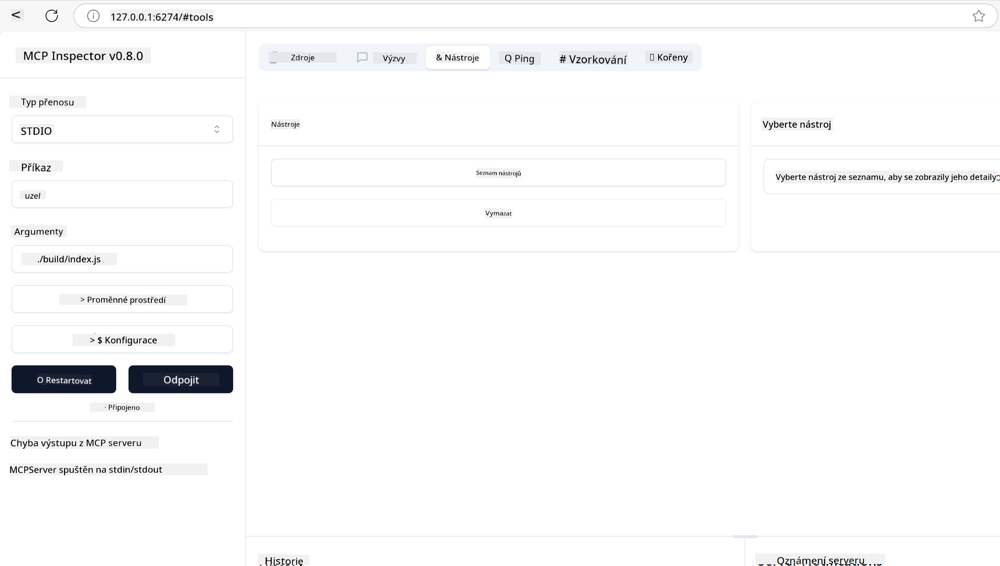
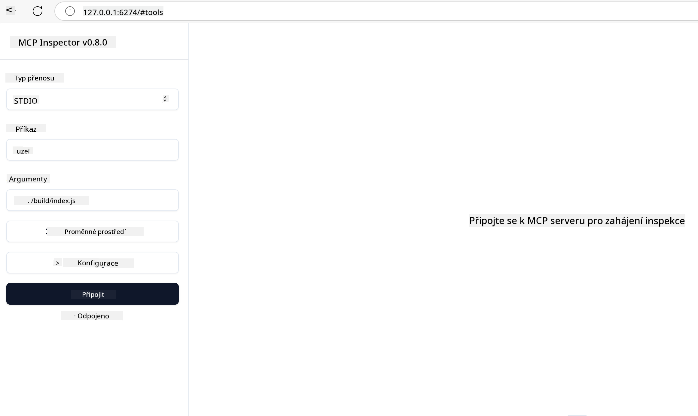

<!--
CO_OP_TRANSLATOR_METADATA:
{
  "original_hash": "5331ffd328a54b90f76706c52b673e27",
  "translation_date": "2025-05-17T08:51:40+00:00",
  "source_file": "03-GettingStarted/01-first-server/README.md",
  "language_code": "cs"
}
-->
# Začínáme s MCP

Vítejte u vašich prvních kroků s Model Context Protocol (MCP)! Ať už jste v MCP nováček, nebo se chcete do problematiky ponořit hlouběji, tento průvodce vás provede základním nastavením a vývojovým procesem. Objevíte, jak MCP umožňuje plynulou integraci mezi AI modely a aplikacemi, a naučíte se, jak rychle připravit své prostředí pro vytváření a testování řešení poháněných MCP.

> TLDR; Pokud vytváříte AI aplikace, víte, že můžete přidat nástroje a další zdroje do svého LLM (large language model), aby byl LLM informovanější. Nicméně pokud tyto nástroje a zdroje umístíte na server, aplikace a schopnosti serveru mohou být využity jakýmkoliv klientem s/bez LLM.

## Přehled

Tato lekce poskytuje praktické pokyny pro nastavení prostředí MCP a vytváření vašich prvních MCP aplikací. Naučíte se, jak nastavit potřebné nástroje a frameworky, vytvářet základní MCP servery, vytvářet hostitelské aplikace a testovat vaše implementace.

Model Context Protocol (MCP) je otevřený protokol, který standardizuje, jak aplikace poskytují kontext LLM. Myslete na MCP jako na USB-C port pro AI aplikace - poskytuje standardizovaný způsob, jak propojit AI modely s různými zdroji dat a nástroji.

## Cíle učení

Na konci této lekce budete schopni:

- Nastavit vývojová prostředí pro MCP v C#, Java, Python, TypeScript a JavaScript
- Vytvářet a nasazovat základní MCP servery s vlastními funkcemi (zdroje, výzvy a nástroje)
- Vytvářet hostitelské aplikace, které se připojují k MCP serverům
- Testovat a ladit implementace MCP

## Nastavení vašeho MCP prostředí

Než začnete pracovat s MCP, je důležité připravit vaše vývojové prostředí a pochopit základní pracovní postup. Tato sekce vás provede počátečními kroky nastavení, abyste mohli plynule začít s MCP.

### Předpoklady

Před ponořením se do vývoje MCP se ujistěte, že máte:

- **Vývojové prostředí**: Pro vámi zvolený jazyk (C#, Java, Python, TypeScript nebo JavaScript)
- **IDE/Editor**: Visual Studio, Visual Studio Code, IntelliJ, Eclipse, PyCharm nebo jakýkoliv moderní editor kódu
- **Správce balíčků**: NuGet, Maven/Gradle, pip nebo npm/yarn
- **API klíče**: Pro jakékoliv AI služby, které plánujete použít ve vašich hostitelských aplikacích

## Základní struktura MCP serveru

MCP server obvykle zahrnuje:

- **Konfiguraci serveru**: Nastavení portu, autentizace a dalších nastavení
- **Zdroje**: Data a kontext zpřístupněné LLM
- **Nástroje**: Funkce, které mohou modely vyvolat
- **Výzvy**: Šablony pro generování nebo strukturování textu

Zde je zjednodušený příklad v TypeScriptu:

```typescript
import { Server, Tool, Resource } from "@modelcontextprotocol/typescript-server-sdk";

// Create a new MCP server
const server = new Server({
  port: 3000,
  name: "Example MCP Server",
  version: "1.0.0"
});

// Register a tool
server.registerTool({
  name: "calculator",
  description: "Performs basic calculations",
  parameters: {
    expression: {
      type: "string",
      description: "The math expression to evaluate"
    }
  },
  handler: async (params) => {
    const result = eval(params.expression);
    return { result };
  }
});

// Start the server
server.start();
```

V předchozím kódu jsme:

- Importovali potřebné třídy z MCP TypeScript SDK.
- Vytvořili a nakonfigurovali novou instanci MCP serveru.
- Zaregistrovali vlastní nástroj (`calculator`) s funkcí handleru.
- Spustili server, aby naslouchal příchozím MCP požadavkům.

## Testování a ladění

Než začnete testovat váš MCP server, je důležité pochopit dostupné nástroje a osvědčené postupy pro ladění. Efektivní testování zajišťuje, že se váš server chová podle očekávání a pomáhá rychle identifikovat a řešit problémy. Následující sekce popisuje doporučené přístupy pro ověření vaší implementace MCP.

MCP poskytuje nástroje, které vám pomohou testovat a ladit vaše servery:

- **Inspector tool**, toto grafické rozhraní vám umožňuje připojit se k vašemu serveru a testovat vaše nástroje, výzvy a zdroje.
- **curl**, můžete se také připojit k vašemu serveru pomocí příkazového řádku jako curl nebo jiných klientů, které mohou vytvářet a spouštět HTTP příkazy.

### Použití MCP Inspector

[MCP Inspector](https://github.com/modelcontextprotocol/inspector) je vizuální testovací nástroj, který vám pomůže:

1. **Objevit schopnosti serveru**: Automaticky detekovat dostupné zdroje, nástroje a výzvy
2. **Testovat vykonání nástrojů**: Zkusit různé parametry a vidět odpovědi v reálném čase
3. **Prohlížet metadata serveru**: Zkoumat informace o serveru, schémata a konfigurace

```bash
# ex TypeScript, installing and running MCP Inspector
npx @modelcontextprotocol/inspector node build/index.js
```

Když spustíte výše uvedené příkazy, MCP Inspector spustí lokální webové rozhraní ve vašem prohlížeči. Můžete očekávat, že uvidíte panel zobrazující vaše registrované MCP servery, jejich dostupné nástroje, zdroje a výzvy. Rozhraní vám umožňuje interaktivně testovat vykonání nástrojů, zkoumat metadata serveru a vidět odpovědi v reálném čase, což usnadňuje validaci a ladění vašich implementací MCP serveru.

Zde je screenshot, jak to může vypadat:



## Běžné problémy při nastavení a jejich řešení

| Problém | Možné řešení |
|---------|--------------|
| Připojení odmítnuto | Zkontrolujte, zda server běží a port je správný |
| Chyby při vykonávání nástrojů | Zkontrolujte validaci parametrů a zpracování chyb |
| Selhání autentizace | Ověřte API klíče a oprávnění |
| Chyby validace schématu | Ujistěte se, že parametry odpovídají definovanému schématu |
| Server se nespustí | Zkontrolujte konflikty portů nebo chybějící závislosti |
| CORS chyby | Nakonfigurujte správné CORS hlavičky pro požadavky z jiných domén |
| Problémy s autentizací | Ověřte platnost tokenu a oprávnění |

## Lokální vývoj

Pro lokální vývoj a testování můžete spouštět MCP servery přímo na svém počítači:

1. **Spusťte proces serveru**: Spusťte vaši aplikaci MCP serveru
2. **Nakonfigurujte síť**: Ujistěte se, že server je přístupný na očekávaném portu
3. **Připojte klienty**: Použijte lokální URL připojení jako `http://localhost:3000`

```bash
# Example: Running a TypeScript MCP server locally
npm run start
# Server running at http://localhost:3000
```

## Vytváření vašeho prvního MCP serveru

Probrali jsme [Základní koncepty](/01-CoreConcepts/README.md) v předchozí lekci, nyní je čas tyto znalosti využít v praxi.

### Co může server dělat

Než začneme psát kód, připomeňme si, co může server dělat:

MCP server může například:

- Přistupovat k lokálním souborům a databázím
- Připojovat se k vzdáleným API
- Provádět výpočty
- Integrovat se s jinými nástroji a službami
- Poskytovat uživatelské rozhraní pro interakci

Skvělé, teď když víme, co pro něj můžeme udělat, pojďme začít kódovat.

## Cvičení: Vytváření serveru

Pro vytvoření serveru musíte následovat tyto kroky:

- Nainstalujte MCP SDK.
- Vytvořte projekt a nastavte strukturu projektu.
- Napište kód serveru.
- Otestujte server.

### -1- Instalace SDK

To se liší v závislosti na vámi zvoleném runtime, takže si vyberte jeden z níže uvedených runtime:

Generativní AI může generovat text, obrázky a dokonce i kód.

### -2- Vytvoření projektu

Nyní, když máte nainstalované SDK, pojďme vytvořit projekt:

### -3- Vytvoření souborů projektu

### -4- Vytvoření kódu serveru

### -5- Přidání nástroje a zdroje

Přidejte nástroj a zdroj přidáním následujícího kódu:

### -6- Finální kód

Přidejme poslední kód, který potřebujeme, aby server mohl začít:

### -7- Testování serveru

Spusťte server pomocí následujícího příkazu:

### -8- Spuštění pomocí inspectoru

Inspector je skvělý nástroj, který může spustit váš server a umožní vám s ním interagovat, abyste mohli testovat, zda funguje. Pojďme ho spustit:

> [!NOTE]
> může vypadat jinak v poli "command", protože obsahuje příkaz pro spuštění serveru s vaším specifickým runtime

Měli byste vidět následující uživatelské rozhraní:



1. Připojte se k serveru výběrem tlačítka Připojit. Jakmile se připojíte k serveru, měli byste nyní vidět následující:

   

1. Vyberte "Nástroje" a "listTools", měli byste vidět "Add", vyberte "Add" a vyplňte hodnoty parametrů.

   Měli byste vidět následující odpověď, tj. výsledek z nástroje "add":

   

Gratulujeme, podařilo se vám vytvořit a spustit váš první server!

### Oficiální SDK

MCP poskytuje oficiální SDK pro více jazyků:
- [C# SDK](https://github.com/modelcontextprotocol/csharp-sdk) - Udržováno ve spolupráci s Microsoftem
- [Java SDK](https://github.com/modelcontextprotocol/java-sdk) - Udržováno ve spolupráci se Spring AI
- [TypeScript SDK](https://github.com/modelcontextprotocol/typescript-sdk) - Oficiální implementace v TypeScriptu
- [Python SDK](https://github.com/modelcontextprotocol/python-sdk) - Oficiální implementace v Pythonu
- [Kotlin SDK](https://github.com/modelcontextprotocol/kotlin-sdk) - Oficiální implementace v Kotlinu
- [Swift SDK](https://github.com/modelcontextprotocol/swift-sdk) - Udržováno ve spolupráci s Loopwork AI
- [Rust SDK](https://github.com/modelcontextprotocol/rust-sdk) - Oficiální implementace v Rustu

## Klíčové poznatky

- Nastavení vývojového prostředí MCP je jednoduché s jazykově specifickými SDK
- Vytváření MCP serverů zahrnuje vytváření a registraci nástrojů s jasnými schématy
- Testování a ladění jsou zásadní pro spolehlivé implementace MCP

## Ukázky

- [Java Kalkulačka](../samples/java/calculator/README.md)
- [.Net Kalkulačka](../../../../03-GettingStarted/samples/csharp)
- [JavaScript Kalkulačka](../samples/javascript/README.md)
- [TypeScript Kalkulačka](../samples/typescript/README.md)
- [Python Kalkulačka](../../../../03-GettingStarted/samples/python)

## Úkol

Vytvořte jednoduchý MCP server s nástrojem dle vašeho výběru:
1. Implementujte nástroj ve vámi preferovaném jazyce (.NET, Java, Python nebo JavaScript).
2. Definujte vstupní parametry a návratové hodnoty.
3. Spusťte nástroj inspector, abyste se ujistili, že server funguje, jak má.
4. Otestujte implementaci s různými vstupy.

## Řešení

[Řešení](./solution/README.md)

## Další zdroje

- [MCP GitHub Repository](https://github.com/microsoft/mcp-for-beginners)

## Co dál

Dále: [Začínáme s MCP klienty](/03-GettingStarted/02-client/README.md)

**Upozornění**:  
Tento dokument byl přeložen pomocí služby pro automatický překlad [Co-op Translator](https://github.com/Azure/co-op-translator). Přestože se snažíme o co nejpřesnější překlad, mějte na paměti, že automatizované překlady mohou obsahovat chyby nebo nepřesnosti. Původní dokument v jeho rodném jazyce by měl být považován za závazný zdroj. Pro kritické informace se doporučuje profesionální lidský překlad. Nejsme zodpovědní za žádná nedorozumění nebo nesprávné interpretace vyplývající z použití tohoto překladu.