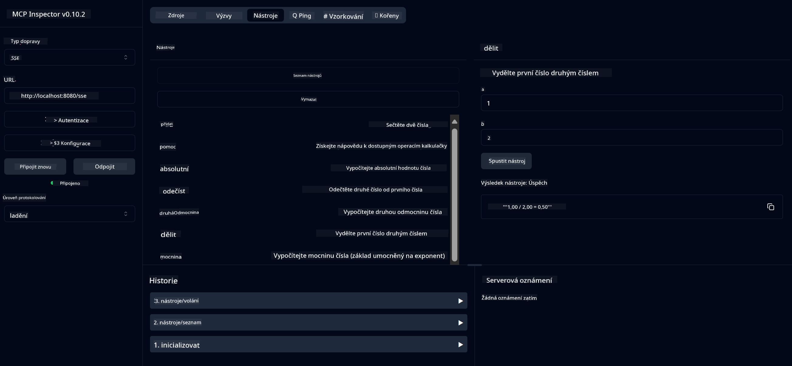
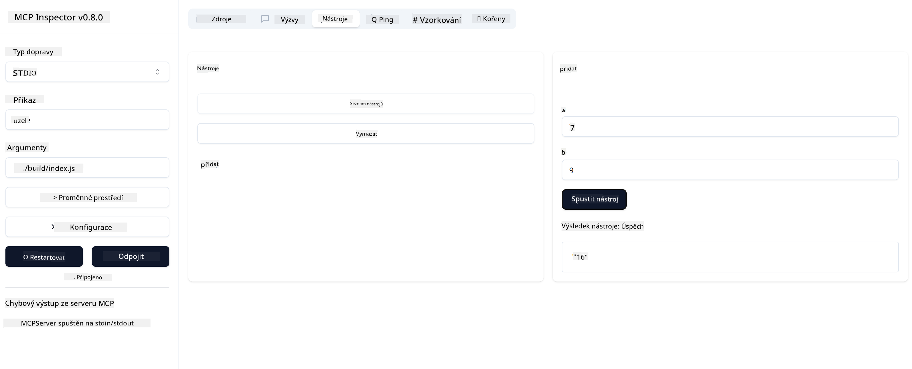

<!--
CO_OP_TRANSLATOR_METADATA:
{
  "original_hash": "ec11ee93f31fdadd94facd3e3d22f9e6",
  "translation_date": "2025-09-09T22:10:58+00:00",
  "source_file": "03-GettingStarted/01-first-server/README.md",
  "language_code": "cs"
}
-->
# Začínáme s MCP

Vítejte u vašich prvních kroků s Model Context Protocol (MCP)! Ať už jste v MCP nováčkem nebo chcete prohloubit své znalosti, tento průvodce vás provede základním nastavením a procesem vývoje. Objevíte, jak MCP umožňuje bezproblémovou integraci mezi AI modely a aplikacemi, a naučíte se rychle připravit své prostředí pro tvorbu a testování řešení využívajících MCP.

> TLDR; Pokud vytváříte AI aplikace, víte, že můžete přidat nástroje a další zdroje do svého LLM (velkého jazykového modelu), aby byl model chytřejší. Pokud však tyto nástroje a zdroje umístíte na server, aplikace i schopnosti serveru mohou být využívány jakýmkoliv klientem, s LLM nebo bez něj.

## Přehled

Tato lekce poskytuje praktické pokyny pro nastavení MCP prostředí a tvorbu vašich prvních MCP aplikací. Naučíte se, jak nastavit potřebné nástroje a frameworky, vytvořit základní MCP servery, vytvořit hostitelské aplikace a otestovat vaše implementace.

Model Context Protocol (MCP) je otevřený protokol, který standardizuje způsob, jakým aplikace poskytují kontext LLM. Představte si MCP jako USB-C port pro AI aplikace – poskytuje standardizovaný způsob připojení AI modelů k různým datovým zdrojům a nástrojům.

## Cíle učení

Na konci této lekce budete schopni:

- Nastavit vývojová prostředí pro MCP v C#, Java, Python, TypeScript a Rust
- Vytvořit a nasadit základní MCP servery s vlastními funkcemi (zdroje, výzvy a nástroje)
- Vytvořit hostitelské aplikace, které se připojují k MCP serverům
- Testovat a ladit MCP implementace

## Nastavení MCP prostředí

Než začnete pracovat s MCP, je důležité připravit vaše vývojové prostředí a pochopit základní pracovní postup. Tato sekce vás provede počátečními kroky nastavení, aby byl váš start s MCP hladký.

### Předpoklady

Než se pustíte do vývoje MCP, ujistěte se, že máte:

- **Vývojové prostředí**: Pro vámi zvolený jazyk (C#, Java, Python, TypeScript nebo Rust)
- **IDE/Editor**: Visual Studio, Visual Studio Code, IntelliJ, Eclipse, PyCharm nebo jakýkoliv moderní editor kódu
- **Správce balíčků**: NuGet, Maven/Gradle, pip, npm/yarn nebo Cargo
- **API klíče**: Pro jakékoliv AI služby, které plánujete použít ve svých hostitelských aplikacích

## Základní struktura MCP serveru

Typický MCP server zahrnuje:

- **Konfiguraci serveru**: Nastavení portu, autentizace a dalších parametrů
- **Zdroje**: Data a kontext dostupné LLM
- **Nástroje**: Funkce, které modely mohou vyvolat
- **Výzvy**: Šablony pro generování nebo strukturování textu

Zde je zjednodušený příklad v TypeScriptu:

```typescript
import { McpServer, ResourceTemplate } from "@modelcontextprotocol/sdk/server/mcp.js";
import { StdioServerTransport } from "@modelcontextprotocol/sdk/server/stdio.js";
import { z } from "zod";

// Create an MCP server
const server = new McpServer({
  name: "Demo",
  version: "1.0.0"
});

// Add an addition tool
server.tool("add",
  { a: z.number(), b: z.number() },
  async ({ a, b }) => ({
    content: [{ type: "text", text: String(a + b) }]
  })
);

// Add a dynamic greeting resource
server.resource(
  "file",
  // The 'list' parameter controls how the resource lists available files. Setting it to undefined disables listing for this resource.
  new ResourceTemplate("file://{path}", { list: undefined }),
  async (uri, { path }) => ({
    contents: [{
      uri: uri.href,
      text: `File, ${path}!`
    }]
  })
);

// Add a file resource that reads the file contents
server.resource(
  "file",
  new ResourceTemplate("file://{path}", { list: undefined }),
  async (uri, { path }) => {
    let text;
    try {
      text = await fs.readFile(path, "utf8");
    } catch (err) {
      text = `Error reading file: ${err.message}`;
    }
    return {
      contents: [{
        uri: uri.href,
        text
      }]
    };
  }
);

server.prompt(
  "review-code",
  { code: z.string() },
  ({ code }) => ({
    messages: [{
      role: "user",
      content: {
        type: "text",
        text: `Please review this code:\n\n${code}`
      }
    }]
  })
);

// Start receiving messages on stdin and sending messages on stdout
const transport = new StdioServerTransport();
await server.connect(transport);
```

V předchozím kódu jsme:

- Importovali potřebné třídy z MCP TypeScript SDK.
- Vytvořili a nakonfigurovali novou instanci MCP serveru.
- Zaregistrovali vlastní nástroj (`calculator`) s funkcí obsluhy.
- Spustili server, aby naslouchal příchozím MCP požadavkům.

## Testování a ladění

Než začnete testovat svůj MCP server, je důležité pochopit dostupné nástroje a osvědčené postupy pro ladění. Efektivní testování zajišťuje, že se server chová podle očekávání, a pomáhá rychle identifikovat a řešit problémy. Následující sekce popisuje doporučené přístupy k validaci vaší MCP implementace.

MCP poskytuje nástroje, které vám pomohou testovat a ladit vaše servery:

- **Nástroj Inspector**, grafické rozhraní, které vám umožní připojit se k serveru a testovat vaše nástroje, výzvy a zdroje.
- **curl**, můžete se také připojit k serveru pomocí příkazového řádku, jako je curl, nebo jiných klientů, které mohou vytvářet a spouštět HTTP příkazy.

### Použití MCP Inspector

[MCP Inspector](https://github.com/modelcontextprotocol/inspector) je vizuální testovací nástroj, který vám pomůže:

1. **Objevit schopnosti serveru**: Automaticky detekovat dostupné zdroje, nástroje a výzvy
2. **Testovat provádění nástrojů**: Vyzkoušet různé parametry a vidět odpovědi v reálném čase
3. **Zobrazit metadata serveru**: Prozkoumat informace o serveru, schémata a konfigurace

```bash
# ex TypeScript, installing and running MCP Inspector
npx @modelcontextprotocol/inspector node build/index.js
```

Když spustíte výše uvedené příkazy, MCP Inspector spustí lokální webové rozhraní ve vašem prohlížeči. Můžete očekávat, že uvidíte dashboard zobrazující vaše registrované MCP servery, jejich dostupné nástroje, zdroje a výzvy. Rozhraní vám umožní interaktivně testovat provádění nástrojů, prozkoumávat metadata serveru a zobrazovat odpovědi v reálném čase, což usnadňuje validaci a ladění vašich MCP serverových implementací.

Zde je screenshot, jak to může vypadat:


## Běžné problémy při nastavení a jejich řešení

| Problém | Možné řešení |
|---------|--------------|
| Odmítnutí připojení | Zkontrolujte, zda server běží a port je správný |
| Chyby při provádění nástrojů | Zkontrolujte validaci parametrů a zpracování chyb |
| Selhání autentizace | Ověřte API klíče a oprávnění |
| Chyby validace schématu | Ujistěte se, že parametry odpovídají definovanému schématu |
| Server se nespustí | Zkontrolujte konflikty portů nebo chybějící závislosti |
| CORS chyby | Nakonfigurujte správné CORS hlavičky pro požadavky mezi doménami |
| Problémy s autentizací | Ověřte platnost tokenů a oprávnění |

## Lokální vývoj

Pro lokální vývoj a testování můžete spouštět MCP servery přímo na svém počítači:

1. **Spusťte proces serveru**: Spusťte svou MCP serverovou aplikaci
2. **Nakonfigurujte síť**: Ujistěte se, že server je dostupný na očekávaném portu
3. **Připojte klienty**: Použijte lokální URL připojení, jako `http://localhost:3000`

```bash
# Example: Running a TypeScript MCP server locally
npm run start
# Server running at http://localhost:3000
```

## Vytvoření vašeho prvního MCP serveru

Pokryli jsme [Základní koncepty](/01-CoreConcepts/README.md) v předchozí lekci, nyní je čas tyto znalosti využít v praxi.

### Co server dokáže

Než začneme psát kód, připomeňme si, co server dokáže:

MCP server může například:

- Přistupovat k lokálním souborům a databázím
- Připojovat se k vzdáleným API
- Provádět výpočty
- Integrovat se s dalšími nástroji a službami
- Poskytovat uživatelské rozhraní pro interakci

Skvělé, teď když víme, co pro něj můžeme udělat, pojďme začít kódovat.

## Cvičení: Vytvoření serveru

Pro vytvoření serveru musíte postupovat podle těchto kroků:

- Nainstalujte MCP SDK.
- Vytvořte projekt a nastavte strukturu projektu.
- Napište kód serveru.
- Otestujte server.

### -1- Vytvoření projektu

#### TypeScript

```sh
# Create project directory and initialize npm project
mkdir calculator-server
cd calculator-server
npm init -y
```

#### Python

```sh
# Create project dir
mkdir calculator-server
cd calculator-server
# Open the folder in Visual Studio Code - Skip this if you are using a different IDE
code .
```

#### .NET

```sh
dotnet new console -n McpCalculatorServer
cd McpCalculatorServer
```

#### Java

Pro Java vytvořte projekt Spring Boot:

```bash
curl https://start.spring.io/starter.zip \
  -d dependencies=web \
  -d javaVersion=21 \
  -d type=maven-project \
  -d groupId=com.example \
  -d artifactId=calculator-server \
  -d name=McpServer \
  -d packageName=com.microsoft.mcp.sample.server \
  -o calculator-server.zip
```

Rozbalte zip soubor:

```bash
unzip calculator-server.zip -d calculator-server
cd calculator-server
# optional remove the unused test
rm -rf src/test/java
```

Přidejte následující kompletní konfiguraci do souboru *pom.xml*:

```xml
<?xml version="1.0" encoding="UTF-8"?>
<project xmlns="http://maven.apache.org/POM/4.0.0"
    xmlns:xsi="http://www.w3.org/2001/XMLSchema-instance"
    xsi:schemaLocation="http://maven.apache.org/POM/4.0.0 http://maven.apache.org/xsd/maven-4.0.0.xsd">
    <modelVersion>4.0.0</modelVersion>
    
    <!-- Spring Boot parent for dependency management -->
    <parent>
        <groupId>org.springframework.boot</groupId>
        <artifactId>spring-boot-starter-parent</artifactId>
        <version>3.5.0</version>
        <relativePath />
    </parent>

    <!-- Project coordinates -->
    <groupId>com.example</groupId>
    <artifactId>calculator-server</artifactId>
    <version>0.0.1-SNAPSHOT</version>
    <name>Calculator Server</name>
    <description>Basic calculator MCP service for beginners</description>

    <!-- Properties -->
    <properties>
        <java.version>21</java.version>
        <maven.compiler.source>21</maven.compiler.source>
        <maven.compiler.target>21</maven.compiler.target>
    </properties>

    <!-- Spring AI BOM for version management -->
    <dependencyManagement>
        <dependencies>
            <dependency>
                <groupId>org.springframework.ai</groupId>
                <artifactId>spring-ai-bom</artifactId>
                <version>1.0.0-SNAPSHOT</version>
                <type>pom</type>
                <scope>import</scope>
            </dependency>
        </dependencies>
    </dependencyManagement>

    <!-- Dependencies -->
    <dependencies>
        <dependency>
            <groupId>org.springframework.ai</groupId>
            <artifactId>spring-ai-starter-mcp-server-webflux</artifactId>
        </dependency>
        <dependency>
            <groupId>org.springframework.boot</groupId>
            <artifactId>spring-boot-starter-actuator</artifactId>
        </dependency>
        <dependency>
         <groupId>org.springframework.boot</groupId>
         <artifactId>spring-boot-starter-test</artifactId>
         <scope>test</scope>
      </dependency>
    </dependencies>

    <!-- Build configuration -->
    <build>
        <plugins>
            <plugin>
                <groupId>org.springframework.boot</groupId>
                <artifactId>spring-boot-maven-plugin</artifactId>
            </plugin>
            <plugin>
                <groupId>org.apache.maven.plugins</groupId>
                <artifactId>maven-compiler-plugin</artifactId>
                <configuration>
                    <release>21</release>
                </configuration>
            </plugin>
        </plugins>
    </build>

    <!-- Repositories for Spring AI snapshots -->
    <repositories>
        <repository>
            <id>spring-milestones</id>
            <name>Spring Milestones</name>
            <url>https://repo.spring.io/milestone</url>
            <snapshots>
                <enabled>false</enabled>
            </snapshots>
        </repository>
        <repository>
            <id>spring-snapshots</id>
            <name>Spring Snapshots</name>
            <url>https://repo.spring.io/snapshot</url>
            <releases>
                <enabled>false</enabled>
            </releases>
        </repository>
    </repositories>
</project>
```

#### Rust

```sh
mkdir calculator-server
cd calculator-server
cargo init
```

### -2- Přidání závislostí

Nyní, když máte projekt vytvořený, přidejte závislosti:

#### TypeScript

```sh
# If not already installed, install TypeScript globally
npm install typescript -g

# Install the MCP SDK and Zod for schema validation
npm install @modelcontextprotocol/sdk zod
npm install -D @types/node typescript
```

#### Python

```sh
# Create a virtual env and install dependencies
python -m venv venv
venv\Scripts\activate
pip install "mcp[cli]"
```

#### Java

```bash
cd calculator-server
./mvnw clean install -DskipTests
```

#### Rust

```sh
cargo add rmcp --features server,transport-io
cargo add serde
cargo add tokio --features rt-multi-thread
```

### -3- Vytvoření souborů projektu

#### TypeScript

Otevřete soubor *package.json* a nahraďte obsah následujícím, abyste zajistili, že můžete server sestavit a spustit:

```json
{
  "name": "calculator-server",
  "version": "1.0.0",
  "main": "index.js",
  "type": "module",
  "scripts": {
    "start": "tsc && node ./build/index.js",
    "build": "tsc && node ./build/index.js"
  },
  "keywords": [],
  "author": "",
  "license": "ISC",
  "description": "A simple calculator server using Model Context Protocol",
  "dependencies": {
    "@modelcontextprotocol/sdk": "^1.16.0",
    "zod": "^3.25.76"
  },
  "devDependencies": {
    "@types/node": "^24.0.14",
    "typescript": "^5.8.3"
  }
}
```

Vytvořte soubor *tsconfig.json* s následujícím obsahem:

```json
{
  "compilerOptions": {
    "target": "ES2022",
    "module": "Node16",
    "moduleResolution": "Node16",
    "outDir": "./build",
    "rootDir": "./src",
    "strict": true,
    "esModuleInterop": true,
    "skipLibCheck": true,
    "forceConsistentCasingInFileNames": true
  },
  "include": ["src/**/*"],
  "exclude": ["node_modules"]
}
```

Vytvořte adresář pro váš zdrojový kód:

```sh
mkdir src
touch src/index.ts
```

#### Python

Vytvořte soubor *server.py*

```sh
touch server.py
```

#### .NET

Nainstalujte požadované balíčky NuGet:

```sh
dotnet add package ModelContextProtocol --prerelease
dotnet add package Microsoft.Extensions.Hosting
```

#### Java

Pro projekty Java Spring Boot je struktura projektu vytvořena automaticky.

#### Rust

Pro Rust je soubor *src/main.rs* vytvořen automaticky při spuštění `cargo init`. Otevřete soubor a smažte výchozí kód.

### -4- Vytvoření kódu serveru

#### TypeScript

Vytvořte soubor *index.ts* a přidejte následující kód:

```typescript
import { McpServer, ResourceTemplate } from "@modelcontextprotocol/sdk/server/mcp.js";
import { StdioServerTransport } from "@modelcontextprotocol/sdk/server/stdio.js";
import { z } from "zod";
 
// Create an MCP server
const server = new McpServer({
  name: "Calculator MCP Server",
  version: "1.0.0"
});
```

Nyní máte server, ale zatím toho moc nedělá, pojďme to napravit.

#### Python

```python
# server.py
from mcp.server.fastmcp import FastMCP

# Create an MCP server
mcp = FastMCP("Demo")
```

#### .NET

```csharp
using Microsoft.Extensions.DependencyInjection;
using Microsoft.Extensions.Hosting;
using Microsoft.Extensions.Logging;
using ModelContextProtocol.Server;
using System.ComponentModel;

var builder = Host.CreateApplicationBuilder(args);
builder.Logging.AddConsole(consoleLogOptions =>
{
    // Configure all logs to go to stderr
    consoleLogOptions.LogToStandardErrorThreshold = LogLevel.Trace;
});

builder.Services
    .AddMcpServer()
    .WithStdioServerTransport()
    .WithToolsFromAssembly();
await builder.Build().RunAsync();

// add features
```

#### Java

Pro Java vytvořte hlavní komponenty serveru. Nejprve upravte hlavní třídu aplikace:

*src/main/java/com/microsoft/mcp/sample/server/McpServerApplication.java*:

```java
package com.microsoft.mcp.sample.server;

import org.springframework.ai.tool.ToolCallbackProvider;
import org.springframework.ai.tool.method.MethodToolCallbackProvider;
import org.springframework.boot.SpringApplication;
import org.springframework.boot.autoconfigure.SpringBootApplication;
import org.springframework.context.annotation.Bean;
import com.microsoft.mcp.sample.server.service.CalculatorService;

@SpringBootApplication
public class McpServerApplication {

    public static void main(String[] args) {
        SpringApplication.run(McpServerApplication.class, args);
    }
    
    @Bean
    public ToolCallbackProvider calculatorTools(CalculatorService calculator) {
        return MethodToolCallbackProvider.builder().toolObjects(calculator).build();
    }
}
```

Vytvořte službu kalkulačky *src/main/java/com/microsoft/mcp/sample/server/service/CalculatorService.java*:

```java
package com.microsoft.mcp.sample.server.service;

import org.springframework.ai.tool.annotation.Tool;
import org.springframework.stereotype.Service;

/**
 * Service for basic calculator operations.
 * This service provides simple calculator functionality through MCP.
 */
@Service
public class CalculatorService {

    /**
     * Add two numbers
     * @param a The first number
     * @param b The second number
     * @return The sum of the two numbers
     */
    @Tool(description = "Add two numbers together")
    public String add(double a, double b) {
        double result = a + b;
        return formatResult(a, "+", b, result);
    }

    /**
     * Subtract one number from another
     * @param a The number to subtract from
     * @param b The number to subtract
     * @return The result of the subtraction
     */
    @Tool(description = "Subtract the second number from the first number")
    public String subtract(double a, double b) {
        double result = a - b;
        return formatResult(a, "-", b, result);
    }

    /**
     * Multiply two numbers
     * @param a The first number
     * @param b The second number
     * @return The product of the two numbers
     */
    @Tool(description = "Multiply two numbers together")
    public String multiply(double a, double b) {
        double result = a * b;
        return formatResult(a, "*", b, result);
    }

    /**
     * Divide one number by another
     * @param a The numerator
     * @param b The denominator
     * @return The result of the division
     */
    @Tool(description = "Divide the first number by the second number")
    public String divide(double a, double b) {
        if (b == 0) {
            return "Error: Cannot divide by zero";
        }
        double result = a / b;
        return formatResult(a, "/", b, result);
    }

    /**
     * Calculate the power of a number
     * @param base The base number
     * @param exponent The exponent
     * @return The result of raising the base to the exponent
     */
    @Tool(description = "Calculate the power of a number (base raised to an exponent)")
    public String power(double base, double exponent) {
        double result = Math.pow(base, exponent);
        return formatResult(base, "^", exponent, result);
    }

    /**
     * Calculate the square root of a number
     * @param number The number to find the square root of
     * @return The square root of the number
     */
    @Tool(description = "Calculate the square root of a number")
    public String squareRoot(double number) {
        if (number < 0) {
            return "Error: Cannot calculate square root of a negative number";
        }
        double result = Math.sqrt(number);
        return String.format("√%.2f = %.2f", number, result);
    }

    /**
     * Calculate the modulus (remainder) of division
     * @param a The dividend
     * @param b The divisor
     * @return The remainder of the division
     */
    @Tool(description = "Calculate the remainder when one number is divided by another")
    public String modulus(double a, double b) {
        if (b == 0) {
            return "Error: Cannot divide by zero";
        }
        double result = a % b;
        return formatResult(a, "%", b, result);
    }

    /**
     * Calculate the absolute value of a number
     * @param number The number to find the absolute value of
     * @return The absolute value of the number
     */
    @Tool(description = "Calculate the absolute value of a number")
    public String absolute(double number) {
        double result = Math.abs(number);
        return String.format("|%.2f| = %.2f", number, result);
    }

    /**
     * Get help about available calculator operations
     * @return Information about available operations
     */
    @Tool(description = "Get help about available calculator operations")
    public String help() {
        return "Basic Calculator MCP Service\n\n" +
               "Available operations:\n" +
               "1. add(a, b) - Adds two numbers\n" +
               "2. subtract(a, b) - Subtracts the second number from the first\n" +
               "3. multiply(a, b) - Multiplies two numbers\n" +
               "4. divide(a, b) - Divides the first number by the second\n" +
               "5. power(base, exponent) - Raises a number to a power\n" +
               "6. squareRoot(number) - Calculates the square root\n" + 
               "7. modulus(a, b) - Calculates the remainder of division\n" +
               "8. absolute(number) - Calculates the absolute value\n\n" +
               "Example usage: add(5, 3) will return 5 + 3 = 8";
    }

    /**
     * Format the result of a calculation
     */
    private String formatResult(double a, String operator, double b, double result) {
        return String.format("%.2f %s %.2f = %.2f", a, operator, b, result);
    }
}
```

**Volitelné komponenty pro produkčně připravenou službu:**

Vytvořte konfiguraci spuštění *src/main/java/com/microsoft/mcp/sample/server/config/StartupConfig.java*:

```java
package com.microsoft.mcp.sample.server.config;

import org.springframework.boot.CommandLineRunner;
import org.springframework.context.annotation.Bean;
import org.springframework.context.annotation.Configuration;

@Configuration
public class StartupConfig {
    
    @Bean
    public CommandLineRunner startupInfo() {
        return args -> {
            System.out.println("\n" + "=".repeat(60));
            System.out.println("Calculator MCP Server is starting...");
            System.out.println("SSE endpoint: http://localhost:8080/sse");
            System.out.println("Health check: http://localhost:8080/actuator/health");
            System.out.println("=".repeat(60) + "\n");
        };
    }
}
```

Vytvořte kontroler zdraví *src/main/java/com/microsoft/mcp/sample/server/controller/HealthController.java*:

```java
package com.microsoft.mcp.sample.server.controller;

import org.springframework.http.ResponseEntity;
import org.springframework.web.bind.annotation.GetMapping;
import org.springframework.web.bind.annotation.RestController;
import java.time.LocalDateTime;
import java.util.HashMap;
import java.util.Map;

@RestController
public class HealthController {
    
    @GetMapping("/health")
    public ResponseEntity<Map<String, Object>> healthCheck() {
        Map<String, Object> response = new HashMap<>();
        response.put("status", "UP");
        response.put("timestamp", LocalDateTime.now().toString());
        response.put("service", "Calculator MCP Server");
        return ResponseEntity.ok(response);
    }
}
```

Vytvořte obslužnou rutinu výjimek *src/main/java/com/microsoft/mcp/sample/server/exception/GlobalExceptionHandler.java*:

```java
package com.microsoft.mcp.sample.server.exception;

import org.springframework.http.HttpStatus;
import org.springframework.http.ResponseEntity;
import org.springframework.web.bind.annotation.ExceptionHandler;
import org.springframework.web.bind.annotation.RestControllerAdvice;

@RestControllerAdvice
public class GlobalExceptionHandler {

    @ExceptionHandler(IllegalArgumentException.class)
    public ResponseEntity<ErrorResponse> handleIllegalArgumentException(IllegalArgumentException ex) {
        ErrorResponse error = new ErrorResponse(
            "Invalid_Input", 
            "Invalid input parameter: " + ex.getMessage());
        return new ResponseEntity<>(error, HttpStatus.BAD_REQUEST);
    }

    public static class ErrorResponse {
        private String code;
        private String message;

        public ErrorResponse(String code, String message) {
            this.code = code;
            this.message = message;
        }

        // Getters
        public String getCode() { return code; }
        public String getMessage() { return message; }
    }
}
```

Vytvořte vlastní banner *src/main/resources/banner.txt*:

```text
_____      _            _       _             
 / ____|    | |          | |     | |            
| |     __ _| | ___ _   _| | __ _| |_ ___  _ __ 
| |    / _` | |/ __| | | | |/ _` | __/ _ \| '__|
| |___| (_| | | (__| |_| | | (_| | || (_) | |   
 \_____\__,_|_|\___|\__,_|_|\__,_|\__\___/|_|   
                                                
Calculator MCP Server v1.0
Spring Boot MCP Application
```

#### Rust

Přidejte následující kód na začátek souboru *src/main.rs*. Tento kód importuje potřebné knihovny a moduly pro váš MCP server.

```rust
use rmcp::{
    handler::server::{router::tool::ToolRouter, tool::Parameters},
    model::{ServerCapabilities, ServerInfo},
    schemars, tool, tool_handler, tool_router,
    transport::stdio,
    ServerHandler, ServiceExt,
};
use std::error::Error;
```

Server kalkulačky bude jednoduchý a bude umět sečíst dvě čísla. Vytvořme strukturu pro reprezentaci požadavku kalkulačky.

```rust
#[derive(Debug, serde::Deserialize, schemars::JsonSchema)]
pub struct CalculatorRequest {
    pub a: f64,
    pub b: f64,
}
```

Dále vytvořte strukturu pro reprezentaci serveru kalkulačky. Tato struktura bude obsahovat router nástrojů, který se používá k registraci nástrojů.

```rust
#[derive(Debug, Clone)]
pub struct Calculator {
    tool_router: ToolRouter<Self>,
}
```

Nyní můžeme implementovat strukturu `Calculator` pro vytvoření nové instance serveru a implementovat obslužnou rutinu serveru pro poskytování informací o serveru.

```rust
#[tool_router]
impl Calculator {
    pub fn new() -> Self {
        Self {
            tool_router: Self::tool_router(),
        }
    }
}

#[tool_handler]
impl ServerHandler for Calculator {
    fn get_info(&self) -> ServerInfo {
        ServerInfo {
            instructions: Some("A simple calculator tool".into()),
            capabilities: ServerCapabilities::builder().enable_tools().build(),
            ..Default::default()
        }
    }
}
```

Nakonec musíme implementovat hlavní funkci pro spuštění serveru. Tato funkce vytvoří instanci struktury `Calculator` a bude ji poskytovat přes standardní vstup/výstup.

```rust
#[tokio::main]
async fn main() -> Result<(), Box<dyn Error>> {
    let service = Calculator::new().serve(stdio()).await?;
    service.waiting().await?;
    Ok(())
}
```

Server je nyní nastaven tak, aby poskytoval základní informace o sobě. Dále přidáme nástroj pro provádění sčítání.

### -5- Přidání nástroje a zdroje

Přidejte nástroj a zdroj přidáním následujícího kódu:

#### TypeScript

```typescript
server.tool(
  "add",
  { a: z.number(), b: z.number() },
  async ({ a, b }) => ({
    content: [{ type: "text", text: String(a + b) }]
  })
);

server.resource(
  "greeting",
  new ResourceTemplate("greeting://{name}", { list: undefined }),
  async (uri, { name }) => ({
    contents: [{
      uri: uri.href,
      text: `Hello, ${name}!`
    }]
  })
);
```

Váš nástroj přijímá parametry `a` a `b` a spouští funkci, která produkuje odpověď ve formě:

```typescript
{
  contents: [{
    type: "text", content: "some content"
  }]
}
```

Váš zdroj je přístupný přes řetězec "greeting" a přijímá parametr `name`, přičemž produkuje podobnou odpověď jako nástroj:

```typescript
{
  uri: "<href>",
  text: "a text"
}
```

#### Python

```python
# Add an addition tool
@mcp.tool()
def add(a: int, b: int) -> int:
    """Add two numbers"""
    return a + b


# Add a dynamic greeting resource
@mcp.resource("greeting://{name}")
def get_greeting(name: str) -> str:
    """Get a personalized greeting"""
    return f"Hello, {name}!"
```

V předchozím kódu jsme:

- Definovali nástroj `add`, který přijímá parametry `a` a `p`, oba celá čísla.
- Vytvořili zdroj nazvaný `greeting`, který přijímá parametr `name`.

#### .NET

Přidejte toto do vašeho souboru Program.cs:

```csharp
[McpServerToolType]
public static class CalculatorTool
{
    [McpServerTool, Description("Adds two numbers")]
    public static string Add(int a, int b) => $"Sum {a + b}";
}
```

#### Java

Nástroje byly již vytvořeny v předchozím kroku.

#### Rust

Přidejte nový nástroj uvnitř bloku `impl Calculator`:

```rust
#[tool(description = "Adds a and b")]
async fn add(
    &self,
    Parameters(CalculatorRequest { a, b }): Parameters<CalculatorRequest>,
) -> String {
    (a + b).to_string()
}
```

### -6- Finální kód

Přidejme poslední kód, který potřebujeme, aby server mohl začít:

#### TypeScript

```typescript
// Start receiving messages on stdin and sending messages on stdout
const transport = new StdioServerTransport();
await server.connect(transport);
```

Zde je kompletní kód:

```typescript
// index.ts
import { McpServer, ResourceTemplate } from "@modelcontextprotocol/sdk/server/mcp.js";
import { StdioServerTransport } from "@modelcontextprotocol/sdk/server/stdio.js";
import { z } from "zod";

// Create an MCP server
const server = new McpServer({
  name: "Calculator MCP Server",
  version: "1.0.0"
});

// Add an addition tool
server.tool(
  "add",
  { a: z.number(), b: z.number() },
  async ({ a, b }) => ({
    content: [{ type: "text", text: String(a + b) }]
  })
);

// Add a dynamic greeting resource
server.resource(
  "greeting",
  new ResourceTemplate("greeting://{name}", { list: undefined }),
  async (uri, { name }) => ({
    contents: [{
      uri: uri.href,
      text: `Hello, ${name}!`
    }]
  })
);

// Start receiving messages on stdin and sending messages on stdout
const transport = new StdioServerTransport();
server.connect(transport);
```

#### Python

```python
# server.py
from mcp.server.fastmcp import FastMCP

# Create an MCP server
mcp = FastMCP("Demo")


# Add an addition tool
@mcp.tool()
def add(a: int, b: int) -> int:
    """Add two numbers"""
    return a + b


# Add a dynamic greeting resource
@mcp.resource("greeting://{name}")
def get_greeting(name: str) -> str:
    """Get a personalized greeting"""
    return f"Hello, {name}!"

# Main execution block - this is required to run the server
if __name__ == "__main__":
    mcp.run()
```

#### .NET

Vytvořte soubor Program.cs s následujícím obsahem:

```csharp
using Microsoft.Extensions.DependencyInjection;
using Microsoft.Extensions.Hosting;
using Microsoft.Extensions.Logging;
using ModelContextProtocol.Server;
using System.ComponentModel;

var builder = Host.CreateApplicationBuilder(args);
builder.Logging.AddConsole(consoleLogOptions =>
{
    // Configure all logs to go to stderr
    consoleLogOptions.LogToStandardErrorThreshold = LogLevel.Trace;
});

builder.Services
    .AddMcpServer()
    .WithStdioServerTransport()
    .WithToolsFromAssembly();
await builder.Build().RunAsync();

[McpServerToolType]
public static class CalculatorTool
{
    [McpServerTool, Description("Adds two numbers")]
    public static string Add(int a, int b) => $"Sum {a + b}";
}
```

#### Java

Vaše kompletní hlavní třída aplikace by měla vypadat takto:

```java
// McpServerApplication.java
package com.microsoft.mcp.sample.server;

import org.springframework.ai.tool.ToolCallbackProvider;
import org.springframework.ai.tool.method.MethodToolCallbackProvider;
import org.springframework.boot.SpringApplication;
import org.springframework.boot.autoconfigure.SpringBootApplication;
import org.springframework.context.annotation.Bean;
import com.microsoft.mcp.sample.server.service.CalculatorService;

@SpringBootApplication
public class McpServerApplication {

    public static void main(String[] args) {
        SpringApplication.run(McpServerApplication.class, args);
    }
    
    @Bean
    public ToolCallbackProvider calculatorTools(CalculatorService calculator) {
        return MethodToolCallbackProvider.builder().toolObjects(calculator).build();
    }
}
```

#### Rust

Finální kód pro Rust server by měl vypadat takto:

```rust
use rmcp::{
    ServerHandler, ServiceExt,
    handler::server::{router::tool::ToolRouter, tool::Parameters},
    model::{ServerCapabilities, ServerInfo},
    schemars, tool, tool_handler, tool_router,
    transport::stdio,
};
use std::error::Error;

#[derive(Debug, serde::Deserialize, schemars::JsonSchema)]
pub struct CalculatorRequest {
    pub a: f64,
    pub b: f64,
}

#[derive(Debug, Clone)]
pub struct Calculator {
    tool_router: ToolRouter<Self>,
}

#[tool_router]
impl Calculator {
    pub fn new() -> Self {
        Self {
            tool_router: Self::tool_router(),
        }
    }
    
    #[tool(description = "Adds a and b")]
    async fn add(
        &self,
        Parameters(CalculatorRequest { a, b }): Parameters<CalculatorRequest>,
    ) -> String {
        (a + b).to_string()
    }
}

#[tool_handler]
impl ServerHandler for Calculator {
    fn get_info(&self) -> ServerInfo {
        ServerInfo {
            instructions: Some("A simple calculator tool".into()),
            capabilities: ServerCapabilities::builder().enable_tools().build(),
            ..Default::default()
        }
    }
}

#[tokio::main]
async fn main() -> Result<(), Box<dyn Error>> {
    let service = Calculator::new().serve(stdio()).await?;
    service.waiting().await?;
    Ok(())
}
```

### -7- Testování serveru

Spusťte server pomocí následujícího příkazu:

#### TypeScript

```sh
npm run build
```

#### Python

```sh
mcp run server.py
```

> Pro použití MCP Inspector použijte `mcp dev server.py`, což automaticky spustí Inspector a poskytne požadovaný proxy session token. Pokud použijete `mcp run server.py`, budete muset ručně spustit Inspector a nakonfigurovat připojení.

#### .NET

Ujistěte se, že jste ve svém projektovém adresáři:

```sh
cd McpCalculatorServer
dotnet run
```

#### Java

```bash
./mvnw clean install -DskipTests
java -jar target/calculator-server-0.0.1-SNAPSHOT.jar
```

#### Rust

Spusťte následující příkazy pro formátování a spuštění serveru:

```sh
cargo fmt
cargo run
```

### -8- Spuštění pomocí Inspectoru

Inspector je skvělý nástroj, který může spustit váš server a umožní vám s ním interagovat, abyste mohli otestovat, že funguje. Pojďme ho spustit:

> [!NOTE]
> Může vypadat jinak v poli "command", protože obsahuje příkaz pro spuštění serveru s vaším konkrétním runtime.

#### TypeScript

```sh
npx @modelcontextprotocol/inspector node build/index.js
```

nebo přidejte do svého *package.json* následující: `"inspector": "npx @modelcontextprotocol/inspector node build/index.js"` a poté spusťte `npm run inspector`.

Python obaluje nástroj Node.js nazvaný inspector. Je možné zavolat tento nástroj takto:

```sh
mcp dev server.py
```

Nicméně neimplementuje všechny dostupné metody nástroje, takže se doporučuje spustit přímo nástroj Node.js, jak je uvedeno níže:

```sh
npx @modelcontextprotocol/inspector mcp run server.py
```

Pokud používáte nástroj nebo IDE, které umožňuje konfigurovat příkazy a argumenty pro spuštění skriptů, 
ujistěte se, že nastavíte `python` v poli `Command` a `server.py` jako `Arguments`. To zajistí správné spuštění skriptu.

#### .NET

Ujistěte se, že jste ve svém projektovém adresáři:

```sh
cd McpCalculatorServer
npx @modelcontextprotocol/inspector dotnet run
```

#### Java

Ujistěte se, že server kalkulačky běží. Poté spusťte Inspector:

```cmd
npx @modelcontextprotocol/inspector
```

V webovém rozhraní Inspectoru:

1. Vyberte "SSE" jako typ transportu
2. Nastavte URL na: `http://localhost:8080/sse`
3. Klikněte na "Connect"


**Nyní jste připojeni k serveru**  
**Sekce testování Java serveru je nyní dokončena**

Další sekce se zaměřuje na interakci se serverem.

Měli byste vidět následující uživatelské rozhraní:


1. Připojte se k serveru výběrem tlačítka Připojit.  
   Jakmile se připojíte k serveru, měli byste vidět následující:

   

1. Vyberte "Nástroje" a "listTools", měli byste vidět možnost "Přidat". Vyberte "Přidat" a vyplňte hodnoty parametrů.

   Měli byste vidět následující odpověď, tj. výsledek z nástroje "přidat":

   

Gratulujeme, podařilo se vám vytvořit a spustit váš první server!

#### Rust

Pro spuštění Rust serveru pomocí MCP Inspector CLI použijte následující příkaz:

```sh
npx @modelcontextprotocol/inspector cargo run --cli --method tools/call --tool-name add --tool-arg a=1 b=2
```

### Oficiální SDK

MCP poskytuje oficiální SDK pro více jazyků:

- [C# SDK](https://github.com/modelcontextprotocol/csharp-sdk) - Udržováno ve spolupráci s Microsoftem  
- [Java SDK](https://github.com/modelcontextprotocol/java-sdk) - Udržováno ve spolupráci se Spring AI  
- [TypeScript SDK](https://github.com/modelcontextprotocol/typescript-sdk) - Oficiální implementace TypeScriptu  
- [Python SDK](https://github.com/modelcontextprotocol/python-sdk) - Oficiální implementace Pythonu  
- [Kotlin SDK](https://github.com/modelcontextprotocol/kotlin-sdk) - Oficiální implementace Kotlinu  
- [Swift SDK](https://github.com/modelcontextprotocol/swift-sdk) - Udržováno ve spolupráci s Loopwork AI  
- [Rust SDK](https://github.com/modelcontextprotocol/rust-sdk) - Oficiální implementace Rustu  

## Klíčové poznatky

- Nastavení vývojového prostředí MCP je snadné díky SDK specifickým pro jednotlivé jazyky  
- Budování MCP serverů zahrnuje vytváření a registraci nástrojů s jasnými schématy  
- Testování a ladění jsou nezbytné pro spolehlivé implementace MCP  

## Ukázky

- [Java Kalkulačka](../samples/java/calculator/README.md)  
- [.Net Kalkulačka](../../../../03-GettingStarted/samples/csharp)  
- [JavaScript Kalkulačka](../samples/javascript/README.md)  
- [TypeScript Kalkulačka](../samples/typescript/README.md)  
- [Python Kalkulačka](../../../../03-GettingStarted/samples/python)  
- [Rust Kalkulačka](../../../../03-GettingStarted/samples/rust)  

## Úkol

Vytvořte jednoduchý MCP server s nástrojem dle vašeho výběru:

1. Implementujte nástroj ve vašem preferovaném jazyce (.NET, Java, Python, TypeScript nebo Rust).  
2. Definujte vstupní parametry a návratové hodnoty.  
3. Spusťte inspektor nástroj, abyste ověřili, že server funguje správně.  
4. Otestujte implementaci s různými vstupy.  

## Řešení

[Řešení](./solution/README.md)

## Další zdroje

- [Vytváření agentů pomocí Model Context Protocol na Azure](https://learn.microsoft.com/azure/developer/ai/intro-agents-mcp)  
- [Vzdálený MCP s Azure Container Apps (Node.js/TypeScript/JavaScript)](https://learn.microsoft.com/samples/azure-samples/mcp-container-ts/mcp-container-ts/)  
- [.NET OpenAI MCP Agent](https://learn.microsoft.com/samples/azure-samples/openai-mcp-agent-dotnet/openai-mcp-agent-dotnet/)  

## Co dál

Další: [Začínáme s MCP klienty](../02-client/README.md)

---

**Prohlášení**:  
Tento dokument byl přeložen pomocí služby pro automatický překlad [Co-op Translator](https://github.com/Azure/co-op-translator). I když se snažíme o přesnost, mějte na paměti, že automatické překlady mohou obsahovat chyby nebo nepřesnosti. Původní dokument v jeho původním jazyce by měl být považován za autoritativní zdroj. Pro důležité informace se doporučuje profesionální lidský překlad. Neodpovídáme za žádná nedorozumění nebo nesprávné interpretace vyplývající z použití tohoto překladu.