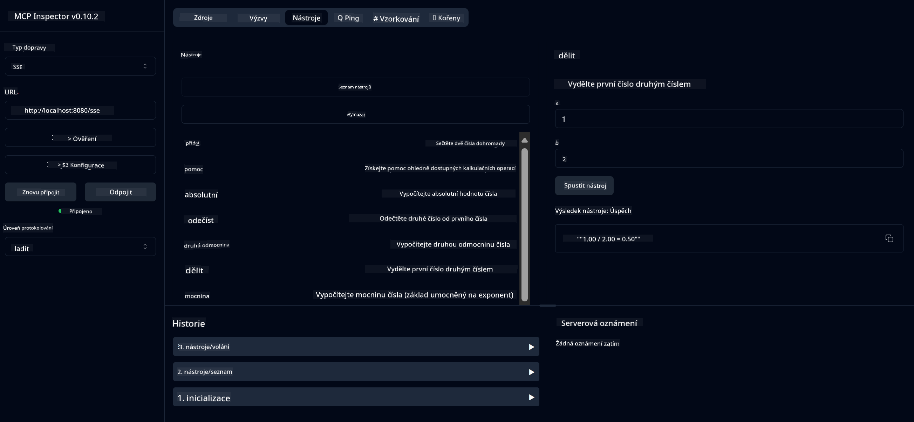

<!--
CO_OP_TRANSLATOR_METADATA:
{
  "original_hash": "ed9cab32cc67c12d8969b407aa47100a",
  "translation_date": "2025-07-13T17:56:17+00:00",
  "source_file": "03-GettingStarted/01-first-server/solution/java/README.md",
  "language_code": "cs"
}
-->
# Základní kalkulační služba MCP

Tato služba poskytuje základní kalkulační operace prostřednictvím Model Context Protocolu (MCP) s využitím Spring Boot a WebFlux transportu. Je navržena jako jednoduchý příklad pro začátečníky, kteří se učí o implementacích MCP.

Pro více informací si přečtěte referenční dokumentaci [MCP Server Boot Starter](https://docs.spring.io/spring-ai/reference/api/mcp/mcp-server-boot-starter-docs.html).


## Použití služby

Služba zpřístupňuje následující API endpointy přes MCP protokol:

- `add(a, b)`: Sečte dvě čísla
- `subtract(a, b)`: Odečte druhé číslo od prvního
- `multiply(a, b)`: Vynásobí dvě čísla
- `divide(a, b)`: Vydělí první číslo druhým (s kontrolou dělení nulou)
- `power(base, exponent)`: Vypočítá mocninu čísla
- `squareRoot(number)`: Vypočítá druhou odmocninu (s kontrolou záporného čísla)
- `modulus(a, b)`: Vypočítá zbytek po dělení
- `absolute(number)`: Vypočítá absolutní hodnotu

## Závislosti

Projekt vyžaduje následující klíčové závislosti:

```xml
<dependency>
    <groupId>org.springframework.ai</groupId>
    <artifactId>spring-ai-starter-mcp-server-webflux</artifactId>
</dependency>
```

## Sestavení projektu

Projekt sestavíte pomocí Maven:
```bash
./mvnw clean install -DskipTests
```

## Spuštění serveru

### Použití Java

```bash
java -jar target/calculator-server-0.0.1-SNAPSHOT.jar
```

### Použití MCP Inspectoru

MCP Inspector je užitečný nástroj pro práci se službami MCP. Pro použití s touto kalkulační službou:

1. **Nainstalujte a spusťte MCP Inspector** v novém terminálovém okně:
   ```bash
   npx @modelcontextprotocol/inspector
   ```

2. **Přistupte k webovému rozhraní** kliknutím na URL zobrazenou aplikací (obvykle http://localhost:6274)

3. **Nastavte připojení**:
   - Zvolte typ transportu "SSE"
   - Nastavte URL na SSE endpoint vašeho běžícího serveru: `http://localhost:8080/sse`
   - Klikněte na "Connect"

4. **Použijte nástroje**:
   - Klikněte na "List Tools" pro zobrazení dostupných kalkulačních operací
   - Vyberte nástroj a klikněte na "Run Tool" pro spuštění operace



**Prohlášení o vyloučení odpovědnosti**:  
Tento dokument byl přeložen pomocí AI překladatelské služby [Co-op Translator](https://github.com/Azure/co-op-translator). I když usilujeme o přesnost, mějte prosím na paměti, že automatické překlady mohou obsahovat chyby nebo nepřesnosti. Původní dokument v jeho mateřském jazyce by měl být považován za závazný zdroj. Pro důležité informace se doporučuje profesionální lidský překlad. Nejsme odpovědní za jakékoliv nedorozumění nebo nesprávné výklady vyplývající z použití tohoto překladu.