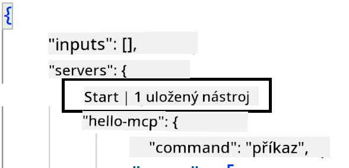
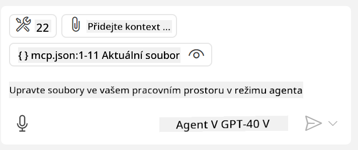
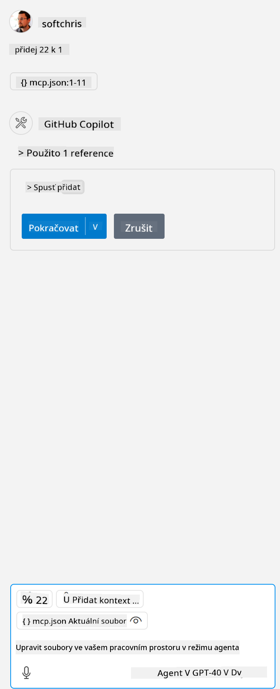

<!--
CO_OP_TRANSLATOR_METADATA:
{
  "original_hash": "c37fabfbc0dcbc9a4afb6d17e7d3be9f",
  "translation_date": "2025-05-17T11:14:43+00:00",
  "source_file": "03-GettingStarted/04-vscode/README.md",
  "language_code": "cs"
}
-->
Pojďme se více zaměřit na to, jak používat vizuální rozhraní v následujících sekcích.

## Přístup

Zde je, jak bychom měli přistoupit k tomuto problému na vysoké úrovni:

- Nakonfigurovat soubor pro nalezení našeho MCP serveru.
- Spustit/Připojit se k danému serveru, aby se zobrazily jeho schopnosti.
- Použít tyto schopnosti prostřednictvím rozhraní pro chat GitHub Copilot.

Skvělé, teď když rozumíme průběhu, zkusme použít MCP server prostřednictvím Visual Studio Code v rámci cvičení.

## Cvičení: Použití serveru

V tomto cvičení nakonfigurujeme Visual Studio Code, aby našlo váš MCP server, takže ho bude možné použít prostřednictvím chatovacího rozhraní GitHub Copilot.

### -0- Předkrok, povolení vyhledávání MCP serveru

Možná budete muset povolit vyhledávání MCP serverů.

1. Jděte na `Soubor -> Předvolby -> Nastavení` in Visual Studio Code.

1. Search for "MCP" and enable `chat.mcp.discovery.enabled` v souboru settings.json.

### -1- Vytvoření konfiguračního souboru

Začněte vytvořením konfiguračního souboru v kořenovém adresáři vašeho projektu. Budete potřebovat soubor nazvaný MCP.json a umístit ho do složky nazvané .vscode. Mělo by to vypadat takto:

```text
.vscode
|-- mcp.json
```

Dále se podíváme, jak můžeme přidat záznam serveru.

### -2- Konfigurace serveru

Přidejte následující obsah do *mcp.json*:

```json
{
    "inputs": [],
    "servers": {
       "hello-mcp": {
           "command": "cmd",
           "args": [
               "/c", "node", "<absolute path>\\build\\index.js"
           ]
       }
    }
}
```

Zde je jednoduchý příklad, jak spustit server napsaný v Node.js, pro jiné runtime zadejte správný příkaz pro spuštění serveru pomocí `command` and `args`.

### -3- Spuštění serveru

Teď, když jste přidali záznam, spusťme server:

1. Najděte svůj záznam v *mcp.json* a ujistěte se, že vidíte ikonu "play":

    

1. Klikněte na ikonu "play", měli byste vidět, jak se v chatovacím rozhraní GitHub Copilot zvyšuje počet dostupných nástrojů. Pokud kliknete na tuto ikonu nástrojů, uvidíte seznam registrovaných nástrojů. Můžete zaškrtnout/odškrtnout každý nástroj podle toho, zda chcete, aby je GitHub Copilot používal jako kontext:

  

1. Pro spuštění nástroje zadejte výzvu, o které víte, že odpovídá popisu jednoho z vašich nástrojů, například výzvu jako "přidej 22 k 1":

  

  Měli byste vidět odpověď říkající 23.

## Úkol

Zkuste přidat záznam serveru do vašeho souboru *mcp.json* a ujistěte se, že můžete server spustit/zastavit. Ujistěte se také, že můžete komunikovat s nástroji na vašem serveru prostřednictvím chatovacího rozhraní GitHub Copilot.

## Řešení

[Řešení](./solution/README.md)

## Klíčové body

Klíčové body z této kapitoly jsou následující:

- Visual Studio Code je skvělý klient, který vám umožňuje využívat několik MCP serverů a jejich nástrojů.
- Chatovací rozhraní GitHub Copilot je způsob, jak interagovat se servery.
- Můžete vyzvat uživatele k zadání vstupů, jako jsou API klíče, které mohou být předány MCP serveru při konfiguraci záznamu serveru v souboru *mcp.json*.

## Ukázky

- [Java Kalkulačka](../samples/java/calculator/README.md)
- [.Net Kalkulačka](../../../../03-GettingStarted/samples/csharp)
- [JavaScript Kalkulačka](../samples/javascript/README.md)
- [TypeScript Kalkulačka](../samples/typescript/README.md)
- [Python Kalkulačka](../../../../03-GettingStarted/samples/python) 

## Další zdroje

- [Dokumentace Visual Studio](https://code.visualstudio.com/docs/copilot/chat/mcp-servers)

## Co bude dál

- Další: [Vytvoření SSE serveru](/03-GettingStarted/05-sse-server/README.md)

**Zřeknutí se odpovědnosti**:  
Tento dokument byl přeložen pomocí služby pro automatický překlad [Co-op Translator](https://github.com/Azure/co-op-translator). Přestože se snažíme o přesnost, mějte na paměti, že automatické překlady mohou obsahovat chyby nebo nepřesnosti. Původní dokument v jeho mateřském jazyce by měl být považován za autoritativní zdroj. Pro důležité informace se doporučuje profesionální lidský překlad. Nejsme zodpovědní za jakékoli nedorozumění nebo nesprávné interpretace vyplývající z použití tohoto překladu.