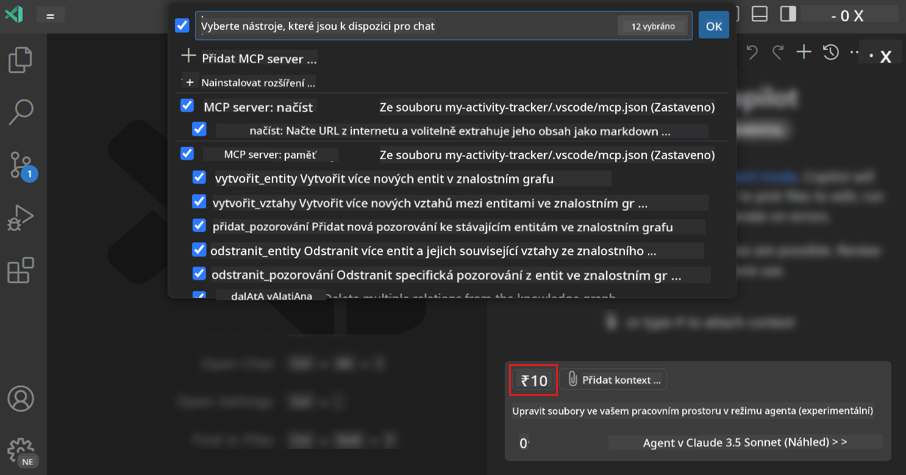
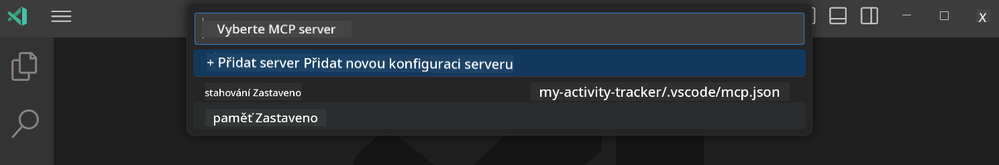
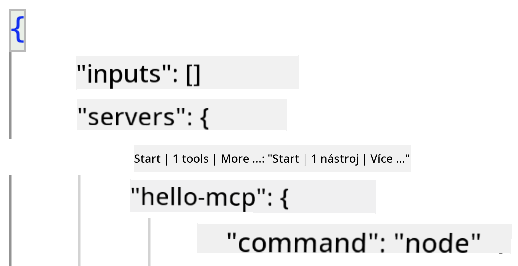
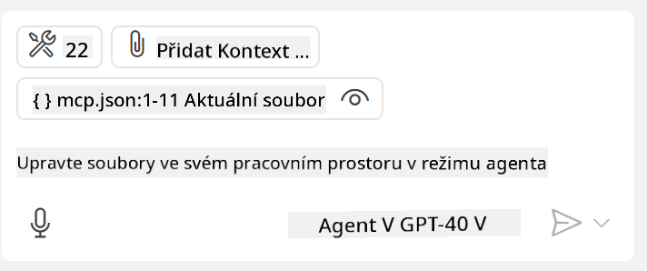

<!--
CO_OP_TRANSLATOR_METADATA:
{
  "original_hash": "d940b5e0af75e3a3a4d1c3179120d1d9",
  "translation_date": "2025-08-26T18:14:00+00:00",
  "source_file": "03-GettingStarted/04-vscode/README.md",
  "language_code": "cs"
}
-->
# Spotřebovávání serveru v režimu agenta GitHub Copilot

Visual Studio Code a GitHub Copilot mohou fungovat jako klient a využívat MCP Server. Proč by nás to mělo zajímat, ptáte se? No, to znamená, že jakékoli funkce, které MCP Server má, mohou být nyní využívány přímo z vašeho IDE. Představte si například přidání MCP serveru GitHubu, což by umožnilo ovládat GitHub pomocí příkazů v přirozeném jazyce místo psaní konkrétních příkazů do terminálu. Nebo si představte cokoli, co by mohlo zlepšit váš vývojářský zážitek, vše ovládané přirozeným jazykem. Už vidíte tu výhodu, že?

## Přehled

Tato lekce pokrývá, jak používat Visual Studio Code a režim agenta GitHub Copilot jako klienta pro váš MCP Server.

## Cíle učení

Na konci této lekce budete schopni:

- Využívat MCP Server prostřednictvím Visual Studio Code.
- Spouštět funkce, jako jsou nástroje, přes GitHub Copilot.
- Nastavit Visual Studio Code tak, aby našel a spravoval váš MCP Server.

## Použití

Svůj MCP server můžete ovládat dvěma různými způsoby:

- Uživatelské rozhraní – jak to funguje, uvidíte později v této kapitole.
- Terminál – je možné ovládat věci z terminálu pomocí spustitelného souboru `code`:

  Pro přidání MCP serveru do vašeho uživatelského profilu použijte příkazovou volbu --add-mcp a poskytněte konfiguraci serveru ve formátu JSON {\"name\":\"server-name\",\"command\":...}.

  ```
  code --add-mcp "{\"name\":\"my-server\",\"command\": \"uvx\",\"args\": [\"mcp-server-fetch\"]}"
  ```

### Snímky obrazovky





Pojďme si více povědět o tom, jak používat vizuální rozhraní v následujících sekcích.

## Přístup

Zde je, jak bychom měli k tomu přistupovat na vysoké úrovni:

- Nastavit soubor pro nalezení našeho MCP Serveru.
- Spustit/Připojit se k danému serveru, aby zobrazil své funkce.
- Používat tyto funkce prostřednictvím rozhraní GitHub Copilot Chat.

Skvělé, teď, když rozumíme toku, pojďme si vyzkoušet použití MCP Serveru ve Visual Studio Code prostřednictvím cvičení.

## Cvičení: Využívání serveru

V tomto cvičení nastavíme Visual Studio Code tak, aby našel váš MCP server, aby mohl být použit prostřednictvím rozhraní GitHub Copilot Chat.

### -0- Předkrok: Povolení vyhledávání MCP Serverů

Možná budete muset povolit vyhledávání MCP Serverů.

1. Přejděte na `Soubor -> Předvolby -> Nastavení` ve Visual Studio Code.

1. Vyhledejte "MCP" a povolte `chat.mcp.discovery.enabled` v souboru settings.json.

### -1- Vytvoření konfiguračního souboru

Začněte vytvořením konfiguračního souboru v kořenovém adresáři vašeho projektu. Budete potřebovat soubor s názvem MCP.json, který umístíte do složky .vscode. Mělo by to vypadat takto:

```text
.vscode
|-- mcp.json
```

Dále se podíváme, jak přidat záznam serveru.

### -2- Konfigurace serveru

Přidejte následující obsah do souboru *mcp.json*:

```json
{
    "inputs": [],
    "servers": {
       "hello-mcp": {
           "command": "node",
           "args": [
               "build/index.js"
           ]
       }
    }
}
```

Výše uvedený příklad ukazuje, jak spustit server napsaný v Node.js. Pro jiné runtime uveďte správný příkaz pro spuštění serveru pomocí `command` a `args`.

### -3- Spuštění serveru

Nyní, když jste přidali záznam, spusťte server:

1. Najděte svůj záznam v *mcp.json* a ujistěte se, že vidíte ikonu "play":

    

1. Klikněte na ikonu "play". Měli byste vidět, že se počet dostupných nástrojů v ikoně nástrojů GitHub Copilot Chat zvýší. Pokud na tuto ikonu kliknete, zobrazí se seznam registrovaných nástrojů. Můžete zaškrtnout/odškrtnout každý nástroj podle toho, zda chcete, aby je GitHub Copilot používal jako kontext:

  

1. Pro spuštění nástroje napište příkaz, o kterém víte, že odpovídá popisu jednoho z vašich nástrojů, například příkaz "přidej 22 k 1":

  

  Měli byste vidět odpověď s výsledkem 23.

## Zadání

Zkuste přidat záznam serveru do svého souboru *mcp.json* a ujistěte se, že můžete server spustit/zastavit. Ujistěte se také, že můžete komunikovat s nástroji na vašem serveru prostřednictvím rozhraní GitHub Copilot Chat.

## Řešení

[Řešení](./solution/README.md)

## Klíčové poznatky

Klíčové poznatky z této kapitoly jsou následující:

- Visual Studio Code je skvělý klient, který umožňuje využívat několik MCP Serverů a jejich nástrojů.
- Rozhraní GitHub Copilot Chat je způsob, jak komunikovat se servery.
- Můžete vyžádat od uživatele vstupy, jako jsou API klíče, které mohou být předány MCP Serveru při konfiguraci záznamu serveru v souboru *mcp.json*.

## Ukázky

- [Java Kalkulačka](../samples/java/calculator/README.md)
- [.Net Kalkulačka](../../../../03-GettingStarted/samples/csharp)
- [JavaScript Kalkulačka](../samples/javascript/README.md)
- [TypeScript Kalkulačka](../samples/typescript/README.md)
- [Python Kalkulačka](../../../../03-GettingStarted/samples/python)

## Další zdroje

- [Dokumentace Visual Studio](https://code.visualstudio.com/docs/copilot/chat/mcp-servers)

## Co dál

- Další: [Vytváření stdio Serveru](../05-stdio-server/README.md)

---

**Upozornění**:  
Tento dokument byl přeložen pomocí služby pro automatický překlad [Co-op Translator](https://github.com/Azure/co-op-translator). I když se snažíme o přesnost, mějte prosím na paměti, že automatické překlady mohou obsahovat chyby nebo nepřesnosti. Původní dokument v jeho původním jazyce by měl být považován za závazný zdroj. Pro důležité informace se doporučuje profesionální lidský překlad. Neodpovídáme za jakékoli nedorozumění nebo nesprávné interpretace vyplývající z použití tohoto překladu.