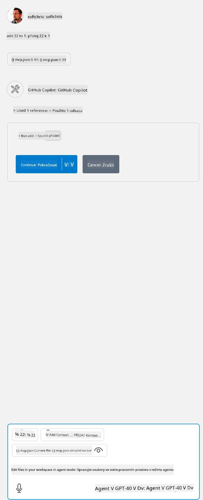

<!--
CO_OP_TRANSLATOR_METADATA:
{
  "original_hash": "5ef8f5821c1a04f7b1fc4f15098ecab8",
  "translation_date": "2025-07-13T19:45:31+00:00",
  "source_file": "03-GettingStarted/04-vscode/solution/README.md",
  "language_code": "cs"
}
-->
To odpovídá spuštění příkazu jako `node build/index.js`.

- Změňte tento záznam serveru tak, aby odpovídal umístění vašeho serverového souboru nebo tomu, co je potřeba pro spuštění serveru podle zvoleného runtime a umístění serveru.

## Využití funkcí na serveru

- Klikněte na ikonu `play`, jakmile přidáte *mcp.json* do složky *./vscode*,

    Sledujte, jak se ikona nástrojů změní a počet dostupných nástrojů se zvýší. Ikona nástrojů se nachází přímo nad polem pro chat v GitHub Copilot.

## Spuštění nástroje

- Napište do okna chatu příkaz, který odpovídá popisu vašeho nástroje. Například pro spuštění nástroje `add` napište něco jako "add 3 to 20".

    Měli byste vidět, že se nad textovým polem chatu zobrazí nástroj, který můžete vybrat pro spuštění, jako na tomto obrázku:

    

    Výběr nástroje by měl vrátit číselný výsledek "23", pokud byl váš příkaz jako v předchozím příkladu.

**Prohlášení o vyloučení odpovědnosti**:  
Tento dokument byl přeložen pomocí AI překladatelské služby [Co-op Translator](https://github.com/Azure/co-op-translator). I když usilujeme o přesnost, mějte prosím na paměti, že automatizované překlady mohou obsahovat chyby nebo nepřesnosti. Původní dokument v jeho mateřském jazyce by měl být považován za autoritativní zdroj. Pro důležité informace se doporučuje profesionální lidský překlad. Nejsme odpovědní za jakékoliv nedorozumění nebo nesprávné výklady vyplývající z použití tohoto překladu.