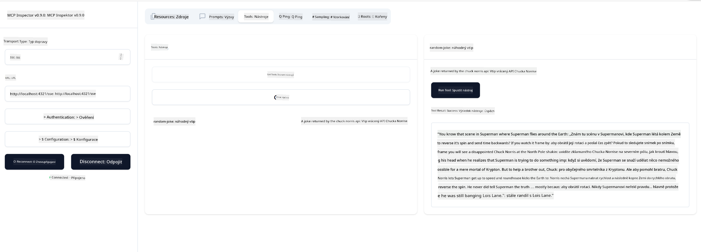

<!--
CO_OP_TRANSLATOR_METADATA:
{
  "original_hash": "d90ca3d326c48fab2ac0ebd3a9876f59",
  "translation_date": "2025-07-13T20:00:47+00:00",
  "source_file": "03-GettingStarted/05-sse-server/README.md",
  "language_code": "cs"
}
-->
Teď, když už o SSE víme trochu víc, pojďme si postavit SSE server.

## Cvičení: Vytvoření SSE serveru

Při vytváření serveru je potřeba mít na paměti dvě věci:

- Musíme použít webový server, který zpřístupní endpointy pro připojení a zprávy.
- Server postavíme stejně jako obvykle s nástroji, zdroji a promptami, jak jsme to dělali u stdio.

### -1- Vytvoření instance serveru

Pro vytvoření serveru použijeme stejné typy jako u stdio. Pro transport ale musíme zvolit SSE.

---

Pojďme teď přidat potřebné routy.

### -2- Přidání rout

Přidáme routy, které budou zpracovávat připojení a příchozí zprávy:

---

Nyní přidáme schopnosti serveru.

### -3- Přidání schopností serveru

Teď, když máme definováno vše specifické pro SSE, přidáme schopnosti serveru jako nástroje, prompta a zdroje.

---

Celý váš kód by měl vypadat takto:

---

Skvěle, máme server používající SSE, pojďme si ho teď vyzkoušet.

## Cvičení: Ladění SSE serveru pomocí Inspectoru

Inspector je skvělý nástroj, který jsme viděli v předchozí lekci [Vytvoření vašeho prvního serveru](/03-GettingStarted/01-first-server/README.md). Podívejme se, jestli ho můžeme použít i tady:

### -1- Spuštění inspectoru

Nejprve musíte mít spuštěný SSE server, tak ho spusťme:

1. Spusťte server

---

1. Spusťte inspector

    > ![NOTE]
    > Spouštějte tento příkaz v jiném terminálovém okně než server. Také si upravte níže uvedený příkaz tak, aby odpovídal URL, kde váš server běží.

    ```sh
    npx @modelcontextprotocol/inspector --cli http://localhost:8000/sse --method tools/list
    ```

Spuštění inspectoru vypadá stejně ve všech runtimech. Všimněte si, že místo předání cesty k serveru a příkazu pro jeho spuštění předáváme URL, kde server běží, a také specifikujeme routu `/sse`.

### -2- Vyzkoušení nástroje

Připojte se k serveru výběrem SSE v rozbalovacím seznamu a vyplňte pole URL, kde váš server běží, například http://localhost:4321/sse. Pak klikněte na tlačítko „Connect“. Stejně jako dříve vyberte zobrazení nástrojů, vyberte nástroj a zadejte vstupní hodnoty. Měli byste vidět výsledek jako na obrázku níže:



Skvěle, umíte pracovat s inspector, pojďme se podívat, jak pracovat s Visual Studio Code.

## Zadání

Zkuste rozšířit svůj server o další schopnosti. Podívejte se na [tuto stránku](https://api.chucknorris.io/), kde můžete například přidat nástroj, který volá API. Vy rozhodnete, jak by měl server vypadat. Hodně zábavy :)

## Řešení

[Řešení](./solution/README.md) Zde je možné řešení s funkčním kódem.

## Hlavní poznatky

Hlavní poznatky z této kapitoly jsou:

- SSE je druhý podporovaný transport vedle stdio.
- Pro podporu SSE musíte spravovat příchozí připojení a zprávy pomocí webového frameworku.
- K využívání SSE serveru můžete použít jak Inspector, tak Visual Studio Code, stejně jako u stdio serverů. Všimněte si, že se to trochu liší mezi stdio a SSE. U SSE musíte server spustit zvlášť a pak spustit inspector. U inspectoru je také potřeba specifikovat URL.

## Ukázky

- [Java Calculator](../samples/java/calculator/README.md)
- [.Net Calculator](../../../../03-GettingStarted/samples/csharp)
- [JavaScript Calculator](../samples/javascript/README.md)
- [TypeScript Calculator](../samples/typescript/README.md)
- [Python Calculator](../../../../03-GettingStarted/samples/python)

## Další zdroje

- [SSE](https://developer.mozilla.org/en-US/docs/Web/API/Server-sent_events)

## Co dál

- Další: [HTTP Streaming s MCP (Streamable HTTP)](../06-http-streaming/README.md)

**Prohlášení o vyloučení odpovědnosti**:  
Tento dokument byl přeložen pomocí AI překladatelské služby [Co-op Translator](https://github.com/Azure/co-op-translator). I když usilujeme o přesnost, mějte prosím na paměti, že automatické překlady mohou obsahovat chyby nebo nepřesnosti. Původní dokument v jeho mateřském jazyce by měl být považován za autoritativní zdroj. Pro důležité informace se doporučuje profesionální lidský překlad. Nejsme odpovědní za jakékoliv nedorozumění nebo nesprávné výklady vyplývající z použití tohoto překladu.