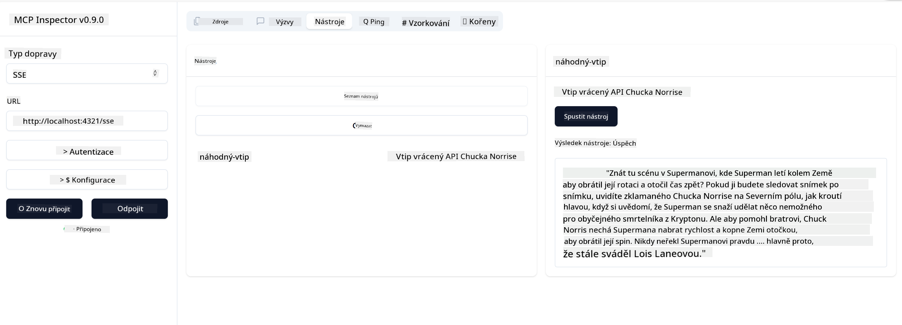

<!--
CO_OP_TRANSLATOR_METADATA:
{
  "original_hash": "0a8086dc4bf89448f83e7936db972c42",
  "translation_date": "2025-05-17T11:42:28+00:00",
  "source_file": "03-GettingStarted/05-sse-server/README.md",
  "language_code": "cs"
}
-->
Nyní, když víme o SSE trochu více, pojďme si postavit SSE server.

## Cvičení: Vytvoření SSE serveru

Při vytváření našeho serveru musíme mít na paměti dvě věci:

- Musíme použít webový server pro zpřístupnění koncových bodů pro připojení a zprávy.
- Postavíme náš server jako obvykle s nástroji, zdroji a výzvami, které jsme používali při použití stdio.

### -1- Vytvoření instance serveru

Pro vytvoření našeho serveru použijeme stejné typy jako u stdio. Nicméně, pro transport musíme zvolit SSE.

Pojďme přidat potřebné trasy.

### -2- Přidání tras

Přidáme trasy, které zpracovávají připojení a příchozí zprávy.

Přidáme schopnosti serveru.

### -3- Přidání schopností serveru

Nyní, když máme vše specifické pro SSE definováno, přidáme schopnosti serveru jako nástroje, výzvy a zdroje.

Váš kompletní kód by měl vypadat takto:

Skvělé, máme server používající SSE, pojďme ho vyzkoušet.

## Cvičení: Ladění SSE serveru s Inspector

Inspector je skvělý nástroj, který jsme viděli v předchozí lekci [Vytvoření vašeho prvního serveru](/03-GettingStarted/01-first-server/README.md). Podívejme se, jestli můžeme Inspector použít i zde:

### -1- Spuštění Inspector

Aby bylo možné spustit Inspector, musíte nejprve mít spuštěný SSE server, takže to uděláme:

1. Spusťte server

1. Spusťte Inspector

    > ![NOTE]
    > Spusťte to v samostatném okně terminálu, než ve kterém běží server. Také si všimněte, že potřebujete upravit níže uvedený příkaz, aby odpovídal URL, kde váš server běží.

    ```sh
    npx @modelcontextprotocol/inspector --cli http://localhost:8000/sse --method tools/list
    ```

    Spuštění Inspector vypadá stejně ve všech runtimech. Všimněte si, jak místo předání cesty k našemu serveru a příkazu pro spuštění serveru místo toho předáváme URL, kde server běží, a také specifikujeme trasu `/sse`.

### -2- Vyzkoušení nástroje

Připojte server výběrem SSE v rozbalovací nabídce a vyplňte pole URL, kde váš server běží, například http:localhost:4321/sse. Nyní klikněte na tlačítko "Connect". Jako dříve, vyberte seznam nástrojů, vyberte nástroj a poskytněte vstupní hodnoty. Měli byste vidět výsledek jako níže:



Skvělé, jste schopni pracovat s Inspector, podívejme se, jak můžeme pracovat s Visual Studio Code dále.

## Úkol

Zkuste rozšířit svůj server o další schopnosti. Podívejte se na [tuto stránku](https://api.chucknorris.io/), abyste například přidali nástroj, který volá API, rozhodněte se, jak by měl váš server vypadat. Užijte si to :)

## Řešení

[Řešení](./solution/README.md) Zde je možné řešení s funkčním kódem.

## Klíčové poznatky

Poznatky z této kapitoly jsou následující:

- SSE je druhý podporovaný transport vedle stdio.
- Aby bylo možné podporovat SSE, musíte spravovat příchozí připojení a zprávy pomocí webového frameworku.
- Můžete použít jak Inspector, tak Visual Studio Code k použití SSE serveru, stejně jako stdio servery. Všimněte si, jak se to trochu liší mezi stdio a SSE. Pro SSE musíte server spustit samostatně a poté spustit váš nástroj Inspector. Pro nástroj Inspector jsou také nějaké rozdíly v tom, že musíte specifikovat URL.

## Ukázky

- [Java Kalkulačka](../samples/java/calculator/README.md)
- [.Net Kalkulačka](../../../../03-GettingStarted/samples/csharp)
- [JavaScript Kalkulačka](../samples/javascript/README.md)
- [TypeScript Kalkulačka](../samples/typescript/README.md)
- [Python Kalkulačka](../../../../03-GettingStarted/samples/python)

## Další zdroje

- [SSE](https://developer.mozilla.org/en-US/docs/Web/API/Server-sent_events)

## Co dál

- Dále: [Začínáme s AI Toolkit pro VSCode](/03-GettingStarted/06-aitk/README.md)

**Prohlášení**:  
Tento dokument byl přeložen pomocí služby pro automatický překlad [Co-op Translator](https://github.com/Azure/co-op-translator). I když se snažíme o přesnost, mějte prosím na paměti, že automatizované překlady mohou obsahovat chyby nebo nepřesnosti. Původní dokument v jeho původním jazyce by měl být považován za závazný zdroj. Pro důležité informace je doporučen profesionální lidský překlad. Nejsme zodpovědní za jakékoli nedorozumění nebo chybné interpretace vyplývající z použití tohoto překladu.