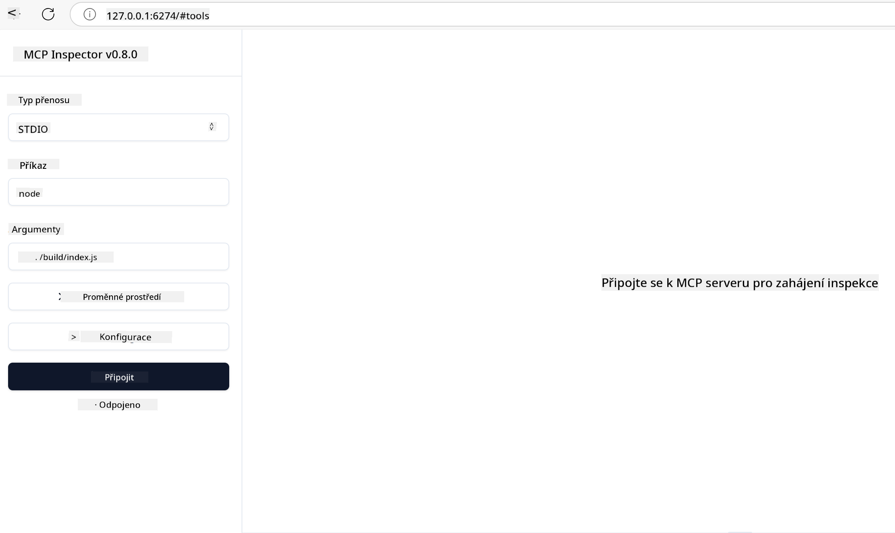

<!--
CO_OP_TRANSLATOR_METADATA:
{
  "original_hash": "4e34e34e84f013e73c7eaa6d09884756",
  "translation_date": "2025-07-13T22:03:21+00:00",
  "source_file": "03-GettingStarted/08-testing/README.md",
  "language_code": "cs"
}
-->
## Testování a ladění

Než začnete testovat svůj MCP server, je důležité pochopit dostupné nástroje a osvědčené postupy pro ladění. Efektivní testování zajistí, že váš server bude fungovat podle očekávání, a pomůže vám rychle identifikovat a vyřešit problémy. Následující část popisuje doporučené přístupy k ověření vaší implementace MCP.

## Přehled

Tato lekce se zabývá tím, jak vybrat správný přístup k testování a nejefektivnější nástroj pro testování.

## Cíle učení

Na konci této lekce budete schopni:

- Popsat různé přístupy k testování.
- Používat různé nástroje pro efektivní testování vašeho kódu.

## Testování MCP serverů

MCP poskytuje nástroje, které vám pomohou testovat a ladit vaše servery:

- **MCP Inspector**: Nástroj příkazové řádky, který lze spustit jak jako CLI nástroj, tak i jako vizuální nástroj.
- **Manuální testování**: Můžete použít nástroj jako curl pro spouštění webových požadavků, ale postačí jakýkoli nástroj schopný provádět HTTP požadavky.
- **Unit testing**: Je možné použít váš oblíbený testovací framework k testování funkcí jak serveru, tak klienta.

### Použití MCP Inspector

Použití tohoto nástroje jsme popsali v předchozích lekcích, ale pojďme si to shrnout na vyšší úrovni. Jedná se o nástroj postavený na Node.js, který můžete spustit pomocí příkazu `npx`. Ten dočasně stáhne a nainstaluje nástroj a po dokončení vašeho požadavku se sám odstraní.

[MCP Inspector](https://github.com/modelcontextprotocol/inspector) vám pomůže:

- **Objevovat schopnosti serveru**: Automaticky detekuje dostupné zdroje, nástroje a výzvy
- **Testovat spuštění nástrojů**: Vyzkoušet různé parametry a sledovat odpovědi v reálném čase
- **Prohlížet metadata serveru**: Zkoumat informace o serveru, schémata a konfigurace

Typické spuštění nástroje vypadá takto:

```bash
npx @modelcontextprotocol/inspector node build/index.js
```

Výše uvedený příkaz spustí MCP a jeho vizuální rozhraní a otevře lokální webové rozhraní ve vašem prohlížeči. Můžete očekávat dashboard zobrazující vaše registrované MCP servery, jejich dostupné nástroje, zdroje a výzvy. Rozhraní umožňuje interaktivně testovat spuštění nástrojů, prohlížet metadata serveru a sledovat odpovědi v reálném čase, což usnadňuje ověřování a ladění implementací MCP serveru.

Takto to může vypadat: 

Tento nástroj můžete také spustit v režimu CLI, kdy přidáte atribut `--cli`. Zde je příklad spuštění nástroje v režimu "CLI", který vypíše všechny nástroje na serveru:

```sh
npx @modelcontextprotocol/inspector --cli node build/index.js --method tools/list
```

### Manuální testování

Kromě spuštění nástroje inspector pro testování schopností serveru můžete použít podobný přístup a spustit klienta schopného používat HTTP, například curl.

Pomocí curl můžete testovat MCP servery přímo pomocí HTTP požadavků:

```bash
# Example: Test server metadata
curl http://localhost:3000/v1/metadata

# Example: Execute a tool
curl -X POST http://localhost:3000/v1/tools/execute \
  -H "Content-Type: application/json" \
  -d '{"name": "calculator", "parameters": {"expression": "2+2"}}'
```

Jak vidíte z výše uvedeného příkladu použití curl, používáte POST požadavek k vyvolání nástroje s payloadem obsahujícím název nástroje a jeho parametry. Použijte přístup, který vám nejlépe vyhovuje. CLI nástroje jsou obecně rychlejší na použití a snadno se dají skriptovat, což může být užitečné v prostředí CI/CD.

### Unit testing

Vytvořte unit testy pro své nástroje a zdroje, abyste zajistili, že fungují podle očekávání. Zde je ukázka testovacího kódu.

```python
import pytest

from mcp.server.fastmcp import FastMCP
from mcp.shared.memory import (
    create_connected_server_and_client_session as create_session,
)

# Mark the whole module for async tests
pytestmark = pytest.mark.anyio


async def test_list_tools_cursor_parameter():
    """Test that the cursor parameter is accepted for list_tools.

    Note: FastMCP doesn't currently implement pagination, so this test
    only verifies that the cursor parameter is accepted by the client.
    """

 server = FastMCP("test")

    # Create a couple of test tools
    @server.tool(name="test_tool_1")
    async def test_tool_1() -> str:
        """First test tool"""
        return "Result 1"

    @server.tool(name="test_tool_2")
    async def test_tool_2() -> str:
        """Second test tool"""
        return "Result 2"

    async with create_session(server._mcp_server) as client_session:
        # Test without cursor parameter (omitted)
        result1 = await client_session.list_tools()
        assert len(result1.tools) == 2

        # Test with cursor=None
        result2 = await client_session.list_tools(cursor=None)
        assert len(result2.tools) == 2

        # Test with cursor as string
        result3 = await client_session.list_tools(cursor="some_cursor_value")
        assert len(result3.tools) == 2

        # Test with empty string cursor
        result4 = await client_session.list_tools(cursor="")
        assert len(result4.tools) == 2
    
```

Výše uvedený kód dělá následující:

- Využívá framework pytest, který umožňuje vytvářet testy jako funkce a používat assert příkazy.
- Vytváří MCP server se dvěma různými nástroji.
- Používá příkaz `assert` k ověření, že jsou splněny určité podmínky.

Podívejte se na [celý soubor zde](https://github.com/modelcontextprotocol/python-sdk/blob/main/tests/client/test_list_methods_cursor.py)

Na základě tohoto souboru můžete otestovat svůj vlastní server, abyste se ujistili, že schopnosti jsou vytvořeny tak, jak mají být.

Všechny hlavní SDK mají podobné sekce pro testování, takže je můžete přizpůsobit svému zvolenému runtime.

## Ukázky

- [Java Calculator](../samples/java/calculator/README.md)
- [.Net Calculator](../../../../03-GettingStarted/samples/csharp)
- [JavaScript Calculator](../samples/javascript/README.md)
- [TypeScript Calculator](../samples/typescript/README.md)
- [Python Calculator](../../../../03-GettingStarted/samples/python)

## Další zdroje

- [Python SDK](https://github.com/modelcontextprotocol/python-sdk)

## Co dál

- Další: [Deployment](../09-deployment/README.md)

**Prohlášení o vyloučení odpovědnosti**:  
Tento dokument byl přeložen pomocí AI překladatelské služby [Co-op Translator](https://github.com/Azure/co-op-translator). I když usilujeme o přesnost, mějte prosím na paměti, že automatizované překlady mohou obsahovat chyby nebo nepřesnosti. Původní dokument v jeho mateřském jazyce by měl být považován za závazný zdroj. Pro důležité informace se doporučuje profesionální lidský překlad. Nejsme odpovědní za jakékoliv nedorozumění nebo nesprávné výklady vyplývající z použití tohoto překladu.