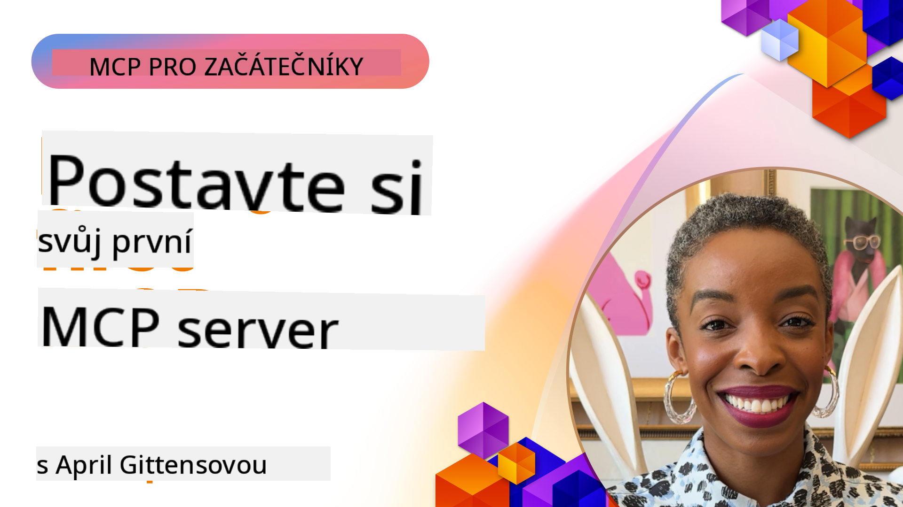

<!--
CO_OP_TRANSLATOR_METADATA:
{
  "original_hash": "858362ce0118de3fec0f9114bf396101",
  "translation_date": "2025-08-18T19:59:07+00:00",
  "source_file": "03-GettingStarted/README.md",
  "language_code": "cs"
}
-->
## Začínáme  

_(Klikněte na obrázek výše pro zhlédnutí videa této lekce)_

Tato sekce se skládá z několika lekcí:

- **1 Váš první server**, v této první lekci se naučíte, jak vytvořit svůj první server a zkontrolovat ho pomocí inspektoru, což je užitečný nástroj pro testování a ladění vašeho serveru, [k lekci](01-first-server/README.md)

- **2 Klient**, v této lekci se naučíte, jak napsat klienta, který se může připojit k vašemu serveru, [k lekci](02-client/README.md)

- **3 Klient s LLM**, ještě lepší způsob, jak napsat klienta, je přidat do něj LLM, aby mohl "vyjednávat" s vaším serverem, co má dělat, [k lekci](03-llm-client/README.md)

- **4 Spotřeba serveru v režimu GitHub Copilot Agent ve Visual Studio Code**. Zde se podíváme na spuštění našeho MCP serveru přímo ve Visual Studio Code, [k lekci](04-vscode/README.md)

- **5 Spotřeba ze SSE (Server Sent Events)** SSE je standard pro streamování server-klient, který umožňuje serverům posílat klientům aktualizace v reálném čase přes HTTP [k lekci](05-sse-server/README.md)

- **6 HTTP streamování s MCP (Streamable HTTP)**. Naučte se o moderním HTTP streamování, notifikacích o průběhu a jak implementovat škálovatelné, real-time MCP servery a klienty pomocí Streamable HTTP. [k lekci](06-http-streaming/README.md)

- **7 Využití AI Toolkit pro VSCode** pro spotřebu a testování vašich MCP klientů a serverů [k lekci](07-aitk/README.md)

- **8 Testování**. Zde se zaměříme zejména na to, jak můžeme testovat náš server a klient různými způsoby, [k lekci](08-testing/README.md)

- **9 Nasazení**. Tato kapitola se zaměří na různé způsoby nasazení vašich MCP řešení, [k lekci](09-deployment/README.md)

Model Context Protocol (MCP) je otevřený protokol, který standardizuje, jak aplikace poskytují kontext LLM. Představte si MCP jako USB-C port pro AI aplikace - poskytuje standardizovaný způsob, jak připojit AI modely k různým zdrojům dat a nástrojům.

## Cíle učení

Na konci této lekce budete schopni:

- Nastavit vývojová prostředí pro MCP v C#, Java, Python, TypeScript a JavaScript
- Vytvořit a nasadit základní MCP servery s vlastními funkcemi (zdroje, prompty a nástroje)
- Vytvořit hostitelské aplikace, které se připojují k MCP serverům
- Testovat a ladit implementace MCP
- Pochopit běžné problémy při nastavování a jejich řešení
- Připojit vaše implementace MCP k populárním LLM službám

## Nastavení vašeho MCP prostředí

Než začnete pracovat s MCP, je důležité připravit si vývojové prostředí a pochopit základní pracovní postup. Tato sekce vás provede počátečními kroky nastavení, aby byl váš start s MCP co nejhladší.

### Předpoklady

Než se pustíte do vývoje MCP, ujistěte se, že máte:

- **Vývojové prostředí**: Pro vámi zvolený jazyk (C#, Java, Python, TypeScript nebo JavaScript)
- **IDE/Editor**: Visual Studio, Visual Studio Code, IntelliJ, Eclipse, PyCharm nebo jakýkoli moderní editor kódu
- **Správce balíčků**: NuGet, Maven/Gradle, pip nebo npm/yarn
- **API klíče**: Pro jakékoli AI služby, které plánujete použít ve svých hostitelských aplikacích

### Oficiální SDK

V nadcházejících kapitolách uvidíte řešení postavená pomocí Pythonu, TypeScriptu, Javy a .NET. Zde jsou všechna oficiálně podporovaná SDK.

MCP poskytuje oficiální SDK pro více jazyků:
- [C# SDK](https://github.com/modelcontextprotocol/csharp-sdk) - Udržováno ve spolupráci s Microsoftem
- [Java SDK](https://github.com/modelcontextprotocol/java-sdk) - Udržováno ve spolupráci se Spring AI
- [TypeScript SDK](https://github.com/modelcontextprotocol/typescript-sdk) - Oficiální implementace TypeScriptu
- [Python SDK](https://github.com/modelcontextprotocol/python-sdk) - Oficiální implementace Pythonu
- [Kotlin SDK](https://github.com/modelcontextprotocol/kotlin-sdk) - Oficiální implementace Kotlinu
- [Swift SDK](https://github.com/modelcontextprotocol/swift-sdk) - Udržováno ve spolupráci s Loopwork AI
- [Rust SDK](https://github.com/modelcontextprotocol/rust-sdk) - Oficiální implementace Rustu

## Klíčové poznatky

- Nastavení vývojového prostředí MCP je jednoduché díky SDK specifickým pro jednotlivé jazyky
- Vytváření MCP serverů zahrnuje vytváření a registraci nástrojů s jasnými schématy
- MCP klienti se připojují k serverům a modelům, aby využili rozšířené schopnosti
- Testování a ladění jsou klíčové pro spolehlivé implementace MCP
- Možnosti nasazení sahají od lokálního vývoje po cloudová řešení

## Procvičování

Máme sadu ukázek, které doplňují cvičení, jež uvidíte ve všech kapitolách této sekce. Každá kapitola navíc obsahuje vlastní cvičení a úkoly.

- [Java Kalkulačka](./samples/java/calculator/README.md)
- [.Net Kalkulačka](../../../03-GettingStarted/samples/csharp)
- [JavaScript Kalkulačka](./samples/javascript/README.md)
- [TypeScript Kalkulačka](./samples/typescript/README.md)
- [Python Kalkulačka](../../../03-GettingStarted/samples/python)

## Další zdroje

- [Vytváření agentů pomocí Model Context Protocol na Azure](https://learn.microsoft.com/azure/developer/ai/intro-agents-mcp)
- [Vzdálený MCP s Azure Container Apps (Node.js/TypeScript/JavaScript)](https://learn.microsoft.com/samples/azure-samples/mcp-container-ts/mcp-container-ts/)
- [.NET OpenAI MCP Agent](https://learn.microsoft.com/samples/azure-samples/openai-mcp-agent-dotnet/openai-mcp-agent-dotnet/)

## Co dál

Další: [Vytvoření vašeho prvního MCP serveru](01-first-server/README.md)

**Prohlášení:**  
Tento dokument byl přeložen pomocí služby AI pro překlady [Co-op Translator](https://github.com/Azure/co-op-translator). Ačkoli se snažíme o přesnost, mějte prosím na paměti, že automatizované překlady mohou obsahovat chyby nebo nepřesnosti. Původní dokument v jeho původním jazyce by měl být považován za autoritativní zdroj. Pro důležité informace se doporučuje profesionální lidský překlad. Nenese odpovědnost za žádná nedorozumění nebo nesprávné interpretace vyplývající z použití tohoto překladu.