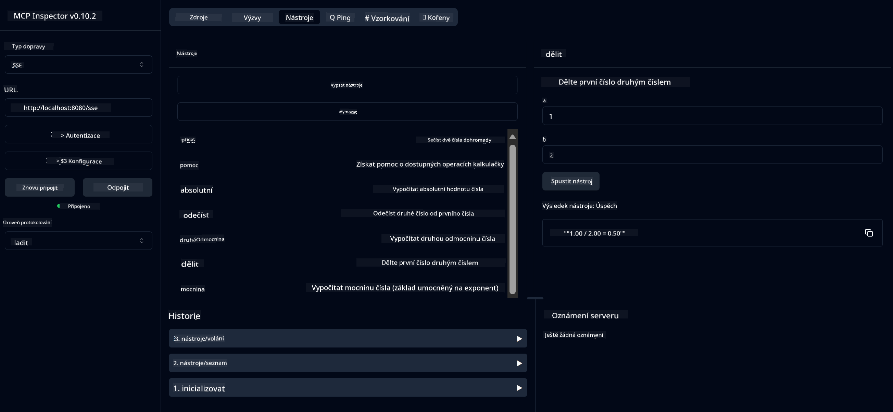

<!--
CO_OP_TRANSLATOR_METADATA:
{
  "original_hash": "13231e9951b68efd9df8c56bd5cdb27e",
  "translation_date": "2025-05-17T13:16:58+00:00",
  "source_file": "03-GettingStarted/samples/java/calculator/README.md",
  "language_code": "cs"
}
-->
# Základní kalkulačka MCP služba

Tato služba poskytuje základní kalkulační operace prostřednictvím Model Context Protocol (MCP) pomocí Spring Boot s WebFlux transportem. Je navržena jako jednoduchý příklad pro začátečníky, kteří se učí o implementacích MCP.

Pro více informací si přečtěte referenční dokumentaci [MCP Server Boot Starter](https://docs.spring.io/spring-ai/reference/api/mcp/mcp-server-boot-starter-docs.html).

## Přehled

Služba ukazuje:
- Podporu pro SSE (Server-Sent Events)
- Automatickou registraci nástrojů pomocí anotace Spring AI `@Tool`
- Základní kalkulační funkce:
  - Sčítání, odčítání, násobení, dělení
  - Výpočet mocniny a druhé odmocniny
  - Modulus (zbytek) a absolutní hodnota
  - Funkci nápovědy pro popis operací

## Vlastnosti

Tato kalkulační služba nabízí následující schopnosti:

1. **Základní aritmetické operace**:
   - Sčítání dvou čísel
   - Odčítání jednoho čísla od druhého
   - Násobení dvou čísel
   - Dělení jednoho čísla druhým (s kontrolou dělení nulou)

2. **Pokročilé operace**:
   - Výpočet mocniny (základ na exponent)
   - Výpočet druhé odmocniny (s kontrolou záporného čísla)
   - Výpočet modulu (zbytku)
   - Výpočet absolutní hodnoty

3. **Systém nápovědy**:
   - Vestavěná funkce nápovědy vysvětlující všechny dostupné operace

## Použití služby

Služba poskytuje následující API koncové body prostřednictvím MCP protokolu:

- `add(a, b)`: Sčítání dvou čísel
- `subtract(a, b)`: Odečtení druhého čísla od prvního
- `multiply(a, b)`: Násobení dvou čísel
- `divide(a, b)`: Dělení prvního čísla druhým (s kontrolou nulou)
- `power(base, exponent)`: Výpočet mocniny čísla
- `squareRoot(number)`: Výpočet druhé odmocniny (s kontrolou záporného čísla)
- `modulus(a, b)`: Výpočet zbytku při dělení
- `absolute(number)`: Výpočet absolutní hodnoty
- `help()`: Získání informací o dostupných operacích

## Testovací klient

Jednoduchý testovací klient je zahrnut v balíčku `com.microsoft.mcp.sample.client`. Třída `SampleCalculatorClient` demonstruje dostupné operace kalkulační služby.

## Použití klienta LangChain4j

Projekt zahrnuje příklad klienta LangChain4j v `com.microsoft.mcp.sample.client.LangChain4jClient`, který ukazuje, jak integrovat kalkulační službu s LangChain4j a GitHub modely:

### Předpoklady

1. **Nastavení GitHub tokenu**:
   
   Pro použití GitHub AI modelů (jako phi-4) potřebujete GitHub osobní přístupový token:

   a. Jděte do nastavení svého GitHub účtu: https://github.com/settings/tokens
   
   b. Klikněte na "Generate new token" → "Generate new token (classic)"
   
   c. Dejte svému tokenu popisné jméno
   
   d. Vyberte následující rozsahy:
      - `repo` (Plná kontrola nad soukromými repozitáři)
      - `read:org` (Čtení členství v organizaci a týmu, čtení projektů organizace)
      - `gist` (Vytváření gistů)
      - `user:email` (Přístup k e-mailovým adresám uživatele (pouze pro čtení))
   
   e. Klikněte na "Generate token" a zkopírujte svůj nový token
   
   f. Nastavte jej jako proměnnou prostředí:
      
      Na Windows:
      ```
      set GITHUB_TOKEN=your-github-token
      ```
      
      Na macOS/Linux:
      ```bash
      export GITHUB_TOKEN=your-github-token
      ```

   g. Pro trvalé nastavení jej přidejte do svých systémových proměnných prostředí

2. Přidejte LangChain4j GitHub závislost do svého projektu (již zahrnuto v pom.xml):
   ```xml
   <dependency>
       <groupId>dev.langchain4j</groupId>
       <artifactId>langchain4j-github</artifactId>
       <version>${langchain4j.version}</version>
   </dependency>
   ```

3. Ujistěte se, že kalkulační server běží na `localhost:8080`

### Spuštění klienta LangChain4j

Tento příklad ukazuje:
- Připojení k MCP serveru kalkulačky přes SSE transport
- Použití LangChain4j k vytvoření chat bota, který využívá kalkulační operace
- Integraci s GitHub AI modely (nyní používající model phi-4)

Klient posílá následující vzorové dotazy k demonstraci funkčnosti:
1. Výpočet součtu dvou čísel
2. Nalezení druhé odmocniny čísla
3. Získání informací o dostupných kalkulačních operacích

Spusťte příklad a zkontrolujte výstup konzole, abyste viděli, jak AI model využívá kalkulační nástroje k odpovědi na dotazy.

### Konfigurace GitHub modelu

Klient LangChain4j je nakonfigurován k použití GitHub modelu phi-4 s následujícím nastavením:

```java
ChatLanguageModel model = GitHubChatModel.builder()
    .apiKey(System.getenv("GITHUB_TOKEN"))
    .timeout(Duration.ofSeconds(60))
    .modelName("phi-4")
    .logRequests(true)
    .logResponses(true)
    .build();
```

Pro použití jiných GitHub modelů jednoduše změňte parametr `modelName` na jiný podporovaný model (např. "claude-3-haiku-20240307", "llama-3-70b-8192", atd.).

## Závislosti

Projekt vyžaduje následující klíčové závislosti:

```xml
<!-- For MCP Server -->
<dependency>
    <groupId>org.springframework.ai</groupId>
    <artifactId>spring-ai-starter-mcp-server-webflux</artifactId>
</dependency>

<!-- For LangChain4j integration -->
<dependency>
    <groupId>dev.langchain4j</groupId>
    <artifactId>langchain4j-mcp</artifactId>
    <version>${langchain4j.version}</version>
</dependency>

<!-- For GitHub models support -->
<dependency>
    <groupId>dev.langchain4j</groupId>
    <artifactId>langchain4j-github</artifactId>
    <version>${langchain4j.version}</version>
</dependency>
```

## Sestavení projektu

Sestavte projekt pomocí Maven:
```bash
./mvnw clean install -DskipTests
```

## Spuštění serveru

### Použití Java

```bash
java -jar target/calculator-server-0.0.1-SNAPSHOT.jar
```

### Použití MCP Inspector

MCP Inspector je užitečný nástroj pro interakci s MCP službami. Pro použití s touto kalkulační službou:

1. **Nainstalujte a spusťte MCP Inspector** v novém terminálovém okně:
   ```bash
   npx @modelcontextprotocol/inspector
   ```

2. **Přístup k webovému UI** kliknutím na URL zobrazené aplikací (obvykle http://localhost:6274)

3. **Konfigurace připojení**:
   - Nastavte typ transportu na "SSE"
   - Nastavte URL na SSE endpoint vašeho běžícího serveru: `http://localhost:8080/sse`
   - Klikněte na "Connect"

4. **Použití nástrojů**:
   - Klikněte na "List Tools" pro zobrazení dostupných kalkulačních operací
   - Vyberte nástroj a klikněte na "Run Tool" pro provedení operace



### Použití Dockeru

Projekt obsahuje Dockerfile pro kontejnerizované nasazení:

1. **Sestavení Docker image**:
   ```bash
   docker build -t calculator-mcp-service .
   ```

2. **Spuštění Docker kontejneru**:
   ```bash
   docker run -p 8080:8080 calculator-mcp-service
   ```

Toto:
- Sestaví multi-stage Docker image s Maven 3.9.9 a Eclipse Temurin 24 JDK
- Vytvoří optimalizovaný kontejnerový image
- Otevře službu na portu 8080
- Spustí MCP kalkulační službu uvnitř kontejneru

Jakmile kontejner běží, můžete přistupovat ke službě na `http://localhost:8080`.

## Řešení problémů

### Běžné problémy s GitHub tokenem

1. **Problémy s oprávněním tokenu**: Pokud dostanete chybu 403 Forbidden, zkontrolujte, zda váš token má správná oprávnění, jak je uvedeno v předpokladech.

2. **Token nenalezen**: Pokud dostanete chybu "No API key found", ujistěte se, že proměnná prostředí GITHUB_TOKEN je správně nastavena.

3. **Omezení rychlosti**: GitHub API má omezení rychlosti. Pokud narazíte na chybu s omezením rychlosti (status kód 429), počkejte několik minut před opětovným pokusem.

4. **Vypršení platnosti tokenu**: GitHub tokeny mohou vypršet. Pokud po nějaké době obdržíte chyby při ověřování, vygenerujte nový token a aktualizujte svou proměnnou prostředí.

Pokud potřebujete další pomoc, zkontrolujte [LangChain4j dokumentaci](https://github.com/langchain4j/langchain4j) nebo [GitHub API dokumentaci](https://docs.github.com/en/rest).

**Prohlášení**:  
Tento dokument byl přeložen pomocí AI překladatelské služby [Co-op Translator](https://github.com/Azure/co-op-translator). I když se snažíme o přesnost, mějte prosím na paměti, že automatizované překlady mohou obsahovat chyby nebo nepřesnosti. Původní dokument v jeho rodném jazyce by měl být považován za autoritativní zdroj. Pro důležité informace se doporučuje profesionální lidský překlad. Nejsme odpovědní za jakékoli nedorozumění nebo nesprávné interpretace vyplývající z použití tohoto překladu.