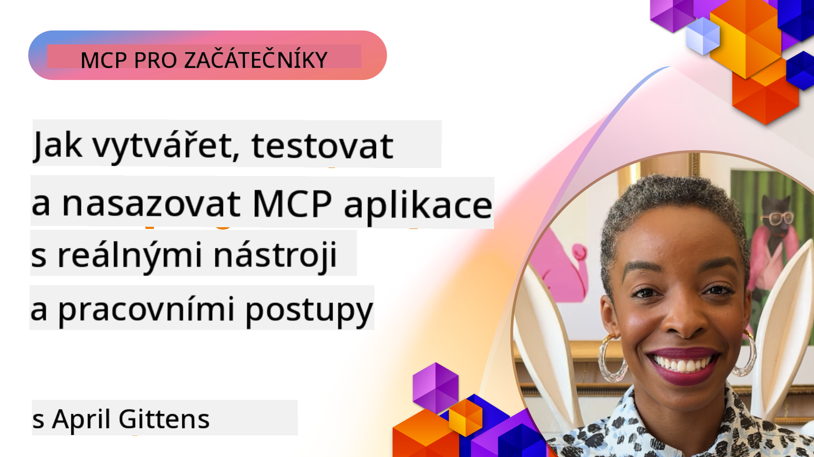

<!--
CO_OP_TRANSLATOR_METADATA:
{
  "original_hash": "83efa75a69bc831277263a6f1ae53669",
  "translation_date": "2025-08-19T15:31:19+00:00",
  "source_file": "04-PracticalImplementation/README.md",
  "language_code": "cs"
}
-->
# Praktická Implementace

[](https://youtu.be/vCN9-mKBDfQ)

_(Klikněte na obrázek výše pro zhlédnutí videa této lekce)_

Praktická implementace je místem, kde se síla Model Context Protocolu (MCP) stává hmatatelnou. Zatímco pochopení teorie a architektury MCP je důležité, skutečná hodnota se projeví, když tyto koncepty aplikujete k vytváření, testování a nasazování řešení, která řeší reálné problémy. Tato kapitola překonává propast mezi teoretickými znalostmi a praktickým vývojem a provede vás procesem oživení aplikací založených na MCP.

Ať už vyvíjíte inteligentní asistenty, integrujete AI do obchodních procesů nebo vytváříte vlastní nástroje pro zpracování dat, MCP poskytuje flexibilní základ. Jeho jazykově nezávislý design a oficiální SDK pro populární programovací jazyky jej činí přístupným pro širokou škálu vývojářů. Díky těmto SDK můžete rychle prototypovat, iterovat a škálovat svá řešení napříč různými platformami a prostředími.

V následujících sekcích najdete praktické příklady, ukázkový kód a strategie nasazení, které demonstrují, jak implementovat MCP v C#, Java se Springem, TypeScriptu, JavaScriptu a Pythonu. Také se naučíte, jak ladit a testovat MCP servery, spravovat API a nasazovat řešení do cloudu pomocí Azure. Tyto praktické zdroje jsou navrženy tak, aby urychlily vaše učení a pomohly vám s jistotou vytvářet robustní, produkčně připravené MCP aplikace.

## Přehled

Tato lekce se zaměřuje na praktické aspekty implementace MCP napříč různými programovacími jazyky. Prozkoumáme, jak používat MCP SDK v C#, Java se Springem, TypeScriptu, JavaScriptu a Pythonu k vytváření robustních aplikací, ladění a testování MCP serverů a vytváření znovupoužitelných zdrojů, šablon a nástrojů.

## Cíle učení

Na konci této lekce budete schopni:

- Implementovat MCP řešení pomocí oficiálních SDK v různých programovacích jazycích
- Systematicky ladit a testovat MCP servery
- Vytvářet a používat funkce serveru (Zdroje, Šablony a Nástroje)
- Navrhovat efektivní MCP pracovní postupy pro složité úkoly
- Optimalizovat implementace MCP pro výkon a spolehlivost

## Oficiální zdroje SDK

Model Context Protocol nabízí oficiální SDK pro více jazyků:

- [C# SDK](https://github.com/modelcontextprotocol/csharp-sdk)
- [Java se Springem SDK](https://github.com/modelcontextprotocol/java-sdk) **Poznámka:** vyžaduje závislost na [Project Reactor](https://projectreactor.io). (Viz [diskusní téma 246](https://github.com/orgs/modelcontextprotocol/discussions/246).)
- [TypeScript SDK](https://github.com/modelcontextprotocol/typescript-sdk)
- [Python SDK](https://github.com/modelcontextprotocol/python-sdk)
- [Kotlin SDK](https://github.com/modelcontextprotocol/kotlin-sdk)

## Práce s MCP SDK

Tato sekce poskytuje praktické příklady implementace MCP napříč různými programovacími jazyky. Ukázkový kód najdete ve složce `samples`, která je organizována podle jazyka.

### Dostupné ukázky

Repozitář obsahuje [ukázkové implementace](../../../04-PracticalImplementation/samples) v následujících jazycích:

- [C#](./samples/csharp/README.md)
- [Java se Springem](./samples/java/containerapp/README.md)
- [TypeScript](./samples/typescript/README.md)
- [JavaScript](./samples/javascript/README.md)
- [Python](./samples/python/README.md)

Každá ukázka demonstruje klíčové koncepty MCP a vzory implementace pro daný jazyk a ekosystém.

## Klíčové funkce serveru

MCP servery mohou implementovat libovolnou kombinaci těchto funkcí:

### Zdroje

Zdroje poskytují kontext a data pro uživatele nebo AI model:

- Repozitáře dokumentů
- Znalostní báze
- Strukturované datové zdroje
- Systémy souborů

### Šablony

Šablony jsou předdefinované zprávy a pracovní postupy pro uživatele:

- Předem definované šablony konverzací
- Vedené vzory interakce
- Specializované struktury dialogů

### Nástroje

Nástroje jsou funkce, které může AI model vykonávat:

- Nástroje pro zpracování dat
- Integrace externích API
- Výpočetní schopnosti
- Funkce vyhledávání

## Ukázková implementace: Implementace v C#

Oficiální C# SDK repozitář obsahuje několik ukázkových implementací, které demonstrují různé aspekty MCP:

- **Základní MCP klient**: Jednoduchý příklad, jak vytvořit MCP klienta a volat nástroje
- **Základní MCP server**: Minimální implementace serveru se základní registrací nástrojů
- **Pokročilý MCP server**: Plně vybavený server s registrací nástrojů, autentizací a zpracováním chyb
- **Integrace s ASP.NET**: Příklady integrace s ASP.NET Core
- **Vzory implementace nástrojů**: Různé vzory implementace nástrojů s různou úrovní složitosti

C# SDK pro MCP je ve fázi preview a API se mohou měnit. Tento blog budeme průběžně aktualizovat, jakmile se SDK vyvíjí.

### Klíčové funkce

- [C# MCP Nuget ModelContextProtocol](https://www.nuget.org/packages/ModelContextProtocol)
- Vytvoření vašeho [prvního MCP serveru](https://devblogs.microsoft.com/dotnet/build-a-model-context-protocol-mcp-server-in-csharp/).

Pro kompletní ukázky implementace v C# navštivte [oficiální repozitář ukázek C# SDK](https://github.com/modelcontextprotocol/csharp-sdk).

## Ukázková implementace: Implementace v Java se Springem

SDK pro Java se Springem nabízí robustní možnosti implementace MCP s funkcemi na úrovni podniku.

### Klíčové funkce

- Integrace s frameworkem Spring
- Silná typová bezpečnost
- Podpora reaktivního programování
- Komplexní zpracování chyb

Pro kompletní ukázku implementace v Java se Springem viz [Java se Springem ukázka](samples/java/containerapp/README.md) ve složce ukázek.

## Ukázková implementace: Implementace v JavaScriptu

SDK pro JavaScript poskytuje lehký a flexibilní přístup k implementaci MCP.

### Klíčové funkce

- Podpora Node.js a prohlížeče
- API založené na Promise
- Snadná integrace s Express a dalšími frameworky
- Podpora WebSocket pro streamování

Pro kompletní ukázku implementace v JavaScriptu viz [JavaScript ukázka](samples/javascript/README.md) ve složce ukázek.

## Ukázková implementace: Implementace v Pythonu

SDK pro Python nabízí Pythonický přístup k implementaci MCP s vynikající integrací ML frameworků.

### Klíčové funkce

- Podpora async/await s asyncio
- Integrace s FastAPI
- Jednoduchá registrace nástrojů
- Nativní integrace s populárními ML knihovnami

Pro kompletní ukázku implementace v Pythonu viz [Python ukázka](samples/python/README.md) ve složce ukázek.

## Správa API

Azure API Management je skvělou odpovědí na otázku, jak zabezpečit MCP servery. Myšlenkou je umístit instanci Azure API Management před váš MCP server a nechat ji spravovat funkce, které pravděpodobně budete chtít, jako například:

- omezení rychlosti
- správa tokenů
- monitorování
- vyvažování zátěže
- zabezpečení

### Azure ukázka

Zde je Azure ukázka, která přesně tohle dělá, tj. [vytvoření MCP serveru a jeho zabezpečení pomocí Azure API Management](https://github.com/Azure-Samples/remote-mcp-apim-functions-python).

Podívejte se, jak probíhá autorizační tok na obrázku níže:


Na předchozím obrázku probíhá následující:

- Autentizace/autorizace probíhá pomocí Microsoft Entra.
- Azure API Management funguje jako brána a používá politiky k řízení a správě provozu.
- Azure Monitor zaznamenává všechny požadavky pro další analýzu.

#### Autorizační tok

Podívejme se na autorizační tok podrobněji:


#### Specifikace autorizace MCP

Více informací o [specifikaci autorizace MCP](https://modelcontextprotocol.io/specification/2025-03-26/basic/authorization#2-10-third-party-authorization-flow).

## Nasazení vzdáleného MCP serveru na Azure

Podívejme se, zda můžeme nasadit ukázku, kterou jsme zmínili dříve:

1. Naklonujte repozitář

    ```bash
    git clone https://github.com/Azure-Samples/remote-mcp-apim-functions-python.git
    cd remote-mcp-apim-functions-python
    ```

1. Zaregistrujte poskytovatele prostředků `Microsoft.App`.

   - Pokud používáte Azure CLI, spusťte `az provider register --namespace Microsoft.App --wait`.
   - Pokud používáte Azure PowerShell, spusťte `Register-AzResourceProvider -ProviderNamespace Microsoft.App`. Poté po chvíli spusťte `(Get-AzResourceProvider -ProviderNamespace Microsoft.App).RegistrationState`, abyste ověřili, zda je registrace dokončena.

1. Spusťte tento příkaz [azd](https://aka.ms/azd) pro zajištění služby správy API, funkční aplikace (s kódem) a všech dalších potřebných Azure prostředků:

    ```shell
    azd up
    ```

    Tento příkaz by měl nasadit všechny cloudové prostředky na Azure.

### Testování vašeho serveru s MCP Inspector

1. V **novém terminálovém okně** nainstalujte a spusťte MCP Inspector:

    ```shell
    npx @modelcontextprotocol/inspector
    ```

    Měli byste vidět rozhraní podobné tomuto:

    

1. CTRL klikněte pro načtení webové aplikace MCP Inspector z URL zobrazené aplikací (např. [http://127.0.0.1:6274/#resources](http://127.0.0.1:6274/#resources)).
1. Nastavte typ přenosu na `SSE`.
1. Nastavte URL na váš běžící API Management SSE endpoint zobrazený po `azd up` a **Připojte se**:

    ```shell
    https://<apim-servicename-from-azd-output>.azure-api.net/mcp/sse
    ```

1. **Seznam nástrojů**. Klikněte na nástroj a **Spusťte nástroj**.

Pokud všechny kroky proběhly úspěšně, měli byste být nyní připojeni k MCP serveru a mohli jste zavolat nástroj.

## MCP servery pro Azure

[Remote-mcp-functions](https://github.com/Azure-Samples/remote-mcp-functions-dotnet): Tato sada repozitářů je rychlým startovacím šablonou pro vytváření a nasazování vlastních vzdálených MCP (Model Context Protocol) serverů pomocí Azure Functions s Pythonem, C# .NET nebo Node/TypeScript.

Ukázky poskytují kompletní řešení, které umožňuje vývojářům:

- Vytvářet a spouštět lokálně: Vyvíjet a ladit MCP server na lokálním stroji
- Nasazovat na Azure: Snadno nasazovat do cloudu pomocí jednoduchého příkazu `azd up`
- Připojovat se z klientů: Připojit se k MCP serveru z různých klientů včetně režimu agenta Copilot ve VS Code a nástroje MCP Inspector

### Klíčové funkce

- Zabezpečení od návrhu: MCP server je zabezpečen pomocí klíčů a HTTPS
- Možnosti autentizace: Podpora OAuth pomocí vestavěné autentizace a/nebo správy API
- Izolace sítě: Umožňuje izolaci sítě pomocí Azure Virtual Networks (VNET)
- Serverless architektura: Využívá Azure Functions pro škálovatelné, událostmi řízené provádění
- Lokální vývoj: Komplexní podpora lokálního vývoje a ladění
- Jednoduché nasazení: Zjednodušený proces nasazení na Azure

Repozitář obsahuje všechny potřebné konfigurační soubory, zdrojový kód a definice infrastruktury pro rychlý začátek s produkčně připravenou implementací MCP serveru.

- [Azure Remote MCP Functions Python](https://github.com/Azure-Samples/remote-mcp-functions-python) - Ukázková implementace MCP pomocí Azure Functions s Pythonem.

- [Azure Remote MCP Functions .NET](https://github.com/Azure-Samples/remote-mcp-functions-dotnet) - Ukázková implementace MCP pomocí Azure Functions s C# .NET.

- [Azure Remote MCP Functions Node/Typescript](https://github.com/Azure-Samples/remote-mcp-functions-typescript) - Ukázková implementace MCP pomocí Azure Functions s Node/TypeScript.

## Klíčové poznatky

- MCP SDK poskytují jazykově specifické nástroje pro implementaci robustních MCP řešení.
- Proces ladění a testování je klíčový pro spolehlivé MCP aplikace.
- Znovupoužitelné šablony umožňují konzistentní AI interakce.
- Dobře navržené pracovní postupy mohou orchestrálně řešit složité úkoly pomocí více nástrojů.
- Implementace MCP řešení vyžaduje zvážení bezpečnosti, výkonu a zpracování chyb.

## Cvičení

Navrhněte praktický MCP pracovní postup, který řeší reálný problém ve vašem oboru:

1. Identifikujte 3-4 nástroje, které by byly užitečné pro řešení tohoto problému.
2. Vytvořte diagram pracovního postupu, který ukazuje, jak tyto nástroje spolupracují.
3. Implementujte základní verzi jednoho z nástrojů pomocí vašeho preferovaného jazyka.
4. Vytvořte šablonu, která by modelu pomohla efektivně používat váš nástroj.

## Další zdroje

---

Další: [Pokročilá témata](../05-AdvancedTopics/README.md)

**Prohlášení**:  
Tento dokument byl přeložen pomocí služby pro automatický překlad [Co-op Translator](https://github.com/Azure/co-op-translator). I když se snažíme o co největší přesnost, mějte prosím na paměti, že automatické překlady mohou obsahovat chyby nebo nepřesnosti. Původní dokument v jeho původním jazyce by měl být považován za závazný zdroj. Pro důležité informace doporučujeme profesionální lidský překlad. Neodpovídáme za žádná nedorozumění nebo nesprávné výklady vyplývající z použití tohoto překladu.