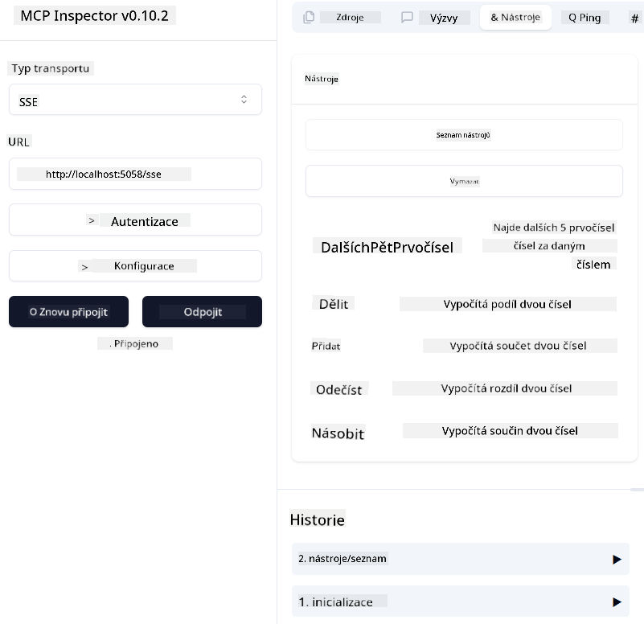
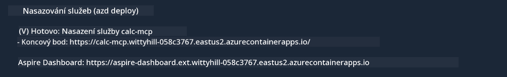

<!--
CO_OP_TRANSLATOR_METADATA:
{
  "original_hash": "5020a3e1a1c7f30c00f9e37f1fa208e3",
  "translation_date": "2025-05-17T14:11:50+00:00",
  "source_file": "04-PracticalImplementation/samples/csharp/README.md",
  "language_code": "cs"
}
-->
# Vzorek

Předchozí příklad ukazuje, jak použít místní .NET projekt s typem `sdio`. A jak spustit server lokálně v kontejneru. Toto je dobré řešení v mnoha situacích. Nicméně může být užitečné mít server spuštěný vzdáleně, například v cloudovém prostředí. Zde přichází na řadu typ `http`.

Při pohledu na řešení ve složce `04-PracticalImplementation` může vypadat mnohem složitěji než předchozí. Ale ve skutečnosti tomu tak není. Pokud se podíváte blíže na projekt `src/mcpserver/mcpserver.csproj`, uvidíte, že je to většinou stejný kód jako v předchozím příkladu. Jediný rozdíl je, že používáme jinou knihovnu `ModelContextProtocol.AspNetCore` pro zpracování HTTP požadavků. A měníme metodu `IsPrime`, aby byla soukromá, jen abychom ukázali, že můžete mít soukromé metody ve svém kódu. Zbytek kódu je stejný jako dříve.

Ostatní projekty pocházejí z [.NET Aspire](https://learn.microsoft.com/dotnet/aspire/get-started/aspire-overview). Mít .NET Aspire v řešení zlepší zkušenost vývojáře při vývoji a testování a pomůže s pozorovatelností. Není nutné pro spuštění serveru, ale je dobré mít ho ve svém řešení.

## Spuštění serveru lokálně

1. Z VS Code (s rozšířením C# DevKit) otevřete řešení `04-PracticalImplementation\samples\csharp\src\Calculator-chap4.sln`.
2. Stiskněte `F5` pro spuštění serveru. Měl by se otevřít webový prohlížeč s dashboardem .NET Aspire.

nebo

1. Z terminálu přejděte do složky `04-PracticalImplementation\samples\csharp\src`
2. Spusťte následující příkaz pro spuštění serveru:
   ```bash
    dotnet run --project .\AppHost
   ```

3. Z dashboardu si všimněte URL `http`. Měla by vypadat jako `http://localhost:5058/`.

## Test `SSE` s ModelContext Protocol Inspector

Pokud máte Node.js 22.7.5 a vyšší, můžete použít ModelContext Protocol Inspector pro testování svého serveru.

Spusťte server a spusťte následující příkaz v terminálu:

```bash
npx @modelcontextprotocol/inspector@latest
```



- Vyberte `SSE` as the Transport type. SSE stand for Server-Sent Events. 
- In the Url field, enter the URL of the server noted earlier,and append `/sse`. Mělo by být `http` (ne `https`) something like `http://localhost:5058/sse`.
- select the Connect button.

A nice thing about the Inspector is that it provide a nice visibility on what is happening.

- Try listing the availables tools
- Try some of them, it should works just like before.


## Test `SSE` with Github Copilot Chat in VS Code

To use the `SSE` transport with Github Copilot Chat, change the configuration of the `mcp-calc` server vytvořený dříve, aby vypadal takto:

```json
"mcp-calc": {
    "type": "sse",
    "url": "http://localhost:5058/sse"
}
```

Proveďte několik testů:
- Zeptejte se na 3 prvočísla po 6780. Všimněte si, jak Copilot použije nové nástroje `NextFivePrimeNumbers` a vrátí pouze první 3 prvočísla.
- Zeptejte se na 7 prvočísel po 111, abyste viděli, co se stane.

# Nasazení serveru na Azure

Pojďme nasadit server na Azure, aby ho mohlo používat více lidí.

Z terminálu přejděte do složky `04-PracticalImplementation\samples\csharp\src` a spusťte následující příkaz:

```bash
azd init
```

To vytvoří několik souborů lokálně pro uložení konfigurace Azure zdrojů a vaší infrastruktury jako kódu (IaC).

Poté spusťte následující příkaz pro nasazení serveru na Azure:

```bash
azd up
```

Jakmile je nasazení dokončeno, měli byste vidět zprávu podobnou této:



Přejděte na dashboard Aspire a všimněte si `HTTP` URL, abyste ji mohli použít v MCP Inspector a v Github Copilot Chat.

## Co dál?

Vyzkoušeli jsme různé typy přenosu, testovací nástroje a také jsme nasadili náš MCP server na Azure. Ale co když náš server potřebuje přístup k soukromým zdrojům? Například k databázi nebo soukromému API? V příští kapitole uvidíme, jak můžeme zlepšit bezpečnost našeho serveru.

**Prohlášení**:  
Tento dokument byl přeložen pomocí služby pro automatický překlad [Co-op Translator](https://github.com/Azure/co-op-translator). Přestože se snažíme o přesnost, mějte prosím na paměti, že automatické překlady mohou obsahovat chyby nebo nepřesnosti. Původní dokument v jeho rodném jazyce by měl být považován za závazný zdroj. Pro důležité informace se doporučuje profesionální lidský překlad. Nejsme zodpovědní za jakékoli nedorozumění nebo nesprávné interpretace vyplývající z použití tohoto překladu.