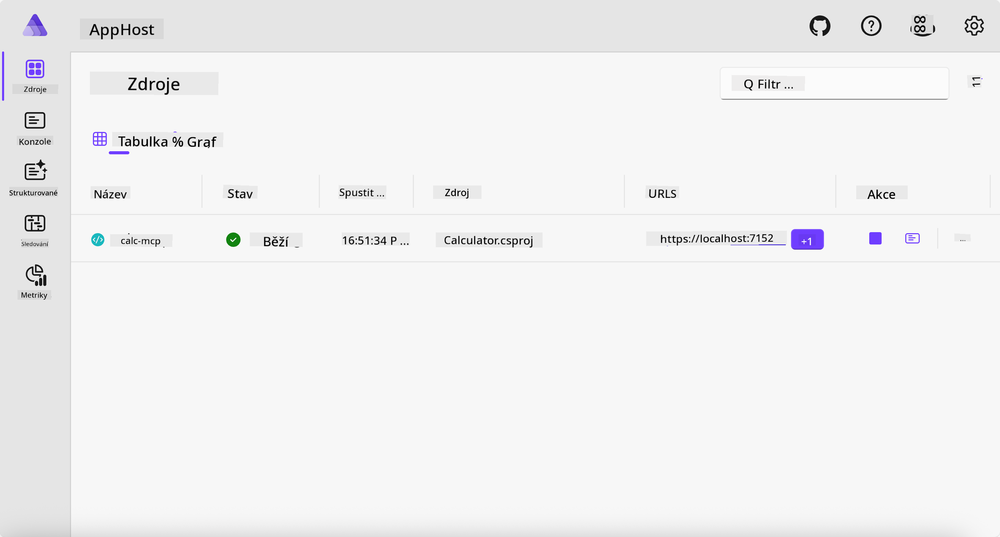
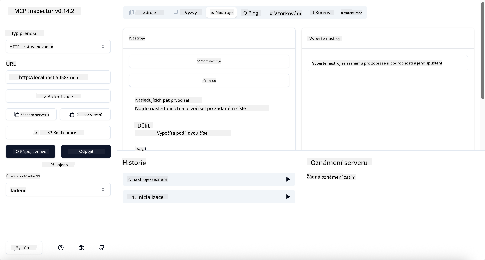
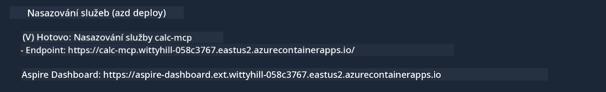

<!--
CO_OP_TRANSLATOR_METADATA:
{
  "original_hash": "0bc7bd48f55f1565f1d95ccb2c16f728",
  "translation_date": "2025-07-13T23:09:21+00:00",
  "source_file": "04-PracticalImplementation/samples/csharp/README.md",
  "language_code": "cs"
}
-->
# Ukázka

Předchozí příklad ukazuje, jak používat lokální .NET projekt s typem `stdio`. A jak spustit server lokálně v kontejneru. To je v mnoha situacích dobré řešení. Nicméně může být užitečné mít server běžící vzdáleně, například v cloudovém prostředí. Právě zde přichází na řadu typ `http`.

Když se podíváte na řešení ve složce `04-PracticalImplementation`, může se zdát mnohem složitější než předchozí. Ve skutečnosti tomu tak ale není. Pokud se podíváte blíže na projekt `src/Calculator`, uvidíte, že je to většinou stejný kód jako v předchozím příkladu. Jediný rozdíl je, že používáme jinou knihovnu `ModelContextProtocol.AspNetCore` pro zpracování HTTP požadavků. A metodu `IsPrime` změníme na privátní, jen abychom ukázali, že ve svém kódu můžete mít privátní metody. Zbytek kódu zůstává stejný jako dříve.

Ostatní projekty pocházejí z [.NET Aspire](https://learn.microsoft.com/dotnet/aspire/get-started/aspire-overview). Mít .NET Aspire v řešení zlepší vývojářský zážitek při vývoji a testování a pomůže s observabilitou. Není to nutné pro spuštění serveru, ale je to dobrá praxe mít to ve svém řešení.

## Spuštění serveru lokálně

1. Ve VS Code (s rozšířením C# DevKit) přejděte do adresáře `04-PracticalImplementation/samples/csharp`.
1. Spusťte následující příkaz pro start serveru:

   ```bash
    dotnet watch run --project ./src/AppHost
   ```

1. Když se v prohlížeči otevře dashboard .NET Aspire, všimněte si URL s protokolem `http`. Mělo by to být něco jako `http://localhost:5058/`.

   

## Testování Streamable HTTP pomocí MCP Inspectoru

Pokud máte Node.js verze 22.7.5 a vyšší, můžete použít MCP Inspector k otestování vašeho serveru.

Spusťte server a v terminálu spusťte následující příkaz:

```bash
npx @modelcontextprotocol/inspector http://localhost:5058
```



- Vyberte `Streamable HTTP` jako typ transportu.
- Do pole Url zadejte URL serveru, které jste si poznamenali, a přidejte `/mcp`. Mělo by to být `http` (nikoli `https`), například `http://localhost:5058/mcp`.
- Klikněte na tlačítko Connect.

Výhodou Inspectoru je, že poskytuje přehled o tom, co se děje.

- Zkuste vypsat dostupné nástroje
- Vyzkoušejte některé z nich, měly by fungovat stejně jako dříve.

## Testování MCP serveru s GitHub Copilot Chat ve VS Code

Pro použití transportu Streamable HTTP s GitHub Copilot Chat změňte konfiguraci serveru `calc-mcp`, který jste vytvořili dříve, takto:

```jsonc
// .vscode/mcp.json
{
  "servers": {
    "calc-mcp": {
      "type": "http",
      "url": "http://localhost:5058/mcp"
    }
  }
}
```

Proveďte několik testů:

- Zeptejte se na „3 prvočísla po 6780“. Všimněte si, že Copilot použije nové nástroje `NextFivePrimeNumbers` a vrátí pouze první 3 prvočísla.
- Zeptejte se na „7 prvočísel po 111“, abyste viděli, co se stane.
- Zeptejte se na „John má 24 lízátek a chce je rozdělit mezi své 3 děti. Kolik lízátek dostane každé dítě?“, abyste viděli, co se stane.

## Nasazení serveru do Azure

Pojďme nasadit server do Azure, aby ho mohlo používat více lidí.

V terminálu přejděte do složky `04-PracticalImplementation/samples/csharp` a spusťte následující příkaz:

```bash
azd up
```

Po dokončení nasazení byste měli vidět zprávu podobnou této:



Zkopírujte URL a použijte ji v MCP Inspectoru i v GitHub Copilot Chat.

```jsonc
// .vscode/mcp.json
{
  "servers": {
    "calc-mcp": {
      "type": "http",
      "url": "https://calc-mcp.gentleriver-3977fbcf.australiaeast.azurecontainerapps.io/mcp"
    }
  }
}
```

## Co dál?

Vyzkoušeli jsme různé typy transportů a testovací nástroje. Také jsme nasadili váš MCP server do Azure. Ale co když náš server potřebuje přístup k privátním zdrojům? Například k databázi nebo soukromému API? V další kapitole uvidíme, jak můžeme zlepšit zabezpečení našeho serveru.

**Prohlášení o vyloučení odpovědnosti**:  
Tento dokument byl přeložen pomocí AI překladatelské služby [Co-op Translator](https://github.com/Azure/co-op-translator). I když usilujeme o přesnost, mějte prosím na paměti, že automatizované překlady mohou obsahovat chyby nebo nepřesnosti. Původní dokument v jeho mateřském jazyce by měl být považován za autoritativní zdroj. Pro důležité informace se doporučuje profesionální lidský překlad. Nejsme odpovědní za jakékoliv nedorozumění nebo nesprávné výklady vyplývající z použití tohoto překladu.