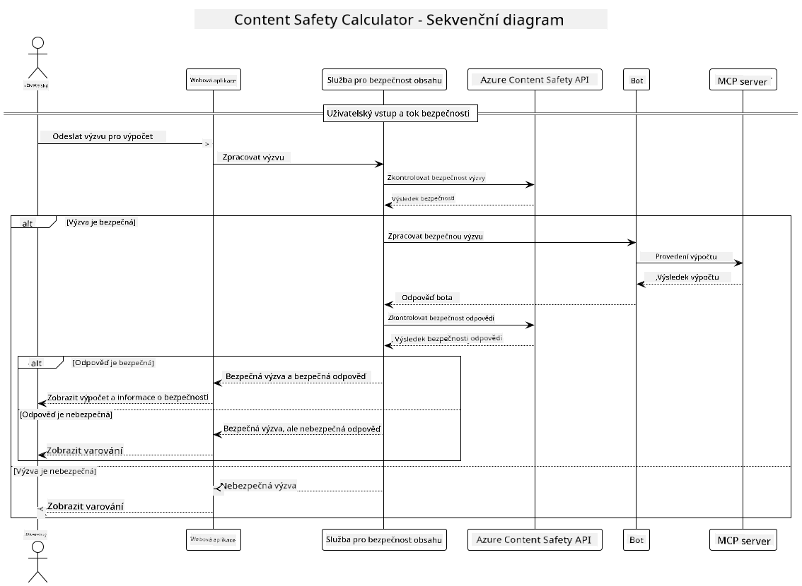

<!--
CO_OP_TRANSLATOR_METADATA:
{
  "original_hash": "e5ea5e7582f70008ea9bec3b3820f20a",
  "translation_date": "2025-07-13T23:19:37+00:00",
  "source_file": "04-PracticalImplementation/samples/java/containerapp/README.md",
  "language_code": "cs"
}
-->
## Architektura systému

Tento projekt ukazuje webovou aplikaci, která před předáním uživatelských požadavků kalkulační službě přes Model Context Protocol (MCP) provádí kontrolu bezpečnosti obsahu.



### Jak to funguje

1. **Uživatelský vstup**: Uživatel zadá výpočetní požadavek do webového rozhraní  
2. **Kontrola bezpečnosti obsahu (vstup)**: Požadavek je analyzován pomocí Azure Content Safety API  
3. **Rozhodnutí o bezpečnosti (vstup)**:  
   - Pokud je obsah bezpečný (závažnost < 2 ve všech kategoriích), pokračuje se ke kalkulačce  
   - Pokud je obsah označen jako potenciálně škodlivý, proces se zastaví a vrátí varování  
4. **Integrace kalkulačky**: Bezpečný obsah zpracovává LangChain4j, který komunikuje s MCP kalkulačním serverem  
5. **Kontrola bezpečnosti obsahu (výstup)**: Odpověď bota je analyzována pomocí Azure Content Safety API  
6. **Rozhodnutí o bezpečnosti (výstup)**:  
   - Pokud je odpověď bota bezpečná, zobrazí se uživateli  
   - Pokud je odpověď bota označena jako potenciálně škodlivá, je nahrazena varováním  
7. **Odpověď**: Výsledky (pokud jsou bezpečné) se zobrazí uživateli spolu s oběma analýzami bezpečnosti

## Použití Model Context Protocol (MCP) s kalkulačními službami

Tento projekt ukazuje, jak používat Model Context Protocol (MCP) pro volání kalkulačních MCP služeb z LangChain4j. Implementace využívá lokální MCP server běžící na portu 8080, který poskytuje kalkulační operace.

### Nastavení služby Azure Content Safety

Před použitím funkcí kontroly bezpečnosti obsahu je potřeba vytvořit zdroj služby Azure Content Safety:

1. Přihlaste se do [Azure Portálu](https://portal.azure.com)  
2. Klikněte na „Create a resource“ a vyhledejte „Content Safety“  
3. Vyberte „Content Safety“ a klikněte na „Create“  
4. Zadejte jedinečný název pro váš zdroj  
5. Vyberte předplatné a skupinu zdrojů (nebo vytvořte novou)  
6. Zvolte podporovaný region (podrobnosti najdete v [Region availability](https://azure.microsoft.com/en-us/global-infrastructure/services/?products=cognitive-services))  
7. Vyberte vhodný cenový plán  
8. Klikněte na „Create“ pro nasazení zdroje  
9. Po dokončení nasazení klikněte na „Go to resource“  
10. V levém panelu pod „Resource Management“ vyberte „Keys and Endpoint“  
11. Zkopírujte některý z klíčů a URL koncového bodu pro použití v dalším kroku

### Konfigurace proměnných prostředí

Nastavte proměnnou prostředí `GITHUB_TOKEN` pro autentizaci GitHub modelů:  
```sh
export GITHUB_TOKEN=<your_github_token>
```

Pro funkce kontroly bezpečnosti obsahu nastavte:  
```sh
export CONTENT_SAFETY_ENDPOINT=<your_content_safety_endpoint>
export CONTENT_SAFETY_KEY=<your_content_safety_key>
```

Tyto proměnné prostředí používá aplikace k autentizaci u služby Azure Content Safety. Pokud nejsou nastaveny, aplikace použije zástupné hodnoty pro demonstrační účely, ale funkce kontroly bezpečnosti nebudou fungovat správně.

### Spuštění kalkulačního MCP serveru

Před spuštěním klienta je potřeba spustit kalkulační MCP server v režimu SSE na localhost:8080.

## Popis projektu

Tento projekt demonstruje integraci Model Context Protocol (MCP) s LangChain4j pro volání kalkulačních služeb. Hlavní funkce zahrnují:

- Použití MCP pro připojení ke kalkulační službě pro základní matematické operace  
- Dvoustupňovou kontrolu bezpečnosti obsahu na uživatelských požadavcích i odpovědích bota  
- Integraci s modelem gpt-4.1-nano z GitHubu přes LangChain4j  
- Použití Server-Sent Events (SSE) pro MCP přenos

## Integrace kontroly bezpečnosti obsahu

Projekt obsahuje komplexní funkce kontroly bezpečnosti obsahu, které zajišťují, že jak uživatelské vstupy, tak systémové odpovědi jsou bez škodlivého obsahu:

1. **Kontrola vstupu**: Všechny uživatelské požadavky jsou před zpracováním analyzovány na škodlivý obsah v kategoriích jako nenávistné projevy, násilí, sebepoškozování a sexuální obsah.  

2. **Kontrola výstupu**: I při použití potenciálně necenzurovaných modelů systém kontroluje všechny generované odpovědi stejnými filtry bezpečnosti obsahu před jejich zobrazením uživateli.

Tento dvouvrstvý přístup zajišťuje bezpečnost systému bez ohledu na použitý AI model a chrání uživatele před škodlivými vstupy i potenciálně problematickými výstupy generovanými AI.

## Webový klient

Aplikace obsahuje uživatelsky přívětivé webové rozhraní, které umožňuje uživatelům interagovat se systémem Content Safety Calculator:

### Funkce webového rozhraní

- Jednoduchý a intuitivní formulář pro zadávání výpočetních požadavků  
- Dvoustupňová validace bezpečnosti obsahu (vstup i výstup)  
- Okamžitá zpětná vazba o bezpečnosti požadavku a odpovědi  
- Barevně odlišené indikátory bezpečnosti pro snadnou orientaci  
- Čistý, responzivní design fungující na různých zařízeních  
- Příklady bezpečných požadavků pro usnadnění používání

### Použití webového klienta

1. Spusťte aplikaci:  
   ```sh
   mvn spring-boot:run
   ```

2. Otevřete prohlížeč a přejděte na `http://localhost:8087`

3. Zadejte výpočetní požadavek do textového pole (např. „Vypočítej součet 24.5 a 17.3“)

4. Klikněte na „Submit“ pro zpracování požadavku

5. Zobrazí se výsledky, které zahrnují:  
   - Analýzu bezpečnosti vašeho požadavku  
   - Vypočtený výsledek (pokud byl požadavek bezpečný)  
   - Analýzu bezpečnosti odpovědi bota  
   - Případná varování o bezpečnosti, pokud byl vstup nebo výstup označen

Webový klient automaticky zajišťuje oba procesy ověřování bezpečnosti obsahu, čímž garantuje, že všechny interakce jsou bezpečné a vhodné bez ohledu na použitý AI model.

**Prohlášení o vyloučení odpovědnosti**:  
Tento dokument byl přeložen pomocí AI překladatelské služby [Co-op Translator](https://github.com/Azure/co-op-translator). I když usilujeme o přesnost, mějte prosím na paměti, že automatizované překlady mohou obsahovat chyby nebo nepřesnosti. Původní dokument v jeho mateřském jazyce by měl být považován za autoritativní zdroj. Pro důležité informace se doporučuje profesionální lidský překlad. Nejsme odpovědní za jakékoliv nedorozumění nebo nesprávné výklady vyplývající z použití tohoto překladu.