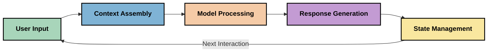
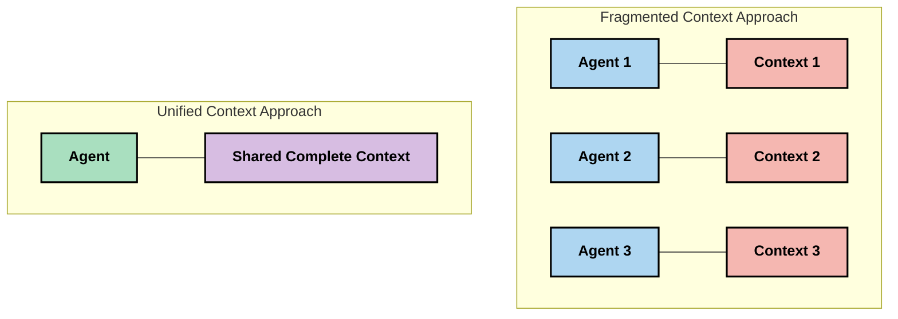
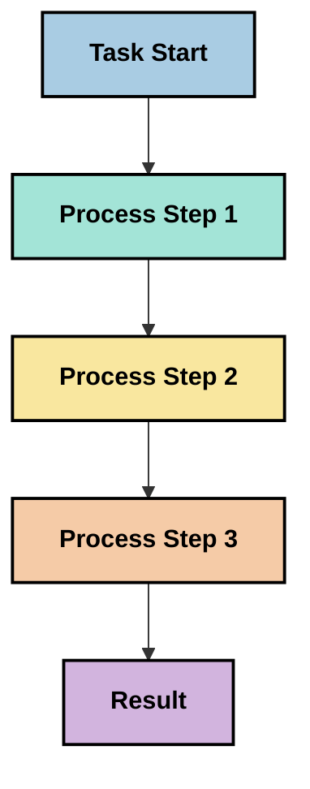
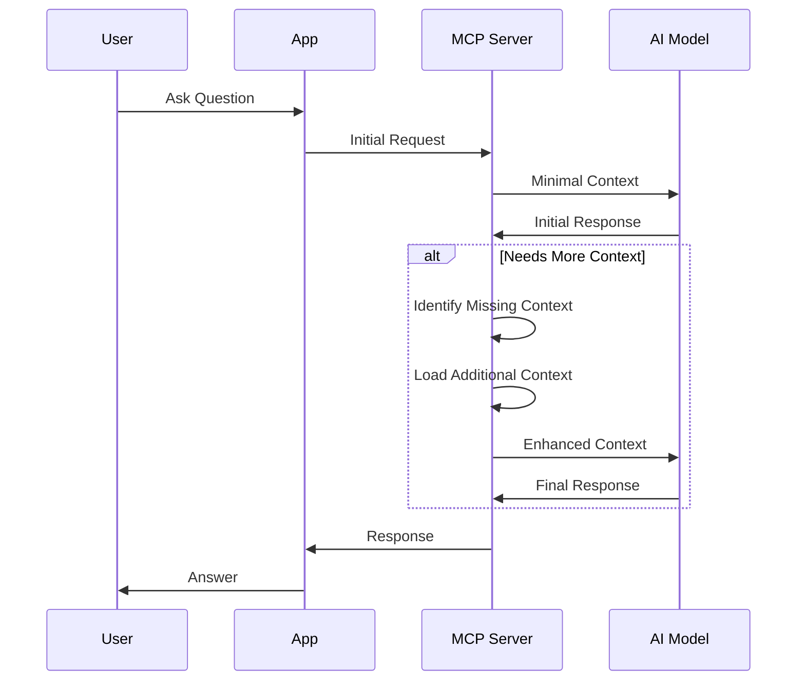
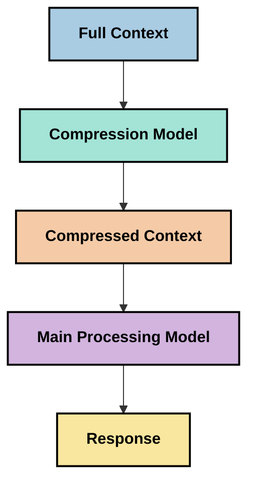

<!--
CO_OP_TRANSLATOR_METADATA:
{
  "original_hash": "5762e8e74dd99d8b7dbb31e69a82561e",
  "translation_date": "2025-07-17T13:15:55+00:00",
  "source_file": "05-AdvancedTopics/mcp-contextengineering/README.md",
  "language_code": "cs"
}
-->
# Context Engineering: Nový koncept v ekosystému MCP

## Přehled

Context engineering je nový koncept v oblasti umělé inteligence, který zkoumá, jak je informace strukturována, předávána a udržována během interakcí mezi klienty a AI službami. S vývojem ekosystému Model Context Protocol (MCP) je stále důležitější pochopit, jak efektivně spravovat kontext. Tento modul představuje pojem context engineering a zkoumá jeho možné využití v implementacích MCP.

## Cíle učení

Na konci tohoto modulu budete schopni:

- Pochopit nový koncept context engineering a jeho potenciální roli v aplikacích MCP
- Identifikovat klíčové výzvy v řízení kontextu, které řeší návrh protokolu MCP
- Prozkoumat techniky pro zlepšení výkonu modelu díky lepší správě kontextu
- Zvážit přístupy k měření a hodnocení efektivity kontextu
- Aplikovat tyto nové koncepty ke zlepšení AI zážitků v rámci MCP

## Úvod do Context Engineering

Context engineering je nový koncept zaměřený na cílený návrh a správu toku informací mezi uživateli, aplikacemi a AI modely. Na rozdíl od zavedených oblastí, jako je prompt engineering, je context engineering stále definován praktikujícími, kteří řeší jedinečné výzvy spojené s poskytováním správných informací AI modelům ve správný čas.

S vývojem velkých jazykových modelů (LLM) se význam kontextu stále více ukazuje. Kvalita, relevance a struktura kontextu, který poskytujeme, přímo ovlivňuje výstupy modelu. Context engineering zkoumá tento vztah a snaží se vyvinout principy pro efektivní správu kontextu.

> „V roce 2025 jsou modely extrémně inteligentní. Ale ani ten nejchytřejší člověk nebude schopen efektivně pracovat bez kontextu toho, co má dělat... ‚Context engineering‘ je další úroveň prompt engineeringu. Jde o to dělat to automaticky v dynamickém systému.“ — Walden Yan, Cognition AI

Context engineering může zahrnovat:

1. **Výběr kontextu**: Určení, jaké informace jsou pro daný úkol relevantní
2. **Strukturování kontextu**: Organizace informací pro maximální porozumění modelem
3. **Předávání kontextu**: Optimalizace způsobu a času, kdy jsou informace posílány modelům
4. **Údržba kontextu**: Správa stavu a vývoje kontextu v čase
5. **Hodnocení kontextu**: Měření a zlepšování efektivity kontextu

Tyto oblasti jsou zvláště důležité pro ekosystém MCP, který poskytuje standardizovaný způsob, jak aplikace předávají kontext LLM.

## Perspektiva cesty kontextu

Jedním ze způsobů, jak si představit context engineering, je sledovat cestu, kterou informace prochází systémem MCP:



### Klíčové fáze cesty kontextu:

1. **Uživatelský vstup**: Surové informace od uživatele (text, obrázky, dokumenty)
2. **Sestavení kontextu**: Kombinace uživatelského vstupu se systémovým kontextem, historií konverzace a dalšími získanými informacemi
3. **Zpracování modelem**: AI model zpracovává sestavený kontext
4. **Generování odpovědi**: Model vytváří výstupy na základě poskytnutého kontextu
5. **Správa stavu**: Systém aktualizuje svůj interní stav na základě interakce

Tento pohled zdůrazňuje dynamickou povahu kontextu v AI systémech a klade důležité otázky, jak nejlépe spravovat informace v každé fázi.

## Vznikající principy context engineering

Jak se oblast context engineering formuje, začínají se objevovat první principy od praktikujících. Tyto principy mohou pomoci při rozhodování o implementaci MCP:

### Princip 1: Sdílejte kontext kompletně

Kontext by měl být sdílen kompletně mezi všemi komponentami systému, nikoli rozdělen mezi více agentů nebo procesů. Když je kontext rozptýlen, rozhodnutí učiněná v jedné části systému mohou být v rozporu s rozhodnutími jinde.



V aplikacích MCP to naznačuje návrh systémů, kde kontext plynule prochází celým procesem, místo aby byl rozdělen do oddělených částí.

### Princip 2: Uvědomte si, že akce nesou implicitní rozhodnutí

Každá akce modelu obsahuje implicitní rozhodnutí o tom, jak interpretovat kontext. Když různé komponenty pracují s různými kontexty, mohou tato implicitní rozhodnutí kolidovat a vést k nekonzistentním výsledkům.

Tento princip má důležité důsledky pro aplikace MCP:
- Upřednostňujte lineární zpracování složitých úkolů před paralelním prováděním s rozděleným kontextem
- Zajistěte, aby všechny rozhodovací body měly přístup ke stejným kontextovým informacím
- Navrhujte systémy tak, aby pozdější kroky viděly celý kontext předchozích rozhodnutí

### Princip 3: Vyvažujte hloubku kontextu s omezeními okna

Jak konverzace a procesy rostou, kontextová okna se nakonec zaplní. Efektivní context engineering zkoumá přístupy, jak zvládat napětí mezi komplexním kontextem a technickými omezeními.

Možné přístupy zahrnují:
- Kompresi kontextu, která zachovává podstatné informace a zároveň snižuje počet tokenů
- Postupné načítání kontextu podle relevance k aktuálním potřebám
- Shrnutí předchozích interakcí při zachování klíčových rozhodnutí a faktů

## Výzvy kontextu a návrh protokolu MCP

Model Context Protocol (MCP) byl navržen s ohledem na jedinečné výzvy správy kontextu. Pochopení těchto výzev pomáhá vysvětlit klíčové aspekty návrhu protokolu MCP:

### Výzva 1: Omezení velikosti kontextového okna
Většina AI modelů má pevně danou velikost kontextového okna, což omezuje množství informací, které mohou zpracovat najednou.

**Odpověď návrhu MCP:**  
- Protokol podporuje strukturovaný, zdrojově založený kontext, který lze efektivně odkazovat  
- Zdroje mohou být stránkovány a načítány postupně

### Výzva 2: Určení relevance
Určit, které informace jsou nejrelevantnější pro zahrnutí do kontextu, je obtížné.

**Odpověď návrhu MCP:**  
- Flexibilní nástroje umožňují dynamické získávání informací podle potřeby  
- Strukturované promptování umožňuje konzistentní organizaci kontextu

### Výzva 3: Přetrvávání kontextu
Správa stavu napříč interakcemi vyžaduje pečlivé sledování kontextu.

**Odpověď návrhu MCP:**  
- Standardizovaná správa relací  
- Jasně definované vzory interakcí pro vývoj kontextu

### Výzva 4: Multimodální kontext
Různé typy dat (text, obrázky, strukturovaná data) vyžadují odlišné zacházení.

**Odpověď návrhu MCP:**  
- Návrh protokolu podporuje různé typy obsahu  
- Standardizovaná reprezentace multimodálních informací

### Výzva 5: Bezpečnost a soukromí
Kontext často obsahuje citlivé informace, které je třeba chránit.

**Odpověď návrhu MCP:**  
- Jasné hranice mezi odpovědnostmi klienta a serveru  
- Možnosti lokálního zpracování pro minimalizaci expozice dat

Pochopení těchto výzev a způsobů, jak je MCP řeší, poskytuje základ pro zkoumání pokročilejších technik context engineering.

## Vznikající přístupy v context engineering

Jak se oblast context engineering rozvíjí, objevují se slibné přístupy. Tyto představují současné myšlení, nikoli zavedené postupy, a pravděpodobně se budou vyvíjet s rostoucími zkušenostmi s implementacemi MCP.

### 1. Jednovláknové lineární zpracování

Na rozdíl od multi-agentních architektur, které rozdělují kontext, někteří praktikující zjišťují, že jednovláknové lineární zpracování přináší konzistentnější výsledky. To odpovídá principu udržování jednotného kontextu.



Ačkoliv se tento přístup může zdát méně efektivní než paralelní zpracování, často přináší soudržnější a spolehlivější výsledky, protože každý krok staví na úplném pochopení předchozích rozhodnutí.

### 2. Rozdělení a priorizace kontextu

Rozdělení velkého kontextu na zvládnutelné části a upřednostnění toho nejdůležitějšího.

```python
# Conceptual Example: Context Chunking and Prioritization
def process_with_chunked_context(documents, query):
    # 1. Break documents into smaller chunks
    chunks = chunk_documents(documents)
    
    # 2. Calculate relevance scores for each chunk
    scored_chunks = [(chunk, calculate_relevance(chunk, query)) for chunk in chunks]
    
    # 3. Sort chunks by relevance score
    sorted_chunks = sorted(scored_chunks, key=lambda x: x[1], reverse=True)
    
    # 4. Use the most relevant chunks as context
    context = create_context_from_chunks([chunk for chunk, score in sorted_chunks[:5]])
    
    # 5. Process with the prioritized context
    return generate_response(context, query)
```

Výše uvedený koncept ukazuje, jak můžeme rozdělit velké dokumenty na menší části a vybrat jen nejrelevantnější části pro kontext. Tento přístup pomáhá pracovat v rámci omezení velikosti kontextového okna a zároveň využívat rozsáhlé znalostní báze.

### 3. Postupné načítání kontextu

Načítání kontextu postupně podle potřeby, nikoli najednou.



Postupné načítání začíná s minimálním kontextem a rozšiřuje ho pouze v případě potřeby. To může výrazně snížit spotřebu tokenů u jednoduchých dotazů a zároveň umožnit zpracování složitých otázek.

### 4. Komprese a shrnutí kontextu

Snižování velikosti kontextu při zachování podstatných informací.



Kompresní přístup se zaměřuje na:  
- Odstranění redundantních informací  
- Shrnutí rozsáhlého obsahu  
- Extrakci klíčových faktů a detailů  
- Zachování kritických prvků kontextu  
- Optimalizaci pro efektivní využití tokenů

Tento přístup je zvláště cenný pro udržení dlouhých konverzací v rámci kontextových oken nebo pro efektivní zpracování velkých dokumentů. Někteří praktikující používají specializované modely přímo pro kompresi a shrnutí historie konverzace.

## Zvažování v rámci explorace context engineering

Při zkoumání nového pole context engineering je užitečné mít na paměti několik aspektů při práci s implementacemi MCP. Nejde o předepsané postupy, ale o oblasti, které mohou přinést zlepšení ve vašem konkrétním případě.

### Zvažte své cíle kontextu

Před zavedením složitých řešení správy kontextu jasně definujte, čeho chcete dosáhnout:  
- Jaké konkrétní informace model potřebuje k úspěchu?  
- Které informace jsou nezbytné a které doplňkové?  
- Jaká jsou vaše omezení výkonu (latence, limity tokenů, náklady)?

### Prozkoumejte vrstvené přístupy ke kontextu

Někteří praktikující dosahují úspěchu s kontextem uspořádaným do konceptuálních vrstev:  
- **Jádrová vrstva**: Nezbytné informace, které model vždy potřebuje  
- **Situační vrstva**: Kontext specifický pro aktuální interakci  
- **Podpůrná vrstva**: Další informace, které mohou být užitečné  
- **Záložní vrstva**: Informace přístupné pouze v případě potřeby

### Zkoumejte strategie získávání informací

Efektivita kontextu často závisí na způsobu získávání informací:  
- Sémantické vyhledávání a embeddingy pro nalezení konceptuálně relevantních informací  
- Vyhledávání podle klíčových slov pro specifické faktické detaily  
- Hybridní přístupy kombinující více metod získávání  
- Filtrování metadaty pro zúžení rozsahu podle kategorií, dat nebo zdrojů

### Experimentujte s koherencí kontextu

Struktura a tok kontextu mohou ovlivnit porozumění modelem:  
- Sdružování souvisejících informací  
- Používání konzistentního formátování a organizace  
- Udržování logického nebo chronologického pořadí tam, kde je to vhodné  
- Vyhýbání se protichůdným informacím

### Zvažte kompromisy multi-agentních architektur

I když jsou multi-agentní architektury populární v mnoha AI rámcích, přinášejí významné výzvy pro správu kontextu:  
- Fragmentace kontextu může vést k nekonzistentním rozhodnutím mezi agenty  
- Paralelní zpracování může způsobit konflikty, které je těžké vyřešit  
- Komunikační režie mezi agenty může vyvážit výkonové zisky  
- Složitá správa stavu je nutná pro udržení koherence

V mnoha případech může jediné agentní řešení s komplexní správou kontextu přinést spolehlivější výsledky než více specializovaných agentů s rozděleným kontextem.

### Vyvíjejte metody hodnocení

Pro zlepšení context engineering v čase zvažte, jak budete měřit úspěch:  
- A/B testování různých struktur kontextu  
- Monitorování spotřeby tokenů a doby odezvy  
- Sledování spokojenosti uživatelů a míry dokončení úkolů  
- Analýza případů, kdy strategie kontextu selhávají

Tyto aspekty představují aktivní oblasti zkoumání v oblasti context engineering. Jak se pole vyvíjí, pravděpodobně se objeví jasnější vzory a postupy.

## Měření efektivity kontextu: Vyvíjející se rámec

S nástupem context engineering začínají praktikující zkoumat, jak měřit jeho efektivitu. Zatím neexistuje zavedený rámec, ale zvažují se různé metriky, které by mohly vést budoucí práci.

### Potenciální dimenze měření

#### 1. Úvahy o efektivitě vstupu

- **Poměr kontextu k odpovědi**: Kolik kontextu je potřeba vzhledem k velikosti odpovědi?  
- **Využití tokenů**: Jaké procento tokenů z poskytnutého kontextu ovlivňuje odpověď?  
- **Redukce kontextu**: Jak efektivně můžeme komprimovat surové informace?

#### 2. Výkonnostní úvahy

- **Dopad na latenci**: Jak správa kontextu ovlivňuje dobu odezvy?  
- **Tokenová ekonomika**: Optimalizujeme efektivně využití tokenů?  
- **Přesnost získávání**: Jak relevantní jsou získané informace?  
- **Využití zdrojů**: Jaké výpočetní zdroje jsou potřeba?

#### 3. Kvalitativní úvahy

- **Relevance odpovědi**: Jak dobře odpověď odpovídá dotazu?  
- **Faktická přesnost**: Zlepšuje správa kontextu faktickou správnost?  
- **Konzistence**: Jsou odpovědi konzistentní u podobných dotazů?  
- **Míra halucinací**: Snižuje lepší kontext halucinace modelu?

#### 4. Uživatelská zkušenost

- **Míra následných dotazů**: Jak často uživatelé potřebují upřesnění?  
- **Dokončení úkolu**: Dokážou uživatelé úspěšně splnit své cíle?  
- **Ukazatele spokojenosti**: Jak uživatelé hodnotí svůj zážitek?

### Explorativní přístupy k měření

Při experimentování s context engineering v implementacích MCP zvažte tyto přístupy:

1. **Porovnání s výchozím stavem**: Nejprve stanovte základní úroveň s jednoduchými přístupy ke kontextu, než vyzkoušíte složitější metody  
2. **Postupné změny**: Měňte jednu část správy kontextu najednou, abyste izolovali její efekt  
3. **Hodnocení zaměřené na uživatele**: Kombinujte kvantitativní metriky s kvalitativní zpětnou vazbou uživatelů  
4. **Analýza selhání**: Zkoumejte případy, kdy strategie kontextu selhávají, abyste pochopili možné z
- [Model Context Protocol Website](https://modelcontextprotocol.io/)
- [Model Context Protocol Specification](https://github.com/modelcontextprotocol/modelcontextprotocol)
- [MCP Documentation](https://modelcontextprotocol.io/docs)
- [MCP C# SDK](https://github.com/modelcontextprotocol/csharp-sdk)
- [MCP Python SDK](https://github.com/modelcontextprotocol/python-sdk)
- [MCP TypeScript SDK](https://github.com/modelcontextprotocol/typescript-sdk)
- [MCP Inspector](https://github.com/modelcontextprotocol/inspector) - Nástroj pro vizuální testování MCP serverů

### Články o Context Engineering
- [Nezřizujte Multi-Agenty: Principy Context Engineering](https://cognition.ai/blog/dont-build-multi-agents) - Postřehy Waldena Yana o principech context engineering
- [Praktický průvodce tvorbou agentů](https://cdn.openai.com/business-guides-and-resources/a-practical-guide-to-building-agents.pdf) - OpenAI průvodce efektivním návrhem agentů
- [Tvorba efektivních agentů](https://www.anthropic.com/engineering/building-effective-agents) - Přístup Anthropic k vývoji agentů

### Související výzkum
- [Dynamické rozšíření vyhledávání pro velké jazykové modely](https://arxiv.org/abs/2310.01487) - Výzkum dynamických přístupů k vyhledávání
- [Ztraceni uprostřed: Jak jazykové modely využívají dlouhé kontexty](https://arxiv.org/abs/2307.03172) - Důležitý výzkum vzorců zpracování kontextu
- [Hierarchická generace obrázků podmíněná textem s CLIP latentními proměnnými](https://arxiv.org/abs/2204.06125) - Článek o DALL-E 2 s poznatky o strukturování kontextu
- [Zkoumání role kontextu v architekturách velkých jazykových modelů](https://aclanthology.org/2023.findings-emnlp.124/) - Nejnovější výzkum o zpracování kontextu
- [Spolupráce více agentů: Přehled](https://arxiv.org/abs/2304.03442) - Výzkum multi-agentních systémů a jejich výzev

### Další zdroje
- [Techniky optimalizace kontextového okna](https://learn.microsoft.com/en-us/azure/ai-services/openai/concepts/context-window)
- [Pokročilé techniky RAG](https://www.microsoft.com/en-us/research/blog/retrieval-augmented-generation-rag-and-frontier-models/)
- [Dokumentace Semantic Kernel](https://github.com/microsoft/semantic-kernel)
- [AI Toolkit pro správu kontextu](https://github.com/microsoft/aitoolkit)

## Co dál
- [6. Příspěvky komunity](../../06-CommunityContributions/README.md)

**Prohlášení o vyloučení odpovědnosti**:  
Tento dokument byl přeložen pomocí AI překladatelské služby [Co-op Translator](https://github.com/Azure/co-op-translator). I když usilujeme o přesnost, mějte prosím na paměti, že automatizované překlady mohou obsahovat chyby nebo nepřesnosti. Původní dokument v jeho mateřském jazyce by měl být považován za autoritativní zdroj. Pro důležité informace se doporučuje profesionální lidský překlad. Nejsme odpovědní za jakékoliv nedorozumění nebo nesprávné výklady vyplývající z použití tohoto překladu.