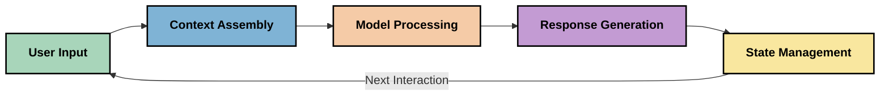
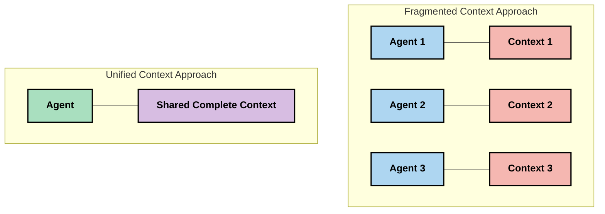
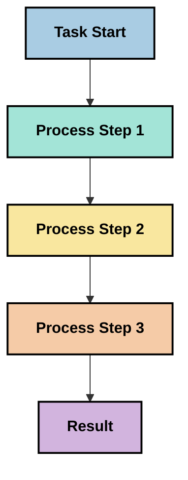
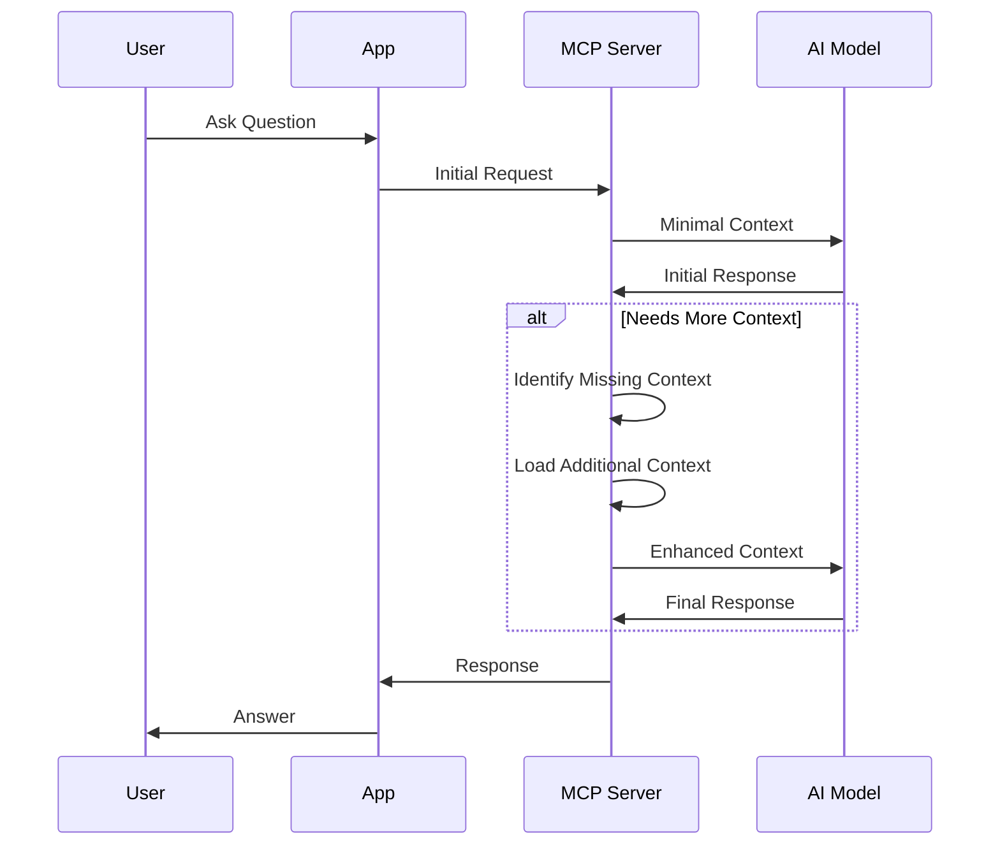
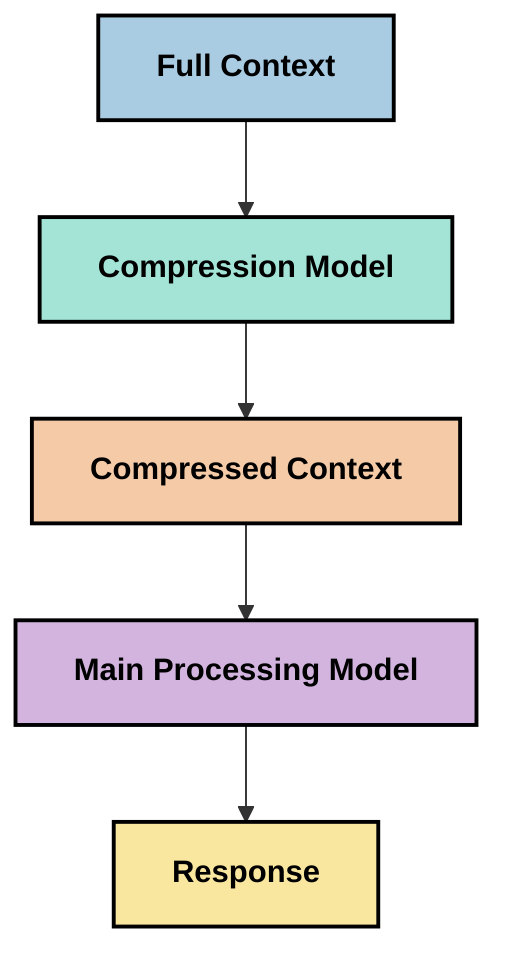

<!--
CO_OP_TRANSLATOR_METADATA:
{
  "original_hash": "fd169ca3071b81b5ee282e194bc823df",
  "translation_date": "2025-09-15T21:01:50+00:00",
  "source_file": "05-AdvancedTopics/mcp-contextengineering/README.md",
  "language_code": "cs"
}
-->
# Kontextové inženýrství: Nově vznikající koncept v ekosystému MCP

## Přehled

Kontextové inženýrství je nově vznikající koncept v oblasti AI, který zkoumá, jak je informace strukturována, doručována a udržována během interakcí mezi klienty a AI službami. Jak se ekosystém Model Context Protocol (MCP) vyvíjí, porozumění efektivnímu řízení kontextu se stává stále důležitějším. Tento modul představuje koncept kontextového inženýrství a zkoumá jeho potenciální aplikace v implementacích MCP.

## Cíle učení

Na konci tohoto modulu budete schopni:

- Porozumět nově vznikajícímu konceptu kontextového inženýrství a jeho potenciální roli v aplikacích MCP
- Identifikovat klíčové výzvy v řízení kontextu, které návrh MCP protokolu řeší
- Prozkoumat techniky pro zlepšení výkonu modelu prostřednictvím lepšího nakládání s kontextem
- Zvážit přístupy k měření a hodnocení efektivity kontextu
- Aplikovat tyto nové koncepty ke zlepšení AI zkušeností prostřednictvím rámce MCP

## Úvod do kontextového inženýrství

Kontextové inženýrství je nově vznikající koncept zaměřený na záměrný návrh a řízení toku informací mezi uživateli, aplikacemi a AI modely. Na rozdíl od zavedených oborů, jako je návrh promptů, je kontextové inženýrství stále definováno odborníky, kteří se snaží řešit jedinečné výzvy spojené s poskytováním správných informací AI modelům ve správný čas.

Jak se velké jazykové modely (LLMs) vyvíjely, důležitost kontextu se stala stále zřetelnější. Kvalita, relevance a struktura kontextu, který poskytujeme, přímo ovlivňuje výstupy modelu. Kontextové inženýrství zkoumá tento vztah a snaží se vyvinout principy pro efektivní řízení kontextu.

> „V roce 2025 budou modely extrémně inteligentní. Ale ani ten nejchytřejší člověk nebude schopen efektivně vykonávat svou práci bez kontextu toho, co se od něj požaduje... 'Kontextové inženýrství' je další úroveň návrhu promptů. Jde o to, jak to dělat automaticky v dynamickém systému." — Walden Yan, Cognition AI

Kontextové inženýrství může zahrnovat:

1. **Výběr kontextu**: Určení, které informace jsou relevantní pro daný úkol
2. **Strukturování kontextu**: Organizace informací pro maximální pochopení modelu
3. **Doručování kontextu**: Optimalizace způsobu a času, kdy jsou informace posílány modelům
4. **Údržba kontextu**: Řízení stavu a vývoje kontextu v průběhu času
5. **Hodnocení kontextu**: Měření a zlepšování efektivity kontextu

Tyto oblasti zaměření jsou obzvláště relevantní pro ekosystém MCP, který poskytuje standardizovaný způsob, jak aplikace poskytují kontext LLMs.

## Perspektiva cesty kontextu

Jedním ze způsobů, jak si představit kontextové inženýrství, je sledovat cestu, kterou informace prochází systémem MCP:



### Klíčové fáze cesty kontextu:

1. **Vstup uživatele**: Surové informace od uživatele (text, obrázky, dokumenty)
2. **Sestavení kontextu**: Kombinace vstupu uživatele se systémovým kontextem, historií konverzace a dalšími získanými informacemi
3. **Zpracování modelem**: AI model zpracovává sestavený kontext
4. **Generování odpovědi**: Model vytváří výstupy na základě poskytnutého kontextu
5. **Řízení stavu**: Systém aktualizuje svůj interní stav na základě interakce

Tato perspektiva zdůrazňuje dynamickou povahu kontextu v AI systémech a klade důležité otázky o tom, jak nejlépe řídit informace v každé fázi.

## Nově vznikající principy v kontextovém inženýrství

Jak se obor kontextového inženýrství formuje, začínají se objevovat některé rané principy od odborníků. Tyto principy mohou pomoci informovat volby při implementaci MCP:

### Princip 1: Sdílejte kontext kompletně

Kontext by měl být sdílen kompletně mezi všemi komponentami systému, spíše než fragmentován mezi více agenty nebo procesy. Když je kontext rozdělen, rozhodnutí učiněná v jedné části systému mohou být v rozporu s těmi učiněnými jinde.



V aplikacích MCP to naznačuje návrh systémů, kde kontext plynule proudí celým potrubím, spíše než aby byl rozdělen.

### Princip 2: Uvědomte si, že akce nesou implicitní rozhodnutí

Každá akce, kterou model provede, obsahuje implicitní rozhodnutí o tom, jak interpretovat kontext. Když více komponent jedná na různých kontextech, tato implicitní rozhodnutí mohou být v rozporu, což vede k nekonzistentním výsledkům.

Tento princip má důležité důsledky pro aplikace MCP:
- Preferujte lineární zpracování složitých úkolů před paralelním prováděním s fragmentovaným kontextem
- Zajistěte, aby všechny rozhodovací body měly přístup ke stejným kontextovým informacím
- Navrhujte systémy, kde pozdější kroky mohou vidět celý kontext předchozích rozhodnutí

### Princip 3: Vyvažte hloubku kontextu s omezeními okna

Jak se konverzace a procesy prodlužují, kontextová okna nakonec přetečou. Efektivní kontextové inženýrství zkoumá přístupy k řízení tohoto napětí mezi komplexním kontextem a technickými omezeními.

Potenciální přístupy, které se zkoumají, zahrnují:
- Komprese kontextu, která zachovává podstatné informace při snižování využití tokenů
- Progresivní načítání kontextu na základě relevance k aktuálním potřebám
- Shrnutí předchozích interakcí při zachování klíčových rozhodnutí a faktů

## Výzvy kontextu a návrh MCP protokolu

Model Context Protocol (MCP) byl navržen s vědomím jedinečných výzev řízení kontextu. Porozumění těmto výzvám pomáhá vysvětlit klíčové aspekty návrhu MCP protokolu:

### Výzva 1: Omezení kontextového okna
Většina AI modelů má pevné velikosti kontextových oken, což omezuje množství informací, které mohou zpracovat najednou.

**Odpověď návrhu MCP:** 
- Protokol podporuje strukturovaný, zdrojově založený kontext, který může být efektivně odkazován
- Zdroje mohou být stránkovány a načítány progresivně

### Výzva 2: Určení relevance
Určení, které informace jsou nejrelevantnější k zahrnutí do kontextu, je obtížné.

**Odpověď návrhu MCP:**
- Flexibilní nástroje umožňují dynamické získávání informací na základě potřeby
- Strukturované prompty umožňují konzistentní organizaci kontextu

### Výzva 3: Trvalost kontextu
Řízení stavu napříč interakcemi vyžaduje pečlivé sledování kontextu.

**Odpověď návrhu MCP:**
- Standardizované řízení relací
- Jasně definované vzory interakcí pro vývoj kontextu

### Výzva 4: Multimodální kontext
Různé typy dat (text, obrázky, strukturovaná data) vyžadují odlišné zpracování.

**Odpověď návrhu MCP:**
- Návrh protokolu zohledňuje různé typy obsahu
- Standardizovaná reprezentace multimodálních informací

### Výzva 5: Bezpečnost a soukromí
Kontext často obsahuje citlivé informace, které musí být chráněny.

**Odpověď návrhu MCP:**
- Jasné hranice mezi odpovědnostmi klienta a serveru
- Možnosti lokálního zpracování pro minimalizaci expozice dat

Porozumění těmto výzvám a tomu, jak je MCP řeší, poskytuje základ pro zkoumání pokročilejších technik kontextového inženýrství.

## Nově vznikající přístupy ke kontextovému inženýrství

Jak se obor kontextového inženýrství vyvíjí, objevuje se několik slibných přístupů. Ty představují současné myšlení spíše než zavedené nejlepší praktiky a pravděpodobně se budou vyvíjet, jak získáme více zkušeností s implementacemi MCP.

### 1. Lineární zpracování v jednom vlákně

Na rozdíl od architektur s více agenty, které rozdělují kontext, někteří odborníci zjišťují, že lineární zpracování v jednom vlákně přináší konzistentnější výsledky. To odpovídá principu udržování jednotného kontextu.



I když se tento přístup může zdát méně efektivní než paralelní zpracování, často přináší koherentnější a spolehlivější výsledky, protože každý krok staví na úplném pochopení předchozích rozhodnutí.

### 2. Dělení kontextu a prioritizace

Rozdělení velkých kontextů na zvládnutelné části a prioritizace toho, co je nejdůležitější.

```python
# Conceptual Example: Context Chunking and Prioritization
def process_with_chunked_context(documents, query):
    # 1. Break documents into smaller chunks
    chunks = chunk_documents(documents)
    
    # 2. Calculate relevance scores for each chunk
    scored_chunks = [(chunk, calculate_relevance(chunk, query)) for chunk in chunks]
    
    # 3. Sort chunks by relevance score
    sorted_chunks = sorted(scored_chunks, key=lambda x: x[1], reverse=True)
    
    # 4. Use the most relevant chunks as context
    context = create_context_from_chunks([chunk for chunk, score in sorted_chunks[:5]])
    
    # 5. Process with the prioritized context
    return generate_response(context, query)
```

Výše uvedený koncept ilustruje, jak bychom mohli rozdělit velké dokumenty na zvládnutelné části a vybrat pouze nejrelevantnější části pro kontext. Tento přístup může pomoci pracovat v rámci omezení kontextového okna a zároveň využívat rozsáhlé znalostní báze.

### 3. Progresivní načítání kontextu

Načítání kontextu postupně podle potřeby, spíše než vše najednou.



Progresivní načítání kontextu začíná s minimálním kontextem a rozšiřuje se pouze tehdy, když je to nutné. To může výrazně snížit využití tokenů pro jednoduché dotazy a zároveň zachovat schopnost řešit složité otázky.

### 4. Komprese a shrnutí kontextu

Snižování velikosti kontextu při zachování podstatných informací.



Komprese kontextu se zaměřuje na:
- Odstranění redundantních informací
- Shrnutí rozsáhlého obsahu
- Extrakci klíčových faktů a detailů
- Zachování kritických prvků kontextu
- Optimalizaci pro efektivitu tokenů

Tento přístup může být obzvláště cenný pro udržení dlouhých konverzací v rámci kontextových oken nebo pro efektivní zpracování rozsáhlých dokumentů. Někteří odborníci používají specializované modely specificky pro kompresi kontextu a shrnutí historie konverzace.

## Průzkumné úvahy o kontextovém inženýrství

Při zkoumání nově vznikajícího oboru kontextového inženýrství stojí za to mít na paměti několik úvah při práci s implementacemi MCP. Nejedná se o předepsané nejlepší praktiky, ale spíše o oblasti průzkumu, které mohou přinést zlepšení ve vašem konkrétním případě použití.

### Zvažte své cíle kontextu

Před implementací složitých řešení řízení kontextu jasně definujte, čeho se snažíte dosáhnout:
- Jaké konkrétní informace model potřebuje k úspěchu?
- Které informace jsou nezbytné a které doplňkové?
- Jaké jsou vaše výkonnostní omezení (latence, limity tokenů, náklady)?

### Prozkoumejte vrstvené přístupy ke kontextu

Někteří odborníci nacházejí úspěch s kontextem uspořádaným do konceptuálních vrstev:
- **Základní vrstva**: Nezbytné informace, které model vždy potřebuje
- **Situační vrstva**: Kontext specifický pro aktuální interakci
- **Podpůrná vrstva**: Další informace, které mohou být užitečné
- **Záložní vrstva**: Informace přístupné pouze v případě potřeby

### Zkoumejte strategie získávání informací

Efektivita vašeho kontextu často závisí na tom, jak získáváte informace:
- Semantické vyhledávání a vkládání pro nalezení konceptuálně relevantních informací
- Vyhledávání na základě klíčových slov pro konkrétní faktické detaily
- Hybridní přístupy, které kombinují více metod získávání
- Filtrování metadat pro zúžení rozsahu na základě kategorií, dat nebo zdrojů

### Experimentujte s koherencí kontextu

Struktura a tok vašeho kontextu mohou ovlivnit pochopení modelu:
- Seskupování souvisejících informací dohromady
- Používání konzistentního formátování a organizace
- Udržování logického nebo chronologického pořadí, kde je to vhodné
- Vyhýbání se protichůdným informacím

### Zvažte kompromisy architektur s více agenty

I když jsou architektury s více agenty populární v mnoha AI rámcích, přinášejí významné výzvy pro řízení kontextu:
- Fragmentace kontextu může vést k nekonzistentním rozhodnutím mezi agenty
- Paralelní zpracování může zavést konflikty, které je obtížné vyřešit
- Komunikační režie mezi agenty může vyvážit zisky z výkonu
- Komplexní řízení stavu je nutné k udržení koherence

V mnoha případech může přístup s jedním agentem a komplexním řízením kontextu přinést spolehlivější výsledky než více specializovaných agentů s fragmentovaným kontextem.

### Vyvíjejte metody hodnocení

Pro zlepšení kontextového inženýrství v průběhu času zvažte, jak budete měřit úspěch:
- A/B testování různých struktur kontextu
- Monitorování využití tokenů a doby odezvy
- Sledování spokojenosti uživatelů a míry dokončení úkolů
- Analýza, kdy a proč strategie kontextu selhávají

Tyto úvahy představují aktivní oblasti průzkumu v prostoru kontextového inženýrství. Jak se obor vyvíjí, pravděpodobně se objeví více definitivních vzorců a praktik.

## Měření efektivity kontextu: Vyvíjející se rámec

Jak kontextové inženýrství vzniká jako koncept, odborníci začínají zkoumat, jak bychom mohli měřit jeho efektivitu. Zatím neexistuje zavedený rámec, ale zvažují se různé metriky, které by mohly pomoci vést budoucí práci.

### Potenciální rozměry měření

#### 1. Úvahy o efektivitě vstupu

- **Poměr kontextu k odpovědi**: Kolik kontextu je potřeba vzhledem k velikosti odpovědi?
- **Využití tokenů**: Jaké procento poskytnutých tokenů kontextu ovlivňuje odpověď?
- **Redukce kontextu**: Jak efektivně můžeme komprimovat surové informace?

#### 2. Úvahy o výkonu

- **Dopad na latenci**: Jak řízení kontextu ovlivňuje dobu odezvy?
- **Ekonomika tokenů**: Optimalizujeme efektivně využití tokenů?
- **Přesnost získávání**: Jak relevantní jsou získané informace?
- **Využití zdrojů**: Jaké výpočetní zdroje jsou vyžadovány?

#### 3. Úvahy o kvalitě

- **Relevance odpovědi**: Jak dobře odpověď řeší dotaz?
- **Faktická přesnost**: Zlepšuje řízení kontextu faktickou správnost?
- **Konzistence**: Jsou odpovědi konzistentní napříč podobnými dotazy?
- **Míra halucinací**: Snižuje lepší kontext halucinace modelu?

#### 4. Úvahy o uživatelské zkušenosti

- **Míra následných dotazů
- [Model Context Protocol Website](https://modelcontextprotocol.io/)
- [Model Context Protocol Specification](https://github.com/modelcontextprotocol/modelcontextprotocol)
- [MCP Documentation](https://modelcontextprotocol.io/docs)
- [MCP C# SDK](https://github.com/modelcontextprotocol/csharp-sdk)
- [MCP Python SDK](https://github.com/modelcontextprotocol/python-sdk)
- [MCP TypeScript SDK](https://github.com/modelcontextprotocol/typescript-sdk)
- [MCP Inspector](https://github.com/modelcontextprotocol/inspector) - Nástroj pro vizuální testování MCP serverů

### Články o inženýrství kontextu
- [Nevyvíjejte multi-agenty: Principy inženýrství kontextu](https://cognition.ai/blog/dont-build-multi-agents) - Postřehy Waldena Yana o principech inženýrství kontextu
- [Praktický průvodce tvorbou agentů](https://cdn.openai.com/business-guides-and-resources/a-practical-guide-to-building-agents.pdf) - Průvodce OpenAI pro efektivní návrh agentů
- [Tvorba efektivních agentů](https://www.anthropic.com/engineering/building-effective-agents) - Přístup společnosti Anthropic k vývoji agentů

### Související výzkum
- [Dynamické rozšíření vyhledávání pro velké jazykové modely](https://arxiv.org/abs/2310.01487) - Výzkum dynamických přístupů k vyhledávání
- [Ztraceni uprostřed: Jak jazykové modely využívají dlouhé kontexty](https://arxiv.org/abs/2307.03172) - Důležitý výzkum o vzorcích zpracování kontextu
- [Hierarchická generace obrazů podmíněná textem pomocí CLIP latentních proměnných](https://arxiv.org/abs/2204.06125) - Studie DALL-E 2 s poznatky o strukturování kontextu
- [Zkoumání role kontextu v architekturách velkých jazykových modelů](https://aclanthology.org/2023.findings-emnlp.124/) - Nedávný výzkum o zpracování kontextu
- [Spolupráce multi-agentů: Přehled](https://arxiv.org/abs/2304.03442) - Výzkum o systémech multi-agentů a jejich výzvách

### Další zdroje
- [Techniky optimalizace kontextového okna](https://learn.microsoft.com/en-us/azure/ai-services/openai/concepts/context-window)
- [Pokročilé techniky RAG](https://www.microsoft.com/en-us/research/blog/retrieval-augmented-generation-rag-and-frontier-models/)
- [Dokumentace Semantic Kernel](https://github.com/microsoft/semantic-kernel)
- [AI Toolkit pro správu kontextu](https://github.com/microsoft/aitoolkit)

## Co dál

- [5.15 MCP Custom Transport](../mcp-transport/README.md)

---

**Prohlášení**:  
Tento dokument byl přeložen pomocí služby pro automatický překlad [Co-op Translator](https://github.com/Azure/co-op-translator). I když se snažíme o přesnost, mějte prosím na paměti, že automatické překlady mohou obsahovat chyby nebo nepřesnosti. Původní dokument v jeho původním jazyce by měl být považován za autoritativní zdroj. Pro důležité informace doporučujeme profesionální lidský překlad. Neodpovídáme za žádné nedorozumění nebo nesprávné interpretace vyplývající z použití tohoto překladu.