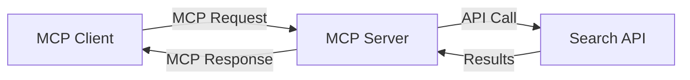
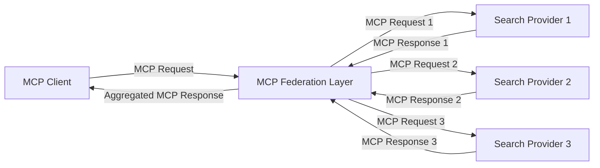
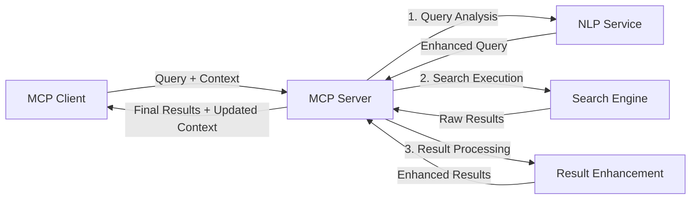

<!--
CO_OP_TRANSLATOR_METADATA:
{
  "original_hash": "333a03e51f90bdf3e6f1ba1694c73f36",
  "translation_date": "2025-07-17T10:45:03+00:00",
  "source_file": "05-AdvancedTopics/mcp-realtimesearch/README.md",
  "language_code": "cs"
}
-->
## Upozornění k příkladům kódu

> **Důležité upozornění**: Níže uvedené příklady kódu demonstrují integraci Model Context Protocolu (MCP) s funkcionalitou webového vyhledávání. I když následují vzory a struktury oficiálních MCP SDK, byly zjednodušeny pro vzdělávací účely.
> 
> Tyto příklady ukazují:
> 
> 1. **Implementaci v Pythonu**: Implementaci serveru FastMCP, který poskytuje nástroj pro webové vyhledávání a připojuje se k externímu vyhledávacímu API. Tento příklad demonstruje správu životního cyklu, práci s kontextem a implementaci nástroje podle vzorů [oficiálního MCP Python SDK](https://github.com/modelcontextprotocol/python-sdk). Server využívá doporučený transport Streamable HTTP, který nahradil starší SSE transport pro produkční nasazení.
> 
> 2. **Implementaci v JavaScriptu**: Implementaci v TypeScriptu/JavaScriptu využívající vzor FastMCP z [oficiálního MCP TypeScript SDK](https://github.com/modelcontextprotocol/typescript-sdk) pro vytvoření vyhledávacího serveru se správnou definicí nástrojů a připojením klientů. Následuje nejnovější doporučené vzory pro správu relací a uchování kontextu.
> 
> Tyto příklady by v produkčním prostředí vyžadovaly doplnění o zpracování chyb, autentizaci a specifickou integraci API. Ukázkové koncové body vyhledávacího API (`https://api.search-service.example/search`) jsou zástupné a je třeba je nahradit skutečnými koncovými body vyhledávacích služeb.
> 
> Pro kompletní implementační detaily a nejaktuálnější přístupy prosím navštivte [oficiální specifikaci MCP](https://spec.modelcontextprotocol.io/) a dokumentaci SDK.

## Základní koncepty

### Rámec Model Context Protocol (MCP)

Model Context Protocol poskytuje standardizovaný způsob, jak si AI modely, aplikace a služby vyměňují kontext. V reálném čase webového vyhledávání je tento rámec nezbytný pro vytváření koherentních, vícekrokových vyhledávacích zkušeností. Klíčové komponenty zahrnují:

1. **Architektura klient-server**: MCP jasně odděluje vyhledávací klienty (žadatele) a vyhledávací servery (poskytovatele), což umožňuje flexibilní modely nasazení.

2. **Komunikace JSON-RPC**: Pro výměnu zpráv používá protokol JSON-RPC, což zajišťuje kompatibilitu s webovými technologiemi a snadnou implementaci na různých platformách.

3. **Správa kontextu**: MCP definuje strukturované metody pro udržování, aktualizaci a využívání vyhledávacího kontextu napříč více interakcemi.

4. **Definice nástrojů**: Vyhledávací schopnosti jsou vystaveny jako standardizované nástroje s jasně definovanými parametry a návratovými hodnotami.

5. **Podpora streamování**: Protokol podporuje streamování výsledků, což je klíčové pro reálné vyhledávání, kde výsledky mohou přicházet postupně.

### Vzory integrace webového vyhledávání

Při integraci MCP s webovým vyhledáváním se objevuje několik vzorů:

#### 1. Přímá integrace poskytovatele vyhledávání

V tomto vzoru MCP server přímo komunikuje s jedním nebo více vyhledávacími API, překládá MCP požadavky do specifických API volání a formátuje výsledky jako MCP odpovědi.

#### 2. Federované vyhledávání s uchováním kontextu

Tento vzor rozděluje vyhledávací dotazy mezi více MCP-kompatibilních poskytovatelů vyhledávání, z nichž každý se může specializovat na různé typy obsahu nebo vyhledávacích schopností, přičemž zachovává jednotný kontext.

#### 3. Řetězec vyhledávání s rozšířeným kontextem

V tomto vzoru je vyhledávací proces rozdělen do několika fází, přičemž kontext je v každém kroku obohacován, což vede k postupně relevantnějším výsledkům.

### Komponenty vyhledávacího kontextu

V MCP založeném webovém vyhledávání kontext obvykle zahrnuje:

- **Historii dotazů**: Předchozí vyhledávací dotazy v relaci
- **Uživatelské preference**: Jazyk, region, nastavení bezpečného vyhledávání
- **Historii interakcí**: Které výsledky byly kliknuty, čas strávený u výsledků
- **Parametry vyhledávání**: Filtry, řazení a další modifikátory vyhledávání
- **Doménové znalosti**: Kontext specifický pro dané téma relevantní pro vyhledávání
- **Časový kontext**: Faktory relevance založené na čase
- **Preference zdrojů**: Důvěryhodné nebo preferované informační zdroje

## Případy použití a aplikace

### Výzkum a sběr informací

MCP zlepšuje pracovní postupy výzkumu tím, že:

- Uchovává kontext výzkumu napříč vyhledávacími relacemi
- Umožňuje sofistikovanější a kontextově relevantní dotazy
- Podporuje federaci vyhledávání z více zdrojů
- Usnadňuje extrakci znalostí z výsledků vyhledávání

### Monitorování zpráv a trendů v reálném čase

Vyhledávání poháněné MCP nabízí výhody pro sledování zpráv:

- Objevování nových zpráv téměř v reálném čase
- Kontextové filtrování relevantních informací
- Sledování témat a entit napříč více zdroji
- Personalizovaná upozornění na zprávy založená na uživatelském kontextu

### Prohlížení a výzkum s podporou AI

MCP otevírá nové možnosti pro prohlížení s podporou AI:

- Kontextové návrhy vyhledávání založené na aktuální aktivitě v prohlížeči
- Bezproblémová integrace webového vyhledávání s asistenty poháněnými LLM
- Vícekrokové upřesňování vyhledávání s udrženým kontextem
- Vylepšené ověřování faktů a verifikace informací

## Budoucí trendy a inovace

### Vývoj MCP ve webovém vyhledávání

Do budoucna očekáváme, že MCP bude rozvíjen tak, aby řešil:

- **Multimodální vyhledávání**: Integrace textového, obrazového, audio a video vyhledávání s uchovaným kontextem
- **Decentralizované vyhledávání**: Podpora distribuovaných a federovaných vyhledávacích ekosystémů
- **Ochrana soukromí při vyhledávání**: Kontextově uvědomělé mechanismy vyhledávání chránící soukromí  
- **Porozumění dotazům**: Hloubková sémantická analýza dotazů v přirozeném jazyce

### Potenciální technologické pokroky

Nové technologie, které budou formovat budoucnost vyhledávání MCP:

1. **Neuronové vyhledávací architektury**: Vyhledávací systémy založené na vektorech optimalizované pro MCP  
2. **Personalizovaný kontext vyhledávání**: Učení se individuálním vzorcům vyhledávání uživatelů v čase  
3. **Integrace znalostních grafů**: Kontextové vyhledávání vylepšené doménově specifickými znalostními grafy  
4. **Mezikontextová modalita**: Udržování kontextu napříč různými modalitami vyhledávání

## Praktická cvičení

### Cvičení 1: Nastavení základního MCP vyhledávacího pipeline

V tomto cvičení se naučíte:  
- Konfigurovat základní MCP vyhledávací prostředí  
- Implementovat správce kontextu pro webové vyhledávání  
- Testovat a ověřovat zachování kontextu během opakovaných vyhledávání

### Cvičení 2: Vytvoření výzkumného asistenta s MCP vyhledáváním

Vytvořte kompletní aplikaci, která:  
- Zpracovává výzkumné otázky v přirozeném jazyce  
- Provádí kontextově uvědomělé webové vyhledávání  
- Syntetizuje informace z více zdrojů  
- Prezentuje uspořádané výsledky výzkumu

### Cvičení 3: Implementace federace vyhledávání z více zdrojů s MCP

Pokročilé cvičení zahrnující:  
- Kontextově uvědomělé rozesílání dotazů do více vyhledávačů  
- Řazení a agregaci výsledků  
- Kontextovou deduplikaci výsledků vyhledávání  
- Zpracování metadat specifických pro jednotlivé zdroje

## Další zdroje

- [Model Context Protocol Specification](https://spec.modelcontextprotocol.io/) - Oficiální specifikace MCP a podrobná dokumentace protokolu  
- [Model Context Protocol Documentation](https://modelcontextprotocol.io/) - Podrobné návody a průvodce implementací  
- [MCP Python SDK](https://github.com/modelcontextprotocol/python-sdk) - Oficiální Python implementace protokolu MCP  
- [MCP TypeScript SDK](https://github.com/modelcontextprotocol/typescript-sdk) - Oficiální TypeScript implementace protokolu MCP  
- [MCP Reference Servers](https://github.com/modelcontextprotocol/servers) - Referenční implementace MCP serverů  
- [Bing Web Search API Documentation](https://learn.microsoft.com/en-us/bing/search-apis/bing-web-search/overview) - Microsoft API pro webové vyhledávání  
- [Google Custom Search JSON API](https://developers.google.com/custom-search/v1/overview) - Programovatelné vyhledávání Google  
- [SerpAPI Documentation](https://serpapi.com/search-api) - API pro výsledky vyhledávačů  
- [Meilisearch Documentation](https://www.meilisearch.com/docs) - Open-source vyhledávací engine  
- [Elasticsearch Documentation](https://www.elastic.co/guide/index.html) - Distribuovaný vyhledávací a analytický engine  
- [LangChain Documentation](https://python.langchain.com/docs/get_started/introduction) - Tvorba aplikací s LLM

## Výsledky učení

Po dokončení tohoto modulu budete schopni:

- Pochopit základy vyhledávání v reálném čase na webu a jeho výzvy  
- Vysvětlit, jak Model Context Protocol (MCP) zlepšuje možnosti vyhledávání v reálném čase  
- Implementovat vyhledávací řešení založená na MCP pomocí populárních frameworků a API  
- Navrhnout a nasadit škálovatelné a výkonné vyhledávací architektury s MCP  
- Aplikovat koncepty MCP v různých případech použití včetně sémantického vyhledávání, výzkumné asistence a AI-podporovaného prohlížení  
- Hodnotit nové trendy a budoucí inovace v technologiích vyhledávání založených na MCP

### Zásady důvěry a bezpečnosti

Při implementaci webového vyhledávání založeného na MCP mějte na paměti tyto důležité principy ze specifikace MCP:

1. **Souhlas a kontrola uživatele**: Uživatelé musí výslovně souhlasit a rozumět všem přístupům k datům a operacím. To je zvlášť důležité u implementací webového vyhledávání, které mohou přistupovat k externím zdrojům dat.

2. **Ochrana soukromí dat**: Zajistěte správné nakládání s dotazy a výsledky vyhledávání, zejména pokud mohou obsahovat citlivé informace. Implementujte vhodná přístupová omezení na ochranu uživatelských dat.

3. **Bezpečnost nástrojů**: Implementujte správnou autorizaci a validaci vyhledávacích nástrojů, protože představují potenciální bezpečnostní riziko kvůli možnosti spouštění libovolného kódu. Popisy chování nástrojů by měly být považovány za nedůvěryhodné, pokud nejsou získány z důvěryhodného serveru.

4. **Jasná dokumentace**: Poskytněte jasnou dokumentaci o schopnostech, omezeních a bezpečnostních aspektech vaší MCP implementace vyhledávání, v souladu s pokyny specifikace MCP.

5. **Robustní procesy souhlasu**: Vytvořte robustní procesy souhlasu a autorizace, které jasně vysvětlují, co každý nástroj dělá, před jeho povolením, zejména u nástrojů, které komunikují s externími webovými zdroji.

Pro kompletní informace o bezpečnosti a zásadách důvěry MCP navštivte [oficiální dokumentaci](https://modelcontextprotocol.io/specification/2025-03-26#security-and-trust-%26-safety).

## Co dál

- [5.12 Entra ID Authentication for Model Context Protocol Servers](../mcp-security-entra/README.md)

**Prohlášení o vyloučení odpovědnosti**:  
Tento dokument byl přeložen pomocí AI překladatelské služby [Co-op Translator](https://github.com/Azure/co-op-translator). I když usilujeme o přesnost, mějte prosím na paměti, že automatické překlady mohou obsahovat chyby nebo nepřesnosti. Původní dokument v jeho mateřském jazyce by měl být považován za závazný zdroj. Pro důležité informace se doporučuje profesionální lidský překlad. Nejsme odpovědní za jakékoliv nedorozumění nebo nesprávné výklady vyplývající z použití tohoto překladu.