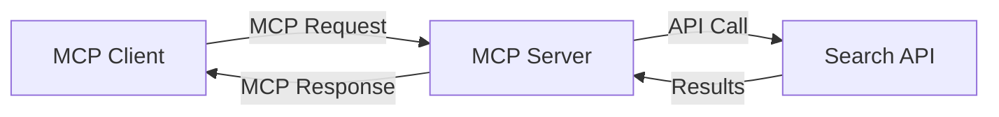
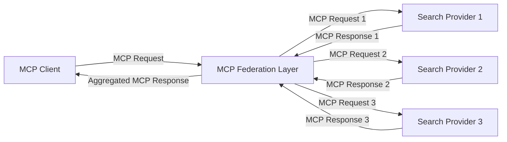
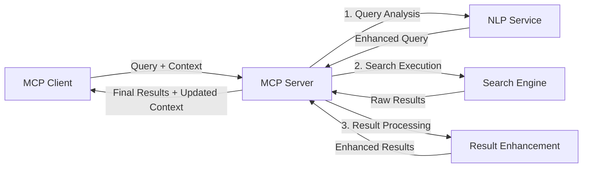

<!--
CO_OP_TRANSLATOR_METADATA:
{
  "original_hash": "16bef2c93c6a86d4ca6a8ce9e120e384",
  "translation_date": "2025-06-13T03:00:01+00:00",
  "source_file": "05-AdvancedTopics/mcp-realtimesearch/README.md",
  "language_code": "cs"
}
-->
## Code Examples Disclaimer

> **Important Note**: Následující ukázky kódu demonstrují integraci Model Context Protocol (MCP) s funkcionalitou webového vyhledávání. I když dodržují vzory a struktury oficiálních MCP SDK, byly zjednodušeny pro výukové účely.
> 
> Tyto příklady ukazují:
> 
> 1. **Implementaci v Pythonu**: Server FastMCP, který poskytuje nástroj pro webové vyhledávání a připojuje se k externímu vyhledávacímu API. Tento příklad demonstruje správu životního cyklu, práci s kontextem a implementaci nástrojů podle vzorů [oficiálního MCP Python SDK](https://github.com/modelcontextprotocol/python-sdk). Server využívá doporučený transport Streamable HTTP, který nahradil starší SSE transport pro produkční nasazení.
> 
> 2. **Implementaci v JavaScriptu**: Implementaci v TypeScript/JavaScriptu podle vzoru FastMCP z [oficiálního MCP TypeScript SDK](https://github.com/modelcontextprotocol/typescript-sdk) pro vytvoření vyhledávacího serveru s definicemi nástrojů a klientskými připojeními. Následuje nejnovější doporučené postupy pro správu relací a uchování kontextu.
> 
> Tyto příklady by v produkčním prostředí vyžadovaly další zpracování chyb, autentizaci a specifickou integraci s API. Ukázkové koncové body vyhledávacího API (`https://api.search-service.example/search`) jsou zástupné a měly by být nahrazeny skutečnými službami.
> 
> Pro kompletní detaily implementace a nejaktuálnější postupy navštivte [oficiální MCP specifikaci](https://spec.modelcontextprotocol.io/) a dokumentaci SDK.

## Core Concepts

### The Model Context Protocol (MCP) Framework

Základním kamenem Model Context Protocol je standardizovaný způsob výměny kontextu mezi AI modely, aplikacemi a službami. V reálném čase webového vyhledávání je tento rámec nezbytný pro tvorbu koherentních, vícekrokových vyhledávacích zkušeností. Klíčové komponenty zahrnují:

1. **Architektura klient-server**: MCP jasně odděluje vyhledávací klienty (žadatele) a vyhledávací servery (poskytovatele), což umožňuje flexibilní modely nasazení.

2. **Komunikace JSON-RPC**: Pro výměnu zpráv protokol používá JSON-RPC, což jej činí kompatibilním s webovými technologiemi a snadno implementovatelným na různých platformách.

3. **Správa kontextu**: MCP definuje strukturované metody pro udržování, aktualizaci a využití vyhledávacího kontextu napříč více interakcemi.

4. **Definice nástrojů**: Vyhledávací schopnosti jsou vystaveny jako standardizované nástroje s dobře definovanými parametry a návratovými hodnotami.

5. **Podpora streamování**: Protokol podporuje streamování výsledků, což je klíčové pro vyhledávání v reálném čase, kde výsledky mohou přicházet postupně.

### Web Search Integration Patterns

Při integraci MCP s webovým vyhledáváním se objevují následující vzory:

#### 1. Přímá integrace poskytovatele vyhledávání

V tomto vzoru MCP server přímo komunikuje s jedním nebo více vyhledávacími API, převádí MCP požadavky na specifické API volání a formátuje výsledky jako MCP odpovědi.

#### 2. Federované vyhledávání s uchováním kontextu

Tento vzor rozděluje vyhledávací dotazy mezi více MCP-kompatibilních poskytovatelů vyhledávání, z nichž každý se může specializovat na jiný typ obsahu nebo vyhledávací schopnosti, přičemž zachovává jednotný kontext.

#### 3. Řetězec vyhledávání s obohaceným kontextem

Ve tomto vzoru je vyhledávací proces rozdělen do několika fází, přičemž se kontext v každém kroku obohacuje, což vede k postupně relevantnějším výsledkům.

### Komponenty vyhledávacího kontextu

V MCP založeném webovém vyhledávání kontext obvykle zahrnuje:

- **Historie dotazů**: Předchozí vyhledávací dotazy v rámci relace
- **Uživatelské preference**: Jazyk, region, nastavení bezpečného vyhledávání
- **Historie interakcí**: Které výsledky byly kliknuty, čas strávený u výsledků
- **Parametry vyhledávání**: Filtry, řazení a další modifikátory vyhledávání
- **Doménové znalosti**: Kontext specifický pro téma vyhledávání
- **Časový kontext**: Faktory relevance založené na čase
- **Preference zdrojů**: Důvěryhodné nebo preferované informační zdroje

## Use Cases and Applications

### Výzkum a sběr informací

MCP zlepšuje pracovní postupy výzkumu tím, že:

- Zachovává kontext výzkumu napříč vyhledávacími relacemi
- Umožňuje sofistikovanější a kontextově relevantní dotazy
- Podporuje federované vyhledávání z více zdrojů
- Usnadňuje extrakci znalostí z výsledků vyhledávání

### Monitorování zpráv a trendů v reálném čase

Vyhledávání s podporou MCP nabízí výhody pro sledování zpráv:

- Objevování nových zpráv téměř v reálném čase
- Kontextové filtrování relevantních informací
- Sledování témat a entit napříč více zdroji
- Personalizovaná upozornění na zprávy na základě uživatelského kontextu

### AI-rozšířené prohlížení a výzkum

MCP otevírá nové možnosti pro AI-rozšířené prohlížení:

- Kontextové návrhy vyhledávání založené na aktuální aktivitě v prohlížeči
- Bezproblémová integrace webového vyhledávání s asistenty poháněnými LLM
- Vícekrokové upřesňování vyhledávání s udrženým kontextem
- Vylepšená kontrola faktů a ověřování informací

## Future Trends and Innovations

### Vývoj MCP ve webovém vyhledávání

Do budoucna očekáváme, že MCP bude řešit:

- **Multimodální vyhledávání**: Integrace textového, obrazového, audio a video vyhledávání s uchovaným kontextem
- **Decentralizované vyhledávání**: Podpora distribuovaných a federovaných vyhledávacích ekosystémů
- **Soukromí ve vyhledávání**: Kontextově uvědomělé mechanismy ochrany soukromí při vyhledávání
- **Porozumění dotazům**: Hluboké sémantické zpracování přirozených jazykových dotazů

### Potenciální technologické pokroky

Nové technologie, které budou formovat budoucnost MCP vyhledávání:

1. **Neurální vyhledávací architektury**: Vyhledávací systémy založené na embedování optimalizované pro MCP
2. **Personalizovaný vyhledávací kontext**: Učení individuálních vzorců vyhledávání uživatele v čase
3. **Integrace znalostních grafů**: Kontextové vyhledávání obohacené o doménově specifické znalostní grafy
4. **Křížový multimodální kontext**: Uchovávání kontextu napříč různými vyhledávacími modalitami

## Hands-On Exercises

### Cvičení 1: Nastavení základního MCP vyhledávacího pipeline

V tomto cvičení se naučíte:
- Konfigurovat základní MCP vyhledávací prostředí
- Implementovat správce kontextu pro webové vyhledávání
- Testovat a ověřovat uchování kontextu napříč vyhledávacími iteracemi

### Cvičení 2: Vytvoření výzkumného asistenta s MCP vyhledáváním

Vytvořte kompletní aplikaci, která:
- Zpracovává přirozeně jazykové výzkumné dotazy
- Provádí kontextově uvědomělé webové vyhledávání
- Syntetizuje informace z více zdrojů
- Prezentuje organizované výsledky výzkumu

### Cvičení 3: Implementace federovaného vyhledávání z více zdrojů s MCP

Pokročilé cvičení zahrnující:
- Kontextově uvědomělé směrování dotazů do více vyhledávačů
- Řazení a agregaci výsledků
- Kontextové odstraňování duplicit ve výsledcích
- Zpracování metadat specifických pro zdroje

## Additional Resources

- [Model Context Protocol Specification](https://spec.modelcontextprotocol.io/) - Oficiální MCP specifikace a detailní dokumentace protokolu
- [Model Context Protocol Documentation](https://modelcontextprotocol.io/) - Podrobné tutoriály a průvodce implementací
- [MCP Python SDK](https://github.com/modelcontextprotocol/python-sdk) - Oficiální Python implementace MCP protokolu
- [MCP TypeScript SDK](https://github.com/modelcontextprotocol/typescript-sdk) - Oficiální TypeScript implementace MCP protokolu
- [MCP Reference Servers](https://github.com/modelcontextprotocol/servers) - Referenční implementace MCP serverů
- [Bing Web Search API Documentation](https://learn.microsoft.com/en-us/bing/search-apis/bing-web-search/overview) - Microsoft API pro webové vyhledávání
- [Google Custom Search JSON API](https://developers.google.com/custom-search/v1/overview) - Programovatelné vyhledávání Google
- [SerpAPI Documentation](https://serpapi.com/search-api) - API výsledků vyhledávačů
- [Meilisearch Documentation](https://www.meilisearch.com/docs) - Open-source vyhledávací engine
- [Elasticsearch Documentation](https://www.elastic.co/guide/index.html) - Distribuovaný vyhledávací a analytický engine
- [LangChain Documentation](https://python.langchain.com/docs/get_started/introduction) - Budování aplikací s LLM

## Learning Outcomes

Po dokončení tohoto modulu budete schopni:

- Pochopit základy reálného času webového vyhledávání a jeho výzvy
- Vysvětlit, jak Model Context Protocol (MCP) zlepšuje schopnosti reálného času webového vyhledávání
- Implementovat MCP založená vyhledávací řešení s využitím populárních frameworků a API
- Navrhovat a nasazovat škálovatelné, vysoce výkonné vyhledávací architektury s MCP
- Aplikovat koncepty MCP v různých případech použití včetně sémantického vyhledávání, asistence při výzkumu a AI-rozšířeného prohlížení
- Hodnotit nové trendy a budoucí inovace v MCP založených vyhledávacích technologiích

### Trust and Safety Considerations

Při implementaci MCP založených webových vyhledávacích řešení mějte na paměti následující důležité zásady z MCP specifikace:

1. **Souhlas a kontrola uživatele**: Uživatelé musí výslovně souhlasit a rozumět všem přístupům k datům a operacím. To je zvláště důležité u implementací webového vyhledávání, které mohou přistupovat k externím zdrojům dat.

2. **Ochrana soukromí dat**: Zajistěte odpovídající nakládání s vyhledávacími dotazy a výsledky, zvláště pokud mohou obsahovat citlivé informace. Implementujte adekvátní přístupové kontroly k ochraně uživatelských dat.

3. **Bezpečnost nástrojů**: Implementujte správnou autorizaci a validaci pro vyhledávací nástroje, protože představují potenciální bezpečnostní riziko skrze spuštění libovolného kódu. Popisy chování nástrojů by měly být považovány za nedůvěryhodné, pokud nejsou získány z důvěryhodného serveru.

4. **Jasná dokumentace**: Poskytněte jasnou dokumentaci o schopnostech, omezeních a bezpečnostních aspektech vaší MCP založené vyhledávací implementace v souladu s pokyny MCP specifikace.

5. **Robustní procesy souhlasu**: Vytvořte robustní procesy souhlasu a autorizace, které jasně vysvětlují, co každý nástroj dělá, než povolíte jeho použití, zejména pro nástroje, které komunikují s externími webovými zdroji.

Pro úplné informace o bezpečnosti a důvěře v MCP navštivte [oficiální dokumentaci](https://modelcontextprotocol.io/specification/2025-03-26#security-and-trust-%26-safety).

## What's next 

- [6. Community Contributions](../../06-CommunityContributions/README.md)

**Prohlášení o vyloučení odpovědnosti**:  
Tento dokument byl přeložen pomocí AI překladatelské služby [Co-op Translator](https://github.com/Azure/co-op-translator). Přestože usilujeme o přesnost, mějte prosím na paměti, že automatizované překlady mohou obsahovat chyby nebo nepřesnosti. Původní dokument v jeho mateřském jazyce by měl být považován za závazný zdroj. Pro důležité informace se doporučuje profesionální lidský překlad. Nejsme odpovědni za jakékoli nedorozumění nebo chybné interpretace vyplývající z použití tohoto překladu.