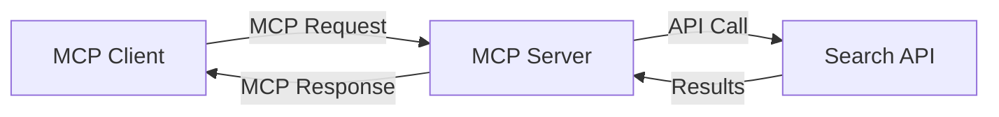
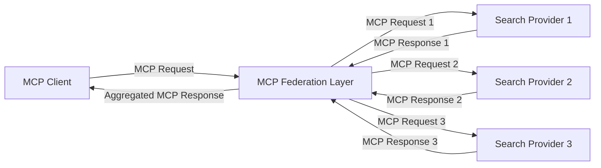
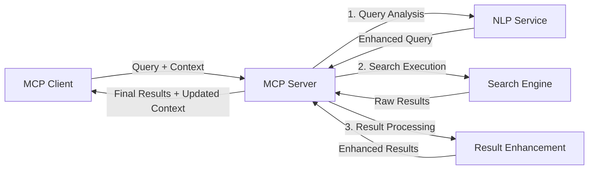

<!--
CO_OP_TRANSLATOR_METADATA:
{
  "original_hash": "eb12652eb7bd17f2193b835a344425c6",
  "translation_date": "2025-06-26T14:19:06+00:00",
  "source_file": "05-AdvancedTopics/mcp-realtimesearch/README.md",
  "language_code": "cs"
}
-->
## Prohlášení o příkladech kódu

> **Důležitá poznámka**: Níže uvedené příklady kódu demonstrují integraci Model Context Protocolu (MCP) s funkcionalitou webového vyhledávání. I když vycházejí ze vzorů a struktur oficiálních MCP SDK, byly zjednodušeny pro vzdělávací účely.
> 
> Tyto příklady ukazují:
> 
> 1. **Implementaci v Pythonu**: Implementaci serveru FastMCP, který poskytuje nástroj pro webové vyhledávání a připojuje se k externímu vyhledávacímu API. Tento příklad demonstruje správu životního cyklu, práci s kontextem a implementaci nástroje podle vzorů z [oficiálního MCP Python SDK](https://github.com/modelcontextprotocol/python-sdk). Server využívá doporučený transport Streamable HTTP, který nahradil starší SSE transport pro produkční nasazení.
> 
> 2. **Implementaci v JavaScriptu**: Implementaci v TypeScriptu/JavaScriptu využívající vzor FastMCP z [oficiálního MCP TypeScript SDK](https://github.com/modelcontextprotocol/typescript-sdk) k vytvoření vyhledávacího serveru s řádnou definicí nástrojů a klientských připojení. Následuje nejnovější doporučené postupy pro správu relací a zachování kontextu.
> 
> Tyto příklady by pro produkční použití vyžadovaly doplnění o zpracování chyb, autentizaci a specifickou integraci s API. Zobrazené koncové body vyhledávacího API (`https://api.search-service.example/search`) jsou zástupné a měly by být nahrazeny skutečnými koncovými body vyhledávacích služeb.
> 
> Pro kompletní detaily implementace a nejaktuálnější přístupy prosím odkazujte na [oficiální specifikaci MCP](https://spec.modelcontextprotocol.io/) a dokumentaci SDK.

## Základní koncepty

### Rámec Model Context Protocol (MCP)

Model Context Protocol poskytuje standardizovaný způsob, jak si AI modely, aplikace a služby vyměňují kontext. V reálném čase při webovém vyhledávání je tento rámec nezbytný pro tvorbu koherentních vícetahových vyhledávacích zážitků. Klíčové komponenty zahrnují:

1. **Architektura klient-server**: MCP jasně odděluje vyhledávací klienty (žadatele) a vyhledávací servery (poskytovatele), což umožňuje flexibilní modely nasazení.

2. **Komunikace JSON-RPC**: Pro výměnu zpráv používá protokol JSON-RPC, což zajišťuje kompatibilitu s webovými technologiemi a snadnou implementaci na různých platformách.

3. **Správa kontextu**: MCP definuje strukturované metody pro udržování, aktualizaci a využívání vyhledávacího kontextu během více interakcí.

4. **Definice nástrojů**: Vyhledávací schopnosti jsou zpřístupněny jako standardizované nástroje s jasně definovanými parametry a návratovými hodnotami.

5. **Podpora streamování**: Protokol podporuje streamování výsledků, což je klíčové pro reálné vyhledávání, kde výsledky mohou přicházet postupně.

### Vzory integrace webového vyhledávání

Při integraci MCP s webovým vyhledáváním se objevuje několik vzorů:

#### 1. Přímá integrace poskytovatele vyhledávání

V tomto vzoru MCP server přímo komunikuje s jedním nebo více vyhledávacími API, překládá MCP požadavky do API specifických volání a formátuje výsledky jako MCP odpovědi.

#### 2. Federované vyhledávání s uchováním kontextu

Tento vzor rozděluje vyhledávací dotazy mezi více MCP-kompatibilních poskytovatelů vyhledávání, z nichž každý může být specializovaný na různé typy obsahu nebo vyhledávací schopnosti, přičemž se zachovává jednotný kontext.

#### 3. Vyhledávací řetězec s rozšířeným kontextem

V tomto vzoru je vyhledávací proces rozdělen do více fází, kdy je kontext na každém kroku obohacován, což vede k postupně relevantnějším výsledkům.

### Komponenty vyhledávacího kontextu

V MCP založeném webovém vyhledávání obvykle kontext zahrnuje:

- **Historii dotazů**: Předchozí vyhledávací dotazy v rámci relace
- **Uživatelské preference**: Jazyk, region, nastavení bezpečného vyhledávání
- **Historii interakcí**: Které výsledky byly kliknuty, doba strávená u výsledků
- **Parametry vyhledávání**: Filtry, řazení a další modifikátory vyhledávání
- **Doménové znalosti**: Kontext specifický pro dané téma vyhledávání
- **Časový kontext**: Faktory relevance založené na čase
- **Preference zdrojů**: Důvěryhodné nebo preferované informační zdroje

## Případy použití a aplikace

### Výzkum a sběr informací

MCP zlepšuje pracovní postupy ve výzkumu tím, že:

- Uchovává kontext výzkumu napříč vyhledávacími relacemi
- Umožňuje sofistikovanější a kontextově relevantní dotazy
- Podporuje federaci vyhledávání napříč více zdroji
- Usnadňuje extrakci znalostí z výsledků vyhledávání

### Monitorování zpráv a trendů v reálném čase

Vyhledávání poháněné MCP nabízí výhody pro sledování zpráv:

- Objevování nových zpráv téměř v reálném čase
- Kontextové filtrování relevantních informací
- Sledování témat a entit napříč zdroji
- Personalizovaná upozornění na zprávy založená na uživatelském kontextu

### Prohlížení a výzkum s podporou AI

MCP otevírá nové možnosti pro AI-podporované prohlížení:

- Kontextové návrhy vyhledávání na základě aktuální aktivity v prohlížeči
- Bezproblémová integrace webového vyhledávání s asistenty poháněnými LLM
- Víceotáčkové zpřesňování vyhledávání s udrženým kontextem
- Vylepšená kontrola faktů a ověřování informací

## Budoucí trendy a inovace

### Vývoj MCP ve webovém vyhledávání

Do budoucna očekáváme, že MCP bude řešit:

- **Multimodální vyhledávání**: Integrace textového, obrazového, audio a video vyhledávání se zachovaným kontextem
- **Decentralizované vyhledávání**: Podpora distribuovaných a federovaných vyhledávacích ekosystémů
- **Soukromí ve vyhledávání**: Kontextově uvědomělé mechanismy ochrany soukromí ve vyhledávání
- **Porozumění dotazům**: Hluboké sémantické zpracování přirozených jazykových vyhledávacích dotazů

### Potenciální technologické pokroky

Nové technologie, které ovlivní budoucnost MCP vyhledávání:

1. **Neurální vyhledávací architektury**: Vyhledávací systémy založené na embedování optimalizované pro MCP
2. **Personalizovaný vyhledávací kontext**: Učení se individuálním vzorcům vyhledávání uživatele v čase
3. **Integrace znalostních grafů**: Kontextové vyhledávání vylepšené o doménově specifické znalostní grafy
4. **Křížově modalitní kontext**: Udržování kontextu napříč různými modalitami vyhledávání

## Praktická cvičení

### Cvičení 1: Nastavení základního MCP vyhledávacího pipeline

V tomto cvičení se naučíte:
- Konfigurovat základní MCP vyhledávací prostředí
- Implementovat správce kontextu pro webové vyhledávání
- Testovat a ověřovat zachování kontextu napříč vyhledávacími iteracemi

### Cvičení 2: Vytvoření výzkumného asistenta s MCP vyhledáváním

Vytvořte kompletní aplikaci, která:
- Zpracovává výzkumné otázky v přirozeném jazyce
- Provádí kontextově uvědomělé webové vyhledávání
- Syntetizuje informace z více zdrojů
- Prezentuje uspořádané výsledky výzkumu

### Cvičení 3: Implementace federace vyhledávání napříč více zdroji s MCP

Pokročilé cvičení pokrývající:
- Kontextově uvědomělé rozesílání dotazů do více vyhledávačů
- Řazení a agregaci výsledků
- Kontextové odstraňování duplicit ve výsledcích vyhledávání
- Zpracování metadat specifických pro jednotlivé zdroje

## Další zdroje

- [Model Context Protocol Specification](https://spec.modelcontextprotocol.io/) - Oficiální specifikace MCP a podrobná dokumentace protokolu
- [Model Context Protocol Documentation](https://modelcontextprotocol.io/) - Podrobné tutoriály a průvodce implementací
- [MCP Python SDK](https://github.com/modelcontextprotocol/python-sdk) - Oficiální Python implementace MCP protokolu
- [MCP TypeScript SDK](https://github.com/modelcontextprotocol/typescript-sdk) - Oficiální TypeScript implementace MCP protokolu
- [MCP Reference Servers](https://github.com/modelcontextprotocol/servers) - Referenční implementace MCP serverů
- [Bing Web Search API Documentation](https://learn.microsoft.com/en-us/bing/search-apis/bing-web-search/overview) - Microsoft API pro webové vyhledávání
- [Google Custom Search JSON API](https://developers.google.com/custom-search/v1/overview) - Google programovatelné vyhledávání
- [SerpAPI Documentation](https://serpapi.com/search-api) - API pro výsledky vyhledávačů
- [Meilisearch Documentation](https://www.meilisearch.com/docs) - Open-source vyhledávací engine
- [Elasticsearch Documentation](https://www.elastic.co/guide/index.html) - Distribuovaný vyhledávací a analytický engine
- [LangChain Documentation](https://python.langchain.com/docs/get_started/introduction) - Tvorba aplikací s LLM

## Výsledky učení

Po dokončení tohoto modulu budete schopni:

- Pochopit základy reálného webového vyhledávání a jeho výzvy
- Vysvětlit, jak Model Context Protocol (MCP) zlepšuje schopnosti reálného webového vyhledávání
- Implementovat MCP založená vyhledávací řešení s využitím populárních frameworků a API
- Navrhnout a nasadit škálovatelné, vysoce výkonné vyhledávací architektury s MCP
- Aplikovat koncepty MCP na různé případy použití včetně sémantického vyhledávání, výzkumné asistence a AI-podporovaného prohlížení
- Hodnotit nové trendy a budoucí inovace v MCP založených vyhledávacích technologiích

### Úvahy o důvěře a bezpečnosti

Při implementaci MCP založených webových vyhledávacích řešení mějte na paměti tyto důležité zásady ze specifikace MCP:

1. **Souhlas a kontrola uživatele**: Uživatelé musí výslovně souhlasit a rozumět všem přístupům k datům a operacím. To je zvláště důležité u implementací webového vyhledávání, které mohou přistupovat k externím zdrojům dat.

2. **Ochrana soukromí dat**: Zajistěte vhodné zacházení s vyhledávacími dotazy a výsledky, zejména pokud mohou obsahovat citlivé informace. Implementujte odpovídající přístupová omezení k ochraně uživatelských dat.

3. **Bezpečnost nástrojů**: Implementujte správné ověřování a validaci vyhledávacích nástrojů, protože představují potenciální bezpečnostní rizika kvůli možnosti spuštění libovolného kódu. Popisy chování nástrojů by měly být považovány za nedůvěryhodné, pokud nejsou získány z důvěryhodného serveru.

4. **Jasná dokumentace**: Poskytněte jasnou dokumentaci o schopnostech, omezeních a bezpečnostních aspektech vaší MCP založené implementace vyhledávání, v souladu s implementačními pokyny ze specifikace MCP.

5. **Robustní procesy souhlasu**: Vytvořte robustní procesy souhlasu a autorizace, které jasně vysvětlují, co každý nástroj dělá před jeho povolením k použití, zejména u nástrojů interagujících s externími webovými zdroji.

Pro úplné informace o bezpečnosti a důvěře MCP navštivte [oficiální dokumentaci](https://modelcontextprotocol.io/specification/2025-03-26#security-and-trust-%26-safety).

## Co dál

- [5.11 Entra ID Authentication for Model Context Protocol Servers](../mcp-security-entra/README.md)

**Prohlášení o vyloučení odpovědnosti**:  
Tento dokument byl přeložen pomocí AI překladatelské služby [Co-op Translator](https://github.com/Azure/co-op-translator). I když usilujeme o přesnost, mějte prosím na paměti, že automatizované překlady mohou obsahovat chyby nebo nepřesnosti. Původní dokument v jeho mateřském jazyce by měl být považován za autoritativní zdroj. Pro důležité informace se doporučuje profesionální lidský překlad. Nejsme odpovědní za jakékoli nedorozumění nebo nesprávné výklady vyplývající z použití tohoto překladu.