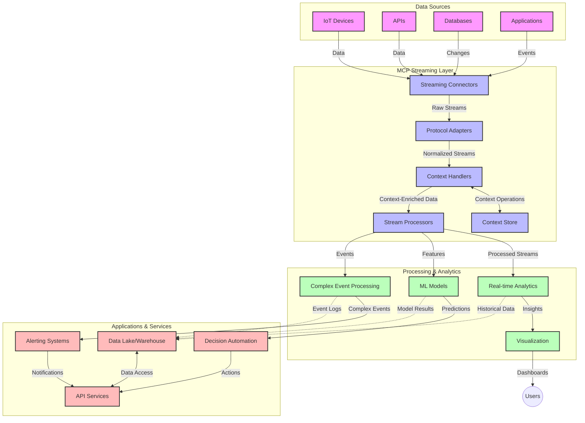

<!--
CO_OP_TRANSLATOR_METADATA:
{
  "original_hash": "195f7287638b77a549acadd96c8f981c",
  "translation_date": "2025-07-14T01:49:24+00:00",
  "source_file": "05-AdvancedTopics/mcp-realtimestreaming/README.md",
  "language_code": "cs"
}
-->
# Model Context Protocol pro streamování dat v reálném čase

## Přehled

Streamování dat v reálném čase se stalo nezbytností v dnešním světě řízeném daty, kde firmy a aplikace potřebují okamžitý přístup k informacím pro včasné rozhodování. Model Context Protocol (MCP) představuje významný pokrok v optimalizaci těchto procesů streamování v reálném čase, zvyšuje efektivitu zpracování dat, zachovává kontextovou integritu a zlepšuje celkový výkon systému.

Tento modul zkoumá, jak MCP mění streamování dat v reálném čase tím, že poskytuje standardizovaný přístup k řízení kontextu napříč AI modely, streamovacími platformami a aplikacemi.

## Úvod do streamování dat v reálném čase

Streamování dat v reálném čase je technologický přístup, který umožňuje nepřetržitý přenos, zpracování a analýzu dat v okamžiku jejich vzniku, což umožňuje systémům okamžitě reagovat na nové informace. Na rozdíl od tradičního dávkového zpracování, které pracuje se statickými datovými sadami, streamování zpracovává data za běhu a poskytuje poznatky a akce s minimální latencí.

### Základní pojmy streamování dat v reálném čase:

- **Nepřetržitý tok dat**: Data jsou zpracovávána jako kontinuální, nikdy nekončící proud událostí nebo záznamů.
- **Zpracování s nízkou latencí**: Systémy jsou navrženy tak, aby minimalizovaly čas mezi vznikem dat a jejich zpracováním.
- **Škálovatelnost**: Streamovací architektury musí zvládat proměnlivé objemy a rychlosti dat.
- **Odolnost vůči chybám**: Systémy musí být schopné odolávat selháním, aby zajistily nepřerušený tok dat.
- **Stavové zpracování**: Udržování kontextu napříč událostmi je klíčové pro smysluplnou analýzu.

### Model Context Protocol a streamování v reálném čase

Model Context Protocol (MCP) řeší několik zásadních výzev v prostředích streamování v reálném čase:

1. **Kontinuita kontextu**: MCP standardizuje způsob, jakým je kontext udržován napříč distribuovanými streamovacími komponentami, což zajišťuje, že AI modely a zpracovatelské uzly mají přístup k relevantnímu historickému a environmentálnímu kontextu.

2. **Efektivní správa stavu**: Poskytováním strukturovaných mechanismů pro přenos kontextu MCP snižuje režii správy stavu ve streamovacích pipelinech.

3. **Interoperabilita**: MCP vytváří společný jazyk pro sdílení kontextu mezi různými streamovacími technologiemi a AI modely, což umožňuje flexibilnější a rozšiřitelnější architektury.

4. **Kontext optimalizovaný pro streamování**: Implementace MCP mohou upřednostňovat, které prvky kontextu jsou nejdůležitější pro rozhodování v reálném čase, čímž optimalizují výkon i přesnost.

5. **Adaptivní zpracování**: Díky správě kontextu prostřednictvím MCP mohou streamovací systémy dynamicky upravovat zpracování na základě měnících se podmínek a vzorců v datech.

V moderních aplikacích od IoT senzorových sítí po finanční obchodní platformy umožňuje integrace MCP se streamovacími technologiemi inteligentnější, kontextově uvědomělé zpracování, které dokáže v reálném čase adekvátně reagovat na složité a vyvíjející se situace.

## Výukové cíle

Na konci této lekce budete schopni:

- Porozumět základům streamování dat v reálném čase a jeho výzvám
- Vysvětlit, jak Model Context Protocol (MCP) zlepšuje streamování dat v reálném čase
- Implementovat streamovací řešení založená na MCP pomocí populárních frameworků jako Kafka a Pulsar
- Navrhnout a nasadit odolné a vysoce výkonné streamovací architektury s MCP
- Aplikovat koncepty MCP v případech použití IoT, finančního obchodování a analytiky řízené AI
- Hodnotit nové trendy a budoucí inovace v technologiích streamování založených na MCP

### Definice a význam

Streamování dat v reálném čase zahrnuje nepřetržitou generaci, zpracování a doručování dat s minimální latencí. Na rozdíl od dávkového zpracování, kde jsou data shromažďována a zpracovávána ve skupinách, jsou streamovaná data zpracovávána postupně, jak přicházejí, což umožňuje okamžité poznatky a reakce.

Klíčové charakteristiky streamování dat v reálném čase zahrnují:

- **Nízká latence**: Zpracování a analýza dat během milisekund až sekund
- **Nepřetržitý tok**: Nepřerušené proudy dat z různých zdrojů
- **Okamžité zpracování**: Analýza dat ihned po příchodu, nikoli ve skupinách
- **Architektura řízená událostmi**: Reakce na události v okamžiku jejich vzniku

### Výzvy v tradičním streamování dat

Tradiční přístupy ke streamování dat čelí několika omezením:

1. **Ztráta kontextu**: Obtížné udržet kontext napříč distribuovanými systémy
2. **Problémy se škálovatelností**: Výzvy při škálování pro vysoký objem a rychlost dat
3. **Komplexita integrace**: Problémy s interoperabilitou mezi různými systémy
4. **Řízení latence**: Vyvažování propustnosti a doby zpracování
5. **Konzistence dat**: Zajištění přesnosti a úplnosti dat v celém streamu

## Pochopení Model Context Protocol (MCP)

### Co je MCP?

Model Context Protocol (MCP) je standardizovaný komunikační protokol navržený k usnadnění efektivní interakce mezi AI modely a aplikacemi. V kontextu streamování dat v reálném čase MCP poskytuje rámec pro:

- Zachování kontextu v celém datovém pipeline
- Standardizaci formátů výměny dat
- Optimalizaci přenosu velkých datových sad
- Zlepšení komunikace mezi modely a mezi modelem a aplikací

### Hlavní komponenty a architektura

Architektura MCP pro streamování v reálném čase se skládá z několika klíčových komponent:

1. **Context Handlers**: Spravují a udržují kontextové informace napříč streamovacím pipeline
2. **Stream Processors**: Zpracovávají příchozí datové toky pomocí technik založených na kontextu
3. **Protocol Adapters**: Převádějí mezi různými streamovacími protokoly při zachování kontextu
4. **Context Store**: Efektivně ukládá a načítá kontextové informace
5. **Streaming Connectors**: Připojují se k různým streamovacím platformám (Kafka, Pulsar, Kinesis atd.)



### Jak MCP zlepšuje zpracování dat v reálném čase

MCP řeší tradiční výzvy streamování prostřednictvím:

- **Kontextové integrity**: Udržování vztahů mezi datovými body v celém pipeline
- **Optimalizovaného přenosu**: Snižování redundance ve výměně dat díky inteligentní správě kontextu
- **Standardizovaných rozhraní**: Poskytování konzistentních API pro streamovací komponenty
- **Snížení latence**: Minimalizace režie zpracování díky efektivní správě kontextu
- **Zvýšené škálovatelnosti**: Podpora horizontálního škálování při zachování kontextu

## Integrace a implementace

Systémy streamování dat v reálném čase vyžadují pečlivý návrh architektury a implementaci, aby bylo možné udržet jak výkon, tak kontextovou integritu. Model Context Protocol nabízí standardizovaný přístup k integraci AI modelů a streamovacích technologií, což umožňuje sofistikovanější, kontextově uvědomělé zpracovatelské pipeline.

### Přehled integrace MCP ve streamovacích architekturách

Implementace MCP v prostředích streamování v reálném čase zahrnuje několik klíčových aspektů:

1. **Serializace a přenos kontextu**: MCP poskytuje efektivní mechanismy pro kódování kontextových informací v rámci streamovacích datových paketů, zajišťující, že nezbytný kontext doprovází data v celém zpracovatelském pipeline. To zahrnuje standardizované serializační formáty optimalizované pro streamovací přenos.

2. **Stavové zpracování streamu**: MCP umožňuje inteligentnější stavové zpracování tím, že udržuje konzistentní reprezentaci kontextu napříč zpracovatelskými uzly. To je zvláště cenné v distribuovaných streamovacích architekturách, kde je správa stavu tradičně náročná.

3. **Čas události vs. čas zpracování**: Implementace MCP ve streamovacích systémech musí řešit běžný problém rozlišení mezi časem, kdy události nastaly, a časem jejich zpracování. Protokol může zahrnovat časový kontext, který zachovává sémantiku času události.

4. **Řízení zpětného tlaku (backpressure)**: Standardizací správy kontextu MCP pomáhá řídit zpětný tlak ve streamovacích systémech, umožňující komponentám komunikovat své zpracovatelské kapacity a podle toho upravovat tok dat.

5. **Okna a agregace kontextu**: MCP usnadňuje pokročilejší operace s okny tím, že poskytuje strukturované reprezentace časového a relačního kontextu, což umožňuje smysluplnější agregace napříč proudy událostí.

6. **Zpracování s přesností exactly-once**: Ve streamovacích systémech vyžadujících exactly-once sémantiku může MCP zahrnovat metadata zpracování, která pomáhají sledovat a ověřovat stav zpracování napříč distribuovanými komponentami.

Implementace MCP napříč různými streamovacími technologiemi vytváří jednotný přístup ke správě kontextu, snižuje potřebu vlastního integračního kódu a zároveň zvyšuje schopnost systému udržet smysluplný kontext během průchodu dat pipeline.

### MCP v různých streamovacích frameworcích

Tyto příklady vycházejí z aktuální specifikace MCP, která se zaměřuje na protokol založený na JSON-RPC s různými transportními mechanismy. Kód ukazuje, jak lze implementovat vlastní transporty, které integrují streamovací platformy jako Kafka a Pulsar, přičemž zachovávají plnou kompatibilitu s protokolem MCP.

Příklady jsou navrženy tak, aby ukázaly, jak lze streamovací platformy integrovat s MCP a zajistit tak zpracování dat v reálném čase při zachování kontextového povědomí, které je pro MCP klíčové. Tento přístup zajišťuje, že ukázky kódu přesně odrážejí aktuální stav specifikace MCP k červnu 2025.

MCP lze integrovat s populárními streamovacími frameworky včetně:

#### Integrace Apache Kafka

```python
import asyncio
import json
from typing import Dict, Any, Optional
from confluent_kafka import Consumer, Producer, KafkaError
from mcp.client import Client, ClientCapabilities
from mcp.core.message import JsonRpcMessage
from mcp.core.transports import Transport

# Custom transport class to bridge MCP with Kafka
class KafkaMCPTransport(Transport):
    def __init__(self, bootstrap_servers: str, input_topic: str, output_topic: str):
        self.bootstrap_servers = bootstrap_servers
        self.input_topic = input_topic
        self.output_topic = output_topic
        self.producer = Producer({'bootstrap.servers': bootstrap_servers})
        self.consumer = Consumer({
            'bootstrap.servers': bootstrap_servers,
            'group.id': 'mcp-client-group',
            'auto.offset.reset': 'earliest'
        })
        self.message_queue = asyncio.Queue()
        self.running = False
        self.consumer_task = None
        
    async def connect(self):
        """Connect to Kafka and start consuming messages"""
        self.consumer.subscribe([self.input_topic])
        self.running = True
        self.consumer_task = asyncio.create_task(self._consume_messages())
        return self
        
    async def _consume_messages(self):
        """Background task to consume messages from Kafka and queue them for processing"""
        while self.running:
            try:
                msg = self.consumer.poll(1.0)
                if msg is None:
                    await asyncio.sleep(0.1)
                    continue
                
                if msg.error():
                    if msg.error().code() == KafkaError._PARTITION_EOF:
                        continue
                    print(f"Consumer error: {msg.error()}")
                    continue
                
                # Parse the message value as JSON-RPC
                try:
                    message_str = msg.value().decode('utf-8')
                    message_data = json.loads(message_str)
                    mcp_message = JsonRpcMessage.from_dict(message_data)
                    await self.message_queue.put(mcp_message)
                except Exception as e:
                    print(f"Error parsing message: {e}")
            except Exception as e:
                print(f"Error in consumer loop: {e}")
                await asyncio.sleep(1)
    
    async def read(self) -> Optional[JsonRpcMessage]:
        """Read the next message from the queue"""
        try:
            message = await self.message_queue.get()
            return message
        except Exception as e:
            print(f"Error reading message: {e}")
            return None
    
    async def write(self, message: JsonRpcMessage) -> None:
        """Write a message to the Kafka output topic"""
        try:
            message_json = json.dumps(message.to_dict())
            self.producer.produce(
                self.output_topic,
                message_json.encode('utf-8'),
                callback=self._delivery_report
            )
            self.producer.poll(0)  # Trigger callbacks
        except Exception as e:
            print(f"Error writing message: {e}")
    
    def _delivery_report(self, err, msg):
        """Kafka producer delivery callback"""
        if err is not None:
            print(f'Message delivery failed: {err}')
        else:
            print(f'Message delivered to {msg.topic()} [{msg.partition()}]')
    
    async def close(self) -> None:
        """Close the transport"""
        self.running = False
        if self.consumer_task:
            self.consumer_task.cancel()
            try:
                await self.consumer_task
            except asyncio.CancelledError:
                pass
        self.consumer.close()
        self.producer.flush()

# Example usage of the Kafka MCP transport
async def kafka_mcp_example():
    # Create MCP client with Kafka transport
    client = Client(
        {"name": "kafka-mcp-client", "version": "1.0.0"},
        ClientCapabilities({})
    )
    
    # Create and connect the Kafka transport
    transport = KafkaMCPTransport(
        bootstrap_servers="localhost:9092",
        input_topic="mcp-responses",
        output_topic="mcp-requests"
    )
    
    await client.connect(transport)
    
    try:
        # Initialize the MCP session
        await client.initialize()
        
        # Example of executing a tool via MCP
        response = await client.execute_tool(
            "process_data",
            {
                "data": "sample data",
                "metadata": {
                    "source": "sensor-1",
                    "timestamp": "2025-06-12T10:30:00Z"
                }
            }
        )
        
        print(f"Tool execution response: {response}")
        
        # Clean shutdown
        await client.shutdown()
    finally:
        await transport.close()

# Run the example
if __name__ == "__main__":
    asyncio.run(kafka_mcp_example())
```

#### Implementace Apache Pulsar

```python
import asyncio
import json
import pulsar
from typing import Dict, Any, Optional
from mcp.core.message import JsonRpcMessage
from mcp.core.transports import Transport
from mcp.server import Server, ServerOptions
from mcp.server.tools import Tool, ToolExecutionContext, ToolMetadata

# Create a custom MCP transport that uses Pulsar
class PulsarMCPTransport(Transport):
    def __init__(self, service_url: str, request_topic: str, response_topic: str):
        self.service_url = service_url
        self.request_topic = request_topic
        self.response_topic = response_topic
        self.client = pulsar.Client(service_url)
        self.producer = self.client.create_producer(response_topic)
        self.consumer = self.client.subscribe(
            request_topic,
            "mcp-server-subscription",
            consumer_type=pulsar.ConsumerType.Shared
        )
        self.message_queue = asyncio.Queue()
        self.running = False
        self.consumer_task = None
    
    async def connect(self):
        """Connect to Pulsar and start consuming messages"""
        self.running = True
        self.consumer_task = asyncio.create_task(self._consume_messages())
        return self
    
    async def _consume_messages(self):
        """Background task to consume messages from Pulsar and queue them for processing"""
        while self.running:
            try:
                # Non-blocking receive with timeout
                msg = self.consumer.receive(timeout_millis=500)
                
                # Process the message
                try:
                    message_str = msg.data().decode('utf-8')
                    message_data = json.loads(message_str)
                    mcp_message = JsonRpcMessage.from_dict(message_data)
                    await self.message_queue.put(mcp_message)
                    
                    # Acknowledge the message
                    self.consumer.acknowledge(msg)
                except Exception as e:
                    print(f"Error processing message: {e}")
                    # Negative acknowledge if there was an error
                    self.consumer.negative_acknowledge(msg)
            except Exception as e:
                # Handle timeout or other exceptions
                await asyncio.sleep(0.1)
    
    async def read(self) -> Optional[JsonRpcMessage]:
        """Read the next message from the queue"""
        try:
            message = await self.message_queue.get()
            return message
        except Exception as e:
            print(f"Error reading message: {e}")
            return None
    
    async def write(self, message: JsonRpcMessage) -> None:
        """Write a message to the Pulsar output topic"""
        try:
            message_json = json.dumps(message.to_dict())
            self.producer.send(message_json.encode('utf-8'))
        except Exception as e:
            print(f"Error writing message: {e}")
    
    async def close(self) -> None:
        """Close the transport"""
        self.running = False
        if self.consumer_task:
            self.consumer_task.cancel()
            try:
                await self.consumer_task
            except asyncio.CancelledError:
                pass
        self.consumer.close()
        self.producer.close()
        self.client.close()

# Define a sample MCP tool that processes streaming data
@Tool(
    name="process_streaming_data",
    description="Process streaming data with context preservation",
    metadata=ToolMetadata(
        required_capabilities=["streaming"]
    )
)
async def process_streaming_data(
    ctx: ToolExecutionContext,
    data: str,
    source: str,
    priority: str = "medium"
) -> Dict[str, Any]:
    """
    Process streaming data while preserving context
    
    Args:
        ctx: Tool execution context
        data: The data to process
        source: The source of the data
        priority: Priority level (low, medium, high)
        
    Returns:
        Dict containing processed results and context information
    """
    # Example processing that leverages MCP context
    print(f"Processing data from {source} with priority {priority}")
    
    # Access conversation context from MCP
    conversation_id = ctx.conversation_id if hasattr(ctx, 'conversation_id') else "unknown"
    
    # Return results with enhanced context
    return {
        "processed_data": f"Processed: {data}",
        "context": {
            "conversation_id": conversation_id,
            "source": source,
            "priority": priority,
            "processing_timestamp": ctx.get_current_time_iso()
        }
    }

# Example MCP server implementation using Pulsar transport
async def run_mcp_server_with_pulsar():
    # Create MCP server
    server = Server(
        {"name": "pulsar-mcp-server", "version": "1.0.0"},
        ServerOptions(
            capabilities={"streaming": True}
        )
    )
    
    # Register our tool
    server.register_tool(process_streaming_data)
    
    # Create and connect Pulsar transport
    transport = PulsarMCPTransport(
        service_url="pulsar://localhost:6650",
        request_topic="mcp-requests",
        response_topic="mcp-responses"
    )
    
    try:
        # Start the server with the Pulsar transport
        await server.run(transport)
    finally:
        await transport.close()

# Run the server
if __name__ == "__main__":
    asyncio.run(run_mcp_server_with_pulsar())
```

### Nejlepší postupy pro nasazení

Při implementaci MCP pro streamování v reálném čase:

1. **Navrhněte odolnost vůči chybám**:
   - Implementujte správné zpracování chyb
   - Používejte dead-letter fronty pro neúspěšné zprávy
   - Navrhujte idempotentní procesory

2. **Optimalizujte výkon**:
   - Nastavte vhodné velikosti bufferů
   - Používejte dávkování tam, kde je to vhodné
   - Implementujte mechanismy zpětného tlaku

3. **Monitorujte a sledujte**:
   - Sledujte metriky zpracování streamu
   - Monitorujte šíření kontextu
   - Nastavte upozornění na anomálie

4. **Zabezpečte své streamy**:
   - Implementujte šifrování citlivých dat
   - Používejte autentizaci a autorizaci
   - Aplikujte správnou kontrolu přístupu

### MCP v IoT a edge computingu

MCP zlepšuje streamování v IoT tím, že:

- Zachovává kontext zařízení napříč zpracovatelským pipeline
- Umožňuje efektivní streamování dat z edge do cloudu
- Podporuje analýzy v reálném čase na IoT datových tocích
- Usnadňuje komunikaci zařízení mezi sebou s kontextem

Příklad: Sítě senzorů ve smart city  
```
Sensors → Edge Gateways → MCP Stream Processors → Real-time Analytics → Automated Responses
```

### Role ve finančních transakcích a vysokofrekvenčním obchodování

MCP přináší významné výhody pro streamování finančních dat:

- Ultra nízká latence zpracování pro obchodní rozhodnutí
- Udržování kontextu transakcí během zpracování
- Podpora komplexního zpracování událostí s kontextovým povědomím
- Zajištění konzistence dat napříč distribuovanými obchodními systémy

### Zlepšení analytiky řízené AI

MCP otevírá nové možnosti pro streamovací analytiku:

- Trénink a inferenci modelů v reálném čase
- Nepřetržité učení ze streamovaných dat
- Kontextově uvědomělé extrahování vlastností
- Pipeline s více modely a zachovaným kontextem

## Budoucí trendy a inovace

### Vývoj MCP v reálných prostředích

Do budoucna očekáváme, že MCP bude rozvíjen tak, aby řešil:

- **Integraci kvantových výpočtů**: Příprava na streamovací systémy založené na kvantových technologiích
- **Edge-native zpracování**: Přesun více kontextově uvědomělého zpracování na edge zařízení
- **Autonomní řízení streamů**: Samooptimalizující se streamovací pipeline
- **Federované streamování**: Distribuované zpracování při zachování soukromí

### Potenciální technologické pokroky

Nové technologie, které ovlivní budoucnost MCP streamování:

1. **AI-optimalizované streamovací protokoly**: Vlastní protokoly navržené speciálně pro AI pracovní zátěže
2. **Integrace neuromorfních výpočtů**: Mozkopodobné výpočty pro zpracování streamů
3. **Serverless streamování**: Událostmi řízené, škálovatelné streamování bez správy infrastruktury
4. **Distribuované context store**: Globálně distribuovaná, ale vysoce konzistentní správa kontextu

## Praktická cvičení

### Cvičení 1: Nastavení základního MCP streamovacího pipeline

V tomto cvičení se naučíte:
- Konfigurovat základní MCP streamovací prostředí
- Implementovat context handlery pro zpracování streamu
- Testovat a ověřovat zachování kontextu

### Cvičení 2: Vytvoření dashboardu pro analýzu v reálném čase

Vytvořte kompletní aplikaci, která:
- Příjímá streamovaná data pomocí MCP
- Zpracovává stream při zachování kontextu
- Vizualizuje výsledky v reálném čase

### Cvičení 3: Implementace komplexního zpracování událostí s MCP

Pokročilé cvičení zahrnující:
- Detekci vzorců ve streamech
- Kontextovou korelaci napříč více streamy
- Generování komplexních událostí se zachovaným kontextem

## Další zdroje

- [Model Context Protocol Specification](https://github.com/modelcontextprotocol) - Oficiální specifikace a dokumentace MCP
- [Apache Kafka Documentation](https://kafka.apache.org/documentation/) - Naučte se o Kafka pro streamovací zpracování
- [Apache Pulsar](https://pulsar.apache.org/) - Jednotná platforma pro messaging a streamování
- [Streaming Systems: The What, Where, When, and How of Large-Scale Data Processing](https://www.oreilly.com/library/view/streaming-systems/9781491983867/) - Komplexní kniha o streamovacích architekturách
- [Microsoft Azure Event Hubs](https://learn.microsoft.com/azure/event-hubs/event-hubs-about) - Spravovaná služba pro streamování udál

**Prohlášení o vyloučení odpovědnosti**:  
Tento dokument byl přeložen pomocí AI překladatelské služby [Co-op Translator](https://github.com/Azure/co-op-translator). I když usilujeme o přesnost, mějte prosím na paměti, že automatizované překlady mohou obsahovat chyby nebo nepřesnosti. Původní dokument v jeho mateřském jazyce by měl být považován za autoritativní zdroj. Pro důležité informace se doporučuje profesionální lidský překlad. Nejsme odpovědní za jakékoliv nedorozumění nebo nesprávné výklady vyplývající z použití tohoto překladu.