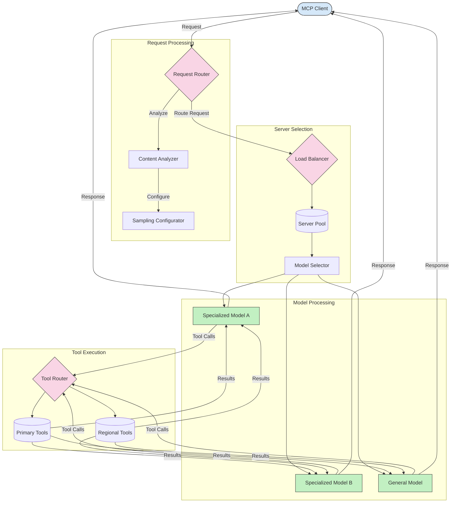

<!--
CO_OP_TRANSLATOR_METADATA:
{
  "original_hash": "af40eab7bd6ebf7e607f982a5506a5b5",
  "translation_date": "2025-06-13T00:58:00+00:00",
  "source_file": "05-AdvancedTopics/mcp-routing/README.md",
  "language_code": "cs"
}
-->
## Vzorkování a směrování v MCP

Vzorkování je klíčovou součástí Model Context Protocol (MCP), která umožňuje efektivní zpracování a směrování požadavků. Zahrnuje analýzu příchozích požadavků za účelem určení nejvhodnějšího modelu nebo služby, která je zpracuje, na základě různých kritérií, jako je typ obsahu, uživatelský kontext a zatížení systému.

Vzorkování a směrování lze kombinovat pro vytvoření robustní architektury, která optimalizuje využití zdrojů a zajišťuje vysokou dostupnost. Proces vzorkování může sloužit k třídění požadavků, zatímco směrování je směruje na příslušné modely nebo služby.

Následující diagram ilustruje, jak vzorkování a směrování spolupracují v komplexní architektuře MCP:

## Co dál

- [5.6 Sampling](../mcp-sampling/README.md)

**Prohlášení o vyloučení odpovědnosti**:  
Tento dokument byl přeložen pomocí AI překladatelské služby [Co-op Translator](https://github.com/Azure/co-op-translator). I když usilujeme o přesnost, mějte prosím na paměti, že automatické překlady mohou obsahovat chyby nebo nepřesnosti. Originální dokument v jeho mateřském jazyce by měl být považován za závazný zdroj. Pro důležité informace se doporučuje profesionální lidský překlad. Nejsme odpovědní za jakékoliv nedorozumění nebo nesprávné výklady vyplývající z použití tohoto překladu.