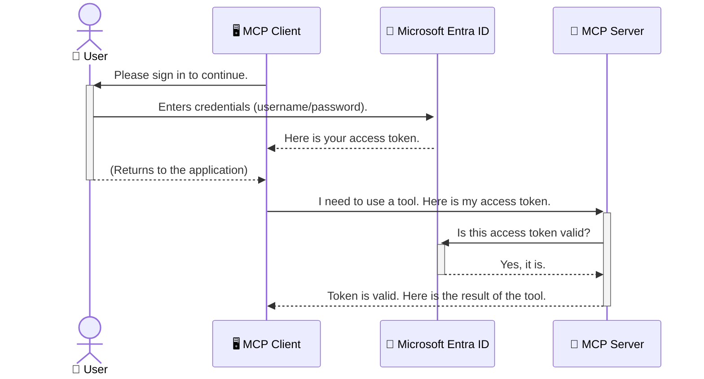

<!--
CO_OP_TRANSLATOR_METADATA:
{
  "original_hash": "9abe1d303ab126f9a8b87f03cebe5213",
  "translation_date": "2025-06-26T14:57:36+00:00",
  "source_file": "05-AdvancedTopics/mcp-security-entra/README.md",
  "language_code": "cs"
}
-->
# Zabezpečení AI pracovních postupů: Autentizace Entra ID pro servery Model Context Protocol

## Úvod
Zabezpečení vašeho serveru Model Context Protocol (MCP) je stejně důležité jako zamknout vchodové dveře svého domu. Nechat server MCP otevřený znamená vystavit vaše nástroje a data neautorizovanému přístupu, což může vést k bezpečnostním incidentům. Microsoft Entra ID nabízí robustní cloudové řešení pro správu identit a přístupů, které zajišťuje, že s vaším MCP serverem mohou komunikovat pouze oprávnění uživatelé a aplikace. V této části se naučíte, jak chránit své AI pracovní postupy pomocí autentizace Entra ID.

## Cíle učení
Po dokončení této části budete schopni:

- Pochopit důležitost zabezpečení serverů MCP.
- Vysvětlit základy Microsoft Entra ID a autentizace OAuth 2.0.
- Rozlišit mezi veřejnými a důvěrnými klienty.
- Implementovat autentizaci Entra ID v lokálních (veřejný klient) i vzdálených (důvěrný klient) scénářích MCP serverů.
- Uplatňovat bezpečnostní osvědčené postupy při vývoji AI pracovních postupů.

# Zabezpečení AI pracovních postupů: Autentizace Entra ID pro servery Model Context Protocol

Stejně jako byste nenechali otevřené dveře svého domu, neměli byste nechat svůj MCP server otevřený komukoli. Zabezpečení vašich AI pracovních postupů je nezbytné pro vytváření spolehlivých, důvěryhodných a bezpečných aplikací. Tato kapitola vás seznámí s použitím Microsoft Entra ID k zabezpečení vašich MCP serverů, aby s vašimi nástroji a daty mohli komunikovat pouze oprávnění uživatelé a aplikace.

## Proč je zabezpečení důležité pro MCP servery

Představte si, že váš MCP server má nástroj, který může odesílat e-maily nebo přistupovat k databázi zákazníků. Nezabezpečený server by znamenal, že kdokoli by mohl tento nástroj využít, což by vedlo k neautorizovanému přístupu k datům, spamu nebo dalším škodlivým aktivitám.

Implementací autentizace zajistíte, že každý požadavek na váš server je ověřen, čímž potvrdíte identitu uživatele nebo aplikace, která požadavek provádí. To je první a nejdůležitější krok k zabezpečení vašich AI pracovních postupů.

## Úvod do Microsoft Entra ID

**Microsoft Entra ID** je cloudová služba pro správu identit a přístupů. Představte si ji jako univerzálního bezpečnostního strážce vašich aplikací. Zajišťuje složitý proces ověřování identity uživatelů (autentizace) a určuje, co smí uživatelé dělat (autorizace).

Použitím Entra ID můžete:

- Umožnit bezpečné přihlášení uživatelů.
- Chrání API a služby.
- Spravovat přístupové politiky z jednoho centrálního místa.

Pro MCP servery Entra ID poskytuje spolehlivé a široce důvěryhodné řešení pro správu toho, kdo může využívat funkce vašeho serveru.

---

## Jak funguje autentizace Entra ID

Entra ID využívá otevřené standardy jako **OAuth 2.0** k řešení autentizace. I když jsou detaily složité, základní princip lze pochopit pomocí přirovnání.

### Jemný úvod do OAuth 2.0: Klíč od parkoviště

Představte si OAuth 2.0 jako službu parkování vašeho auta. Když přijedete do restaurace, nedáte parkovacímu svůj hlavní klíč. Místo toho mu dáte **parkovací klíč**, který má omezená oprávnění – může auto nastartovat a zamknout dveře, ale nemůže otevřít kufr nebo přihrádku.

V tomto přirovnání:

- **Vy** jste **uživatel**.
- **Vaše auto** je **MCP server** s cennými nástroji a daty.
- **Parkovací služba** je **Microsoft Entra ID**.
- **Parkovací asistent** je **MCP klient** (aplikace, která se snaží přistoupit na server).
- **Parkovací klíč** je **Access Token**.

Access token je bezpečný textový řetězec, který MCP klient získá od Entra ID po přihlášení uživatele. Klient pak předkládá tento token serveru MCP u každého požadavku. Server může token ověřit, aby potvrdil, že je požadavek legitimní a že klient má potřebná oprávnění, aniž by musel pracovat s vašimi skutečnými přihlašovacími údaji (například heslem).

### Průběh autentizace

Proces v praxi probíhá následovně:



### Představení Microsoft Authentication Library (MSAL)

Než se pustíme do kódu, je důležité představit klíčovou součást, kterou uvidíte v příkladech: **Microsoft Authentication Library (MSAL)**.

MSAL je knihovna vyvinutá Microsoftem, která vývojářům výrazně usnadňuje práci s autentizací. Místo toho, abyste museli psát složitý kód pro správu bezpečnostních tokenů, přihlašování a obnovování relací, MSAL toto vše zvládá za vás.

Použití knihovny jako MSAL je vysoce doporučeno, protože:

- **Je bezpečná:** Implementuje průmyslové standardy a osvědčené bezpečnostní postupy, čímž snižuje riziko zranitelností ve vašem kódu.
- **Zjednodušuje vývoj:** Abstrahuje složitost protokolů OAuth 2.0 a OpenID Connect, takže můžete přidat robustní autentizaci do aplikace jen s několika řádky kódu.
- **Je udržovaná:** Microsoft ji aktivně aktualizuje, aby reagovala na nové bezpečnostní hrozby a změny platforem.

MSAL podporuje širokou škálu jazyků a aplikačních rámců, včetně .NET, JavaScript/TypeScript, Python, Java, Go a mobilních platforem jako iOS a Android. To znamená, že můžete používat stejné ověřené vzory autentizace napříč celým technologickým stackem.

Více informací o MSAL najdete v oficiální [dokumentaci přehledu MSAL](https://learn.microsoft.com/entra/identity-platform/msal-overview).

---

## Zabezpečení vašeho MCP serveru pomocí Entra ID: krok za krokem

Nyní si ukážeme, jak zabezpečit lokální MCP server (ten, který komunikuje přes `stdio`) using Entra ID. This example uses a **public client**, which is suitable for applications running on a user's machine, like a desktop app or a local development server.

### Scenario 1: Securing a Local MCP Server (with a Public Client)

In this scenario, we'll look at an MCP server that runs locally, communicates over `stdio`, and uses Entra ID to authenticate the user before allowing access to its tools. The server will have a single tool that fetches the user's profile information from the Microsoft Graph API.

#### 1. Setting Up the Application in Entra ID

Before writing any code, you need to register your application in Microsoft Entra ID. This tells Entra ID about your application and grants it permission to use the authentication service.

1. Navigate to the **[Microsoft Entra portal](https://entra.microsoft.com/)**.
2. Go to **App registrations** and click **New registration**.
3. Give your application a name (e.g., "My Local MCP Server").
4. For **Supported account types**, select **Accounts in this organizational directory only**.
5. You can leave the **Redirect URI** blank for this example.
6. Click **Register**.

Once registered, take note of the **Application (client) ID** and **Directory (tenant) ID**. You'll need these in your code.

#### 2. The Code: A Breakdown

Let's look at the key parts of the code that handle authentication. The full code for this example is available in the [Entra ID - Local - WAM](https://github.com/Azure-Samples/mcp-auth-servers/tree/main/src/entra-id-local-wam) folder of the [mcp-auth-servers GitHub repository](https://github.com/Azure-Samples/mcp-auth-servers).

**`AuthenticationService.cs`**

This class is responsible for handling the interaction with Entra ID.

- **`CreateAsync`**: This method initializes the `PublicClientApplication` from the MSAL (Microsoft Authentication Library). It's configured with your application's `clientId` and `tenantId`.
- **`WithBroker`**: This enables the use of a broker (like the Windows Web Account Manager), which provides a more secure and seamless single sign-on experience.
- **`AcquireTokenAsync`**: Toto je hlavní metoda. Nejprve se pokouší získat token potichu (uživatel se nemusí znovu přihlašovat, pokud má platnou relaci). Pokud tichý token nelze získat, vyzve uživatele k interaktivnímu přihlášení.

```csharp
// Simplified for clarity
public static async Task<AuthenticationService> CreateAsync(ILogger<AuthenticationService> logger)
{
    var msalClient = PublicClientApplicationBuilder
        .Create(_clientId) // Your Application (client) ID
        .WithAuthority(AadAuthorityAudience.AzureAdMyOrg)
        .WithTenantId(_tenantId) // Your Directory (tenant) ID
        .WithBroker(new BrokerOptions(BrokerOptions.OperatingSystems.Windows))
        .Build();

    // ... cache registration ...

    return new AuthenticationService(logger, msalClient);
}

public async Task<string> AcquireTokenAsync()
{
    try
    {
        // Try silent authentication first
        var accounts = await _msalClient.GetAccountsAsync();
        var account = accounts.FirstOrDefault();

        AuthenticationResult? result = null;

        if (account != null)
        {
            result = await _msalClient.AcquireTokenSilent(_scopes, account).ExecuteAsync();
        }
        else
        {
            // If no account, or silent fails, go interactive
            result = await _msalClient.AcquireTokenInteractive(_scopes).ExecuteAsync();
        }

        return result.AccessToken;
    }
    catch (Exception ex)
    {
        _logger.LogError(ex, "An error occurred while acquiring the token.");
        throw; // Optionally rethrow the exception for higher-level handling
    }
}
```

**`Program.cs`**

This is where the MCP server is set up and the authentication service is integrated.

- **`AddSingleton<AuthenticationService>`**: This registers the `AuthenticationService` with the dependency injection container, so it can be used by other parts of the application (like our tool).
- **`GetUserDetailsFromGraph` tool**: This tool requires an instance of `AuthenticationService`. Before it does anything, it calls `authService.AcquireTokenAsync()` pro získání platného access tokenu. Pokud je autentizace úspěšná, token se použije k volání Microsoft Graph API a načtení uživatelských údajů.

```csharp
// Simplified for clarity
[McpServerTool(Name = "GetUserDetailsFromGraph")]
public static async Task<string> GetUserDetailsFromGraph(
    AuthenticationService authService)
{
    try
    {
        // This will trigger the authentication flow
        var accessToken = await authService.AcquireTokenAsync();

        // Use the token to create a GraphServiceClient
        var graphClient = new GraphServiceClient(
            new BaseBearerTokenAuthenticationProvider(new TokenProvider(authService)));

        var user = await graphClient.Me.GetAsync();

        return System.Text.Json.JsonSerializer.Serialize(user);
    }
    catch (Exception ex)
    {
        return $"Error: {ex.Message}";
    }
}
```

#### 3. Jak to vše funguje dohromady

1. Když MCP klient zavolá `GetUserDetailsFromGraph` tool, the tool first calls `AcquireTokenAsync`.
2. `AcquireTokenAsync` triggers the MSAL library to check for a valid token.
3. If no token is found, MSAL, through the broker, will prompt the user to sign in with their Entra ID account.
4. Once the user signs in, Entra ID issues an access token.
5. The tool receives the token and uses it to make a secure call to the Microsoft Graph API.
6. The user's details are returned to the MCP client.

This process ensures that only authenticated users can use the tool, effectively securing your local MCP server.

### Scenario 2: Securing a Remote MCP Server (with a Confidential Client)

When your MCP server is running on a remote machine (like a cloud server) and communicates over a protocol like HTTP Streaming, the security requirements are different. In this case, you should use a **confidential client** and the **Authorization Code Flow**. This is a more secure method because the application's secrets are never exposed to the browser.

This example uses a TypeScript-based MCP server that uses Express.js to handle HTTP requests.

#### 1. Setting Up the Application in Entra ID

The setup in Entra ID is similar to the public client, but with one key difference: you need to create a **client secret**.

1. Navigate to the **[Microsoft Entra portal](https://entra.microsoft.com/)**.
2. In your app registration, go to the **Certificates & secrets** tab.
3. Click **New client secret**, give it a description, and click **Add**.
4. **Important:** Copy the secret value immediately. You will not be able to see it again.
5. You also need to configure a **Redirect URI**. Go to the **Authentication** tab, click **Add a platform**, select **Web**, and enter the redirect URI for your application (e.g., `http://localhost:3001/auth/callback`).

> **⚠️ Important Security Note:** For production applications, Microsoft strongly recommends using **secretless authentication** methods such as **Managed Identity** or **Workload Identity Federation** instead of client secrets. Client secrets pose security risks as they can be exposed or compromised. Managed identities provide a more secure approach by eliminating the need to store credentials in your code or configuration.
>
> For more information about managed identities and how to implement them, see the [Managed identities for Azure resources overview](https://learn.microsoft.com/entra/identity/managed-identities-azure-resources/overview).

#### 2. The Code: A Breakdown

This example uses a session-based approach. When the user authenticates, the server stores the access token and refresh token in a session and gives the user a session token. This session token is then used for subsequent requests. The full code for this example is available in the [Entra ID - Confidential client](https://github.com/Azure-Samples/mcp-auth-servers/tree/main/src/entra-id-cca-session) folder of the [mcp-auth-servers GitHub repository](https://github.com/Azure-Samples/mcp-auth-servers).

**`Server.ts`**

This file sets up the Express server and the MCP transport layer.

- **`requireBearerAuth`**: This is middleware that protects the `/sse` and `/message` endpoints. It checks for a valid bearer token in the `Authorization` header of the request.
- **`EntraIdServerAuthProvider`**: This is a custom class that implements the `McpServerAuthorizationProvider` interface. It's responsible for handling the OAuth 2.0 flow.
- **`/auth/callback`**: Tento endpoint zpracovává přesměrování z Entra ID po úspěšném přihlášení uživatele. Vymění autorizační kód za access token a refresh token.

```typescript
// Simplified for clarity
const app = express();
const { server } = createServer();
const provider = new EntraIdServerAuthProvider();

// Protect the SSE endpoint
app.get("/sse", requireBearerAuth({
  provider,
  requiredScopes: ["User.Read"]
}), async (req, res) => {
  // ... connect to the transport ...
});

// Protect the message endpoint
app.post("/message", requireBearerAuth({
  provider,
  requiredScopes: ["User.Read"]
}), async (req, res) => {
  // ... handle the message ...
});

// Handle the OAuth 2.0 callback
app.get("/auth/callback", (req, res) => {
  provider.handleCallback(req.query.code, req.query.state)
    .then(result => {
      // ... handle success or failure ...
    });
});
```

**`Tools.ts`**

This file defines the tools that the MCP server provides. The `getUserDetails` nástroj je podobný tomu v předchozím příkladu, ale získává access token ze session.

```typescript
// Simplified for clarity
server.setRequestHandler(CallToolRequestSchema, async (request) => {
  const { name } = request.params;
  const context = request.params?.context as { token?: string } | undefined;
  const sessionToken = context?.token;

  if (name === ToolName.GET_USER_DETAILS) {
    if (!sessionToken) {
      throw new AuthenticationError("Authentication token is missing or invalid. Ensure the token is provided in the request context.");
    }

    // Get the Entra ID token from the session store
    const tokenData = tokenStore.getToken(sessionToken);
    const entraIdToken = tokenData.accessToken;

    const graphClient = Client.init({
      authProvider: (done) => {
        done(null, entraIdToken);
      }
    });

    const user = await graphClient.api('/me').get();

    // ... return user details ...
  }
});
```

**`auth/EntraIdServerAuthProvider.ts`**

This class handles the logic for:

- Redirecting the user to the Entra ID sign-in page.
- Exchanging the authorization code for an access token.
- Storing the tokens in the `tokenStore`.
- Refreshing the access token when it expires.

#### 3. How It All Works Together

1. When a user first tries to connect to the MCP server, the `requireBearerAuth` middleware will see that they don't have a valid session and will redirect them to the Entra ID sign-in page.
2. The user signs in with their Entra ID account.
3. Entra ID redirects the user back to the `/auth/callback` endpoint with an authorization code.
4. The server exchanges the code for an access token and a refresh token, stores them, and creates a session token which is sent to the client.
5. The client can now use this session token in the `Authorization` header for all future requests to the MCP server.
6. When the `getUserDetails` nástroj je volán, používá token ze session k vyhledání Entra ID access tokenu a ten pak použije k volání Microsoft Graph API.

Tento tok je složitější než u veřejného klienta, ale je nutný pro internetově přístupné endpointy. Vzhledem k tomu, že vzdálené MCP servery jsou přístupné přes veřejný internet, vyžadují silnější bezpečnostní opatření, aby se zabránilo neautorizovanému přístupu a potenciálním útokům.

## Bezpečnostní osvědčené postupy

- **Vždy používejte HTTPS**: Šifrujte komunikaci mezi klientem a serverem, aby se tokeny nemohly zachytit.
- **Implementujte řízení přístupu na základě rolí (RBAC)**: Nezkoumejte jen *zda* je uživatel autentizován, ale i *co* smí dělat. V Entra ID můžete definovat role a kontrolovat je na MCP serveru.
- **Monitorujte a auditujte**: Logujte všechny autentizační události, abyste mohli odhalit a reagovat na podezřelou aktivitu.
- **Řešte omezení počtu požadavků a zpomalování**: Microsoft Graph a další API mají omezení počtu požadavků, aby zabránily zneužití. Implementujte exponenciální zpětný odskok a opakování v MCP serveru pro hladké zpracování HTTP 429 (Příliš mnoho požadavků). Zvažte ukládání často používaných dat do cache ke snížení počtu volání API.
- **Bezpečné ukládání tokenů**: Access tokeny a refresh tokeny ukládejte bezpečně. Pro lokální aplikace používejte bezpečnostní mechanismy operačního systému. Pro serverové aplikace zvažte šifrované úložiště nebo služby správy klíčů jako Azure Key Vault.
- **Řízení vypršení platnosti tokenů**: Access tokeny mají omezenou platnost. Implementujte automatické obnovení tokenů pomocí refresh tokenů, aby uživatelé nemuseli znovu procházet přihlášením.
- **Zvažte použití Azure API Management**: I když přímá implementace zabezpečení na MCP serveru poskytuje detailní kontrolu, API Gateway jako Azure API Management mohou automaticky řešit mnoho bezpečnostních aspektů, včetně autentizace, autorizace, omezení počtu požadavků a monitoringu. Poskytují centralizovanou bezpečnostní vrstvu mezi klienty a MCP servery. Více o použití API Gateway s MCP najdete v našem [Azure API Management Your Auth Gateway For MCP Servers](https://techcommunity.microsoft.com/blog/integrationsonazureblog/azure-api-management-your-auth-gateway-for-mcp-servers/4402690).

## Klíčové body k zapamatování

- Zabezpečení MCP serveru je zásadní pro ochranu vašich dat a nástrojů.
- Microsoft Entra ID nabízí robustní a škálovatelné řešení pro autentizaci a autorizaci.
- Pro lokální aplikace použijte **veřejného klienta**, pro vzdálené servery **důvěrného klienta**.
- **Authorization Code Flow** je nejbezpečnější volba pro webové aplikace.

## Cvičení

1. Zamyslete se nad MCP serverem, který byste mohli vytvořit. Byl by to lokální server nebo vzdálený server?
2. Na základě odpovědi, použili byste veřejného nebo důvěrného klienta?
3. Jaká oprávnění by váš MCP server požadoval pro provádění akcí vůči Microsoft Graph?

## Praktická cvičení

### Cvičení 1: Registrace aplikace v Entra ID
Přejděte do portálu Microsoft Entra.  
Zaregistrujte novou aplikaci pro váš MCP server.  
Poznamenejte si Application (client) ID a Directory (tenant) ID.

### Cvičení 2: Zabezpečení lokálního MCP serveru (veřejný klient)
Postupujte podle příkladu kódu pro integraci MSAL (Microsoft Authentication Library) pro autentizaci uživatelů.  
Otestujte autentizační tok voláním nástroje MCP, který načítá uživatelské údaje z Microsoft Graph.

### Cvičení 3: Zabezpečení vzdáleného MCP serveru (důvěrný klient)
Zaregistrujte důvěrného klienta v Entra ID a vytvořte klientský tajný klíč.  
Nakonfigurujte svůj Express.js MCP server pro použití Authorization Code Flow.  
Otestujte chráněné endpointy a ověřte přístup na základě tokenu.

### Cvičení 4: Uplatnění bezpečnostních osvědčených postupů
Povolte HTTPS pro váš lokální nebo vzdálený server.  
Implementujte řízení přístupu na základě rolí (RBAC) v logice serveru.  
Přidejte správu vypršení platnosti tokenů a bezpečné ukládání tokenů.

## Zdroje

1. **MSAL Přehledová dokumentace**  
   Naučte se, jak Microsoft Authentication Library (MSAL) umožňuje bezpečné získávání tokenů napříč platformami:  
   [MSAL Overview on Microsoft Learn](https://learn.microsoft.com/en-gb/entra/msal/overview)

2. **Azure-Samples/mcp-auth-servers GitHub repozitář**  
   Referenční implementace MCP serverů ukazující autentizační toky:  
   [Azure-Samples/mcp-auth-servers on GitHub](https://github.com/Azure-Samples/mcp-auth-servers)

3. **Přehled Managed Identities pro Azure Resources**  
   Pochopte, jak eliminovat tajné klíče použitím systémových nebo uživatelsky přiřazených spravovaných identit:  
   [Managed Identities Overview on Microsoft Learn](https://learn.microsoft.com/en-us/entra/identity/managed-identities-azure-resources/)

4. **Azure API Management: Vaše autentizační brána pro MCP servery**  
   Podrobný pohled na použití APIM jako bezpečné OAuth2 brány pro MCP servery:  
   [Azure API Management Your Auth Gateway For MCP Servers](https://techcommunity.microsoft.com/blog/integrationsonazureblog/azure-api-management-your-auth-gateway-for-mcp-servers/4402690)

5. **Reference oprávnění Microsoft Graph**  
   Kompletní seznam delegovaných a aplikačních oprávnění pro Microsoft Graph:  
   [Microsoft Graph Permissions Reference](https://learn.microsoft.com/zh-tw/graph/permissions-reference)

## Výsledky učení
Po dokončení této části budete schopni:

- Vysvětlit, proč je autentizace klíčová pro MCP servery a AI pracovní postupy.
- Nastavit a konfigurovat autentizaci Entra ID pro lokální i vzdálené MCP servery.
- Vybrat správný typ klienta (veřejný nebo důvěrný) podle nasazení serveru.
- Implementovat bezpečné programovací praktiky včetně ukládání tokenů a řízení přístupu na základě rolí.
- S jistotou chránit svůj MCP server a jeho nástroje před neautorizovaným přístupem.

## Co dál

- [6. Příspěvky komunity](../../06-CommunityContributions/README.md)

**Prohlášení o vyloučení odpovědnosti**:  
Tento dokument byl přeložen pomocí AI překladatelské služby [Co-op Translator](https://github.com/Azure/co-op-translator). I když usilujeme o přesnost, mějte prosím na paměti, že automatizované překlady mohou obsahovat chyby nebo nepřesnosti. Původní dokument v jeho mateřském jazyce by měl být považován za závazný zdroj. Pro kritické informace se doporučuje profesionální lidský překlad. Nejsme odpovědní za jakékoliv nedorozumění nebo nesprávné výklady vyplývající z použití tohoto překladu.