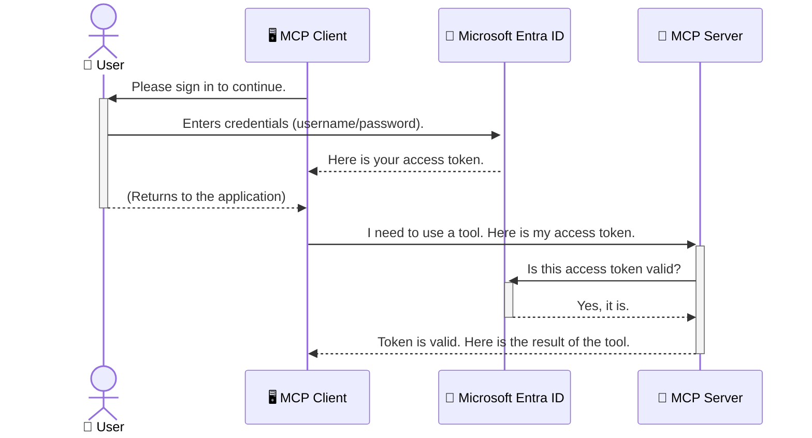

<!--
CO_OP_TRANSLATOR_METADATA:
{
  "original_hash": "6e562d7e5a77c8982da4aa8f762ad1d8",
  "translation_date": "2025-07-14T03:14:34+00:00",
  "source_file": "05-AdvancedTopics/mcp-security-entra/README.md",
  "language_code": "cs"
}
-->
# Zabezpečení AI pracovních postupů: Autentizace Entra ID pro servery Model Context Protocol

## Úvod
Zabezpečení vašeho serveru Model Context Protocol (MCP) je stejně důležité jako zamknout hlavní dveře vašeho domu. Nechat váš MCP server otevřený znamená vystavit vaše nástroje a data neoprávněnému přístupu, což může vést k bezpečnostním incidentům. Microsoft Entra ID nabízí robustní cloudové řešení pro správu identity a přístupu, které pomáhá zajistit, že s vaším MCP serverem mohou komunikovat pouze oprávnění uživatelé a aplikace. V této části se naučíte, jak chránit své AI pracovní postupy pomocí autentizace Entra ID.

## Cíle učení
Na konci této části budete schopni:

- Pochopit důležitost zabezpečení MCP serverů.
- Vysvětlit základy Microsoft Entra ID a autentizace OAuth 2.0.
- Rozlišit mezi veřejnými a důvěrnými klienty.
- Implementovat autentizaci Entra ID v lokálních (veřejný klient) i vzdálených (důvěrný klient) scénářích MCP serveru.
- Aplikovat osvědčené bezpečnostní postupy při vývoji AI pracovních postupů.

## Bezpečnost a MCP

Stejně jako byste nenechali hlavní dveře svého domu odemčené, neměli byste nechat svůj MCP server otevřený pro kohokoli. Zabezpečení vašich AI pracovních postupů je klíčové pro vytváření spolehlivých, důvěryhodných a bezpečných aplikací. Tato kapitola vás seznámí s použitím Microsoft Entra ID k zabezpečení vašich MCP serverů, aby s vašimi nástroji a daty mohli pracovat pouze oprávnění uživatelé a aplikace.

## Proč je bezpečnost důležitá pro MCP servery

Představte si, že váš MCP server má nástroj, který může odesílat e-maily nebo přistupovat k databázi zákazníků. Nezabezpečený server by znamenal, že kdokoli by mohl tento nástroj použít, což by mohlo vést k neoprávněnému přístupu k datům, spamu nebo jiným škodlivým aktivitám.

Implementací autentizace zajistíte, že každý požadavek na váš server je ověřen a potvrzuje identitu uživatele nebo aplikace, která požadavek odesílá. To je první a nejdůležitější krok k zabezpečení vašich AI pracovních postupů.

## Úvod do Microsoft Entra ID

[**Microsoft Entra ID**](https://adoption.microsoft.com/microsoft-security/entra/) je cloudová služba pro správu identity a přístupu. Můžete si ji představit jako univerzálního bezpečnostního strážce pro vaše aplikace. Zajišťuje složitý proces ověřování uživatelů (autentizace) a rozhodování o tom, co smí dělat (autorizace).

Používáním Entra ID můžete:

- Umožnit bezpečné přihlašování uživatelů.
- Chránit API a služby.
- Spravovat přístupové politiky z jednoho centrálního místa.

Pro MCP servery poskytuje Entra ID spolehlivé a široce důvěryhodné řešení pro správu toho, kdo může využívat schopnosti vašeho serveru.

---

## Jak funguje autentizace Entra ID

Entra ID používá otevřené standardy jako **OAuth 2.0** pro zpracování autentizace. I když jsou detaily složité, základní princip je jednoduchý a lze ho vysvětlit pomocí přirovnání.

### Jemný úvod do OAuth 2.0: Klíč pro parkoviště

Představte si OAuth 2.0 jako službu parkování vašeho auta. Když přijedete do restaurace, nedáte parkovacímu svůj hlavní klíč od auta. Místo toho mu předáte **klíč pro parkoviště**, který má omezená oprávnění – může nastartovat auto a zamknout dveře, ale nemůže otevřít kufr nebo přihrádku.

V tomto přirovnání:

- **Vy** jste **Uživatel**.
- **Vaše auto** je **MCP server** s jeho cennými nástroji a daty.
- **Parkovací služba** je **Microsoft Entra ID**.
- **Parkovací asistent** je **MCP klient** (aplikace, která se snaží přistoupit na server).
- **Klíč pro parkoviště** je **Access Token**.

Access token je bezpečný textový řetězec, který MCP klient obdrží od Entra ID po vašem přihlášení. Klient pak tento token předkládá MCP serveru při každém požadavku. Server může token ověřit, aby zajistil, že požadavek je legitimní a že klient má potřebná oprávnění, aniž by musel pracovat s vašimi skutečnými přihlašovacími údaji (například heslem).

### Průběh autentizace

Takto proces funguje v praxi:



### Představení Microsoft Authentication Library (MSAL)

Než se pustíme do kódu, je důležité představit klíčovou součást, kterou uvidíte v příkladech: **Microsoft Authentication Library (MSAL)**.

MSAL je knihovna vyvinutá Microsoftem, která vývojářům výrazně usnadňuje práci s autentizací. Místo toho, abyste museli psát složitý kód pro správu bezpečnostních tokenů, přihlašování a obnovování relací, MSAL se o to postará za vás.

Použití knihovny jako MSAL je velmi doporučováno, protože:

- **Je bezpečná:** Implementuje průmyslové standardy a osvědčené bezpečnostní postupy, čímž snižuje riziko zranitelností ve vašem kódu.
- **Zjednodušuje vývoj:** Abstrahuje složitost protokolů OAuth 2.0 a OpenID Connect, takže můžete do své aplikace přidat robustní autentizaci jen několika řádky kódu.
- **Je udržovaná:** Microsoft ji aktivně aktualizuje, aby řešila nové bezpečnostní hrozby a změny platforem.

MSAL podporuje širokou škálu jazyků a aplikačních rámců, včetně .NET, JavaScript/TypeScript, Python, Java, Go a mobilních platforem jako iOS a Android. To znamená, že můžete používat konzistentní autentizační vzory napříč celým technologickým stackem.

Více o MSAL se dozvíte v oficiální [dokumentaci přehledu MSAL](https://learn.microsoft.com/entra/identity-platform/msal-overview).

---

## Zabezpečení vašeho MCP serveru pomocí Entra ID: krok za krokem

Nyní si projdeme, jak zabezpečit lokální MCP server (komunikující přes `stdio`) pomocí Entra ID. Tento příklad používá **veřejného klienta**, což je vhodné pro aplikace běžící na uživatelově zařízení, například desktopovou aplikaci nebo lokální vývojový server.

### Scénář 1: Zabezpečení lokálního MCP serveru (s veřejným klientem)

V tomto scénáři se podíváme na MCP server, který běží lokálně, komunikuje přes `stdio` a používá Entra ID k autentizaci uživatele před povolením přístupu k jeho nástrojům. Server bude mít jeden nástroj, který získává informace o uživatelském profilu z Microsoft Graph API.

#### 1. Nastavení aplikace v Entra ID

Než začnete psát kód, musíte zaregistrovat svou aplikaci v Microsoft Entra ID. Tím Entra ID sdělíte informace o vaší aplikaci a udělíte jí oprávnění používat autentizační službu.

1. Přejděte do **[Microsoft Entra portálu](https://entra.microsoft.com/)**.
2. V sekci **App registrations** klikněte na **New registration**.
3. Pojmenujte svou aplikaci (např. „My Local MCP Server“).
4. U **Supported account types** vyberte **Accounts in this organizational directory only**.
5. Pole **Redirect URI** můžete pro tento příklad nechat prázdné.
6. Klikněte na **Register**.

Po registraci si poznamenejte **Application (client) ID** a **Directory (tenant) ID**. Budete je potřebovat v kódu.

#### 2. Kód: rozbor

Podívejme se na klíčové části kódu, které zajišťují autentizaci. Kompletní kód tohoto příkladu najdete ve složce [Entra ID - Local - WAM](https://github.com/Azure-Samples/mcp-auth-servers/tree/main/src/entra-id-local-wam) v repozitáři [mcp-auth-servers GitHub](https://github.com/Azure-Samples/mcp-auth-servers).

**`AuthenticationService.cs`**

Tato třída zajišťuje komunikaci s Entra ID.

- **`CreateAsync`**: Inicializuje `PublicClientApplication` z MSAL. Je nakonfigurována s `clientId` a `tenantId` vaší aplikace.
- **`WithBroker`**: Umožňuje použití brokera (například Windows Web Account Manager), který poskytuje bezpečnější a plynulejší přihlašování jedním kliknutím.
- **`AcquireTokenAsync`**: Hlavní metoda. Nejprve se pokusí získat token potichu (pokud uživatel má platnou relaci, nebude se muset znovu přihlašovat). Pokud to není možné, vyzve uživatele k interaktivnímu přihlášení.

```csharp
// Simplified for clarity
public static async Task<AuthenticationService> CreateAsync(ILogger<AuthenticationService> logger)
{
    var msalClient = PublicClientApplicationBuilder
        .Create(_clientId) // Your Application (client) ID
        .WithAuthority(AadAuthorityAudience.AzureAdMyOrg)
        .WithTenantId(_tenantId) // Your Directory (tenant) ID
        .WithBroker(new BrokerOptions(BrokerOptions.OperatingSystems.Windows))
        .Build();

    // ... cache registration ...

    return new AuthenticationService(logger, msalClient);
}

public async Task<string> AcquireTokenAsync()
{
    try
    {
        // Try silent authentication first
        var accounts = await _msalClient.GetAccountsAsync();
        var account = accounts.FirstOrDefault();

        AuthenticationResult? result = null;

        if (account != null)
        {
            result = await _msalClient.AcquireTokenSilent(_scopes, account).ExecuteAsync();
        }
        else
        {
            // If no account, or silent fails, go interactive
            result = await _msalClient.AcquireTokenInteractive(_scopes).ExecuteAsync();
        }

        return result.AccessToken;
    }
    catch (Exception ex)
    {
        _logger.LogError(ex, "An error occurred while acquiring the token.");
        throw; // Optionally rethrow the exception for higher-level handling
    }
}
```

**`Program.cs`**

Zde je nastaven MCP server a integrována autentizační služba.

- **`AddSingleton<AuthenticationService>`**: Registruje `AuthenticationService` v kontejneru závislostí, aby ji mohly používat další části aplikace (například náš nástroj).
- **Nástroj `GetUserDetailsFromGraph`**: Tento nástroj vyžaduje instanci `AuthenticationService`. Než začne pracovat, zavolá `authService.AcquireTokenAsync()`, aby získal platný access token. Pokud je autentizace úspěšná, použije token k volání Microsoft Graph API a získání uživatelských údajů.

```csharp
// Simplified for clarity
[McpServerTool(Name = "GetUserDetailsFromGraph")]
public static async Task<string> GetUserDetailsFromGraph(
    AuthenticationService authService)
{
    try
    {
        // This will trigger the authentication flow
        var accessToken = await authService.AcquireTokenAsync();

        // Use the token to create a GraphServiceClient
        var graphClient = new GraphServiceClient(
            new BaseBearerTokenAuthenticationProvider(new TokenProvider(authService)));

        var user = await graphClient.Me.GetAsync();

        return System.Text.Json.JsonSerializer.Serialize(user);
    }
    catch (Exception ex)
    {
        return $"Error: {ex.Message}";
    }
}
```

#### 3. Jak to celé funguje dohromady

1. Když MCP klient chce použít nástroj `GetUserDetailsFromGraph`, nástroj nejprve zavolá `AcquireTokenAsync`.
2. `AcquireTokenAsync` spustí knihovnu MSAL, která zkontroluje platný token.
3. Pokud token není k dispozici, MSAL přes brokera vyzve uživatele k přihlášení pomocí účtu Entra ID.
4. Po přihlášení Entra ID vydá access token.
5. Nástroj token obdrží a použije ho k bezpečnému volání Microsoft Graph API.
6. Uživatelské údaje jsou vráceny MCP klientovi.

Tento proces zajistí, že nástroj může používat pouze autentizovaný uživatel, čímž efektivně zabezpečuje váš lokální MCP server.

### Scénář 2: Zabezpečení vzdáleného MCP serveru (s důvěrným klientem)

Pokud váš MCP server běží na vzdáleném stroji (například v cloudu) a komunikuje přes protokol jako HTTP Streaming, bezpečnostní požadavky jsou jiné. V tomto případě byste měli použít **důvěrného klienta** a **Authorization Code Flow**. Tento způsob je bezpečnější, protože tajemství aplikace nejsou nikdy vystavena v prohlížeči.

Tento příklad používá MCP server založený na TypeScriptu, který využívá Express.js pro zpracování HTTP požadavků.

#### 1. Nastavení aplikace v Entra ID

Nastavení v Entra ID je podobné jako u veřejného klienta, ale s jedním klíčovým rozdílem: musíte vytvořit **client secret**.

1. Přejděte do **[Microsoft Entra portálu](https://entra.microsoft.com/)**.
2. Ve vaší registraci aplikace přejděte na záložku **Certificates & secrets**.
3. Klikněte na **New client secret**, zadejte popis a klikněte na **Add**.
4. **Důležité:** Okamžitě si zkopírujte hodnotu tajemství. Už ji znovu neuvidíte.
5. Také musíte nastavit **Redirect URI**. Přejděte na záložku **Authentication**, klikněte na **Add a platform**, vyberte **Web** a zadejte redirect URI vaší aplikace (např. `http://localhost:3001/auth/callback`).

> **⚠️ Důležitá bezpečnostní poznámka:** Pro produkční aplikace Microsoft důrazně doporučuje používat **autentizaci bez tajemství** jako **Managed Identity** nebo **Workload Identity Federation** místo client secretů. Client secret představují bezpečnostní riziko, protože mohou být odhaleny nebo kompromitovány. Managed identity poskytují bezpečnější přístup tím, že eliminuje potřebu ukládat přihlašovací údaje v kódu nebo konfiguraci.
>
> Více informací o managed identities a jejich implementaci najdete v přehledu [Managed identities for Azure resources](https://learn.microsoft.com/entra/identity/managed-identities-azure-resources/overview).

#### 2. Kód: rozbor

Tento příklad používá přístup založený na relacích (session). Když se uživatel autentizuje, server uloží access token a refresh token do relace a uživateli předá token relace. Tento token se pak používá pro následné požadavky. Kompletní kód tohoto příkladu najdete ve složce [Entra ID - Confidential client](https://github.com/Azure-Samples/mcp-auth-servers/tree/main/src/entra-id-cca-session) v repozitáři [mcp-auth-servers GitHub](https://github.com/Azure-Samples/mcp-auth-servers).

**`Server.ts`**

Tento soubor nastavuje Express server a transportní vrstvu MCP.

- **`requireBearerAuth`**: Middleware, který chrání endpointy `/sse` a `/message`. Kontroluje platný bearer token v hlavičce `Authorization` požadavku.
- **`EntraIdServerAuthProvider`**: Vlastní třída implementující rozhraní `McpServerAuthorizationProvider`. Zajišťuje správu OAuth 2.0 toku.
- **`/auth/callback`**: Tento endpoint zpracovává přesměrování z Entra ID po autentizaci uživatele. Vymění autorizační kód za access token a refresh token.

```typescript
// Simplified for clarity
const app = express();
const { server } = createServer();
const provider = new EntraIdServerAuthProvider();

// Protect the SSE endpoint
app.get("/sse", requireBearerAuth({
  provider,
  requiredScopes: ["User.Read"]
}), async (req, res) => {
  // ... connect to the transport ...
});

// Protect the message endpoint
app.post("/message", requireBearerAuth({
  provider,
  requiredScopes: ["User.Read"]
}), async (req, res) => {
  // ... handle the message ...
});

// Handle the OAuth 2.0 callback
app.get("/auth/callback", (req, res) => {
  provider.handleCallback(req.query.code, req.query.state)
    .then(result => {
      // ... handle success or failure ...
    });
});
```

**`Tools.ts`**

Tento soubor definuje nástroje, které MCP server poskytuje. Nástroj `getUserDetails` je podobný jako v předchozím příkladu, ale získává access token z relace.

```typescript
// Simplified for clarity
server.setRequestHandler(CallToolRequestSchema, async (request) => {
  const { name } = request.params;
  const context = request.params?.context as { token?: string } | undefined;
  const sessionToken = context?.token;

  if (name === ToolName.GET_USER_DETAILS) {
    if (!sessionToken) {
      throw new AuthenticationError("Authentication token is missing or invalid. Ensure the token is provided in the request context.");
    }

    // Get the Entra ID token from the session store
    const tokenData = tokenStore.getToken(sessionToken);
    const entraIdToken = tokenData.accessToken;

    const graphClient = Client.init({
      authProvider: (done) => {
        done(null, entraIdToken);
      }
    });

    const user = await graphClient.api('/me').get();

    // ... return user details ...
  }
});
```

**`auth/EntraIdServerAuthProvider.ts`**

Tato třída zajišťuje:

- Přesměrování uživatele na přihlašovací stránku Entra ID.
- Výměnu autorizačního kódu za access token.
- Ukládání tokenů do `tokenStore`.
- Obnovování access tokenu po jeho vypršení.

#### 3. Jak to celé funguje dohromady

1. Když se uživatel poprvé pokusí připojit k MCP serveru, middleware `requireBearerAuth` zjistí, že nemá platnou relaci, a přesměruje ho na přihlašovací stránku Entra ID.
2. Uživatel se přihlásí pomocí svého účtu Entra ID.
3. Entra ID přesměruje uživatele zpět na endpoint `/auth/callback` s autorizačním kódem.
4. Server vymění kód za access token a refresh token, uloží je a vytvoří session token, který je odeslán klientovi.  
5. Klient nyní může používat tento session token v hlavičce `Authorization` pro všechny budoucí požadavky na MCP server.  
6. Když je zavolán nástroj `getUserDetails`, použije session token k vyhledání Entra ID access tokenu a ten pak použije pro volání Microsoft Graph API.

Tento tok je složitější než tok pro veřejné klienty, ale je nezbytný pro internetově přístupné koncové body. Vzhledem k tomu, že vzdálené MCP servery jsou přístupné přes veřejný internet, vyžadují silnější bezpečnostní opatření k ochraně proti neoprávněnému přístupu a možným útokům.


## Nejlepší bezpečnostní postupy

- **Vždy používejte HTTPS**: Šifrujte komunikaci mezi klientem a serverem, aby se zabránilo zachycení tokenů.  
- **Implementujte řízení přístupu na základě rolí (RBAC)**: Nekontrolujte jen *zda* je uživatel autentizován, ale i *co* má oprávnění dělat. Role můžete definovat v Entra ID a kontrolovat je na vašem MCP serveru.  
- **Monitorujte a auditujte**: Logujte všechny autentizační události, abyste mohli odhalit a reagovat na podezřelou aktivitu.  
- **Řešte omezení rychlosti a throttling**: Microsoft Graph a další API implementují omezení rychlosti, aby zabránily zneužití. Implementujte exponenciální zpětný odskok a logiku opakování v MCP serveru, abyste elegantně zvládli odpovědi HTTP 429 (Too Many Requests). Zvažte také cachování často používaných dat ke snížení počtu API volání.  
- **Bezpečné ukládání tokenů**: Ukládejte access tokeny a refresh tokeny bezpečně. Pro lokální aplikace používejte zabezpečené úložiště systému. Pro serverové aplikace zvažte šifrované úložiště nebo služby pro správu klíčů, jako je Azure Key Vault.  
- **Řízení vypršení platnosti tokenů**: Access tokeny mají omezenou životnost. Implementujte automatické obnovení tokenů pomocí refresh tokenů, aby uživatelé nemuseli znovu procházet autentizací.  
- **Zvažte použití Azure API Management**: I když implementace bezpečnosti přímo na vašem MCP serveru poskytuje detailní kontrolu, API brány jako Azure API Management mohou automaticky řešit mnoho bezpečnostních aspektů, včetně autentizace, autorizace, omezení rychlosti a monitoringu. Poskytují centralizovanou bezpečnostní vrstvu mezi vašimi klienty a MCP servery. Pro více informací o použití API bran s MCP viz náš článek [Azure API Management Your Auth Gateway For MCP Servers](https://techcommunity.microsoft.com/blog/integrationsonazureblog/azure-api-management-your-auth-gateway-for-mcp-servers/4402690).


## Klíčové poznatky

- Zabezpečení vašeho MCP serveru je zásadní pro ochranu dat a nástrojů.  
- Microsoft Entra ID nabízí robustní a škálovatelné řešení pro autentizaci a autorizaci.  
- Pro lokální aplikace používejte **veřejného klienta** a pro vzdálené servery **důvěrného klienta**.  
- **Authorization Code Flow** je nejbezpečnější volba pro webové aplikace.


## Cvičení

1. Zamyslete se nad MCP serverem, který byste mohli vytvořit. Byl by to lokální server nebo vzdálený server?  
2. Podle vaší odpovědi, použili byste veřejného nebo důvěrného klienta?  
3. Jaké oprávnění by váš MCP server požadoval pro provádění akcí vůči Microsoft Graph?


## Praktická cvičení

### Cvičení 1: Registrace aplikace v Entra ID  
Přejděte do portálu Microsoft Entra.  
Zaregistrujte novou aplikaci pro váš MCP server.  
Zaznamenejte si Application (client) ID a Directory (tenant) ID.

### Cvičení 2: Zabezpečení lokálního MCP serveru (veřejný klient)  
- Postupujte podle příkladu kódu pro integraci MSAL (Microsoft Authentication Library) pro autentizaci uživatelů.  
- Otestujte autentizační tok zavoláním MCP nástroje, který získává uživatelské údaje z Microsoft Graph.

### Cvičení 3: Zabezpečení vzdáleného MCP serveru (důvěrný klient)  
- Zaregistrujte důvěrného klienta v Entra ID a vytvořte klientské tajemství.  
- Nakonfigurujte váš Express.js MCP server pro použití Authorization Code Flow.  
- Otestujte chráněné koncové body a ověřte přístup na základě tokenů.

### Cvičení 4: Aplikace nejlepších bezpečnostních postupů  
- Povolit HTTPS pro váš lokální nebo vzdálený server.  
- Implementujte řízení přístupu na základě rolí (RBAC) v logice serveru.  
- Přidejte správu vypršení platnosti tokenů a bezpečné ukládání tokenů.

## Zdroje

1. **MSAL Přehled Dokumentace**  
   Naučte se, jak Microsoft Authentication Library (MSAL) umožňuje bezpečné získávání tokenů napříč platformami:  
   [MSAL Overview on Microsoft Learn](https://learn.microsoft.com/en-gb/entra/msal/overview)

2. **Azure-Samples/mcp-auth-servers GitHub Repozitář**  
   Referenční implementace MCP serverů ukazující autentizační toky:  
   [Azure-Samples/mcp-auth-servers on GitHub](https://github.com/Azure-Samples/mcp-auth-servers)

3. **Přehled Managed Identities pro Azure Resources**  
   Pochopte, jak eliminovat tajemství pomocí systémových nebo uživatelsky přiřazených spravovaných identit:  
   [Managed Identities Overview on Microsoft Learn](https://learn.microsoft.com/en-us/entra/identity/managed-identities-azure-resources/)

4. **Azure API Management: Your Auth Gateway for MCP Servers**  
   Hloubkový pohled na použití APIM jako bezpečné OAuth2 brány pro MCP servery:  
   [Azure API Management Your Auth Gateway For MCP Servers](https://techcommunity.microsoft.com/blog/integrationsonazureblog/azure-api-management-your-auth-gateway-for-mcp-servers/4402690)

5. **Reference oprávnění Microsoft Graph**  
   Kompletní seznam delegovaných a aplikačních oprávnění pro Microsoft Graph:  
   [Microsoft Graph Permissions Reference](https://learn.microsoft.com/zh-tw/graph/permissions-reference)


## Výsledky učení  
Po dokončení této části budete schopni:

- Vysvětlit, proč je autentizace klíčová pro MCP servery a AI workflow.  
- Nastavit a konfigurovat autentizaci Entra ID pro scénáře lokálních i vzdálených MCP serverů.  
- Vybrat vhodný typ klienta (veřejný nebo důvěrný) podle nasazení serveru.  
- Implementovat bezpečné programovací postupy včetně ukládání tokenů a autorizace na základě rolí.  
- S jistotou chránit váš MCP server a jeho nástroje před neoprávněným přístupem.

## Co dál

- [5.13 Model Context Protocol (MCP) Integrace s Azure AI Foundry](../mcp-foundry-agent-integration/README.md)

**Prohlášení o vyloučení odpovědnosti**:  
Tento dokument byl přeložen pomocí AI překladatelské služby [Co-op Translator](https://github.com/Azure/co-op-translator). I když usilujeme o přesnost, mějte prosím na paměti, že automatické překlady mohou obsahovat chyby nebo nepřesnosti. Původní dokument v jeho mateřském jazyce by měl být považován za závazný zdroj. Pro důležité informace se doporučuje profesionální lidský překlad. Nejsme odpovědní za jakékoliv nedorozumění nebo nesprávné výklady vyplývající z použití tohoto překladu.