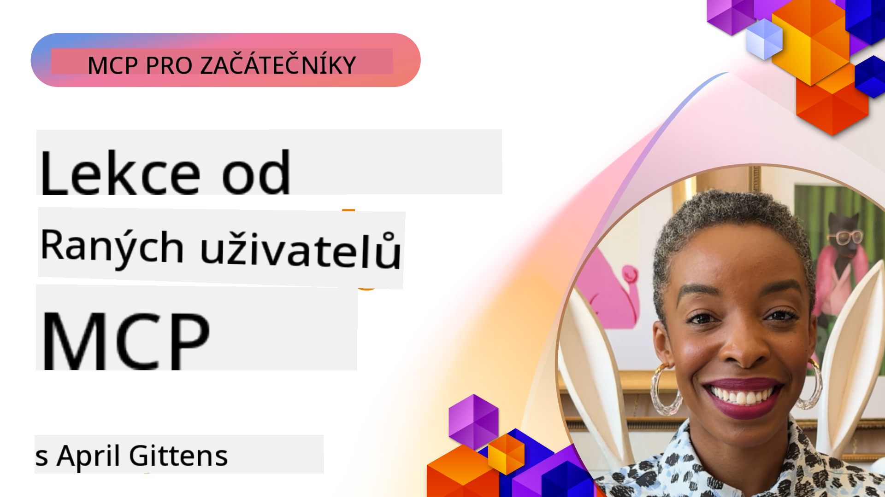

<!--
CO_OP_TRANSLATOR_METADATA:
{
  "original_hash": "41f16dac486d2086a53bc644a01cbe42",
  "translation_date": "2025-08-18T19:48:05+00:00",
  "source_file": "07-LessonsfromEarlyAdoption/README.md",
  "language_code": "cs"
}
-->
# 🌟 Lekce od raných uživatelů

[](https://youtu.be/jds7dSmNptE)

_(Klikněte na obrázek výše pro zhlédnutí videa této lekce)_

## 🎯 Co tento modul pokrývá

Tento modul zkoumá, jak skutečné organizace a vývojáři využívají Model Context Protocol (MCP) k řešení reálných výzev a podpoře inovací. Prostřednictvím podrobných případových studií a praktických projektů objevíte, jak MCP umožňuje bezpečnou a škálovatelnou integraci AI, která propojuje jazykové modely, nástroje a podniková data.

### 📚 Podívejte se na MCP v akci

Chcete vidět, jak jsou tyto principy aplikovány na nástroje připravené pro produkci? Podívejte se na [**10 Microsoft MCP serverů, které transformují produktivitu vývojářů**](microsoft-mcp-servers.md), kde najdete skutečné Microsoft MCP servery, které můžete začít používat již dnes.

## Přehled

Tato lekce zkoumá, jak raní uživatelé využili Model Context Protocol (MCP) k řešení reálných výzev a podpoře inovací napříč odvětvími. Prostřednictvím podrobných případových studií a praktických projektů uvidíte, jak MCP umožňuje standardizovanou, bezpečnou a škálovatelnou integraci AI – propojující velké jazykové modely, nástroje a podniková data v jednotném rámci. Získáte praktické zkušenosti s návrhem a budováním řešení založených na MCP, naučíte se osvědčené implementační vzory a objevíte nejlepší postupy pro nasazení MCP v produkčním prostředí. Lekce také zdůrazňuje nové trendy, budoucí směry a open-source zdroje, které vám pomohou zůstat na špici technologie MCP a jejího vyvíjejícího se ekosystému.

## Výukové cíle

- Analyzovat reálné implementace MCP napříč různými odvětvími  
- Navrhnout a vytvořit kompletní aplikace založené na MCP  
- Prozkoumat nové trendy a budoucí směry v technologii MCP  
- Aplikovat osvědčené postupy ve skutečných vývojových scénářích  

## Reálné implementace MCP

### Případová studie 1: Automatizace zákaznické podpory v podniku

Nadnárodní korporace implementovala řešení založené na MCP pro standardizaci AI interakcí napříč jejich systémy zákaznické podpory. To jim umožnilo:

- Vytvořit jednotné rozhraní pro více poskytovatelů LLM  
- Udržovat konzistentní správu promptů napříč odděleními  
- Zavést robustní bezpečnostní a regulační kontroly  
- Snadno přepínat mezi různými AI modely podle konkrétních potřeb  

**Technická implementace:**

```python
# Python MCP server implementation for customer support
import logging
import asyncio
from modelcontextprotocol import create_server, ServerConfig
from modelcontextprotocol.server import MCPServer
from modelcontextprotocol.transports import create_http_transport
from modelcontextprotocol.resources import ResourceDefinition
from modelcontextprotocol.prompts import PromptDefinition
from modelcontextprotocol.tool import ToolDefinition

# Configure logging
logging.basicConfig(level=logging.INFO)

async def main():
    # Create server configuration
    config = ServerConfig(
        name="Enterprise Customer Support Server",
        version="1.0.0",
        description="MCP server for handling customer support inquiries"
    )
    
    # Initialize MCP server
    server = create_server(config)
    
    # Register knowledge base resources
    server.resources.register(
        ResourceDefinition(
            name="customer_kb",
            description="Customer knowledge base documentation"
        ),
        lambda params: get_customer_documentation(params)
    )
    
    # Register prompt templates
    server.prompts.register(
        PromptDefinition(
            name="support_template",
            description="Templates for customer support responses"
        ),
        lambda params: get_support_templates(params)
    )
    
    # Register support tools
    server.tools.register(
        ToolDefinition(
            name="ticketing",
            description="Create and update support tickets"
        ),
        handle_ticketing_operations
    )
    
    # Start server with HTTP transport
    transport = create_http_transport(port=8080)
    await server.run(transport)

if __name__ == "__main__":
    asyncio.run(main())
```

**Výsledky:** 30% snížení nákladů na modely, 45% zlepšení konzistence odpovědí a zvýšená shoda s předpisy napříč globálními operacemi.

### Případová studie 2: Asistent pro diagnostiku ve zdravotnictví

Poskytovatel zdravotní péče vyvinul infrastrukturu MCP pro integraci více specializovaných lékařských AI modelů při zajištění ochrany citlivých údajů pacientů:

- Plynulé přepínání mezi obecnými a specializovanými lékařskými modely  
- Přísné kontroly ochrany soukromí a auditní stopy  
- Integrace se stávajícími systémy elektronických zdravotních záznamů (EHR)  
- Konzistentní návrh promptů pro lékařskou terminologii  

**Technická implementace:**

```csharp
// C# MCP host application implementation in healthcare application
using Microsoft.Extensions.DependencyInjection;
using ModelContextProtocol.SDK.Client;
using ModelContextProtocol.SDK.Security;
using ModelContextProtocol.SDK.Resources;

public class DiagnosticAssistant
{
    private readonly MCPHostClient _mcpClient;
    private readonly PatientContext _patientContext;
    
    public DiagnosticAssistant(PatientContext patientContext)
    {
        _patientContext = patientContext;
        
        // Configure MCP client with healthcare-specific settings
        var clientOptions = new ClientOptions
        {
            Name = "Healthcare Diagnostic Assistant",
            Version = "1.0.0",
            Security = new SecurityOptions
            {
                Encryption = EncryptionLevel.Medical,
                AuditEnabled = true
            }
        };
        
        _mcpClient = new MCPHostClientBuilder()
            .WithOptions(clientOptions)
            .WithTransport(new HttpTransport("https://healthcare-mcp.example.org"))
            .WithAuthentication(new HIPAACompliantAuthProvider())
            .Build();
    }
    
    public async Task<DiagnosticSuggestion> GetDiagnosticAssistance(
        string symptoms, string patientHistory)
    {
        // Create request with appropriate resources and tool access
        var resourceRequest = new ResourceRequest
        {
            Name = "patient_records",
            Parameters = new Dictionary<string, object>
            {
                ["patientId"] = _patientContext.PatientId,
                ["requestingProvider"] = _patientContext.ProviderId
            }
        };
        
        // Request diagnostic assistance using appropriate prompt
        var response = await _mcpClient.SendPromptRequestAsync(
            promptName: "diagnostic_assistance",
            parameters: new Dictionary<string, object>
            {
                ["symptoms"] = symptoms,
                patientHistory = patientHistory,
                relevantGuidelines = _patientContext.GetRelevantGuidelines()
            });
            
        return DiagnosticSuggestion.FromMCPResponse(response);
    }
}
```

**Výsledky:** Zlepšené diagnostické návrhy pro lékaře při plném dodržování HIPAA a významné snížení přepínání mezi systémy.

### Případová studie 3: Analýza rizik ve finančních službách

Finanční instituce implementovala MCP pro standardizaci procesů analýzy rizik napříč různými odděleními:

- Vytvořila jednotné rozhraní pro modely kreditního rizika, detekce podvodů a investičního rizika  
- Zavedla přísné kontroly přístupu a verzování modelů  
- Zajistila auditovatelnost všech AI doporučení  
- Udržovala konzistentní formátování dat napříč různými systémy  

**Technická implementace:**

```java
// Java MCP server for financial risk assessment
import org.mcp.server.*;
import org.mcp.security.*;

public class FinancialRiskMCPServer {
    public static void main(String[] args) {
        // Create MCP server with financial compliance features
        MCPServer server = new MCPServerBuilder()
            .withModelProviders(
                new ModelProvider("risk-assessment-primary", new AzureOpenAIProvider()),
                new ModelProvider("risk-assessment-audit", new LocalLlamaProvider())
            )
            .withPromptTemplateDirectory("./compliance/templates")
            .withAccessControls(new SOCCompliantAccessControl())
            .withDataEncryption(EncryptionStandard.FINANCIAL_GRADE)
            .withVersionControl(true)
            .withAuditLogging(new DatabaseAuditLogger())
            .build();
            
        server.addRequestValidator(new FinancialDataValidator());
        server.addResponseFilter(new PII_RedactionFilter());
        
        server.start(9000);
        
        System.out.println("Financial Risk MCP Server running on port 9000");
    }
}
```

**Výsledky:** Zvýšená shoda s předpisy, o 40% rychlejší cykly nasazení modelů a zlepšená konzistence hodnocení rizik napříč odděleními.

### Případová studie 4: Microsoft Playwright MCP Server pro automatizaci prohlížeče

Microsoft vyvinul [Playwright MCP server](https://github.com/microsoft/playwright-mcp), který umožňuje bezpečnou a standardizovanou automatizaci prohlížeče prostřednictvím Model Context Protocol. Tento server připravený pro produkci umožňuje AI agentům a LLM interagovat s webovými prohlížeči kontrolovaným, auditovatelným a rozšiřitelným způsobem – umožňující případy použití, jako je automatizované testování webu, extrakce dat a end-to-end pracovní postupy.

> **🎯 Nástroj připravený pro produkci**  
> Tato případová studie představuje skutečný MCP server, který můžete použít již dnes! Více informací o Playwright MCP Serveru a dalších 9 produkčně připravených Microsoft MCP serverech najdete v našem [**Průvodci Microsoft MCP servery**](microsoft-mcp-servers.md#8--playwright-mcp-server).

**Klíčové vlastnosti:**
- Poskytuje funkce automatizace prohlížeče (navigace, vyplňování formulářů, pořizování snímků obrazovky atd.) jako MCP nástroje  
- Zavádí přísné kontroly přístupu a sandboxing pro prevenci neoprávněných akcí  
- Poskytuje podrobné auditní záznamy všech interakcí s prohlížečem  
- Podporuje integraci s Azure OpenAI a dalšími poskytovateli LLM pro automatizaci řízenou agenty  
- Pohání schopnosti prohlížení webu GitHub Copilota  

**Technická implementace:**

```typescript
// TypeScript: Registering Playwright browser automation tools in an MCP server
import { createServer, ToolDefinition } from 'modelcontextprotocol';
import { launch } from 'playwright';

const server = createServer({
  name: 'Playwright MCP Server',
  version: '1.0.0',
  description: 'MCP server for browser automation using Playwright'
});

// Register a tool for navigating to a URL and capturing a screenshot
server.tools.register(
  new ToolDefinition({
    name: 'navigate_and_screenshot',
    description: 'Navigate to a URL and capture a screenshot',
    parameters: {
      url: { type: 'string', description: 'The URL to visit' }
    }
  }),
  async ({ url }) => {
    const browser = await launch();
    const page = await browser.newPage();
    await page.goto(url);
    const screenshot = await page.screenshot();
    await browser.close();
    return { screenshot };
  }
);

// Start the MCP server
server.listen(8080);
```

**Výsledky:**

- Umožnil bezpečnou, programovatelnou automatizaci prohlížeče pro AI agenty a LLM  
- Snížil manuální úsilí při testování a zlepšil pokrytí testů webových aplikací  
- Poskytl znovupoužitelný, rozšiřitelný rámec pro integraci nástrojů založených na prohlížeči v podnikových prostředích  
- Pohání schopnosti prohlížení webu GitHub Copilota  

**Reference:**

- [Playwright MCP Server GitHub Repository](https://github.com/microsoft/playwright-mcp)  
- [Microsoft AI a automatizační řešení](https://azure.microsoft.com/en-us/products/ai-services/)  

### Případová studie 5: Azure MCP – Podnikový Model Context Protocol jako služba

Azure MCP Server ([https://aka.ms/azmcp](https://aka.ms/azmcp)) je spravovaná, podniková implementace Model Context Protocol od Microsoftu, navržená pro poskytování škálovatelných, bezpečných a kompatibilních MCP serverových schopností jako cloudové služby. Azure MCP umožňuje organizacím rychle nasazovat, spravovat a integrovat MCP servery s Azure AI, datovými a bezpečnostními službami, čímž snižuje provozní zátěž a urychluje adopci AI.

> **🎯 Nástroj připravený pro produkci**  
> Toto je skutečný MCP server, který můžete použít již dnes! Více informací o Azure AI Foundry MCP Serveru najdete v našem [**Průvodci Microsoft MCP servery**](microsoft-mcp-servers.md).

- Plně spravovaný hosting MCP serveru s vestavěným škálováním, monitorováním a zabezpečením  
- Nativní integrace s Azure OpenAI, Azure AI Search a dalšími Azure službami  
- Podniková autentizace a autorizace prostřednictvím Microsoft Entra ID  
- Podpora vlastních nástrojů, šablon promptů a konektorů zdrojů  
- Shoda s podnikovými bezpečnostními a regulačními požadavky  

**Technická implementace:**

```yaml
# Example: Azure MCP server deployment configuration (YAML)
apiVersion: mcp.microsoft.com/v1
kind: McpServer
metadata:
  name: enterprise-mcp-server
spec:
  modelProviders:
    - name: azure-openai
      type: AzureOpenAI
      endpoint: https://<your-openai-resource>.openai.azure.com/
      apiKeySecret: <your-azure-keyvault-secret>
  tools:
    - name: document_search
      type: AzureAISearch
      endpoint: https://<your-search-resource>.search.windows.net/
      apiKeySecret: <your-azure-keyvault-secret>
  authentication:
    type: EntraID
    tenantId: <your-tenant-id>
  monitoring:
    enabled: true
    logAnalyticsWorkspace: <your-log-analytics-id>
```

**Výsledky:**  
- Zkrácení doby potřebné k realizaci podnikových AI projektů díky připravené, kompatibilní platformě MCP serveru  
- Zjednodušení integrace LLM, nástrojů a podnikových datových zdrojů  
- Zvýšená bezpečnost, přehlednost a provozní efektivita pro MCP pracovní zátěže  
- Zlepšení kvality kódu s osvědčenými postupy Azure SDK a aktuálními autentizačními vzory  

**Reference:**  
- [Azure MCP Dokumentace](https://aka.ms/azmcp)  
- [Azure MCP Server GitHub Repository](https://github.com/Azure/azure-mcp)  
- [Azure AI Služby](https://azure.microsoft.com/en-us/products/ai-services/)  
- [Microsoft MCP Centrum](https://mcp.azure.com)  

### Případová studie 6: NLWeb

MCP (Model Context Protocol) je nový protokol pro chatboty a AI asistenty, který umožňuje interakci s nástroji. Každá instance NLWeb je také MCP serverem, který podporuje jednu základní metodu, ask, používanou k pokládání otázek webovým stránkám v přirozeném jazyce. Odpověď využívá schema.org, široce používanou slovní zásobu pro popis webových dat. Volně řečeno, MCP je k NLWeb to, co je Http k HTML. NLWeb kombinuje protokoly, formáty Schema.org a ukázkový kód, aby pomohl webům rychle vytvářet tyto koncové body, což přináší výhody jak lidem prostřednictvím konverzačních rozhraní, tak strojům prostřednictvím přirozené interakce agent-agent.

Existují dvě odlišné komponenty NLWeb:
- Protokol, velmi jednoduchý na začátek, pro interakci s webem v přirozeném jazyce a formát, využívající JSON a schema.org pro vrácenou odpověď. Podrobnosti naleznete v dokumentaci k REST API.  
- Jednoduchá implementace (1), která využívá stávající značkování pro weby, které lze abstrahovat jako seznamy položek (produkty, recepty, atrakce, recenze atd.). Spolu se sadou widgetů uživatelského rozhraní mohou weby snadno poskytovat konverzační rozhraní ke svému obsahu. Podrobnosti o tom, jak to funguje, naleznete v dokumentaci k Životu dotazu chatu.  

**Reference:**  
- [Azure MCP Dokumentace](https://aka.ms/azmcp)  
- [NLWeb](https://github.com/microsoft/NlWeb)  

### Případová studie 7: Azure AI Foundry MCP Server – Integrace podnikových AI agentů

Azure AI Foundry MCP servery ukazují, jak lze MCP použít k orchestraci a správě AI agentů a pracovních postupů v podnikových prostředích. Integrací MCP s Azure AI Foundry mohou organizace standardizovat interakce agentů, využívat správu pracovních postupů Foundry a zajistit bezpečné, škálovatelné nasazení.

> **🎯 Nástroj připravený pro produkci**  
> Toto je skutečný MCP server, který můžete použít již dnes! Více informací o Azure AI Foundry MCP Serveru najdete v našem [**Průvodci Microsoft MCP servery**](microsoft-mcp-servers.md#9--azure-ai-foundry-mcp-server).

**Klíčové vlastnosti:**
- Komplexní přístup k AI ekosystému Azure, včetně katalogů modelů a správy nasazení  
- Indexování znalostí s Azure AI Search pro RAG aplikace  
- Nástroje pro hodnocení výkonu a kvality AI modelů  
- Integrace s katalogem a laboratořemi Azure AI Foundry pro špičkové výzkumné modely  
- Schopnosti správy a hodnocení agentů pro produkční scénáře  

**Výsledky:**  
- Rychlé prototypování a robustní monitorování pracovních postupů AI agentů  
- Plynulá integrace s Azure AI službami pro pokročilé scénáře  
- Jednotné rozhraní pro vytváření, nasazování a monitorování agentních pipeline  
- Zvýšená bezpečnost, shoda a provozní efektivita pro podniky  
- Urychlená adopce AI při zachování kontroly nad složitými procesy řízenými agenty  

**Reference:**  
- [Azure AI Foundry MCP Server GitHub Repository](https://github.com/azure-ai-foundry/mcp-foundry)  
- [Integrace Azure AI agentů s MCP (Microsoft Foundry Blog)](https://devblogs.microsoft.com/foundry/integrating-azure-ai-agents-mcp/)  

### Případová studie 8: Foundry MCP Playground – Experimentování a prototypování

Foundry MCP Playground nabízí připravené prostředí pro experimentování s MCP servery a integracemi Azure AI Foundry. Vývojáři mohou rychle prototypovat, testovat a hodnotit AI modely a pracovní postupy agentů pomocí zdrojů z katalogu a laboratoří Azure AI Foundry. Playground zjednodušuje nastavení, poskytuje ukázkové projekty a podporuje spolupráci, což usnadňuje objevování osvědčených postupů a nových scénářů s minimálními náklady. Je obzvláště užitečný pro týmy, které chtějí ověřit nápady, sdílet experimenty a urychlit učení bez potřeby složité infrastruktury. Snížením bariér pro vstup podporuje playground inovace a komunitní příspěvky v ekosystému MCP a Azure AI Foundry.

**Reference:**  
- [Foundry MCP Playground GitHub Repository](https://github.com/azure-ai-foundry/foundry-mcp-playground)  

### Případová studie 9: Microsoft Learn Docs MCP Server – AI-poháněný přístup k dokumentaci

Microsoft Learn Docs MCP Server je cloudová služba, která poskytuje AI asistentům přístup v reálném čase k oficiální dokumentaci Microsoftu prostřednictvím Model Context Protocol. Tento server připravený pro produkci se připojuje k rozsáhlému ekosystému Microsoft Learn a umožňuje sémantické vyhledávání napříč všemi oficiálními zdroji Microsoftu.
> **🎯 Nástroj připravený pro produkci**
> 
> Toto je skutečný MCP server, který můžete používat již dnes! Více informací o MCP serveru Microsoft Learn Docs najdete v našem [**Průvodci MCP servery Microsoft**](microsoft-mcp-servers.md#1--microsoft-learn-docs-mcp-server).
**Klíčové vlastnosti:**
- Přístup v reálném čase k oficiální dokumentaci Microsoftu, dokumentaci Azure a Microsoft 365
- Pokročilé schopnosti sémantického vyhledávání, které rozumí kontextu a záměru
- Neustále aktuální informace díky publikaci obsahu Microsoft Learn
- Komplexní pokrytí zdrojů Microsoft Learn, dokumentace Azure a Microsoft 365
- Poskytuje až 10 kvalitních obsahových bloků s názvy článků a URL

**Proč je to důležité:**
- Řeší problém „zastaralých znalostí AI“ pro technologie Microsoftu
- Zajišťuje, že AI asistenti mají přístup k nejnovějším funkcím .NET, C#, Azure a Microsoft 365
- Poskytuje autoritativní, prvotřídní informace pro přesnou generaci kódu
- Nezbytné pro vývojáře pracující s rychle se vyvíjejícími technologiemi Microsoftu

**Výsledky:**
- Výrazně zlepšená přesnost AI generovaného kódu pro technologie Microsoftu
- Snížení času stráveného hledáním aktuální dokumentace a osvědčených postupů
- Zvýšená produktivita vývojářů díky vyhledávání dokumentace s ohledem na kontext
- Bezproblémová integrace do vývojových pracovních postupů bez nutnosti opustit IDE

**Reference:**
- [Microsoft Learn Docs MCP Server GitHub Repository](https://github.com/MicrosoftDocs/mcp)
- [Microsoft Learn Documentation](https://learn.microsoft.com/)

## Praktické projekty

### Projekt 1: Vytvoření MCP serveru s více poskytovateli

**Cíl:** Vytvořit MCP server, který dokáže směrovat požadavky na více poskytovatelů AI modelů na základě specifických kritérií.

**Požadavky:**

- Podpora alespoň tří různých poskytovatelů modelů (např. OpenAI, Anthropic, lokální modely)
- Implementace směrovacího mechanismu na základě metadat požadavků
- Vytvoření konfiguračního systému pro správu přihlašovacích údajů poskytovatelů
- Přidání cache pro optimalizaci výkonu a nákladů
- Vytvoření jednoduchého dashboardu pro monitorování využití

**Kroky implementace:**

1. Nastavení základní infrastruktury MCP serveru
2. Implementace adaptérů poskytovatelů pro každou AI modelovou službu
3. Vytvoření směrovací logiky na základě atributů požadavků
4. Přidání mechanismů cache pro časté požadavky
5. Vývoj monitorovacího dashboardu
6. Testování s různými vzory požadavků

**Technologie:** Vyberte si mezi Pythonem (.NET/Java/Python podle preferencí), Redis pro cache a jednoduchým webovým frameworkem pro dashboard.

### Projekt 2: Podnikový systém pro správu promptů

**Cíl:** Vyvinout systém založený na MCP pro správu, verzování a nasazení šablon promptů v rámci organizace.

**Požadavky:**

- Vytvoření centralizovaného úložiště pro šablony promptů
- Implementace verzování a schvalovacích workflow
- Vývoj možností testování šablon s ukázkovými vstupy
- Zavedení řízení přístupu na základě rolí
- Vytvoření API pro načítání a nasazení šablon

**Kroky implementace:**

1. Navrhněte databázové schéma pro ukládání šablon
2. Vytvořte základní API pro CRUD operace šablon
3. Implementujte systém verzování
4. Vybudujte schvalovací workflow
5. Vyviněte testovací framework
6. Vytvořte jednoduché webové rozhraní pro správu
7. Integrujte s MCP serverem

**Technologie:** Vámi zvolený backendový framework, SQL nebo NoSQL databáze a frontendový framework pro rozhraní pro správu.

### Projekt 3: Platforma pro generování obsahu založená na MCP

**Cíl:** Vytvořit platformu pro generování obsahu, která využívá MCP k poskytování konzistentních výsledků napříč různými typy obsahu.

**Požadavky:**

- Podpora více formátů obsahu (blogové příspěvky, sociální média, marketingové texty)
- Implementace generování na základě šablon s možnostmi přizpůsobení
- Vytvoření systému pro kontrolu a zpětnou vazbu k obsahu
- Sledování metrik výkonnosti obsahu
- Podpora verzování a iterace obsahu

**Kroky implementace:**

1. Nastavte infrastrukturu MCP klienta
2. Vytvořte šablony pro různé typy obsahu
3. Vybudujte pipeline pro generování obsahu
4. Implementujte systém pro kontrolu obsahu
5. Vyviněte systém pro sledování metrik
6. Vytvořte uživatelské rozhraní pro správu šablon a generování obsahu

**Technologie:** Vámi preferovaný programovací jazyk, webový framework a databázový systém.

## Budoucí směry technologie MCP

### Nové trendy

1. **Multi-modální MCP**
   - Rozšíření MCP pro standardizaci interakcí s modely pro obrázky, zvuk a video
   - Vývoj schopností pro cross-modální uvažování
   - Standardizované formáty promptů pro různé modality

2. **Federovaná infrastruktura MCP**
   - Distribuované MCP sítě, které mohou sdílet zdroje mezi organizacemi
   - Standardizované protokoly pro bezpečné sdílení modelů
   - Techniky pro zachování soukromí při výpočtech

3. **Tržiště MCP**
   - Ekosystémy pro sdílení a monetizaci šablon a pluginů MCP
   - Procesy zajištění kvality a certifikace
   - Integrace s tržišti modelů

4. **MCP pro edge computing**
   - Adaptace standardů MCP pro zařízení s omezenými zdroji
   - Optimalizované protokoly pro prostředí s nízkou šířkou pásma
   - Specializované implementace MCP pro IoT ekosystémy

5. **Regulační rámce**
   - Vývoj rozšíření MCP pro regulační shodu
   - Standardizované auditní stopy a rozhraní pro vysvětlitelnost
   - Integrace s nově vznikajícími rámci pro správu AI

### Řešení MCP od Microsoftu

Microsoft a Azure vyvinuly několik open-source repozitářů, které pomáhají vývojářům implementovat MCP v různých scénářích:

#### Organizace Microsoft

1. [playwright-mcp](https://github.com/microsoft/playwright-mcp) - MCP server Playwright pro automatizaci prohlížeče a testování
2. [files-mcp-server](https://github.com/microsoft/files-mcp-server) - Implementace MCP serveru OneDrive pro lokální testování a komunitní příspěvky
3. [NLWeb](https://github.com/microsoft/NlWeb) - NLWeb je sada otevřených protokolů a nástrojů zaměřených na vytvoření základní vrstvy pro AI Web

#### Organizace Azure-Samples

1. [mcp](https://github.com/Azure-Samples/mcp) - Odkazy na ukázky, nástroje a zdroje pro budování a integraci MCP serverů na Azure
2. [mcp-auth-servers](https://github.com/Azure-Samples/mcp-auth-servers) - Referenční MCP servery demonstrující autentizaci s aktuální specifikací Model Context Protocol
3. [remote-mcp-functions](https://github.com/Azure-Samples/remote-mcp-functions) - Stránka pro implementace Remote MCP serverů v Azure Functions
4. [remote-mcp-functions-python](https://github.com/Azure-Samples/remote-mcp-functions-python) - Šablona pro rychlý start s budováním a nasazením vlastních Remote MCP serverů pomocí Azure Functions s Pythonem
5. [remote-mcp-functions-dotnet](https://github.com/Azure-Samples/remote-mcp-functions-dotnet) - Šablona pro rychlý start s budováním a nasazením vlastních Remote MCP serverů pomocí Azure Functions s .NET/C#
6. [remote-mcp-functions-typescript](https://github.com/Azure-Samples/remote-mcp-functions-typescript) - Šablona pro rychlý start s budováním a nasazením vlastních Remote MCP serverů pomocí Azure Functions s TypeScriptem
7. [remote-mcp-apim-functions-python](https://github.com/Azure-Samples/remote-mcp-apim-functions-python) - Azure API Management jako AI Gateway pro Remote MCP servery s Pythonem
8. [AI-Gateway](https://github.com/Azure-Samples/AI-Gateway) - Experimenty APIM ❤️ AI včetně schopností MCP, integrace s Azure OpenAI a AI Foundry

Tyto repozitáře poskytují různé implementace, šablony a zdroje pro práci s Model Context Protocol napříč různými programovacími jazyky a službami Azure. Pokrývají širokou škálu případů použití od základních implementací serverů po autentizaci, cloudové nasazení a podnikové integrační scénáře.

#### Adresář zdrojů MCP

Adresář [MCP Resources](https://github.com/microsoft/mcp/tree/main/Resources) v oficiálním repozitáři Microsoft MCP poskytuje kurátorovanou sbírku ukázkových zdrojů, šablon promptů a definic nástrojů pro použití s MCP servery. Tento adresář je navržen tak, aby vývojářům pomohl rychle začít s MCP díky nabídce opakovaně použitelných stavebních bloků a příkladů osvědčených postupů pro:

- **Šablony promptů:** Připravené šablony promptů pro běžné úkoly a scénáře AI, které lze přizpůsobit pro vlastní implementace MCP serverů.
- **Definice nástrojů:** Příkladové schémata nástrojů a metadata pro standardizaci integrace a vyvolávání nástrojů napříč různými MCP servery.
- **Ukázky zdrojů:** Příkladové definice zdrojů pro připojení k datovým zdrojům, API a externím službám v rámci MCP frameworku.
- **Referenční implementace:** Praktické ukázky, které demonstrují, jak strukturovat a organizovat zdroje, prompty a nástroje v reálných MCP projektech.

Tyto zdroje urychlují vývoj, podporují standardizaci a pomáhají zajistit osvědčené postupy při budování a nasazování řešení založených na MCP.

#### Adresář zdrojů MCP

- [MCP Resources (Ukázkové prompty, nástroje a definice zdrojů)](https://github.com/microsoft/mcp/tree/main/Resources)

### Výzkumné příležitosti

- Efektivní techniky optimalizace promptů v rámci MCP frameworků
- Bezpečnostní modely pro multi-tenantní nasazení MCP
- Benchmarking výkonu napříč různými implementacemi MCP
- Formální metody ověřování pro MCP servery

## Závěr

Model Context Protocol (MCP) rychle formuje budoucnost standardizované, bezpečné a interoperabilní AI integrace napříč odvětvími. Prostřednictvím případových studií a praktických projektů v této lekci jste viděli, jak raní uživatelé – včetně Microsoftu a Azure – využívají MCP k řešení reálných výzev, urychlení adopce AI a zajištění souladu, bezpečnosti a škálovatelnosti. Modulární přístup MCP umožňuje organizacím propojit velké jazykové modely, nástroje a podniková data v jednotném, auditovatelném rámci. Jak se MCP dále vyvíjí, klíčem k budování robustních, budoucnosti odolných AI řešení bude zapojení do komunity, zkoumání open-source zdrojů a aplikace osvědčených postupů.

## Další zdroje

- [MCP Foundry GitHub Repository](https://github.com/azure-ai-foundry/mcp-foundry)
- [Foundry MCP Playground](https://github.com/azure-ai-foundry/foundry-mcp-playground)
- [Integrace Azure AI Agentů s MCP (Microsoft Foundry Blog)](https://devblogs.microsoft.com/foundry/integrating-azure-ai-agents-mcp/)
- [MCP GitHub Repository (Microsoft)](https://github.com/microsoft/mcp)
- [Adresář zdrojů MCP (Ukázkové prompty, nástroje a definice zdrojů)](https://github.com/microsoft/mcp/tree/main/Resources)
- [Komunita a dokumentace MCP](https://modelcontextprotocol.io/introduction)
- [Dokumentace Azure MCP](https://aka.ms/azmcp)
- [Playwright MCP Server GitHub Repository](https://github.com/microsoft/playwright-mcp)
- [Files MCP Server (OneDrive)](https://github.com/microsoft/files-mcp-server)
- [Azure-Samples MCP](https://github.com/Azure-Samples/mcp)
- [MCP Auth Servers (Azure-Samples)](https://github.com/Azure-Samples/mcp-auth-servers)
- [Remote MCP Functions (Azure-Samples)](https://github.com/Azure-Samples/remote-mcp-functions)
- [Remote MCP Functions Python (Azure-Samples)](https://github.com/Azure-Samples/remote-mcp-functions-python)
- [Remote MCP Functions .NET (Azure-Samples)](https://github.com/Azure-Samples/remote-mcp-functions-dotnet)
- [Remote MCP Functions TypeScript (Azure-Samples)](https://github.com/Azure-Samples/remote-mcp-functions-typescript)
- [Remote MCP APIM Functions Python (Azure-Samples)](https://github.com/Azure-Samples/remote-mcp-apim-functions-python)
- [AI-Gateway (Azure-Samples)](https://github.com/Azure-Samples/AI-Gateway)
- [Řešení Microsoft AI a automatizace](https://azure.microsoft.com/en-us/products/ai-services/)

## Cvičení

1. Analyzujte jednu z případových studií a navrhněte alternativní přístup k implementaci.
2. Vyberte si jeden z projektových nápadů a vytvořte podrobnou technickou specifikaci.
3. Prozkoumejte odvětví, které není pokryto v případových studiích, a načrtněte, jak by MCP mohlo řešit jeho specifické výzvy.
4. Prozkoumejte jeden z budoucích směrů a vytvořte koncept pro nové rozšíření MCP, které jej podpoří.

Další: [Microsoft MCP Server](../07-LessonsfromEarlyAdoption/microsoft-mcp-servers.md)

**Prohlášení:**  
Tento dokument byl přeložen pomocí služby pro automatizovaný překlad [Co-op Translator](https://github.com/Azure/co-op-translator). Ačkoli se snažíme o přesnost, mějte na paměti, že automatizované překlady mohou obsahovat chyby nebo nepřesnosti. Původní dokument v jeho původním jazyce by měl být považován za autoritativní zdroj. Pro důležité informace se doporučuje profesionální lidský překlad. Neodpovídáme za žádná nedorozumění nebo nesprávné interpretace vyplývající z použití tohoto překladu.