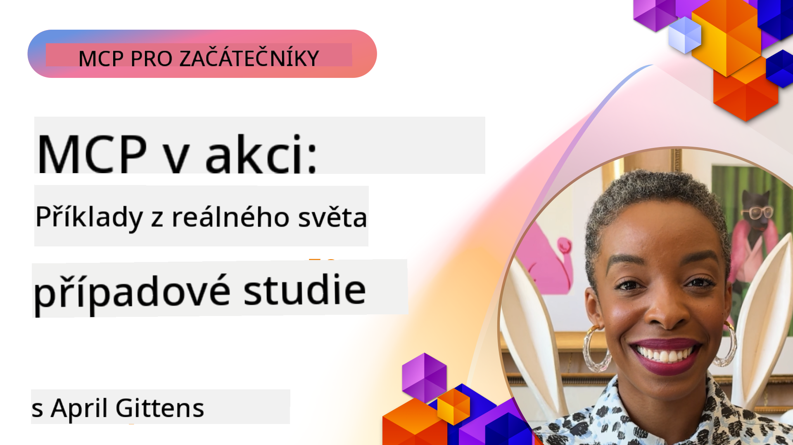

<!--
CO_OP_TRANSLATOR_METADATA:
{
  "original_hash": "1611dc5f6a2a35a789fc4c95fc5bfbe8",
  "translation_date": "2025-09-26T19:00:15+00:00",
  "source_file": "09-CaseStudy/README.md",
  "language_code": "cs"
}
-->
# MCP v akci: Případové studie z reálného světa

_(Klikněte na obrázek výše pro zhlédnutí videa této lekce)_

Model Context Protocol (MCP) mění způsob, jakým AI aplikace interagují s daty, nástroji a službami. Tato sekce představuje případové studie z reálného světa, které ukazují praktické aplikace MCP v různých podnikových scénářích.

## Přehled

Tato sekce představuje konkrétní příklady implementace MCP, které zdůrazňují, jak organizace využívají tento protokol k řešení složitých obchodních výzev. Prozkoumáním těchto případových studií získáte přehled o všestrannosti, škálovatelnosti a praktických výhodách MCP v reálných situacích.

## Klíčové cíle učení

Prozkoumáním těchto případových studií se naučíte:

- Jak lze MCP aplikovat na řešení konkrétních obchodních problémů
- Různé integrační vzory a architektonické přístupy
- Nejlepší postupy pro implementaci MCP v podnikových prostředích
- Přehled o výzvách a řešeních při implementaci MCP v reálném světě
- Identifikaci příležitostí k aplikaci podobných vzorů ve vlastních projektech

## Představené případové studie

### 1. [Azure AI Travel Agents – Referenční implementace](./travelagentsample.md)

Tato případová studie zkoumá komplexní referenční řešení od Microsoftu, které ukazuje, jak vytvořit multi-agentní AI aplikaci pro plánování cest pomocí MCP, Azure OpenAI a Azure AI Search. Projekt zahrnuje:

- Orchestrace více agentů prostřednictvím MCP
- Integraci podnikových dat s Azure AI Search
- Bezpečnou, škálovatelnou architekturu využívající služby Azure
- Rozšiřitelné nástroje s opakovaně použitelnými komponentami MCP
- Konverzační uživatelské rozhraní poháněné Azure OpenAI

Architektura a detaily implementace poskytují cenné poznatky o budování komplexních systémů s více agenty, kde MCP slouží jako koordinační vrstva.

### 2. [Aktualizace položek Azure DevOps z dat YouTube](./UpdateADOItemsFromYT.md)

Tato případová studie ukazuje praktickou aplikaci MCP pro automatizaci pracovních procesů. Demonstruje, jak lze MCP nástroje použít k:

- Extrakci dat z online platforem (YouTube)
- Aktualizaci pracovních položek v systémech Azure DevOps
- Vytváření opakovatelných automatizačních pracovních postupů
- Integraci dat napříč různými systémy

Tento příklad ilustruje, jak i relativně jednoduché implementace MCP mohou přinést významné zlepšení efektivity automatizací rutinních úkolů a zlepšením konzistence dat napříč systémy.

### 3. [Získávání dokumentace v reálném čase pomocí MCP](./docs-mcp/README.md)

Tato případová studie vás provede připojením Python konzolového klienta k serveru Model Context Protocol (MCP) za účelem získávání a logování dokumentace Microsoftu v reálném čase. Naučíte se:

- Připojit se k MCP serveru pomocí Python klienta a oficiálního MCP SDK
- Používat streamovací HTTP klienty pro efektivní získávání dat v reálném čase
- Volat nástroje dokumentace na serveru a logovat odpovědi přímo do konzole
- Integrovat aktuální dokumentaci Microsoftu do svého pracovního procesu bez opuštění terminálu

Kapitola obsahuje praktický úkol, minimální funkční ukázku kódu a odkazy na další zdroje pro hlubší učení. Podívejte se na kompletní průvodce a kód v přiložené kapitole, abyste pochopili, jak MCP může transformovat přístup k dokumentaci a produktivitu vývojářů v konzolových prostředích.

### 4. [Interaktivní webová aplikace pro generování studijních plánů pomocí MCP](./docs-mcp/README.md)

Tato případová studie ukazuje, jak vytvořit interaktivní webovou aplikaci pomocí Chainlit a Model Context Protocol (MCP) pro generování personalizovaných studijních plánů na libovolné téma. Uživatelé mohou specifikovat předmět (např. "certifikace AI-900") a dobu studia (např. 8 týdnů), a aplikace poskytne týdenní rozpis doporučeného obsahu. Chainlit umožňuje konverzační chatové rozhraní, které činí zážitek poutavým a adaptivním.

- Konverzační webová aplikace poháněná Chainlit
- Uživatelské zadávání tématu a délky studia
- Týdenní doporučení obsahu pomocí MCP
- Odezvy v reálném čase v chatovém rozhraní

Projekt ukazuje, jak lze kombinovat konverzační AI a MCP k vytvoření dynamických, uživatelsky řízených vzdělávacích nástrojů v moderním webovém prostředí.

### 5. [Dokumentace v editoru pomocí MCP serveru ve VS Code](./docs-mcp/README.md)

Tato případová studie ukazuje, jak můžete přinést dokumentaci Microsoft Learn přímo do prostředí VS Code pomocí MCP serveru—už žádné přepínání mezi záložkami prohlížeče! Uvidíte, jak:

- Okamžitě vyhledávat a číst dokumentaci přímo ve VS Code pomocí MCP panelu nebo příkazové palety
- Vkládat odkazy na dokumentaci přímo do README nebo markdown souborů kurzu
- Používat GitHub Copilot a MCP společně pro bezproblémové pracovní postupy dokumentace a kódu poháněné AI
- Validovat a vylepšovat dokumentaci pomocí zpětné vazby v reálném čase a přesnosti zdrojů Microsoftu
- Integrovat MCP s GitHub pracovními postupy pro kontinuální validaci dokumentace

Implementace zahrnuje:

- Příklad konfigurace `.vscode/mcp.json` pro snadné nastavení
- Průvodce založený na snímcích obrazovky pro práci v editoru
- Tipy pro kombinaci Copilot a MCP pro maximální produktivitu

Tento scénář je ideální pro autory kurzů, dokumentační pracovníky a vývojáře, kteří chtějí zůstat soustředění ve svém editoru při práci s dokumentací, Copilotem a validačními nástroji—vše poháněné MCP.

### 6. [Vytvoření MCP serveru pomocí APIM](./apimsample.md)

Tato případová studie poskytuje podrobný návod, jak vytvořit MCP server pomocí Azure API Management (APIM). Pokrývá:

- Nastavení MCP serveru v Azure API Management
- Zpřístupnění operací API jako MCP nástrojů
- Konfiguraci politik pro omezení rychlosti a bezpečnost
- Testování MCP serveru pomocí Visual Studio Code a GitHub Copilot

Tento příklad ukazuje, jak využít schopnosti Azure k vytvoření robustního MCP serveru, který lze použít v různých aplikacích, čímž se zlepšuje integrace AI systémů s podnikovými API.

### 7. [GitHub MCP Registry — Zrychlení agentické integrace](https://github.com/mcp)

Tato případová studie zkoumá, jak GitHub MCP Registry, spuštěný v září 2025, řeší klíčový problém v AI ekosystému: roztříštěné objevování a nasazování serverů Model Context Protocol (MCP).

#### Přehled
**MCP Registry** řeší rostoucí problém rozptýlených MCP serverů napříč repozitáři a registry, což dříve zpomalovalo integraci a zvyšovalo chybovost. Tyto servery umožňují AI agentům interagovat s externími systémy, jako jsou API, databáze a zdroje dokumentace.

#### Problém
Vývojáři budující agentické pracovní postupy čelili několika výzvám:
- **Špatná dohledatelnost** MCP serverů na různých platformách
- **Redundantní otázky nastavení** rozptýlené po fórech a dokumentaci
- **Bezpečnostní rizika** z neověřených a nedůvěryhodných zdrojů
- **Nedostatek standardizace** v kvalitě a kompatibilitě serverů

#### Architektura řešení
GitHub MCP Registry centralizuje důvěryhodné MCP servery s klíčovými funkcemi:
- **Jedno kliknutí pro instalaci** integrace přes VS Code pro zjednodušené nastavení
- **Třídění podle relevance** pomocí hvězdiček, aktivity a validace komunitou
- **Přímá integrace** s GitHub Copilotem a dalšími MCP kompatibilními nástroji
- **Otevřený model příspěvků** umožňující komunitě i podnikovým partnerům přispívat

#### Dopad na podnikání
Registry přinesla měřitelné zlepšení:
- **Rychlejší onboarding** pro vývojáře používající nástroje jako Microsoft Learn MCP Server, který streamuje oficiální dokumentaci přímo do agentů
- **Zvýšená produktivita** díky specializovaným serverům jako `github-mcp-server`, umožňujícím přirozenou jazykovou automatizaci GitHubu (vytváření PR, opakování CI, skenování kódu)
- **Silnější důvěra v ekosystém** díky kurátorovaným seznamům a transparentním standardům konfigurace

#### Strategická hodnota
Pro odborníky na správu životního cyklu agentů a reprodukovatelné pracovní postupy poskytuje MCP Registry:
- **Modulární nasazení agentů** s standardizovanými komponentami
- **Pipeline pro hodnocení podporované registry** pro konzistentní testování a validaci
- **Interoperabilitu napříč nástroji** umožňující bezproblémovou integraci napříč různými AI platformami

Tato případová studie ukazuje, že MCP Registry není jen adresář—je to základní platforma pro škálovatelné, reálné integrace modelů a nasazení agentických systémů.

## Závěr

Těchto sedm komplexních případových studií demonstruje pozoruhodnou všestrannost a praktické aplikace Model Context Protocolu v různých reálných scénářích. Od komplexních systémů pro plánování cest s více agenty a správy podnikových API až po zjednodušené pracovní postupy dokumentace a revoluční GitHub MCP Registry, tyto příklady ukazují, jak MCP poskytuje standardizovaný, škálovatelný způsob propojení AI systémů s nástroji, daty a službami, které potřebují k poskytování výjimečné hodnoty.

Případové studie pokrývají různé dimenze implementace MCP:
- **Podniková integrace**: Automatizace Azure API Management a Azure DevOps
- **Orchestrace více agentů**: Plánování cest s koordinovanými AI agenty
- **Produktivita vývojářů**: Integrace VS Code a přístup k dokumentaci v reálném čase
- **Rozvoj ekosystému**: GitHub MCP Registry jako základní platforma
- **Vzdělávací aplikace**: Generátory interaktivních studijních plánů a konverzační rozhraní

Studium těchto implementací vám poskytne klíčové poznatky o:
- **Architektonických vzorech** pro různé měřítka a případy použití
- **Strategiích implementace**, které vyvažují funkčnost a udržovatelnost
- **Bezpečnostních a škálovacích** úvahách pro nasazení v produkci
- **Nejlepších postupech** pro vývoj MCP serverů a integraci klientů
- **Ekosystémovém myšlení** pro budování propojených AI řešení

Tyto příklady společně ukazují, že MCP není jen teoretický rámec, ale zralý, připravený protokol umožňující praktická řešení složitých obchodních výzev. Ať už budujete jednoduché automatizační nástroje nebo sofistikované systémy s více agenty, vzory a přístupy zde ilustrované poskytují pevný základ pro vaše vlastní MCP projekty.

## Další zdroje

- [Azure AI Travel Agents GitHub Repository](https://github.com/Azure-Samples/azure-ai-travel-agents)
- [Azure DevOps MCP Tool](https://github.com/microsoft/azure-devops-mcp)
- [Playwright MCP Tool](https://github.com/microsoft/playwright-mcp)
- [Microsoft Docs MCP Server](https://github.com/MicrosoftDocs/mcp)
- [GitHub MCP Registry — Zrychlení agentické integrace](https://github.com/mcp)
- [MCP Community Examples](https://github.com/microsoft/mcp)

Další: Praktická laboratoř [Zjednodušení AI pracovních postupů: Vytvoření MCP serveru pomocí AI Toolkit](../10-StreamliningAIWorkflowsBuildingAnMCPServerWithAIToolkit/README.md)

---

