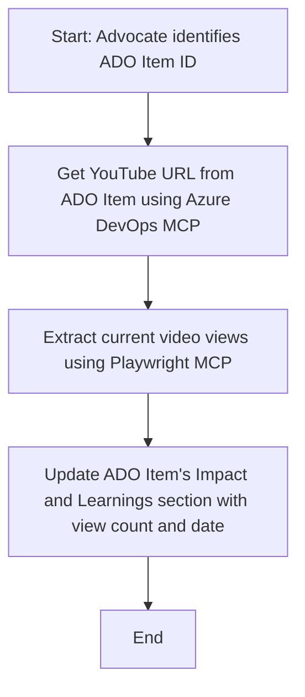

<!--
CO_OP_TRANSLATOR_METADATA:
{
  "original_hash": "14a2dfbea55ef735660a06bd6bdfe5f3",
  "translation_date": "2025-06-13T21:38:17+00:00",
  "source_file": "09-CaseStudy/UpdateADOItemsFromYT.md",
  "language_code": "cs"
}
-->
# Case Study: Aktualisieren von Azure DevOps-Elementen mit YouTube-Daten mithilfe von MCP

> **Disclaimer:** Es gibt bereits Online-Tools und Berichte, die den Prozess der Aktualisierung von Azure DevOps-Elementen mit Daten von Plattformen wie YouTube automatisieren können. Das folgende Szenario dient ausschließlich als Beispiel, um zu zeigen, wie MCP-Tools für Automatisierungs- und Integrationsaufgaben eingesetzt werden können.

## Übersicht

Diese Fallstudie zeigt ein Beispiel, wie das Model Context Protocol (MCP) und seine Tools verwendet werden können, um den Prozess der Aktualisierung von Azure DevOps (ADO) Arbeitselementen mit Informationen aus Online-Plattformen wie YouTube zu automatisieren. Das beschriebene Szenario ist nur eine von vielen möglichen Anwendungen dieser Tools, die an verschiedene Automatisierungsbedürfnisse angepasst werden können.

In diesem Beispiel verfolgt ein Advocate Online-Sitzungen über ADO-Elemente, wobei jedes Element eine YouTube-Video-URL enthält. Durch den Einsatz der MCP-Tools kann der Advocate die ADO-Elemente automatisch und wiederholbar mit den neuesten Videostatistiken, wie der Anzahl der Aufrufe, aktuell halten. Dieser Ansatz lässt sich auf weitere Anwendungsfälle übertragen, bei denen Informationen aus Online-Quellen in ADO oder andere Systeme integriert werden müssen.

## Szenario

Ein Advocate ist dafür verantwortlich, die Wirkung von Online-Sitzungen und Community-Engagements zu verfolgen. Jede Sitzung wird als ADO-Arbeitselement im Projekt 'DevRel' protokolliert, und das Arbeitselement enthält ein Feld für die YouTube-Video-URL. Um die Reichweite der Sitzung genau zu berichten, muss der Advocate das ADO-Element mit der aktuellen Anzahl der Videoaufrufe und dem Datum der Datenerfassung aktualisieren.

## Verwendete Tools

- [Azure DevOps MCP](https://github.com/microsoft/azure-devops-mcp): Ermöglicht den programmatischen Zugriff und die Aktualisierung von ADO-Arbeitselementen über MCP.
- [Playwright MCP](https://github.com/microsoft/playwright-mcp): Automatisiert Browseraktionen, um Live-Daten von Webseiten wie YouTube-Video-Statistiken zu extrahieren.

## Schritt-für-Schritt Arbeitsablauf

1. **ADO-Element identifizieren**: Beginnen Sie mit der ADO-Arbeitselement-ID (z. B. 1234) im Projekt 'DevRel'.
2. **YouTube-URL abrufen**: Verwenden Sie das Azure DevOps MCP-Tool, um die YouTube-URL aus dem Arbeitselement zu erhalten.
3. **Videoaufrufe extrahieren**: Nutzen Sie das Playwright MCP-Tool, um die YouTube-URL aufzurufen und die aktuelle Anzahl der Aufrufe zu ermitteln.
4. **ADO-Element aktualisieren**: Schreiben Sie die neuesten Aufrufzahlen und das Abrufdatum in den Abschnitt 'Impact and Learnings' des ADO-Arbeitselements mithilfe des Azure DevOps MCP-Tools.

## Beispiel Prompt

```bash
- Work with the ADO Item ID: 1234
- The project is '2025-Awesome'
- Get the YouTube URL for the ADO item
- Use Playwright to get the current views from the YouTube video
- Update the ADO item with the current video views and the updated date of the information
```

## Mermaid-Flussdiagramm



## Technische Umsetzung

- **MCP-Orchestrierung**: Der Arbeitsablauf wird von einem MCP-Server gesteuert, der den Einsatz der Azure DevOps MCP- und Playwright MCP-Tools koordiniert.
- **Automatisierung**: Der Prozess kann manuell gestartet oder zeitgesteuert ausgeführt werden, um die ADO-Elemente stets aktuell zu halten.
- **Erweiterbarkeit**: Das gleiche Muster lässt sich auf weitere Online-Metriken (z. B. Likes, Kommentare) oder andere Plattformen ausweiten.

## Ergebnisse und Auswirkungen

- **Effizienz**: Verringert den manuellen Aufwand für Advocates durch Automatisierung der Datenabfrage und Aktualisierung der Videostatistiken.
- **Genauigkeit**: Stellt sicher, dass ADO-Elemente stets die aktuellsten verfügbaren Daten aus Online-Quellen widerspiegeln.
- **Wiederholbarkeit**: Bietet einen wiederverwendbaren Workflow für ähnliche Szenarien mit anderen Datenquellen oder Metriken.

## Referenzen

- [Azure DevOps MCP](https://github.com/microsoft/azure-devops-mcp)
- [Playwright MCP](https://github.com/microsoft/playwright-mcp)
- [Model Context Protocol (MCP)](https://modelcontextprotocol.io/)

**Prohlášení o vyloučení odpovědnosti**:  
Tento dokument byl přeložen pomocí AI překladatelské služby [Co-op Translator](https://github.com/Azure/co-op-translator). Přestože usilujeme o přesnost, mějte prosím na paměti, že automatizované překlady mohou obsahovat chyby nebo nepřesnosti. Původní dokument v jeho mateřském jazyce by měl být považován za autoritativní zdroj. Pro důležité informace se doporučuje profesionální lidský překlad. Nejsme odpovědní za jakékoliv nedorozumění nebo chybné interpretace vyplývající z použití tohoto překladu.