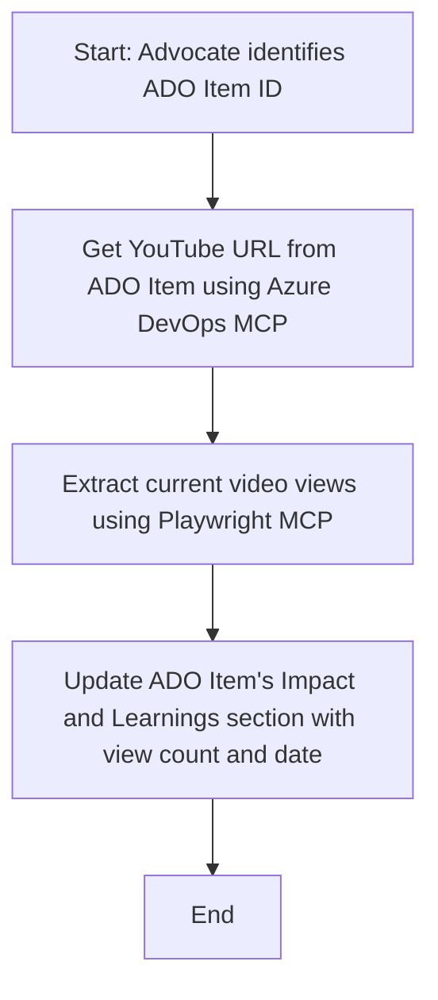

<!--
CO_OP_TRANSLATOR_METADATA:
{
  "original_hash": "14a2dfbea55ef735660a06bd6bdfe5f3",
  "translation_date": "2025-07-14T06:15:04+00:00",
  "source_file": "09-CaseStudy/UpdateADOItemsFromYT.md",
  "language_code": "cs"
}
-->
# Případová studie: Aktualizace položek Azure DevOps pomocí dat z YouTube s MCP

> **Disclaimer:** Existují online nástroje a reporty, které dokážou automatizovat proces aktualizace položek Azure DevOps daty z platforem jako YouTube. Následující scénář slouží pouze jako ukázkový případ, jak lze nástroje MCP využít pro automatizaci a integraci.

## Přehled

Tato případová studie ukazuje jeden příklad, jak lze Model Context Protocol (MCP) a jeho nástroje použít k automatizaci aktualizace pracovních položek Azure DevOps (ADO) informacemi získanými z online platforem, jako je YouTube. Popisovaný scénář je jen jednou z ukázek širších možností těchto nástrojů, které lze přizpůsobit mnoha podobným automatizačním potřebám.

V tomto příkladu Advocate sleduje online sezení pomocí položek ADO, kde každá položka obsahuje URL videa na YouTube. Díky nástrojům MCP může Advocate udržovat položky ADO aktuální s nejnovějšími metrikami videa, jako je počet zhlédnutí, opakovatelným a automatizovaným způsobem. Tento přístup lze zobecnit i na jiné případy, kdy je potřeba integrovat informace z online zdrojů do ADO nebo jiných systémů.

## Scénář

Advocate je zodpovědný za sledování dopadu online sezení a zapojení komunity. Každé sezení je zaznamenáno jako pracovní položka ADO v projektu 'DevRel' a položka obsahuje pole s URL videa na YouTube. Pro přesné reportování dosahu sezení musí Advocate aktualizovat položku ADO o aktuální počet zhlédnutí videa a datum, kdy byla tato informace získána.

## Použité nástroje

- [Azure DevOps MCP](https://github.com/microsoft/azure-devops-mcp): Umožňuje programový přístup a aktualizace pracovních položek ADO přes MCP.
- [Playwright MCP](https://github.com/microsoft/playwright-mcp): Automatizuje akce v prohlížeči pro získání živých dat z webových stránek, například statistik videí na YouTube.

## Postup krok za krokem

1. **Identifikace položky ADO**: Začít s ID pracovní položky ADO (např. 1234) v projektu 'DevRel'.
2. **Získání URL YouTube**: Pomocí nástroje Azure DevOps MCP získat URL videa z pracovní položky.
3. **Získání počtu zhlédnutí**: Pomocí nástroje Playwright MCP přejít na URL YouTube a získat aktuální počet zhlédnutí.
4. **Aktualizace položky ADO**: Zapsat nejnovější počet zhlédnutí a datum získání do sekce 'Impact and Learnings' pracovní položky ADO pomocí nástroje Azure DevOps MCP.

## Příklad promptu

```bash
- Work with the ADO Item ID: 1234
- The project is '2025-Awesome'
- Get the YouTube URL for the ADO item
- Use Playwright to get the current views from the YouTube video
- Update the ADO item with the current video views and the updated date of the information
```

## Mermaid diagram toku



## Technická implementace

- **Orchestrace MCP**: Pracovní postup je řízen MCP serverem, který koordinuje použití nástrojů Azure DevOps MCP a Playwright MCP.
- **Automatizace**: Proces může být spuštěn ručně nebo naplánován, aby se pravidelně aktualizovaly položky ADO.
- **Rozšiřitelnost**: Stejný vzor lze rozšířit pro aktualizaci položek ADO o další online metriky (např. lajky, komentáře) nebo z jiných platforem.

## Výsledky a dopad

- **Efektivita**: Snižuje manuální práci Advocate tím, že automatizuje získávání a aktualizaci metrik videí.
- **Přesnost**: Zajišťuje, že položky ADO obsahují nejaktuálnější data z online zdrojů.
- **Opakovatelnost**: Poskytuje znovupoužitelný pracovní postup pro podobné scénáře zahrnující jiné datové zdroje nebo metriky.

## Reference

- [Azure DevOps MCP](https://github.com/microsoft/azure-devops-mcp)
- [Playwright MCP](https://github.com/microsoft/playwright-mcp)
- [Model Context Protocol (MCP)](https://modelcontextprotocol.io/)

**Prohlášení o vyloučení odpovědnosti**:  
Tento dokument byl přeložen pomocí AI překladatelské služby [Co-op Translator](https://github.com/Azure/co-op-translator). I když usilujeme o přesnost, mějte prosím na paměti, že automatické překlady mohou obsahovat chyby nebo nepřesnosti. Původní dokument v jeho mateřském jazyce by měl být považován za závazný zdroj. Pro důležité informace se doporučuje profesionální lidský překlad. Nejsme odpovědní za jakékoliv nedorozumění nebo nesprávné výklady vyplývající z použití tohoto překladu.