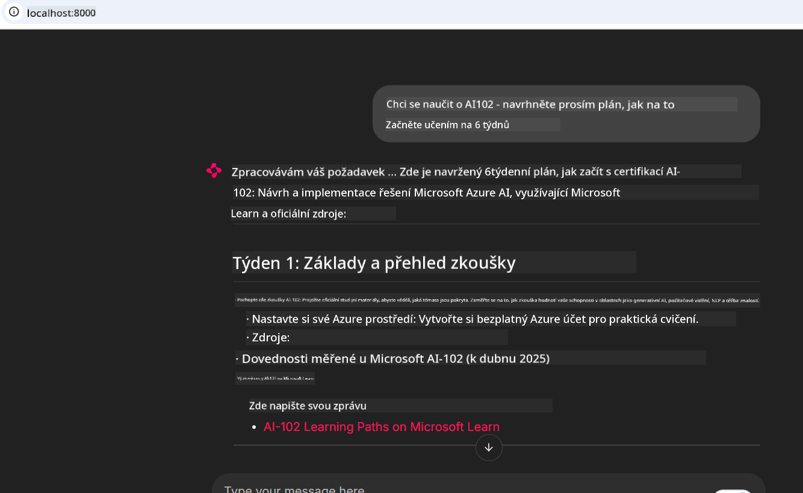

<!--
CO_OP_TRANSLATOR_METADATA:
{
  "original_hash": "4319d291c9d124ecafea52b3d04bfa0e",
  "translation_date": "2025-07-14T06:28:42+00:00",
  "source_file": "09-CaseStudy/docs-mcp/README.md",
  "language_code": "cs"
}
-->
# Případová studie: Připojení ke Microsoft Learn Docs MCP serveru z klienta

Stalo se vám někdy, že jste přeskakovali mezi dokumentačními stránkami, Stack Overflow a nekonečnými záložkami ve vyhledávači, zatímco jste se snažili vyřešit problém ve svém kódu? Možná máte druhý monitor jen na dokumentaci, nebo neustále přepínáte mezi IDE a prohlížečem pomocí Alt+Tab. Nebylo by lepší mít dokumentaci přímo ve svém pracovním toku – integrovanou do vašich aplikací, IDE nebo dokonce vlastních nástrojů? V této případové studii si ukážeme, jak přesně to udělat připojením přímo k Microsoft Learn Docs MCP serveru z vaší vlastní klientské aplikace.

## Přehled

Moderní vývoj není jen o psaní kódu – jde o nalezení správných informací ve správný čas. Dokumentace je všude, ale málokdy tam, kde ji nejvíce potřebujete: přímo ve vašich nástrojích a pracovních postupech. Integrací získávání dokumentace přímo do vašich aplikací můžete ušetřit čas, snížit přepínání kontextu a zvýšit produktivitu. V této části vám ukážeme, jak připojit klienta k Microsoft Learn Docs MCP serveru, abyste mohli získávat aktuální, kontextově relevantní dokumentaci, aniž byste opustili svou aplikaci.

Projdeme si proces navázání spojení, odeslání požadavku a efektivního zpracování streamovaných odpovědí. Tento přístup nejen zjednodušuje váš pracovní tok, ale také otevírá cestu k vytváření chytřejších a užitečnějších nástrojů pro vývojáře.

## Cíle učení

Proč to děláme? Protože nejlepší vývojářské zážitky jsou ty, které odstraňují překážky. Představte si svět, kde váš kódový editor, chatbot nebo webová aplikace dokáže okamžitě odpovědět na vaše dotazy ohledně dokumentace pomocí nejnovějšího obsahu z Microsoft Learn. Na konci této kapitoly budete umět:

- Porozumět základům komunikace MCP server-klient pro dokumentaci
- Implementovat konzolovou nebo webovou aplikaci pro připojení k Microsoft Learn Docs MCP serveru
- Používat streamovací HTTP klienty pro získávání dokumentace v reálném čase
- Logovat a interpretovat odpovědi dokumentace ve vaší aplikaci

Ukážeme vám, jak tyto dovednosti využít k tvorbě nástrojů, které nejsou jen reaktivní, ale skutečně interaktivní a kontextově uvědomělé.

## Scénář 1 - Získávání dokumentace v reálném čase s MCP

V tomto scénáři vám ukážeme, jak připojit klienta k Microsoft Learn Docs MCP serveru, abyste mohli získávat aktuální, kontextově relevantní dokumentaci, aniž byste opustili svou aplikaci.

Pojďme to vyzkoušet v praxi. Vaším úkolem je napsat aplikaci, která se připojí k Microsoft Learn Docs MCP serveru, zavolá nástroj `microsoft_docs_search` a zaznamená streamovanou odpověď do konzole.

### Proč tento přístup?
Protože je to základ pro vytváření pokročilejších integrací – ať už chcete pohánět chatbota, rozšíření IDE nebo webovou nástěnku.

Kód a instrukce pro tento scénář najdete ve složce [`solution`](./solution/README.md) v rámci této případové studie. Kroky vás provedou nastavením připojení:
- Použijte oficiální MCP SDK a streamovací HTTP klienta pro připojení
- Zavolejte nástroj `microsoft_docs_search` s parametrem dotazu pro získání dokumentace
- Implementujte správné logování a zpracování chyb
- Vytvořte interaktivní konzolové rozhraní, které umožní uživatelům zadávat více vyhledávacích dotazů

Tento scénář demonstruje, jak:
- Připojit se k Docs MCP serveru
- Odeslat dotaz
- Parsovat a vypsat výsledky

Takto může vypadat spuštění řešení:

```
Prompt> What is Azure Key Vault?
Answer> Azure Key Vault is a cloud service for securely storing and accessing secrets. ...
```

Níže je minimální ukázkové řešení. Kompletní kód a podrobnosti jsou k dispozici ve složce solution.

<details>
<summary>Python</summary>

```python
import asyncio
from mcp.client.streamable_http import streamablehttp_client
from mcp import ClientSession

async def main():
    async with streamablehttp_client("https://learn.microsoft.com/api/mcp") as (read_stream, write_stream, _):
        async with ClientSession(read_stream, write_stream) as session:
            await session.initialize()
            result = await session.call_tool("microsoft_docs_search", {"query": "Azure Functions best practices"})
            print(result.content)

if __name__ == "__main__":
    asyncio.run(main())
```

- Pro kompletní implementaci a logování viz [`scenario1.py`](../../../../09-CaseStudy/docs-mcp/solution/python/scenario1.py).
- Pro instrukce k instalaci a použití viz soubor [`README.md`](./solution/python/README.md) ve stejné složce.
</details>

## Scénář 2 - Interaktivní webová aplikace pro generování studijního plánu s MCP

V tomto scénáři se naučíte, jak integrovat Docs MCP do webového vývojového projektu. Cílem je umožnit uživatelům vyhledávat dokumentaci Microsoft Learn přímo z webového rozhraní, čímž bude dokumentace okamžitě dostupná přímo ve vaší aplikaci nebo na webu.

Ukážeme si, jak:
- Nastavit webovou aplikaci
- Připojit se k Docs MCP serveru
- Zpracovat vstup uživatele a zobrazit výsledky

Takto může vypadat spuštění řešení:

```
User> I want to learn about AI102 - so suggest the roadmap to get it started from learn for 6 weeks

Assistant> Here’s a detailed 6-week roadmap to start your preparation for the AI-102: Designing and Implementing a Microsoft Azure AI Solution certification, using official Microsoft resources and focusing on exam skills areas:

---
## Week 1: Introduction & Fundamentals
- **Understand the Exam**: Review the [AI-102 exam skills outline](https://learn.microsoft.com/en-us/credentials/certifications/exams/ai-102/).
- **Set up Azure**: Sign up for a free Azure account if you don't have one.
- **Learning Path**: [Introduction to Azure AI services](https://learn.microsoft.com/en-us/training/modules/intro-to-azure-ai/)
- **Focus**: Get familiar with Azure portal, AI capabilities, and necessary tools.

....more weeks of the roadmap...

Let me know if you want module-specific recommendations or need more customized weekly tasks!
```

Níže je minimální ukázkové řešení. Kompletní kód a podrobnosti jsou k dispozici ve složce solution.



<details>
<summary>Python (Chainlit)</summary>

Chainlit je framework pro tvorbu konverzačních AI webových aplikací. Umožňuje snadno vytvářet interaktivní chatboty a asistenty, kteří mohou volat MCP nástroje a zobrazovat výsledky v reálném čase. Je ideální pro rychlé prototypování a uživatelsky přívětivá rozhraní.

```python
import chainlit as cl
import requests

MCP_URL = "https://learn.microsoft.com/api/mcp"

@cl.on_message
def handle_message(message):
    query = {"question": message}
    response = requests.post(MCP_URL, json=query)
    if response.ok:
        result = response.json()
        cl.Message(content=result.get("answer", "No answer found.")).send()
    else:
        cl.Message(content="Error: " + response.text).send()
```

- Pro kompletní implementaci viz [`scenario2.py`](../../../../09-CaseStudy/docs-mcp/solution/python/scenario2.py).
- Pro instrukce k nastavení a spuštění viz [`README.md`](./solution/python/README.md).
</details>

## Scénář 3: Dokumentace přímo v editoru s MCP serverem ve VS Code

Pokud chcete mít Microsoft Learn Docs přímo ve VS Code (místo přepínání záložek v prohlížeči), můžete použít MCP server ve svém editoru. To vám umožní:
- Vyhledávat a číst dokumentaci ve VS Code bez opuštění vývojového prostředí.
- Odkazovat na dokumentaci a vkládat odkazy přímo do README nebo studijních materiálů.
- Využít GitHub Copilot a MCP společně pro plynulý, AI-poháněný pracovní tok s dokumentací.

**Ukážeme vám, jak:**
- Přidat platný soubor `.vscode/mcp.json` do kořenové složky vašeho workspace (viz příklad níže).
- Otevřít panel MCP nebo použít příkazovou paletu ve VS Code pro vyhledávání a vkládání dokumentace.
- Odkazovat na dokumentaci přímo ve vašich markdown souborech během práce.
- Kombinovat tento pracovní tok s GitHub Copilot pro ještě vyšší produktivitu.

Zde je příklad, jak nastavit MCP server ve VS Code:

```json
{
  "servers": {
    "LearnDocsMCP": {
      "url": "https://learn.microsoft.com/api/mcp"
    }
  }
}
```

</details>

> Pro podrobný průvodce s obrázky a krok za krokem navštivte [`README.md`](./solution/scenario3/README.md).


Tento přístup je ideální pro každého, kdo vytváří technické kurzy, píše dokumentaci nebo vyvíjí kód s častou potřebou odkazování.

## Hlavní poznatky

Integrace dokumentace přímo do vašich nástrojů není jen pohodlí – je to zásadní změna pro produktivitu. Připojením ke Microsoft Learn Docs MCP serveru z vašeho klienta můžete:

- Eliminovat přepínání kontextu mezi kódem a dokumentací
- Získávat aktuální, kontextově relevantní dokumentaci v reálném čase
- Vytvářet chytřejší, interaktivnější nástroje pro vývojáře

Tyto dovednosti vám pomohou vytvářet řešení, která nejsou jen efektivní, ale také příjemná na používání.

## Další zdroje

Pro hlubší pochopení prozkoumejte tyto oficiální zdroje:

- [Microsoft Learn Docs MCP Server (GitHub)](https://github.com/MicrosoftDocs/mcp)
- [Začínáme s Azure MCP Serverem (mcp-python)](https://learn.microsoft.com/en-us/azure/developer/azure-mcp-server/get-started#create-the-python-app)
- [Co je Azure MCP Server?](https://learn.microsoft.com/en-us/azure/developer/azure-mcp-server/)
- [Úvod do Model Context Protocol (MCP)](https://modelcontextprotocol.io/introduction)
- [Přidání pluginů z MCP serveru (Python)](https://learn.microsoft.com/en-us/semantic-kernel/concepts/plugins/adding-mcp-plugins)

**Prohlášení o vyloučení odpovědnosti**:  
Tento dokument byl přeložen pomocí AI překladatelské služby [Co-op Translator](https://github.com/Azure/co-op-translator). I když usilujeme o přesnost, mějte prosím na paměti, že automatizované překlady mohou obsahovat chyby nebo nepřesnosti. Původní dokument v jeho mateřském jazyce by měl být považován za autoritativní zdroj. Pro důležité informace se doporučuje profesionální lidský překlad. Nejsme odpovědní za jakékoliv nedorozumění nebo nesprávné výklady vyplývající z použití tohoto překladu.