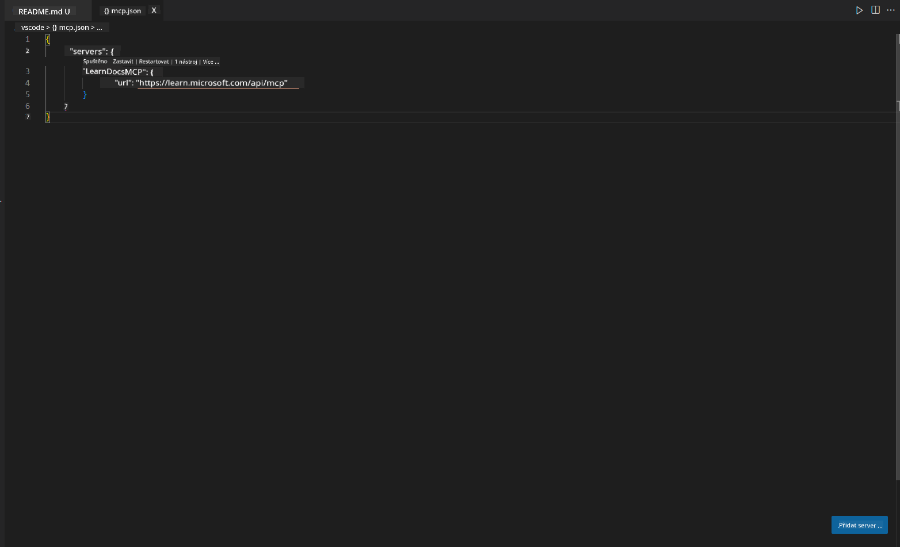
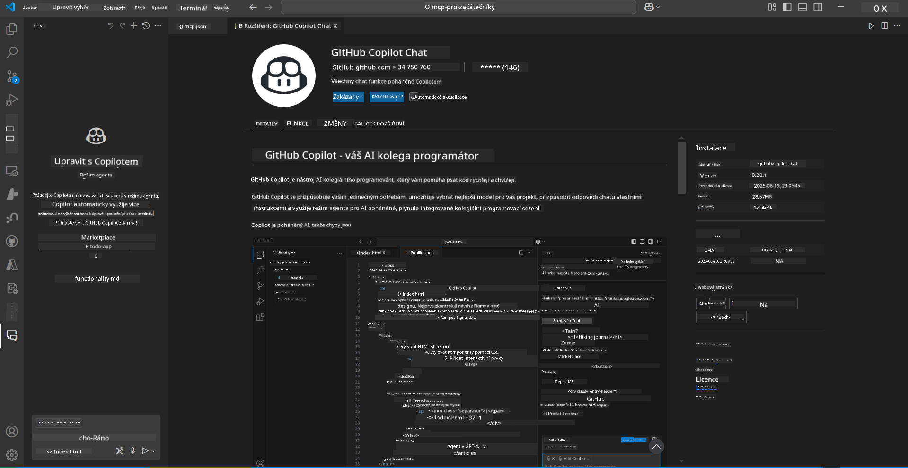
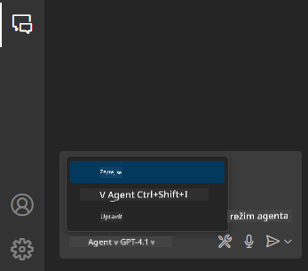
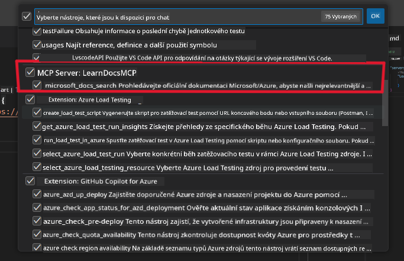
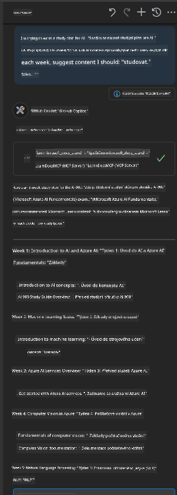
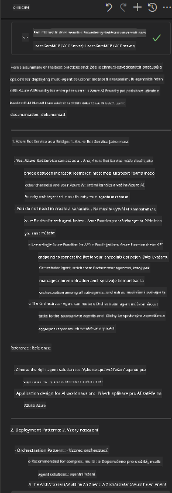

<!--
CO_OP_TRANSLATOR_METADATA:
{
  "original_hash": "db532b1ec386c9ce38c791653dc3c881",
  "translation_date": "2025-07-14T06:55:22+00:00",
  "source_file": "09-CaseStudy/docs-mcp/solution/scenario3/README.md",
  "language_code": "cs"
}
-->
# Scénář 3: Dokumentace přímo v editoru s MCP serverem ve VS Code

## Přehled

V tomto scénáři se naučíte, jak přenést Microsoft Learn Docs přímo do prostředí Visual Studio Code pomocí MCP serveru. Místo neustálého přepínání mezi záložkami v prohlížeči při hledání dokumentace můžete oficiální dokumentaci vyhledávat, číst a odkazovat přímo v editoru. Tento přístup zjednodušuje váš pracovní postup, pomáhá vám zůstat soustředění a umožňuje bezproblémovou integraci s nástroji jako GitHub Copilot.

- Vyhledávejte a čtěte dokumentaci přímo ve VS Code, aniž byste opustili své vývojové prostředí.
- Vkládejte odkazy na dokumentaci přímo do README nebo souborů kurzu.
- Používejte GitHub Copilot a MCP společně pro plynulý pracovní tok s podporou AI.

## Cíle učení

Na konci této kapitoly budete umět nastavit a používat MCP server ve VS Code pro zlepšení vaší dokumentace a vývojového workflow. Budete schopni:

- Nakonfigurovat pracovní prostor tak, aby využíval MCP server pro vyhledávání dokumentace.
- Vyhledávat a vkládat dokumentaci přímo z VS Code.
- Kombinovat sílu GitHub Copilota a MCP pro produktivnější workflow s podporou AI.

Tyto dovednosti vám pomohou zůstat soustředění, zlepšit kvalitu dokumentace a zvýšit vaši produktivitu jako vývojáře nebo technického pisatele.

## Řešení

Pro přístup k dokumentaci přímo v editoru budete postupovat podle série kroků, které integrují MCP server s VS Code a GitHub Copilotem. Toto řešení je ideální pro autory kurzů, tvůrce dokumentace a vývojáře, kteří chtějí zůstat soustředění v editoru při práci s dokumentací a Copilotem.

- Rychle přidávejte odkazy na dokumentaci do README při psaní kurzu nebo projektové dokumentace.
- Používejte Copilota k generování kódu a MCP k okamžitému vyhledání a citování relevantní dokumentace.
- Zůstaňte soustředění v editoru a zvyšte svou produktivitu.

### Podrobný návod

Pro začátek postupujte podle těchto kroků. Ke každému kroku můžete přidat screenshot z adresáře assets, který vizuálně znázorní postup.

1. **Přidejte konfiguraci MCP:**
   V kořenovém adresáři projektu vytvořte soubor `.vscode/mcp.json` a vložte do něj následující konfiguraci:
   ```json
   {
     "servers": {
       "LearnDocsMCP": {
         "url": "https://learn.microsoft.com/api/mcp"
       }
     }
   }
   ```
   Tato konfigurace říká VS Code, jak se připojit k [`Microsoft Learn Docs MCP serveru`](https://github.com/MicrosoftDocs/mcp).
   
   
    
2. **Otevřete panel GitHub Copilot Chat:**
   Pokud ještě nemáte nainstalované rozšíření GitHub Copilot, přejděte do zobrazení Extensions ve VS Code a nainstalujte ho. Můžete si ho stáhnout přímo z [Visual Studio Code Marketplace](https://marketplace.visualstudio.com/items?itemName=GitHub.copilot-chat). Poté otevřete panel Copilot Chat v postranním panelu.

   

3. **Povolte agent mode a ověřte nástroje:**
   V panelu Copilot Chat zapněte agent mode.

   

   Po zapnutí agent mode ověřte, že MCP server je uveden mezi dostupnými nástroji. To zajistí, že Copilot agent má přístup k dokumentačnímu serveru a může načítat relevantní informace.
   
   
4. **Začněte nový chat a zadejte dotaz agentovi:**
   Otevřete nový chat v panelu Copilot Chat. Nyní můžete agenta požádat o informace z dokumentace. Agent použije MCP server k načtení a zobrazení relevantní dokumentace Microsoft Learn přímo ve vašem editoru.

   - *„Snažím se napsat studijní plán pro téma X. Budu se mu věnovat 8 týdnů, pro každý týden navrhni obsah, který bych měl studovat.“*

   

5. **Živý dotaz:**

   > Podívejme se na živý dotaz z kanálu [#get-help](https://discord.gg/D6cRhjHWSC) na Discordu Azure AI Foundry ([zobrazit původní zprávu](https://discord.com/channels/1113626258182504448/1385498306720829572)):
   
   *„Hledám odpovědi, jak nasadit multi-agentní řešení s AI agenty vyvinutými na Azure AI Foundry. Vidím, že neexistuje přímá metoda nasazení, jako jsou kanály v Copilot Studiu. Jaké jsou tedy různé způsoby nasazení pro podnikové uživatele, aby mohli spolupracovat a dokončit práci?
Existuje mnoho článků/blogů, které uvádějí, že lze použít Azure Bot service jako most mezi MS Teams a Azure AI Foundry agenty. Fungovalo by to, kdybych nastavil Azure bota, který se připojuje k Orchestrator Agentovi na Azure AI Foundry přes Azure function pro orchestraci, nebo je potřeba vytvořit Azure function pro každého AI agenta v multi-agentním řešení, aby orchestraci prováděl Bot framework? Jakékoliv další návrhy jsou vítány.“*

   

   Agent odpoví s relevantními odkazy na dokumentaci a shrnutími, které můžete přímo vložit do svých markdown souborů nebo použít jako reference ve svém kódu.
   
### Ukázkové dotazy

Zde je několik příkladů dotazů, které můžete vyzkoušet. Tyto dotazy ukážou, jak MCP server a Copilot spolupracují a poskytují okamžitou, kontextově relevantní dokumentaci a odkazy přímo ve VS Code:

- „Ukáž mi, jak používat Azure Functions triggers.“
- „Vlož odkaz na oficiální dokumentaci Azure Key Vault.“
- „Jaké jsou nejlepší postupy pro zabezpečení Azure zdrojů?“
- „Najdi quickstart pro Azure AI služby.“

Tyto dotazy demonstrují, jak MCP server a Copilot společně umožňují rychlý přístup k dokumentaci a referencím bez opuštění VS Code.

---

**Prohlášení o vyloučení odpovědnosti**:  
Tento dokument byl přeložen pomocí AI překladatelské služby [Co-op Translator](https://github.com/Azure/co-op-translator). I když usilujeme o přesnost, mějte prosím na paměti, že automatizované překlady mohou obsahovat chyby nebo nepřesnosti. Původní dokument v jeho mateřském jazyce by měl být považován za autoritativní zdroj. Pro důležité informace se doporučuje profesionální lidský překlad. Nejsme odpovědní za jakékoliv nedorozumění nebo nesprávné výklady vyplývající z použití tohoto překladu.