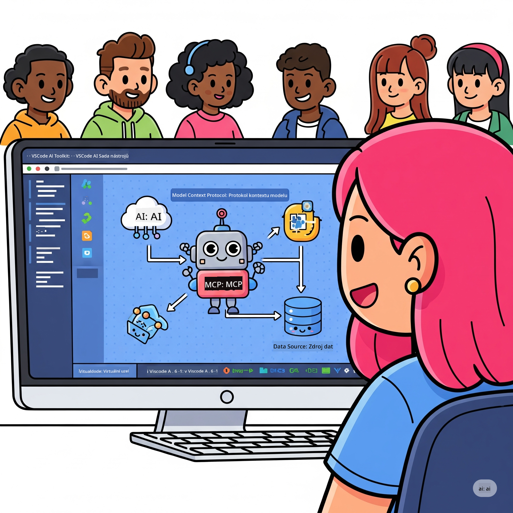
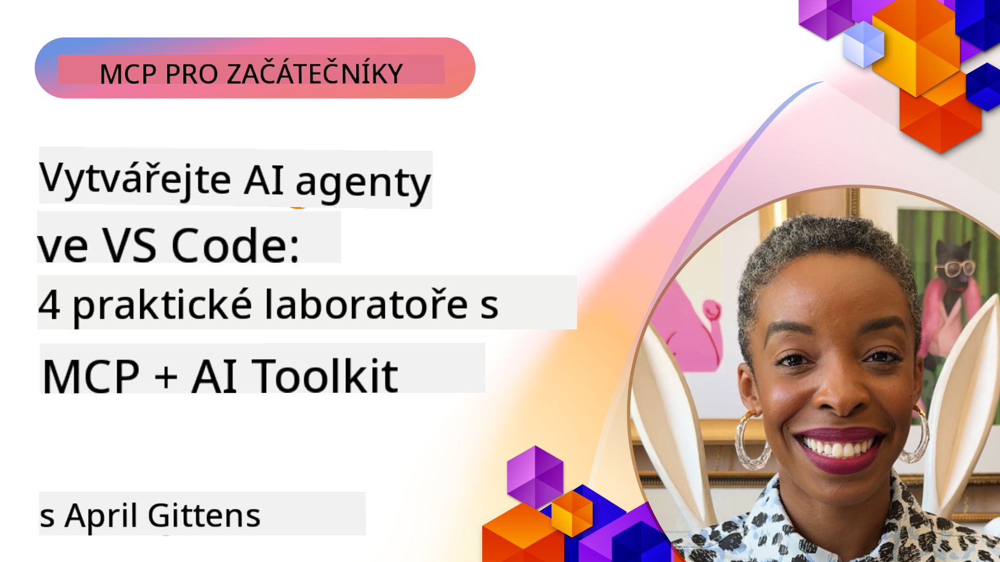

<!--
CO_OP_TRANSLATOR_METADATA:
{
  "original_hash": "1b000fd6e1b04c047578bfc5d07d54eb",
  "translation_date": "2025-08-19T15:48:36+00:00",
  "source_file": "10-StreamliningAIWorkflowsBuildingAnMCPServerWithAIToolkit/README.md",
  "language_code": "cs"
}
-->
# Zjednodušení AI pracovních postupů: Vytvoření MCP serveru s AI Toolkitem

## 🎯 Přehled

_(Klikněte na obrázek výše pro zhlédnutí videa této lekce)_

Vítejte na **Workshopu Model Context Protocol (MCP)**! Tento komplexní praktický workshop spojuje dvě špičkové technologie, které mění vývoj AI aplikací:

- **🔗 Model Context Protocol (MCP)**: Otevřený standard pro bezproblémovou integraci AI nástrojů
- **🛠️ AI Toolkit pro Visual Studio Code (AITK)**: Výkonné rozšíření od Microsoftu pro vývoj AI

### 🎓 Co se naučíte

Na konci tohoto workshopu zvládnete umění vytvářet inteligentní aplikace, které propojují AI modely s reálnými nástroji a službami. Od automatizovaného testování po vlastní API integrace získáte praktické dovednosti pro řešení složitých obchodních výzev.

## 🏗️ Technologický stack

### 🔌 Model Context Protocol (MCP)

MCP je **"USB-C pro AI"** - univerzální standard, který propojuje AI modely s externími nástroji a datovými zdroji.

**✨ Klíčové vlastnosti:**

- 🔄 **Standardizovaná integrace**: Univerzální rozhraní pro připojení AI nástrojů
- 🏛️ **Flexibilní architektura**: Lokální i vzdálené servery přes stdio/SSE transport
- 🧰 **Bohatý ekosystém**: Nástroje, výzvy a zdroje v jednom protokolu
- 🔒 **Připraveno pro podniky**: Vestavěná bezpečnost a spolehlivost

**🎯 Proč je MCP důležité:**
Stejně jako USB-C odstranilo chaos s kabely, MCP odstraňuje složitost AI integrací. Jeden protokol, nekonečné možnosti.

### 🤖 AI Toolkit pro Visual Studio Code (AITK)

Vlajkové rozšíření Microsoftu pro vývoj AI, které promění VS Code v AI centrum.

**🚀 Hlavní schopnosti:**

- 📦 **Katalog modelů**: Přístup k modelům z Azure AI, GitHubu, Hugging Face, Ollama
- ⚡ **Lokální inference**: Optimalizované ONNX provádění na CPU/GPU/NPU
- 🏗️ **Agent Builder**: Vizualizovaný vývoj AI agentů s integrací MCP
- 🎭 **Multi-modální podpora**: Text, vizuální a strukturované výstupy

**💡 Výhody vývoje:**

- Nasazení modelů bez konfigurace
- Vizualizované navrhování výzev
- Testovací prostředí v reálném čase
- Bezproblémová integrace MCP serveru

## 📚 Vzdělávací cesta

### [🚀 Modul 1: Základy AI Toolkitu](./lab1/README.md)

**Délka**: 15 minut

- 🛠️ Instalace a konfigurace AI Toolkitu pro VS Code
- 🗂️ Prozkoumání katalogu modelů (100+ modelů z GitHubu, ONNX, OpenAI, Anthropic, Google)
- 🎮 Ovládnutí interaktivního testovacího prostředí pro testování modelů v reálném čase
- 🤖 Vytvoření prvního AI agenta pomocí Agent Builderu
- 📊 Hodnocení výkonu modelu pomocí vestavěných metrik (F1, relevance, podobnost, koherence)
- ⚡ Naučte se dávkové zpracování a multi-modální schopnosti

**🎯 Výsledek učení**: Vytvoření funkčního AI agenta s komplexním pochopením schopností AITK

### [🌐 Modul 2: Základy MCP s AI Toolkitem](./lab2/README.md)

**Délka**: 20 minut

- 🧠 Ovládnutí architektury a konceptů Model Context Protocol (MCP)
- 🌐 Prozkoumání ekosystému MCP serverů od Microsoftu
- 🤖 Vytvoření agenta pro automatizaci prohlížeče pomocí Playwright MCP serveru
- 🔧 Integrace MCP serverů s Agent Builderem AI Toolkitu
- 📊 Konfigurace a testování MCP nástrojů v rámci vašich agentů
- 🚀 Export a nasazení agentů poháněných MCP pro produkční použití

**🎯 Výsledek učení**: Nasazení AI agenta obohaceného o externí nástroje prostřednictvím MCP

### [🔧 Modul 3: Pokročilý vývoj MCP s AI Toolkitem](./lab3/README.md)

**Délka**: 20 minut

- 💻 Vytvoření vlastních MCP serverů pomocí AI Toolkitu
- 🐍 Konfigurace a použití nejnovějšího MCP Python SDK (v1.9.3)
- 🔍 Nastavení a využití MCP Inspectoru pro ladění
- 🛠️ Vytvoření Weather MCP Serveru s profesionálními pracovními postupy ladění
- 🧪 Ladění MCP serverů v prostředích Agent Builder a Inspector

**🎯 Výsledek učení**: Vývoj a ladění vlastních MCP serverů s moderními nástroji

### [🐙 Modul 4: Praktický vývoj MCP - Vlastní GitHub Clone Server](./lab4/README.md)

**Délka**: 30 minut

- 🏗️ Vytvoření reálného GitHub Clone MCP Serveru pro vývojové pracovní postupy
- 🔄 Implementace chytrého klonování repozitářů s validací a zpracováním chyb
- 📁 Vytvoření inteligentní správy adresářů a integrace s VS Code
- 🤖 Použití GitHub Copilot Agent Mode s vlastními MCP nástroji
- 🛡️ Aplikace spolehlivosti připravené pro produkci a kompatibility napříč platformami

**🎯 Výsledek učení**: Nasazení produkčně připraveného MCP serveru, který zjednodušuje reálné vývojové pracovní postupy

## 💡 Reálné aplikace a dopad

### 🏢 Podnikové případy použití

#### 🔄 Automatizace DevOps

Transformujte svůj vývojový pracovní postup pomocí inteligentní automatizace:

- **Chytrá správa repozitářů**: AI řízené revize kódu a rozhodování o sloučení
- **Inteligentní CI/CD**: Automatizovaná optimalizace pipeline na základě změn kódu
- **Třídění problémů**: Automatická klasifikace a přiřazení chyb

#### 🧪 Revoluce v zajištění kvality

Zvyšte testování pomocí AI automatizace:

- **Inteligentní generování testů**: Automatické vytváření komplexních testovacích sad
- **Vizuální regresní testování**: AI detekce změn v uživatelském rozhraní
- **Monitorování výkonu**: Proaktivní identifikace a řešení problémů

#### 📊 Inteligence datových toků

Vytvářejte chytřejší pracovní postupy pro zpracování dat:

- **Adaptivní ETL procesy**: Samooptimalizující transformace dat
- **Detekce anomálií**: Monitorování kvality dat v reálném čase
- **Inteligentní směrování**: Chytrá správa datových toků

#### 🎧 Zlepšení zákaznické zkušenosti

Vytvářejte výjimečné interakce se zákazníky:

- **Podpora s ohledem na kontext**: AI agenti s přístupem k historii zákazníků
- **Proaktivní řešení problémů**: Prediktivní zákaznický servis
- **Multi-kanálová integrace**: Jednotná AI zkušenost napříč platformami

## 🛠️ Požadavky a nastavení

### 💻 Požadavky na systém

| Komponenta | Požadavek | Poznámky |
|------------|-----------|----------|
| **Operační systém** | Windows 10+, macOS 10.15+, Linux | Jakýkoli moderní OS |
| **Visual Studio Code** | Nejnovější stabilní verze | Vyžadováno pro AITK |
| **Node.js** | v18.0+ a npm | Pro vývoj MCP serverů |
| **Python** | 3.10+ | Volitelné pro Python MCP servery |
| **Paměť** | Minimálně 8GB RAM | Doporučeno 16GB pro lokální modely |

### 🔧 Vývojové prostředí

#### Doporučená rozšíření pro VS Code

- **AI Toolkit** (ms-windows-ai-studio.windows-ai-studio)
- **Python** (ms-python.python)
- **Python Debugger** (ms-python.debugpy)
- **GitHub Copilot** (GitHub.copilot) - Volitelné, ale užitečné

#### Volitelné nástroje

- **uv**: Moderní správce balíčků pro Python
- **MCP Inspector**: Vizualizační nástroj pro ladění MCP serverů
- **Playwright**: Pro příklady webové automatizace

## 🎖️ Výsledky učení a certifikační cesta

### 🏆 Kontrolní seznam dovedností

Po dokončení tohoto workshopu dosáhnete mistrovství v:

#### 🎯 Základní kompetence

- [ ] **Mistrovství MCP protokolu**: Hluboké pochopení architektury a implementačních vzorů
- [ ] **Znalost AITK**: Expertní úroveň používání AI Toolkitu pro rychlý vývoj
- [ ] **Vývoj vlastních serverů**: Vytváření, nasazení a údržba produkčních MCP serverů
- [ ] **Excelence v integraci nástrojů**: Bezproblémové propojení AI s existujícími pracovními postupy
- [ ] **Aplikace na řešení problémů**: Použití naučených dovedností na reálné obchodní výzvy

#### 🔧 Technické dovednosti

- [ ] Nastavení a konfigurace AI Toolkitu ve VS Code
- [ ] Návrh a implementace vlastních MCP serverů
- [ ] Integrace GitHub modelů s MCP architekturou
- [ ] Vytváření automatizovaných testovacích pracovních postupů s Playwright
- [ ] Nasazení AI agentů pro produkční použití
- [ ] Ladění a optimalizace výkonu MCP serverů

#### 🚀 Pokročilé schopnosti

- [ ] Architektura AI integrací v podnikovém měřítku
- [ ] Implementace bezpečnostních osvědčených postupů pro AI aplikace
- [ ] Návrh škálovatelných MCP serverových architektur
- [ ] Vytváření vlastních nástrojových řetězců pro specifické domény
- [ ] Mentorování ostatních ve vývoji zaměřeném na AI

## 📖 Další zdroje

- [Specifikace MCP](https://modelcontextprotocol.io/docs)
- [GitHub repozitář AI Toolkitu](https://github.com/microsoft/vscode-ai-toolkit)
- [Kolekce ukázkových MCP serverů](https://github.com/modelcontextprotocol/servers)
- [Příručka osvědčených postupů](https://modelcontextprotocol.io/docs/best-practices)

---

**🚀 Připraveni revolucionalizovat svůj vývojový pracovní postup s AI?**

Pojďme společně budovat budoucnost inteligentních aplikací s MCP a AI Toolkitem!

**Prohlášení**:  
Tento dokument byl přeložen pomocí služby pro automatický překlad [Co-op Translator](https://github.com/Azure/co-op-translator). I když se snažíme o přesnost, mějte prosím na paměti, že automatické překlady mohou obsahovat chyby nebo nepřesnosti. Původní dokument v jeho původním jazyce by měl být považován za závazný zdroj. Pro důležité informace doporučujeme profesionální lidský překlad. Neodpovídáme za žádná nedorozumění nebo nesprávné výklady vyplývající z použití tohoto překladu.