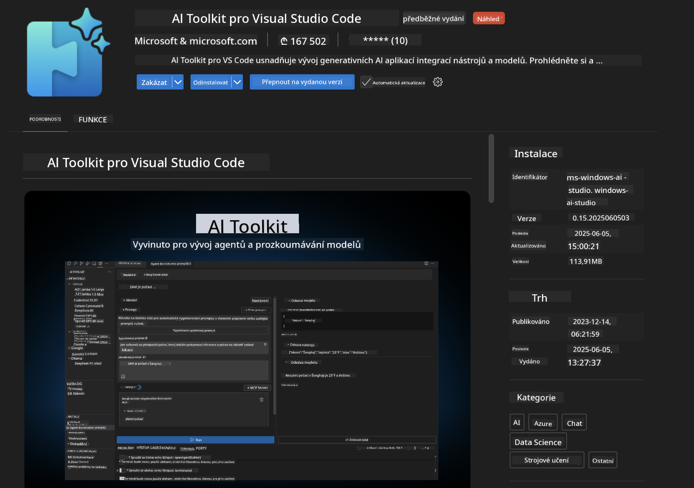
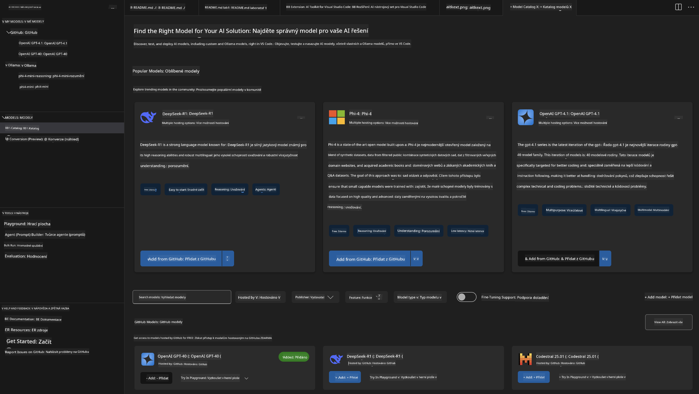
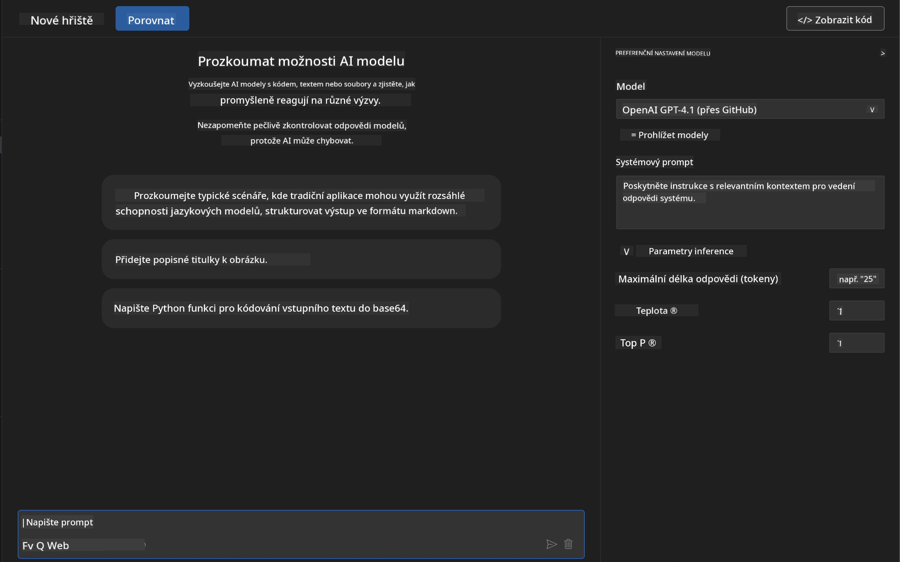
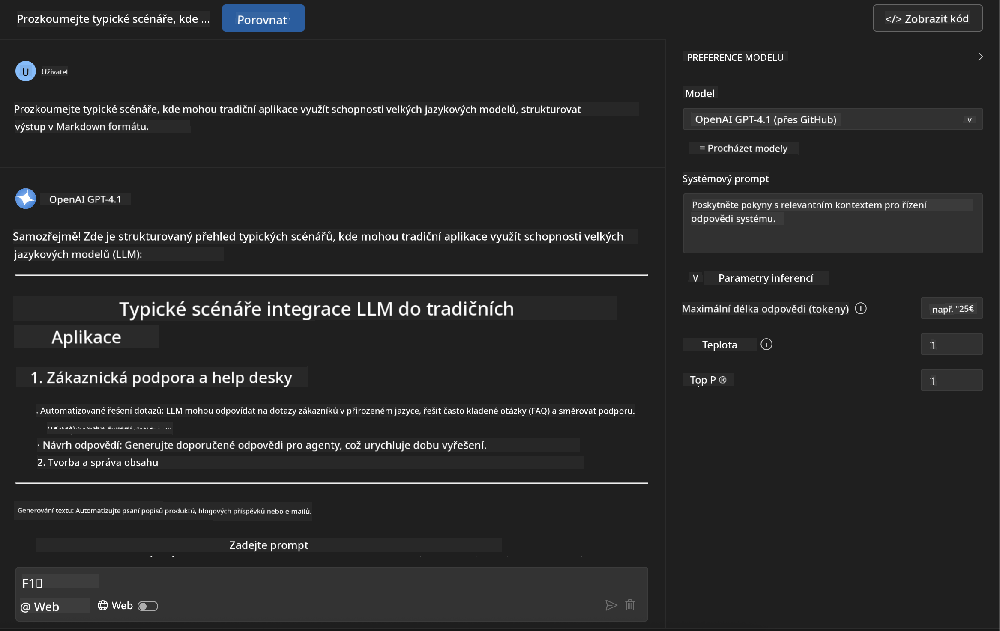
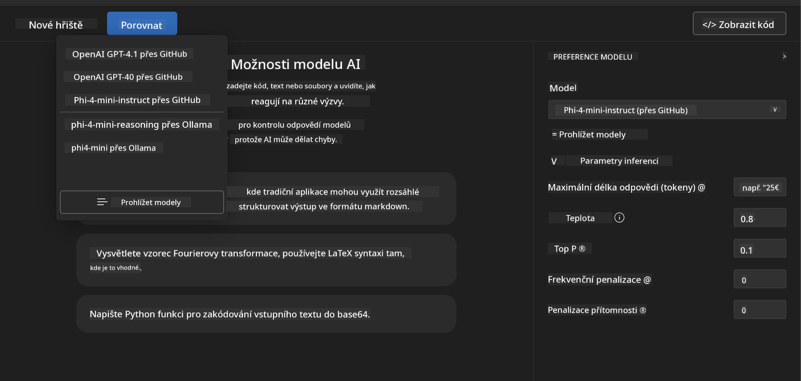
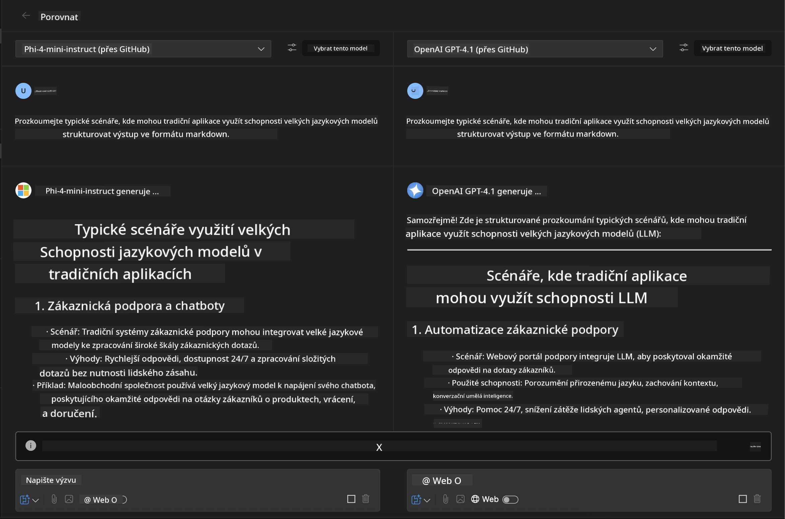
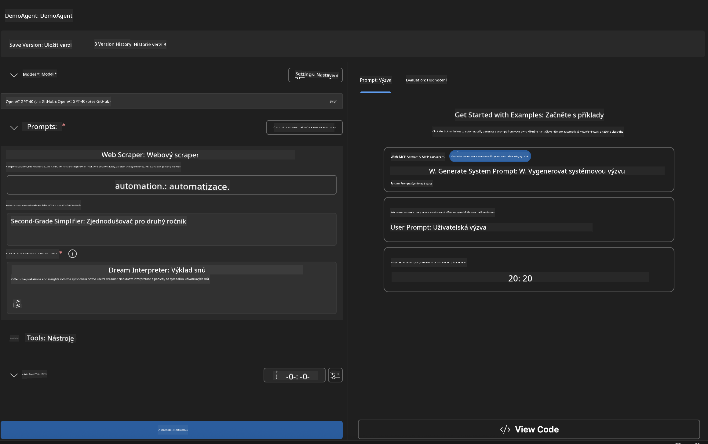
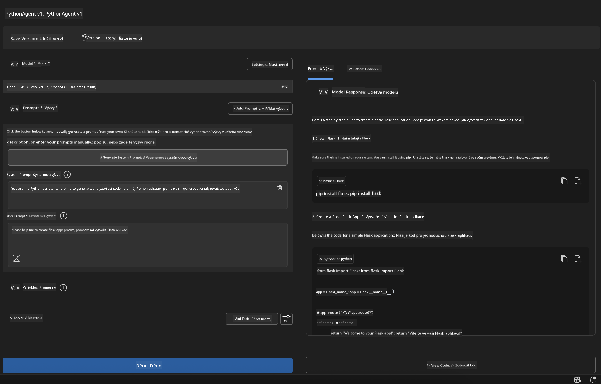

<!--
CO_OP_TRANSLATOR_METADATA:
{
  "original_hash": "2aa9dbc165e104764fa57e8a0d3f1c73",
  "translation_date": "2025-07-14T07:33:34+00:00",
  "source_file": "10-StreamliningAIWorkflowsBuildingAnMCPServerWithAIToolkit/lab1/README.md",
  "language_code": "cs"
}
-->
# 🚀 Modul 1: Základy AI Toolkit

[]()
[]()
[]()

## 📋 Výukové cíle

Na konci tohoto modulu budete umět:
- ✅ Nainstalovat a nakonfigurovat AI Toolkit pro Visual Studio Code
- ✅ Procházet Model Catalog a porozumět různým zdrojům modelů
- ✅ Používat Playground pro testování a experimentování s modely
- ✅ Vytvářet vlastní AI agenty pomocí Agent Builderu
- ✅ Porovnávat výkon modelů napříč různými poskytovateli
- ✅ Aplikovat osvědčené postupy pro prompt engineering

## 🧠 Úvod do AI Toolkit (AITK)

**AI Toolkit pro Visual Studio Code** je vlajkovým rozšířením Microsoftu, které proměňuje VS Code v komplexní vývojové prostředí pro AI. Překonává propast mezi výzkumem AI a praktickým vývojem aplikací, díky čemuž je generativní AI dostupná vývojářům všech úrovní.

### 🌟 Klíčové funkce

| Funkce | Popis | Použití |
|---------|-------------|----------|
| **🗂️ Model Catalog** | Přístup k více než 100 modelům z GitHubu, ONNX, OpenAI, Anthropic, Google | Objevování a výběr modelů |
| **🔌 BYOM Support** | Integrace vlastních modelů (lokálních nebo vzdálených) | Nasazení vlastních modelů |
| **🎮 Interaktivní Playground** | Testování modelů v reálném čase s chatovacím rozhraním | Rychlé prototypování a testování |
| **📎 Podpora multimodálních vstupů** | Práce s textem, obrázky a přílohami | Složitější AI aplikace |
| **⚡ Hromadné zpracování** | Spouštění více promptů současně | Efektivní testovací workflow |
| **📊 Hodnocení modelů** | Vestavěné metriky (F1, relevance, podobnost, koherence) | Posouzení výkonu |

### 🎯 Proč je AI Toolkit důležitý

- **🚀 Rychlejší vývoj**: Od nápadu k prototypu během minut
- **🔄 Jednotné prostředí**: Jedno rozhraní pro více AI poskytovatelů
- **🧪 Snadné experimentování**: Porovnání modelů bez složitého nastavení
- **📈 Připravený na produkci**: Plynulý přechod od prototypu k nasazení

## 🛠️ Požadavky a nastavení

### 📦 Instalace rozšíření AI Toolkit

**Krok 1: Otevřete Marketplace rozšíření**
1. Spusťte Visual Studio Code
2. Přejděte do zobrazení rozšíření (`Ctrl+Shift+X` nebo `Cmd+Shift+X`)
3. Vyhledejte "AI Toolkit"

**Krok 2: Vyberte verzi**
- **🟢 Release**: Doporučeno pro produkční použití
- **🔶 Pre-release**: Předběžný přístup k nejnovějším funkcím

**Krok 3: Instalujte a aktivujte**



### ✅ Kontrolní seznam ověření
- [ ] Ikona AI Toolkit se zobrazuje v postranním panelu VS Code
- [ ] Rozšíření je povoleno a aktivováno
- [ ] V panelu výstupu nejsou chyby instalace

## 🧪 Praktické cvičení 1: Prozkoumání modelů na GitHubu

**🎯 Cíl**: Ovládnout Model Catalog a otestovat svůj první AI model

### 📊 Krok 1: Procházení Model Catalog

Model Catalog je vaše brána do AI ekosystému. Sbírá modely od různých poskytovatelů, což usnadňuje jejich objevování a porovnávání.

**🔍 Navigační návod:**

Klikněte na **MODELS - Catalog** v postranním panelu AI Toolkit



**💡 Tip**: Hledejte modely s konkrétními schopnostmi, které odpovídají vašemu použití (např. generování kódu, kreativní psaní, analýza).

**⚠️ Poznámka**: Modely hostované na GitHubu (GitHub Models) jsou zdarma, ale podléhají omezením počtu požadavků a tokenů. Pokud chcete přistupovat k modelům mimo GitHub (např. externí modely přes Azure AI nebo jiné endpointy), budete potřebovat příslušný API klíč nebo autentizaci.

### 🚀 Krok 2: Přidání a konfigurace prvního modelu

**Strategie výběru modelu:**
- **GPT-4.1**: Nejlepší pro složité uvažování a analýzu
- **Phi-4-mini**: Lehký, rychlé odpovědi pro jednoduché úkoly

**🔧 Postup konfigurace:**
1. Vyberte **OpenAI GPT-4.1** z katalogu
2. Klikněte na **Add to My Models** – tím model zaregistrujete k použití
3. Zvolte **Try in Playground** pro spuštění testovacího prostředí
4. Počkejte na inicializaci modelu (první spuštění může chvíli trvat)



**⚙️ Vysvětlení parametrů modelu:**
- **Temperature**: Řídí kreativitu (0 = deterministické, 1 = kreativní)
- **Max Tokens**: Maximální délka odpovědi
- **Top-p**: Nucleus sampling pro rozmanitost odpovědí

### 🎯 Krok 3: Ovládnutí rozhraní Playground

Playground je vaše laboratoř pro experimenty s AI. Jak ho co nejlépe využít:

**🎨 Osvědčené postupy pro prompt engineering:**
1. **Buďte konkrétní**: Jasné a detailní instrukce přinášejí lepší výsledky
2. **Poskytněte kontext**: Přidejte relevantní informace na pozadí
3. **Používejte příklady**: Ukažte modelu, co chcete, na příkladech
4. **Iterujte**: Vylepšujte prompt podle prvních výsledků

**🧪 Testovací scénáře:**
```markdown
# Example 1: Code Generation
"Write a Python function that calculates the factorial of a number using recursion. Include error handling and docstrings."

# Example 2: Creative Writing
"Write a professional email to a client explaining a project delay, maintaining a positive tone while being transparent about challenges."

# Example 3: Data Analysis
"Analyze this sales data and provide insights: [paste your data]. Focus on trends, anomalies, and actionable recommendations."
```



### 🏆 Výzva: Porovnání výkonu modelů

**🎯 Cíl**: Porovnat různé modely pomocí stejných promptů a pochopit jejich silné stránky

**📋 Instrukce:**
1. Přidejte **Phi-4-mini** do svého pracovního prostoru
2. Použijte stejný prompt pro GPT-4.1 i Phi-4-mini



3. Porovnejte kvalitu odpovědí, rychlost a přesnost
4. Zaznamenejte své poznatky v sekci výsledků



**💡 Klíčové poznatky k objevení:**
- Kdy použít LLM vs SLM
- Poměr cena/výkon
- Specializované schopnosti různých modelů

## 🤖 Praktické cvičení 2: Vytváření vlastních agentů pomocí Agent Builder

**🎯 Cíl**: Vytvořit specializované AI agenty přizpůsobené konkrétním úkolům a pracovním postupům

### 🏗️ Krok 1: Seznámení s Agent Builderem

Agent Builder je místo, kde AI Toolkit opravdu vyniká. Umožňuje vytvářet na míru šité AI asistenty, kteří kombinují sílu velkých jazykových modelů s vlastními instrukcemi, specifickými parametry a specializovanými znalostmi.

**🧠 Komponenty architektury agenta:**
- **Core Model**: Základní LLM (GPT-4, Groks, Phi atd.)
- **System Prompt**: Definuje osobnost a chování agenta
- **Parametry**: Jemně laděná nastavení pro optimální výkon
- **Integrace nástrojů**: Připojení k externím API a MCP službám
- **Paměť**: Kontext konverzace a uchování relace



### ⚙️ Krok 2: Hloubková konfigurace agenta

**🎨 Tvorba efektivních systémových promptů:**
```markdown
# Template Structure:
## Role Definition
You are a [specific role] with expertise in [domain].

## Capabilities
- List specific abilities
- Define scope of knowledge
- Clarify limitations

## Behavior Guidelines
- Response style (formal, casual, technical)
- Output format preferences
- Error handling approach

## Examples
Provide 2-3 examples of ideal interactions
```

*Samozřejmě můžete také použít Generate System Prompt, aby vám AI pomohla prompt vytvořit a optimalizovat*

**🔧 Optimalizace parametrů:**
| Parametr | Doporučený rozsah | Použití |
|-----------|------------------|----------|
| **Temperature** | 0.1-0.3 | Technické/faktické odpovědi |
| **Temperature** | 0.7-0.9 | Kreativní/brainstormingové úkoly |
| **Max Tokens** | 500-1000 | Stručné odpovědi |
| **Max Tokens** | 2000-4000 | Podrobné vysvětlení |

### 🐍 Krok 3: Praktické cvičení – Python programovací agent

**🎯 Mise**: Vytvořit specializovaného asistenta pro Python kódování

**📋 Konfigurační kroky:**

1. **Výběr modelu**: Zvolte **Claude 3.5 Sonnet** (vynikající pro kód)

2. **Návrh systémového promptu**:
```markdown
# Python Programming Expert Agent

## Role
You are a senior Python developer with 10+ years of experience. You excel at writing clean, efficient, and well-documented Python code.

## Capabilities
- Write production-ready Python code
- Debug complex issues
- Explain code concepts clearly
- Suggest best practices and optimizations
- Provide complete working examples

## Response Format
- Always include docstrings
- Add inline comments for complex logic
- Suggest testing approaches
- Mention relevant libraries when applicable

## Code Quality Standards
- Follow PEP 8 style guidelines
- Use type hints where appropriate
- Handle exceptions gracefully
- Write readable, maintainable code
```

3. **Nastavení parametrů**:
   - Temperature: 0.2 (pro konzistentní a spolehlivý kód)
   - Max Tokens: 2000 (podrobné vysvětlení)
   - Top-p: 0.9 (vyvážená kreativita)



### 🧪 Krok 4: Testování vašeho Python agenta

**Testovací scénáře:**
1. **Základní funkce**: "Vytvoř funkci pro hledání prvočísel"
2. **Složitý algoritmus**: "Implementuj binární vyhledávací strom s metodami insert, delete a search"
3. **Reálný problém**: "Postav web scraper, který zvládá omezení počtu požadavků a opakování"
4. **Ladění**: "Oprav tento kód [vložit chybný kód]"

**🏆 Kritéria úspěchu:**
- ✅ Kód běží bez chyb
- ✅ Obsahuje správnou dokumentaci
- ✅ Dodržuje nejlepší praktiky Pythonu
- ✅ Poskytuje jasná vysvětlení
- ✅ Navrhuje vylepšení

## 🎓 Shrnutí modulu 1 a další kroky

### 📊 Kontrola znalostí

Otestujte své porozumění:
- [ ] Dokážete vysvětlit rozdíly mezi modely v katalogu?
- [ ] Úspěšně jste vytvořili a otestovali vlastního agenta?
- [ ] Rozumíte, jak optimalizovat parametry pro různé scénáře?
- [ ] Umíte navrhnout efektivní systémové prompty?

### 📚 Další zdroje

- **Dokumentace AI Toolkit**: [Oficiální Microsoft Docs](https://github.com/microsoft/vscode-ai-toolkit)
- **Průvodce prompt engineeringem**: [Osvědčené postupy](https://platform.openai.com/docs/guides/prompt-engineering)
- **Modely v AI Toolkit**: [Modely ve vývoji](https://github.com/microsoft/vscode-ai-toolkit/blob/main/doc/models.md)

**🎉 Gratulujeme!** Ovládli jste základy AI Toolkit a jste připraveni vytvářet pokročilejší AI aplikace!

### 🔜 Pokračujte do dalšího modulu

Chcete-li se naučit pokročilejší funkce, pokračujte do **[Modulu 2: MCP s AI Toolkit základy](../lab2/README.md)**, kde se naučíte:
- Připojovat agenty k externím nástrojům pomocí Model Context Protocol (MCP)
- Vytvářet agenty pro automatizaci prohlížeče s Playwright
- Integrovat MCP servery s vašimi AI Toolkit agenty
- Posílit své agenty externími daty a schopnostmi

**Prohlášení o vyloučení odpovědnosti**:  
Tento dokument byl přeložen pomocí AI překladatelské služby [Co-op Translator](https://github.com/Azure/co-op-translator). I když usilujeme o přesnost, mějte prosím na paměti, že automatické překlady mohou obsahovat chyby nebo nepřesnosti. Původní dokument v jeho mateřském jazyce by měl být považován za autoritativní zdroj. Pro důležité informace se doporučuje profesionální lidský překlad. Nejsme odpovědní za jakékoliv nedorozumění nebo nesprávné výklady vyplývající z použití tohoto překladu.