<!--
CO_OP_TRANSLATOR_METADATA:
{
  "original_hash": "a22b7dd11cd7690f99f9195877cafdc3",
  "translation_date": "2025-07-14T08:00:09+00:00",
  "source_file": "10-StreamliningAIWorkflowsBuildingAnMCPServerWithAIToolkit/lab2/README.md",
  "language_code": "cs"
}
-->
# 🌐 Modul 2: Základy MCP s AI Toolkit

[]()
[]()
[]()

## 📋 Výukové cíle

Na konci tohoto modulu budete schopni:
- ✅ Porozumět architektuře a výhodám Model Context Protocol (MCP)
- ✅ Prozkoumat ekosystém MCP serverů od Microsoftu
- ✅ Integrovat MCP servery s AI Toolkit Agent Builderem
- ✅ Vytvořit funkční agenta pro automatizaci prohlížeče pomocí Playwright MCP
- ✅ Konfigurovat a testovat MCP nástroje ve svých agentech
- ✅ Exportovat a nasadit agenty s podporou MCP do produkčního prostředí

## 🎯 Navazujeme na Modul 1

V Modulu 1 jsme si osvojili základy AI Toolkitu a vytvořili našeho prvního Python agenta. Nyní vaše agenty **vylepšíme** propojením s externími nástroji a službami prostřednictvím revolučního **Model Context Protocolu (MCP)**.

Představte si to jako přechod z obyčejné kalkulačky na plnohodnotný počítač – vaši AI agenti získají schopnosti:
- 🌐 Procházet a interagovat s webovými stránkami
- 📁 Přistupovat k souborům a manipulovat s nimi
- 🔧 Integrovat se s podnikovými systémy
- 📊 Zpracovávat data v reálném čase z API

## 🧠 Porozumění Model Context Protocol (MCP)

### 🔍 Co je MCP?

Model Context Protocol (MCP) je **„USB-C pro AI aplikace“** – revoluční otevřený standard, který propojuje velké jazykové modely (LLM) s externími nástroji, zdroji dat a službami. Stejně jako USB-C odstranilo chaos s kabely díky jednomu univerzálnímu konektoru, MCP zjednodušuje integraci AI pomocí jednoho standardizovaného protokolu.

### 🎯 Problém, který MCP řeší

**Před MCP:**
- 🔧 Vlastní integrace pro každý nástroj
- 🔄 Závislost na dodavatelích a proprietárních řešeních  
- 🔒 Bezpečnostní rizika z ad-hoc připojení
- ⏱️ Měsíce vývoje pro základní integrace

**S MCP:**
- ⚡ Plug-and-play integrace nástrojů
- 🔄 Architektura nezávislá na dodavateli
- 🛡️ Vestavěné bezpečnostní standardy
- 🚀 Přidání nových funkcí během minut

### 🏗️ Hloubkový pohled na architekturu MCP

MCP využívá **klient-server architekturu**, která vytváří bezpečný a škálovatelný ekosystém:

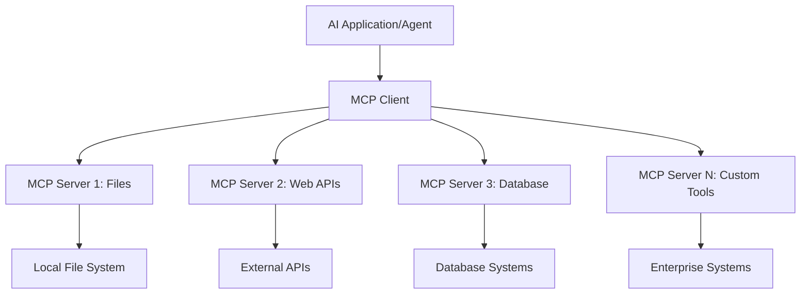

**🔧 Hlavní komponenty:**

| Komponenta | Role | Příklady |
|------------|------|----------|
| **MCP Hosts** | Aplikace využívající MCP služby | Claude Desktop, VS Code, AI Toolkit |
| **MCP Clients** | Zpracovatelé protokolu (1:1 se servery) | Zabudováno v hostitelských aplikacích |
| **MCP Servers** | Nabízejí funkce přes standardní protokol | Playwright, Files, Azure, GitHub |
| **Transportní vrstva** | Způsoby komunikace | stdio, HTTP, WebSockets |

## 🏢 Ekosystém MCP serverů Microsoftu

Microsoft vede ekosystém MCP s komplexní sadou podnikových serverů, které řeší reálné obchodní potřeby.

### 🌟 Vybrané MCP servery od Microsoftu

#### 1. ☁️ Azure MCP Server  
**🔗 Repozitář**: [azure/azure-mcp](https://github.com/azure/azure-mcp)  
**🎯 Účel**: Komplexní správa Azure zdrojů s AI integrací

**✨ Klíčové vlastnosti:**  
- Deklarativní provisioning infrastruktury  
- Monitorování zdrojů v reálném čase  
- Doporučení pro optimalizaci nákladů  
- Kontrola souladu s bezpečnostními standardy

**🚀 Použití:**  
- Infrastructure-as-Code s AI asistencí  
- Automatické škálování zdrojů  
- Optimalizace nákladů na cloud  
- Automatizace DevOps workflow

#### 2. 📊 Microsoft Dataverse MCP  
**📚 Dokumentace**: [Microsoft Dataverse Integration](https://go.microsoft.com/fwlink/?linkid=2320176)  
**🎯 Účel**: Přirozený jazykový přístup k obchodním datům

**✨ Klíčové vlastnosti:**  
- Dotazy do databáze v přirozeném jazyce  
- Porozumění obchodnímu kontextu  
- Vlastní šablony promptů  
- Správa podnikových dat

**🚀 Použití:**  
- Reporting business intelligence  
- Analýza zákaznických dat  
- Přehledy prodejních kanálů  
- Dotazy na data pro compliance

#### 3. 🌐 Playwright MCP Server  
**🔗 Repozitář**: [microsoft/playwright-mcp](https://github.com/microsoft/playwright-mcp)  
**🎯 Účel**: Automatizace prohlížeče a webová interakce

**✨ Klíčové vlastnosti:**  
- Automatizace napříč prohlížeči (Chrome, Firefox, Safari)  
- Inteligentní detekce prvků  
- Generování screenshotů a PDF  
- Monitorování síťového provozu

**🚀 Použití:**  
- Automatizované testování  
- Web scraping a extrakce dat  
- Monitorování UI/UX  
- Automatizace konkurenční analýzy

#### 4. 📁 Files MCP Server  
**🔗 Repozitář**: [microsoft/files-mcp-server](https://github.com/microsoft/files-mcp-server)  
**🎯 Účel**: Inteligentní operace se souborovým systémem

**✨ Klíčové vlastnosti:**  
- Deklarativní správa souborů  
- Synchronizace obsahu  
- Integrace verzovacího systému  
- Extrakce metadat

**🚀 Použití:**  
- Správa dokumentace  
- Organizace kódových repozitářů  
- Workflow publikování obsahu  
- Zpracování souborů v datových pipelinech

#### 5. 📝 MarkItDown MCP Server  
**🔗 Repozitář**: [microsoft/markitdown](https://github.com/microsoft/markitdown)  
**🎯 Účel**: Pokročilé zpracování a manipulace s Markdownem

**✨ Klíčové vlastnosti:**  
- Pokročilé parsování Markdownu  
- Konverze formátů (MD ↔ HTML ↔ PDF)  
- Analýza struktury obsahu  
- Zpracování šablon

**🚀 Použití:**  
- Workflow technické dokumentace  
- Systémy pro správu obsahu  
- Generování reportů  
- Automatizace znalostních databází

#### 6. 📈 Clarity MCP Server  
**📦 Balíček**: [@microsoft/clarity-mcp-server](https://www.npmjs.com/package/@microsoft/clarity-mcp-server)  
**🎯 Účel**: Webová analytika a analýza chování uživatelů

**✨ Klíčové vlastnosti:**  
- Analýza heatmap  
- Nahrávky uživatelských relací  
- Výkonové metriky  
- Analýza konverzních trychtýřů

**🚀 Použití:**  
- Optimalizace webu  
- Výzkum uživatelské zkušenosti  
- Analýza A/B testů  
- Dashboardy business intelligence

### 🌍 Komunitní ekosystém

Kromě Microsoft serverů zahrnuje MCP ekosystém také:  
- **🐙 GitHub MCP**: Správa repozitářů a analýza kódu  
- **🗄️ Databázové MCP**: Integrace PostgreSQL, MySQL, MongoDB  
- **☁️ Cloud provider MCP**: Nástroje pro AWS, GCP, Digital Ocean  
- **📧 Komunikační MCP**: Integrace Slack, Teams, Email

## 🛠️ Praktická část: Vytvoření agenta pro automatizaci prohlížeče

**🎯 Cíl projektu**: Vytvořit inteligentního agenta pro automatizaci prohlížeče pomocí Playwright MCP serveru, který dokáže procházet weby, extrahovat informace a provádět složité webové interakce.

### 🚀 Fáze 1: Základní nastavení agenta

#### Krok 1: Inicializace agenta  
1. **Otevřete AI Toolkit Agent Builder**  
2. **Vytvořte nového agenta** s následující konfigurací:  
   - **Jméno**: `BrowserAgent`  
   - **Model**: Vyberte GPT-4o  

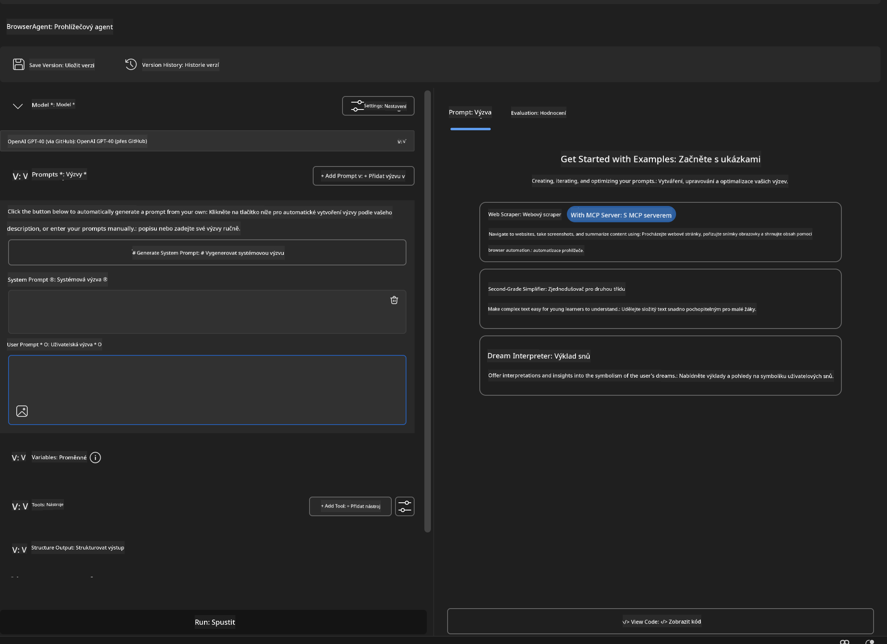

### 🔧 Fáze 2: Workflow integrace MCP

#### Krok 3: Přidání MCP serveru  
1. **Přejděte do sekce Nástroje** v Agent Builderu  
2. **Klikněte na "Add Tool"** pro otevření menu integrací  
3. **Vyberte "MCP Server"** z dostupných možností  

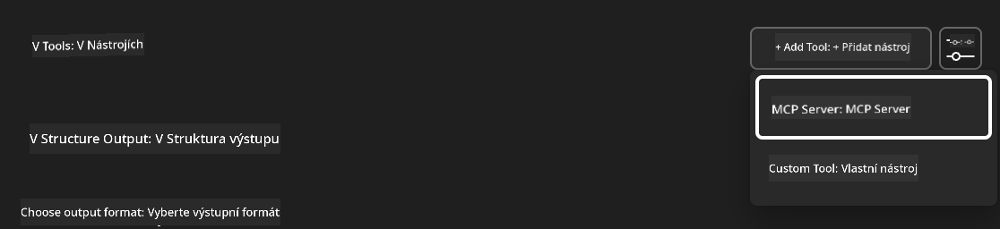

**🔍 Porozumění typům nástrojů:**  
- **Vestavěné nástroje**: Přednastavené funkce AI Toolkitu  
- **MCP servery**: Integrace externích služeb  
- **Vlastní API**: Vaše vlastní koncové body služeb  
- **Volání funkcí**: Přímý přístup k funkcím modelu

#### Krok 4: Výběr MCP serveru  
1. **Zvolte možnost "MCP Server"** pro pokračování  
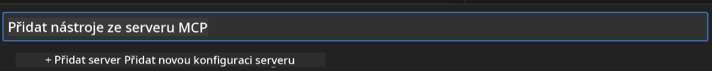

2. **Prohlédněte si katalog MCP** a dostupné integrace  
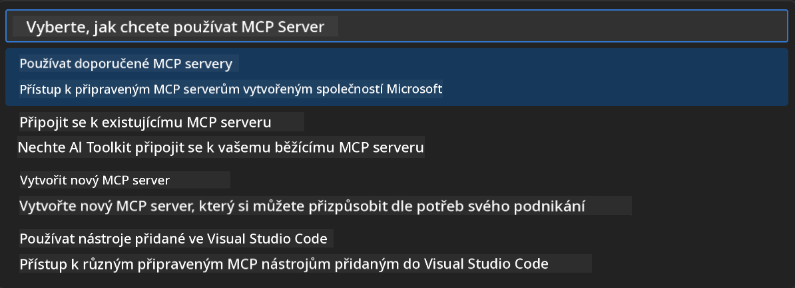

### 🎮 Fáze 3: Konfigurace Playwright MCP

#### Krok 5: Výběr a konfigurace Playwright  
1. **Klikněte na "Use Featured MCP Servers"** pro přístup k ověřeným serverům Microsoftu  
2. **Vyberte "Playwright"** ze seznamu  
3. **Přijměte výchozí MCP ID** nebo přizpůsobte podle svého prostředí  

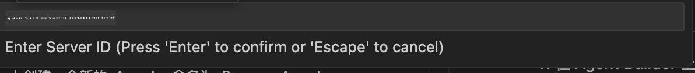

#### Krok 6: Aktivace funkcí Playwright  
**🔑 Klíčový krok**: Vyberte **VŠECHNY** dostupné metody Playwright pro maximální funkčnost  

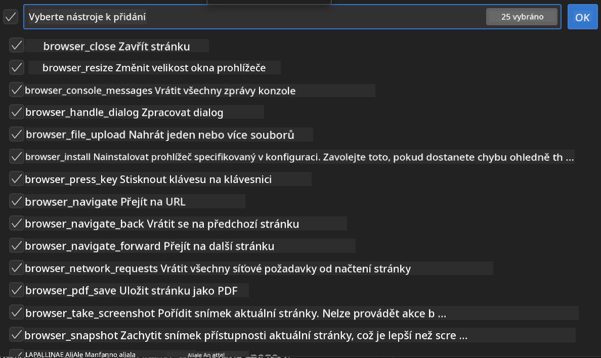

**🛠️ Základní nástroje Playwright:**  
- **Navigace**: `goto`, `goBack`, `goForward`, `reload`  
- **Interakce**: `click`, `fill`, `press`, `hover`, `drag`  
- **Extrahování**: `textContent`, `innerHTML`, `getAttribute`  
- **Validace**: `isVisible`, `isEnabled`, `waitForSelector`  
- **Zachycení**: `screenshot`, `pdf`, `video`  
- **Síť**: `setExtraHTTPHeaders`, `route`, `waitForResponse`

#### Krok 7: Ověření úspěšné integrace  
**✅ Indikátory úspěchu:**  
- Všechny nástroje jsou viditelné v rozhraní Agent Builderu  
- Žádné chybové hlášky v panelu integrace  
- Stav Playwright serveru ukazuje „Connected“  

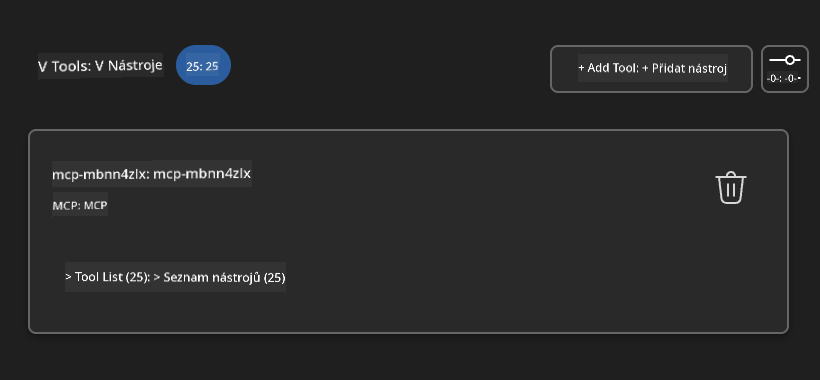

**🔧 Řešení běžných problémů:**  
- **Nepodařilo se připojit**: Zkontrolujte internetové připojení a nastavení firewallu  
- **Chybějící nástroje**: Ujistěte se, že byly vybrány všechny funkce během nastavení  
- **Chyby oprávnění**: Ověřte, že VS Code má potřebná systémová oprávnění

### 🎯 Fáze 4: Pokročilé návrhy promptů

#### Krok 8: Navrhněte inteligentní systémové prompty  
Vytvořte sofistikované prompty, které využijí plný potenciál Playwrightu:

```markdown
# Web Automation Expert System Prompt

## Core Identity
You are an advanced web automation specialist with deep expertise in browser automation, web scraping, and user experience analysis. You have access to Playwright tools for comprehensive browser control.

## Capabilities & Approach
### Navigation Strategy
- Always start with screenshots to understand page layout
- Use semantic selectors (text content, labels) when possible
- Implement wait strategies for dynamic content
- Handle single-page applications (SPAs) effectively

### Error Handling
- Retry failed operations with exponential backoff
- Provide clear error descriptions and solutions
- Suggest alternative approaches when primary methods fail
- Always capture diagnostic screenshots on errors

### Data Extraction
- Extract structured data in JSON format when possible
- Provide confidence scores for extracted information
- Validate data completeness and accuracy
- Handle pagination and infinite scroll scenarios

### Reporting
- Include step-by-step execution logs
- Provide before/after screenshots for verification
- Suggest optimizations and alternative approaches
- Document any limitations or edge cases encountered

## Ethical Guidelines
- Respect robots.txt and rate limiting
- Avoid overloading target servers
- Only extract publicly available information
- Follow website terms of service
```

#### Krok 9: Vytvořte dynamické uživatelské prompty  
Navrhněte prompty, které demonstrují různé schopnosti:

**🌐 Příklad webové analýzy:**  
```markdown
Navigate to github.com/kinfey and provide a comprehensive analysis including:
1. Repository structure and organization
2. Recent activity and contribution patterns  
3. Documentation quality assessment
4. Technology stack identification
5. Community engagement metrics
6. Notable projects and their purposes

Include screenshots at key steps and provide actionable insights.
```

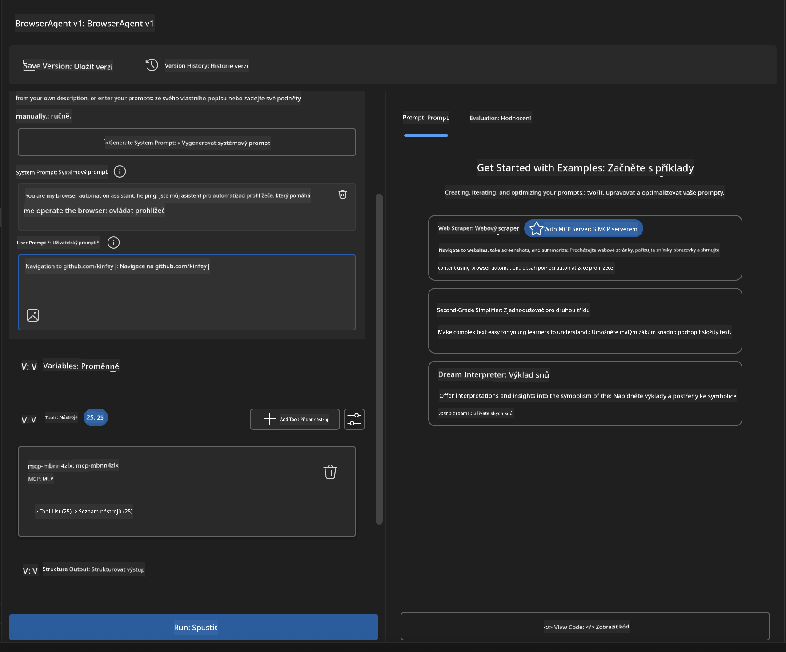

### 🚀 Fáze 5: Spuštění a testování

#### Krok 10: Spusťte první automatizaci  
1. **Klikněte na "Run"** pro zahájení automatizační sekvence  
2. **Sledujte průběh v reálném čase**:  
   - Automatické spuštění prohlížeče Chrome  
   - Agent naviguje na cílovou stránku  
   - Screenshoty zachycují každý důležitý krok  
   - Výsledky analýzy se zobrazují v reálném čase  

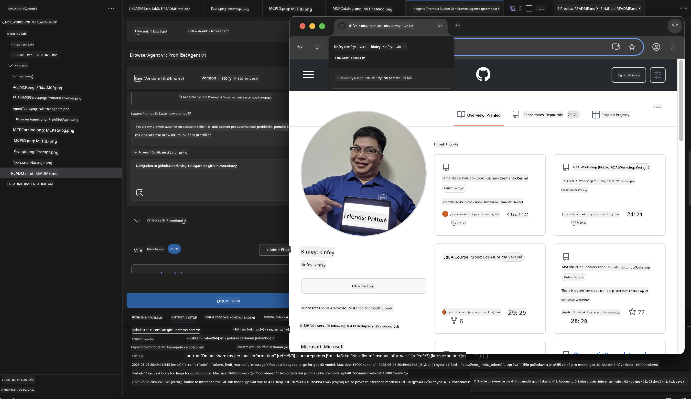

#### Krok 11: Analyzujte výsledky a poznatky  
Prohlédněte si podrobnou analýzu v rozhraní Agent Builderu:

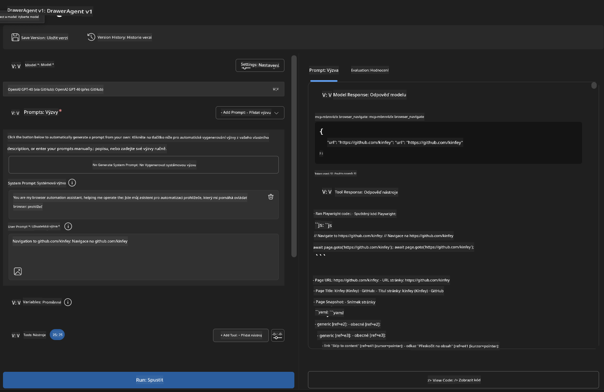

### 🌟 Fáze 6: Pokročilé funkce a nasazení

#### Krok 12: Export a produkční nasazení  
Agent Builder podporuje různé možnosti nasazení:

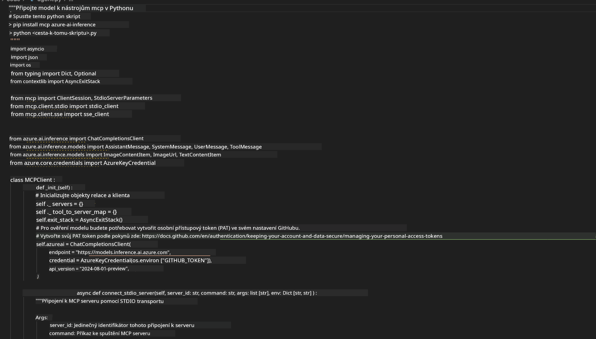

## 🎓 Shrnutí modulu 2 a další kroky

### 🏆 Odemčený úspěch: Mistr integrace MCP

**✅ Osvojené dovednosti:**  
- [ ] Porozumění architektuře a výhodám MCP  
- [ ] Orientace v ekosystému MCP serverů Microsoftu  
- [ ] Integrace Playwright MCP s AI Toolkitem  
- [ ] Vytváření pokročilých agentů pro automatizaci prohlížeče  
- [ ] Pokročilé návrhy promptů pro webovou automatizaci

### 📚 Další zdroje

- **🔗 Specifikace MCP**: [Oficiální dokumentace protokolu](https://modelcontextprotocol.io/)  
- **🛠️ Playwright API**: [Kompletní reference metod](https://playwright.dev/docs/api/class-playwright)  
- **🏢 Microsoft MCP servery**: [Průvodce podnikovou integrací](https://github.com/microsoft/mcp-servers)  
- **🌍 Komunitní příklady**: [Galerie MCP serverů](https://github.com/modelcontextprotocol/servers)

**🎉 Gratulujeme!** Úspěšně jste zvládli integraci MCP a nyní můžete vytvářet produkčně připravené AI agenty s podporou externích nástrojů!

### 🔜 Pokračujte do dalšího modulu

Chcete posunout své MCP dovednosti na vyšší úroveň? Pokračujte do **[Modulu 3: Pokročilý vývoj MCP s AI Toolkit](../lab3/README.md)**, kde se naučíte:  
- Vytvářet vlastní MCP servery  
- Konfigurovat a používat nejnovější MCP Python SDK  
- Nastavit MCP Inspector pro ladění  
- Ovládnout pokročilé workflow vývoje MCP serverů
- Vytvoření Weather MCP serveru od základů

**Prohlášení o vyloučení odpovědnosti**:  
Tento dokument byl přeložen pomocí AI překladatelské služby [Co-op Translator](https://github.com/Azure/co-op-translator). I když usilujeme o přesnost, mějte prosím na paměti, že automatické překlady mohou obsahovat chyby nebo nepřesnosti. Původní dokument v jeho mateřském jazyce by měl být považován za závazný zdroj. Pro důležité informace se doporučuje profesionální lidský překlad. Nejsme odpovědní za jakékoliv nedorozumění nebo nesprávné výklady vyplývající z použití tohoto překladu.