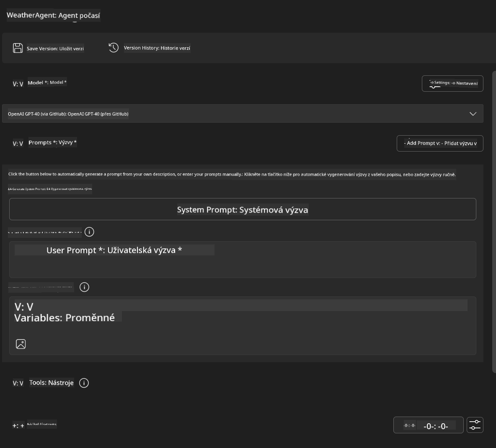
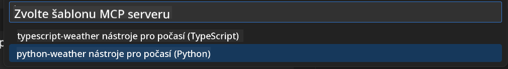
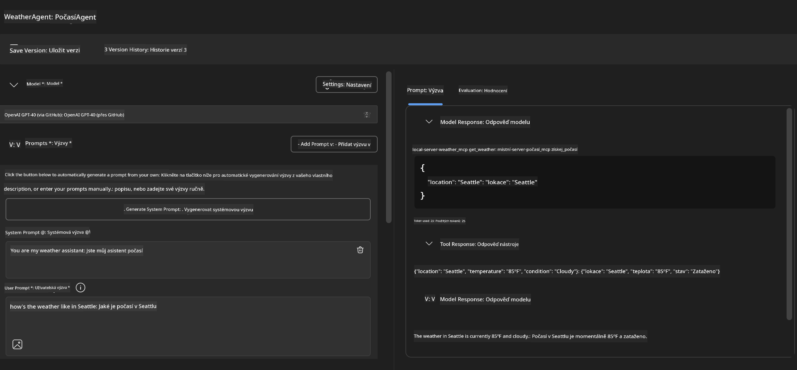
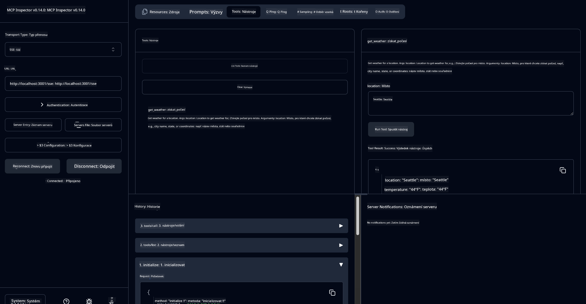

<!--
CO_OP_TRANSLATOR_METADATA:
{
  "original_hash": "dd8da3f75addcef453fe11f02a270217",
  "translation_date": "2025-07-14T08:18:45+00:00",
  "source_file": "10-StreamliningAIWorkflowsBuildingAnMCPServerWithAIToolkit/lab3/README.md",
  "language_code": "cs"
}
-->
# 🔧 Modul 3: Pokročilý vývoj MCP s AI Toolkit


## 🎯 Cíle učení

Na konci tohoto labu budete schopni:

- ✅ Vytvořit vlastní MCP servery pomocí AI Toolkit
- ✅ Nakonfigurovat a používat nejnovější MCP Python SDK (verze 1.9.3)
- ✅ Nastavit a využívat MCP Inspector pro ladění
- ✅ Ladit MCP servery v prostředí Agent Builder i Inspector
- ✅ Porozumět pokročilým pracovním postupům vývoje MCP serverů

## 📋 Požadavky

- Dokončení Labu 2 (Základy MCP)
- VS Code s nainstalovaným rozšířením AI Toolkit
- Prostředí Python 3.10+
- Node.js a npm pro nastavení Inspectoru

## 🏗️ Co vytvoříte

V tomto labu vytvoříte **Weather MCP Server**, který demonstruje:
- Vlastní implementaci MCP serveru
- Integraci s AI Toolkit Agent Builderem
- Profesionální pracovní postupy ladění
- Moderní způsoby využití MCP SDK

---

## 🔧 Přehled hlavních komponent

### 🐍 MCP Python SDK
Model Context Protocol Python SDK poskytuje základ pro tvorbu vlastních MCP serverů. Budete používat verzi 1.9.3 s rozšířenými možnostmi ladění.

### 🔍 MCP Inspector
Výkonný nástroj pro ladění, který nabízí:
- Monitorování serveru v reálném čase
- Vizualizaci spouštění nástrojů
- Kontrolu síťových požadavků a odpovědí
- Interaktivní testovací prostředí

---

## 📖 Krok za krokem: Implementace

### Krok 1: Vytvoření WeatherAgent v Agent Builderu

1. **Spusťte Agent Builder** ve VS Code přes rozšíření AI Toolkit
2. **Vytvořte nového agenta** s následující konfigurací:
   - Název agenta: `WeatherAgent`



### Krok 2: Inicializace projektu MCP serveru

1. **Přejděte do Tools** → **Add Tool** v Agent Builderu
2. **Vyberte "MCP Server"** z dostupných možností
3. **Zvolte "Create A new MCP Server"**
4. **Vyberte šablonu `python-weather`**
5. **Pojmenujte server:** `weather_mcp`



### Krok 3: Otevření a prozkoumání projektu

1. **Otevřete vygenerovaný projekt** ve VS Code
2. **Prohlédněte si strukturu projektu:**
   ```
   weather_mcp/
   ├── src/
   │   ├── __init__.py
   │   └── server.py
   ├── inspector/
   │   ├── package.json
   │   └── package-lock.json
   ├── .vscode/
   │   ├── launch.json
   │   └── tasks.json
   ├── pyproject.toml
   └── README.md
   ```

### Krok 4: Aktualizace na nejnovější MCP SDK

> **🔍 Proč aktualizovat?** Chceme využít nejnovější MCP SDK (verze 1.9.3) a službu Inspector (0.14.0) pro lepší funkce a ladění.

#### 4a. Aktualizace Python závislostí

**Upravte `pyproject.toml`:** aktualizace v [./code/weather_mcp/pyproject.toml](../../../../10-StreamliningAIWorkflowsBuildingAnMCPServerWithAIToolkit/lab3/code/weather_mcp/pyproject.toml)

#### 4b. Aktualizace konfigurace Inspectoru

**Upravte `inspector/package.json`:** aktualizace v [./code/weather_mcp/inspector/package.json](../../../../10-StreamliningAIWorkflowsBuildingAnMCPServerWithAIToolkit/lab3/code/weather_mcp/inspector/package.json)

#### 4c. Aktualizace závislostí Inspectoru

**Upravte `inspector/package-lock.json`:** aktualizace v [./code/weather_mcp/inspector/package-lock.json](../../../../10-StreamliningAIWorkflowsBuildingAnMCPServerWithAIToolkit/lab3/code/weather_mcp/inspector/package-lock.json)

> **📝 Poznámka:** Tento soubor obsahuje rozsáhlé definice závislostí. Níže je základní struktura – kompletní obsah zajišťuje správné vyřešení závislostí.

> **⚡ Kompletní package-lock:** Plný package-lock.json obsahuje cca 3000 řádků definic závislostí. Výše je klíčová struktura – pro kompletní vyřešení použijte poskytnutý soubor.

### Krok 5: Nastavení ladění ve VS Code

*Poznámka: Prosím zkopírujte soubor na uvedenou cestu a nahraďte odpovídající lokální soubor*

#### 5a. Aktualizace konfigurace spuštění

**Upravte `.vscode/launch.json`:**

```json
{
  "version": "0.2.0",
  "configurations": [
    {
      "name": "Attach to Local MCP",
      "type": "debugpy",
      "request": "attach",
      "connect": {
        "host": "localhost",
        "port": 5678
      },
      "presentation": {
        "hidden": true
      },
      "internalConsoleOptions": "neverOpen",
      "postDebugTask": "Terminate All Tasks"
    },
    {
      "name": "Launch Inspector (Edge)",
      "type": "msedge",
      "request": "launch",
      "url": "http://localhost:6274?timeout=60000&serverUrl=http://localhost:3001/sse#tools",
      "cascadeTerminateToConfigurations": [
        "Attach to Local MCP"
      ],
      "presentation": {
        "hidden": true
      },
      "internalConsoleOptions": "neverOpen"
    },
    {
      "name": "Launch Inspector (Chrome)",
      "type": "chrome",
      "request": "launch",
      "url": "http://localhost:6274?timeout=60000&serverUrl=http://localhost:3001/sse#tools",
      "cascadeTerminateToConfigurations": [
        "Attach to Local MCP"
      ],
      "presentation": {
        "hidden": true
      },
      "internalConsoleOptions": "neverOpen"
    }
  ],
  "compounds": [
    {
      "name": "Debug in Agent Builder",
      "configurations": [
        "Attach to Local MCP"
      ],
      "preLaunchTask": "Open Agent Builder",
    },
    {
      "name": "Debug in Inspector (Edge)",
      "configurations": [
        "Launch Inspector (Edge)",
        "Attach to Local MCP"
      ],
      "preLaunchTask": "Start MCP Inspector",
      "stopAll": true
    },
    {
      "name": "Debug in Inspector (Chrome)",
      "configurations": [
        "Launch Inspector (Chrome)",
        "Attach to Local MCP"
      ],
      "preLaunchTask": "Start MCP Inspector",
      "stopAll": true
    }
  ]
}
```

**Upravte `.vscode/tasks.json`:**

```
{
  "version": "2.0.0",
  "tasks": [
    {
      "label": "Start MCP Server",
      "type": "shell",
      "command": "python -m debugpy --listen 127.0.0.1:5678 src/__init__.py sse",
      "isBackground": true,
      "options": {
        "cwd": "${workspaceFolder}",
        "env": {
          "PORT": "3001"
        }
      },
      "problemMatcher": {
        "pattern": [
          {
            "regexp": "^.*$",
            "file": 0,
            "location": 1,
            "message": 2
          }
        ],
        "background": {
          "activeOnStart": true,
          "beginsPattern": ".*",
          "endsPattern": "Application startup complete|running"
        }
      }
    },
    {
      "label": "Start MCP Inspector",
      "type": "shell",
      "command": "npm run dev:inspector",
      "isBackground": true,
      "options": {
        "cwd": "${workspaceFolder}/inspector",
        "env": {
          "CLIENT_PORT": "6274",
          "SERVER_PORT": "6277",
        }
      },
      "problemMatcher": {
        "pattern": [
          {
            "regexp": "^.*$",
            "file": 0,
            "location": 1,
            "message": 2
          }
        ],
        "background": {
          "activeOnStart": true,
          "beginsPattern": "Starting MCP inspector",
          "endsPattern": "Proxy server listening on port"
        }
      },
      "dependsOn": [
        "Start MCP Server"
      ]
    },
    {
      "label": "Open Agent Builder",
      "type": "shell",
      "command": "echo ${input:openAgentBuilder}",
      "presentation": {
        "reveal": "never"
      },
      "dependsOn": [
        "Start MCP Server"
      ],
    },
    {
      "label": "Terminate All Tasks",
      "command": "echo ${input:terminate}",
      "type": "shell",
      "problemMatcher": []
    }
  ],
  "inputs": [
    {
      "id": "openAgentBuilder",
      "type": "command",
      "command": "ai-mlstudio.agentBuilder",
      "args": {
        "initialMCPs": [ "local-server-weather_mcp" ],
        "triggeredFrom": "vsc-tasks"
      }
    },
    {
      "id": "terminate",
      "type": "command",
      "command": "workbench.action.tasks.terminate",
      "args": "terminateAll"
    }
  ]
}
```

---

## 🚀 Spuštění a testování vašeho MCP serveru

### Krok 6: Instalace závislostí

Po provedení změn konfigurace spusťte následující příkazy:

**Instalace Python závislostí:**
```bash
uv sync
```

**Instalace závislostí Inspectoru:**
```bash
cd inspector
npm install
```

### Krok 7: Ladění v Agent Builderu

1. **Stiskněte F5** nebo použijte konfiguraci **"Debug in Agent Builder"**
2. **Vyberte složenou konfiguraci** v panelu ladění
3. **Počkejte na spuštění serveru** a otevření Agent Builderu
4. **Otestujte svůj weather MCP server** pomocí dotazů v přirozeném jazyce

Zadejte prompt jako tento

SYSTEM_PROMPT

```
You are my weather assistant
```

USER_PROMPT

```
How's the weather like in Seattle
```



### Krok 8: Ladění s MCP Inspectorem

1. **Použijte konfiguraci "Debug in Inspector"** (v Edge nebo Chrome)
2. **Otevřete rozhraní Inspectoru** na adrese `http://localhost:6274`
3. **Prozkoumejte interaktivní testovací prostředí:**
   - Zobrazte dostupné nástroje
   - Otestujte spouštění nástrojů
   - Sledujte síťové požadavky
   - Laděte odpovědi serveru



---

## 🎯 Klíčové výsledky učení

Dokončením tohoto labu jste:

- [x] **Vytvořili vlastní MCP server** pomocí šablon AI Toolkit
- [x] **Aktualizovali na nejnovější MCP SDK** (verze 1.9.3) pro rozšířené funkce
- [x] **Nakonfigurovali profesionální pracovní postupy ladění** pro Agent Builder i Inspector
- [x] **Nastavili MCP Inspector** pro interaktivní testování serveru
- [x] **Ovládáte konfigurace ladění ve VS Code** pro vývoj MCP

## 🔧 Prozkoumané pokročilé funkce

| Funkce | Popis | Použití |
|---------|-------------|----------|
| **MCP Python SDK v1.9.3** | Nejnovější implementace protokolu | Moderní vývoj serverů |
| **MCP Inspector 0.14.0** | Interaktivní nástroj pro ladění | Testování serveru v reálném čase |
| **Ladění ve VS Code** | Integrované vývojové prostředí | Profesionální pracovní postup ladění |
| **Integrace Agent Builderu** | Přímé propojení s AI Toolkit | Kompletní testování agenta |

## 📚 Další zdroje

- [Dokumentace MCP Python SDK](https://modelcontextprotocol.io/docs/sdk/python)
- [Průvodce rozšířením AI Toolkit](https://code.visualstudio.com/docs/ai/ai-toolkit)
- [Dokumentace ladění ve VS Code](https://code.visualstudio.com/docs/editor/debugging)
- [Specifikace Model Context Protocol](https://modelcontextprotocol.io/docs/concepts/architecture)

---

**🎉 Gratulujeme!** Úspěšně jste dokončili Lab 3 a nyní umíte vytvářet, ladit a nasazovat vlastní MCP servery s profesionálními pracovními postupy.

### 🔜 Pokračujte do dalšího modulu

Jste připraveni aplikovat své MCP dovednosti v reálném vývojovém workflow? Pokračujte do **[Modulu 4: Praktický vývoj MCP - Vlastní GitHub Clone Server](../lab4/README.md)**, kde:
- Vytvoříte produkčně připravený MCP server automatizující operace s GitHub repozitáři
- Implementujete funkci klonování GitHub repozitářů přes MCP
- Integrujete vlastní MCP servery s VS Code a GitHub Copilot Agent Mode
- Testujete a nasadíte vlastní MCP servery v produkčním prostředí
- Naučíte se praktickou automatizaci pracovních postupů pro vývojáře

**Prohlášení o vyloučení odpovědnosti**:  
Tento dokument byl přeložen pomocí AI překladatelské služby [Co-op Translator](https://github.com/Azure/co-op-translator). I když usilujeme o přesnost, mějte prosím na paměti, že automatické překlady mohou obsahovat chyby nebo nepřesnosti. Původní dokument v jeho mateřském jazyce by měl být považován za závazný zdroj. Pro důležité informace se doporučuje profesionální lidský překlad. Nejsme odpovědní za jakékoliv nedorozumění nebo nesprávné výklady vyplývající z použití tohoto překladu.