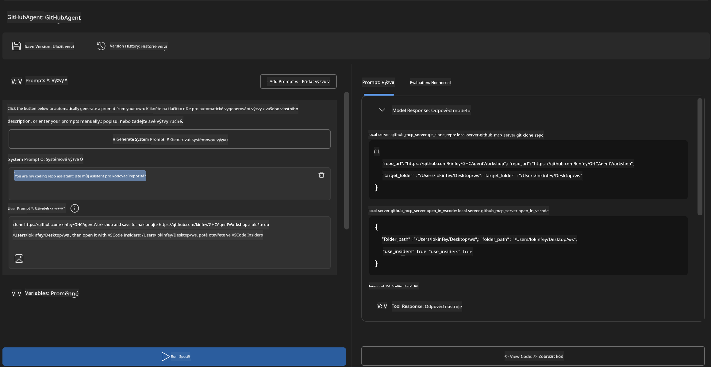
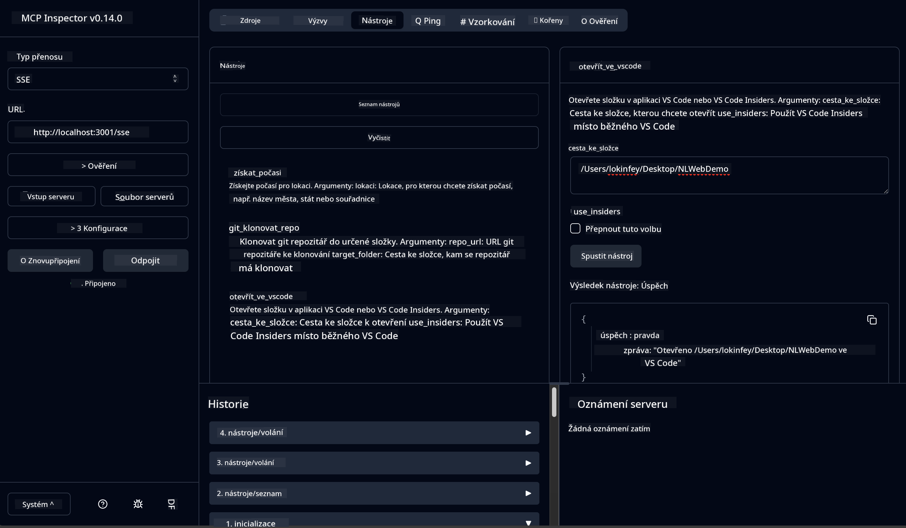

<!--
CO_OP_TRANSLATOR_METADATA:
{
  "original_hash": "f83bc722dc758efffd68667d6a1db470",
  "translation_date": "2025-07-14T08:46:43+00:00",
  "source_file": "10-StreamliningAIWorkflowsBuildingAnMCPServerWithAIToolkit/lab4/README.md",
  "language_code": "cs"
}
-->
# 🐙 Modul 4: Praktický vývoj MCP – Vlastní server pro klonování GitHub repozitářů


> **⚡ Rychlý start:** Vytvořte produkčně připravený MCP server, který automatizuje klonování GitHub repozitářů a integraci s VS Code během pouhých 30 minut!

## 🎯 Cíle učení

Na konci tohoto labu budete umět:

- ✅ Vytvořit vlastní MCP server pro reálné vývojové workflow
- ✅ Implementovat funkci klonování GitHub repozitářů přes MCP
- ✅ Integrovat vlastní MCP servery s VS Code a Agent Builderem
- ✅ Používat GitHub Copilot Agent Mode s vlastními MCP nástroji
- ✅ Testovat a nasazovat vlastní MCP servery v produkčním prostředí

## 📋 Požadavky

- Dokončení labů 1–3 (základy MCP a pokročilý vývoj)
- Předplatné GitHub Copilot ([dostupná bezplatná registrace](https://github.com/github-copilot/signup))
- VS Code s rozšířeními AI Toolkit a GitHub Copilot
- Nainstalovaný a nakonfigurovaný Git CLI

## 🏗️ Přehled projektu

### **Reálná výzva ve vývoji**
Jako vývojáři často používáme GitHub k naklonování repozitářů a jejich otevření ve VS Code nebo VS Code Insiders. Tento manuální proces zahrnuje:
1. Otevření terminálu/příkazového řádku
2. Navigaci do požadovaného adresáře
3. Spuštění příkazu `git clone`
4. Otevření VS Code v naklonovaném adresáři

**Naše MCP řešení to zjednodušuje na jediný inteligentní příkaz!**

### **Co vytvoříte**
**GitHub Clone MCP Server** (`git_mcp_server`), který nabízí:

| Funkce | Popis | Výhoda |
|---------|-------------|---------|
| 🔄 **Chytré klonování repozitářů** | Klonování GitHub repozitářů s validací | Automatická kontrola chyb |
| 📁 **Inteligentní správa adresářů** | Bezpečná kontrola a vytváření adresářů | Zabraňuje přepsání dat |
| 🚀 **Multiplatformní integrace VS Code** | Otevírání projektů ve VS Code/Insiders | Plynulý přechod ve workflow |
| 🛡️ **Robustní zpracování chyb** | Řešení problémů sítě, oprávnění a cest | Spolehlivost pro produkci |

---

## 📖 Krok za krokem – implementace

### Krok 1: Vytvoření GitHub agenta v Agent Builderu

1. **Spusťte Agent Builder** přes rozšíření AI Toolkit
2. **Vytvořte nového agenta** s následující konfigurací:
   ```
   Agent Name: GitHubAgent
   ```

3. **Inicializujte vlastní MCP server:**
   - Přejděte do **Nástroje** → **Přidat nástroj** → **MCP Server**
   - Vyberte **"Vytvořit nový MCP Server"**
   - Zvolte **Python šablonu** pro maximální flexibilitu
   - **Název serveru:** `git_mcp_server`

### Krok 2: Nastavení GitHub Copilot Agent Mode

1. **Otevřete GitHub Copilot** ve VS Code (Ctrl/Cmd + Shift + P → "GitHub Copilot: Open")
2. **Vyberte Agent Model** v rozhraní Copilota
3. **Zvolte model Claude 3.7** pro lepší schopnosti uvažování
4. **Povolte integraci MCP** pro přístup k nástrojům

> **💡 Tip:** Claude 3.7 nabízí lepší porozumění vývojovým workflow a vzorcům zpracování chyb.

### Krok 3: Implementace základní funkčnosti MCP serveru

**Použijte následující podrobný prompt s GitHub Copilot Agent Mode:**

```
Create two MCP tools with the following comprehensive requirements:

🔧 TOOL A: clone_repository
Requirements:
- Clone any GitHub repository to a specified local folder
- Return the absolute path of the successfully cloned project
- Implement comprehensive validation:
  ✓ Check if target directory already exists (return error if exists)
  ✓ Validate GitHub URL format (https://github.com/user/repo)
  ✓ Verify git command availability (prompt installation if missing)
  ✓ Handle network connectivity issues
  ✓ Provide clear error messages for all failure scenarios

🚀 TOOL B: open_in_vscode
Requirements:
- Open specified folder in VS Code or VS Code Insiders
- Cross-platform compatibility (Windows/Linux/macOS)
- Use direct application launch (not terminal commands)
- Auto-detect available VS Code installations
- Handle cases where VS Code is not installed
- Provide user-friendly error messages

Additional Requirements:
- Follow MCP 1.9.3 best practices
- Include proper type hints and documentation
- Implement logging for debugging purposes
- Add input validation for all parameters
- Include comprehensive error handling
```

### Krok 4: Testování vašeho MCP serveru

#### 4a. Testování v Agent Builderu

1. **Spusťte debug konfiguraci** v Agent Builderu
2. **Nakonfigurujte agenta s tímto systémovým promptem:**

```
SYSTEM_PROMPT:
You are my intelligent coding repository assistant. You help developers efficiently clone GitHub repositories and set up their development environment. Always provide clear feedback about operations and handle errors gracefully.
```

3. **Testujte realistické uživatelské scénáře:**

```
USER_PROMPT EXAMPLES:

Scenario : Basic Clone and Open
"Clone {Your GitHub Repo link such as https://github.com/kinfey/GHCAgentWorkshop
 } and save to {The global path you specify}, then open it with VS Code Insiders"
```



**Očekávané výsledky:**
- ✅ Úspěšné klonování s potvrzením cesty
- ✅ Automatické spuštění VS Code
- ✅ Jasné chybové zprávy pro neplatné scénáře
- ✅ Správné zpracování okrajových případů

#### 4b. Testování v MCP Inspector




---


**🎉 Gratulujeme!** Úspěšně jste vytvořili praktický, produkčně připravený MCP server, který řeší skutečné výzvy ve vývojových workflow. Váš vlastní GitHub clone server ukazuje sílu MCP pro automatizaci a zvýšení produktivity vývojářů.

### 🏆 Ocenění:
- ✅ **MCP Developer** – Vytvořil vlastní MCP server
- ✅ **Workflow Automator** – Zjednodušil vývojové procesy  
- ✅ **Integration Expert** – Propojil více vývojových nástrojů
- ✅ **Production Ready** – Vytvořil řešení připravená k nasazení

---

## 🎓 Dokončení workshopu: Vaše cesta s Model Context Protocol

**Vážený účastníku workshopu,**

gratulujeme k dokončení všech čtyř modulů workshopu Model Context Protocol! Ušli jste dlouhou cestu od pochopení základů AI Toolkit až po tvorbu produkčně připravených MCP serverů, které řeší reálné vývojové výzvy.

### 🚀 Přehled vaší cesty:

**[Modul 1](../lab1/README.md)**: Začali jste průzkumem základů AI Toolkit, testováním modelů a tvorbou prvního AI agenta.

**[Modul 2](../lab2/README.md)**: Naučili jste se architekturu MCP, integrovali Playwright MCP a vytvořili prvního agenta pro automatizaci prohlížeče.

**[Modul 3](../lab3/README.md)**: Pokročili jste ve vývoji vlastních MCP serverů s Weather MCP serverem a zvládli ladicí nástroje.

**[Modul 4](../lab4/README.md)**: Nyní jste vše aplikovali při tvorbě praktického nástroje pro automatizaci workflow s GitHub repozitáři.

### 🌟 Co jste zvládli:

- ✅ **Ekosystém AI Toolkit**: Modely, agenti a integrační vzory
- ✅ **Architektura MCP**: Klient-server design, transportní protokoly a bezpečnost
- ✅ **Vývojářské nástroje**: Od Playground přes Inspector až po produkční nasazení
- ✅ **Vlastní vývoj**: Tvorba, testování a nasazení vlastních MCP serverů
- ✅ **Praktické aplikace**: Řešení reálných workflow výzev pomocí AI

### 🔮 Vaše další kroky:

1. **Vytvořte si vlastní MCP server**: Aplikujte získané dovednosti k automatizaci svých unikátních workflow
2. **Připojte se ke komunitě MCP**: Sdílejte své projekty a učte se od ostatních
3. **Prozkoumejte pokročilou integraci**: Propojte MCP servery s podnikovými systémy
4. **Přispívejte do open source**: Pomozte zlepšovat MCP nástroje a dokumentaci

Pamatujte, že tento workshop je jen začátek. Ekosystém Model Context Protocol se rychle vyvíjí a vy jste nyní vybaveni být v čele AI-poháněných vývojářských nástrojů.

**Děkujeme za vaši účast a odhodlání učit se!**

Doufáme, že vám workshop přinesl inspiraci, která změní způsob, jakým vytváříte a pracujete s AI nástroji ve svém vývojářském životě.

**Přejeme hodně úspěchů při kódování!**

---

**Prohlášení o vyloučení odpovědnosti**:  
Tento dokument byl přeložen pomocí AI překladatelské služby [Co-op Translator](https://github.com/Azure/co-op-translator). I když usilujeme o přesnost, mějte prosím na paměti, že automatizované překlady mohou obsahovat chyby nebo nepřesnosti. Původní dokument v jeho mateřském jazyce by měl být považován za autoritativní zdroj. Pro důležité informace se doporučuje profesionální lidský překlad. Nejsme odpovědní za jakékoliv nedorozumění nebo nesprávné výklady vyplývající z použití tohoto překladu.