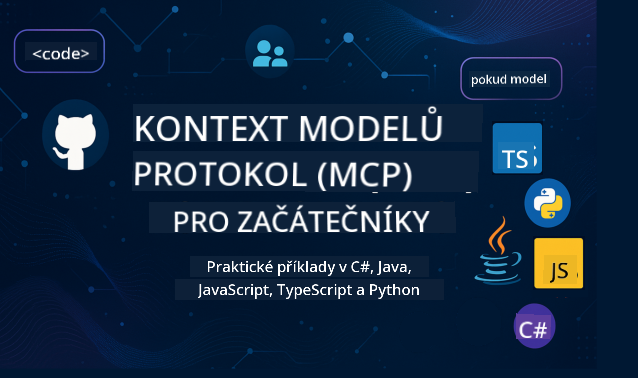

<!--
CO_OP_TRANSLATOR_METADATA:
{
  "original_hash": "2a21391378c12ecfef50f866329dfde0",
  "translation_date": "2025-05-17T05:33:21+00:00",
  "source_file": "README.md",
  "language_code": "cs"
}
-->

Postupujte podle těchto kroků, abyste mohli začít používat tyto zdroje:
1. **Forkněte si repozitář**: Klikněte na 
2. **Klonujte repozitář**: `git clone https://github.com/microsoft/mcp-for-beginners.git`
3. [**Připojte se k Microsoft Azure AI Foundry Discord a setkejte se s odborníky a dalšími vývojáři**](https://discord.com/invite/ByRwuEEgH4)

### 🌐 Podpora více jazyků

#### Podporováno prostřednictvím GitHub Action (automatizované a vždy aktuální)
[Francouzština](../fr/README.md) | [Španělština](../es/README.md) | [Němčina](../de/README.md) | [Ruština](../ru/README.md) | [Arabština](../ar/README.md) | [Perština (Farsi)](../fa/README.md) | [Urdština](../ur/README.md) | [Čínština (zjednodušená)](../zh/README.md) | [Čínština (tradiční, Macao)](../mo/README.md) | [Čínština (tradiční, Hongkong)](../hk/README.md) | [Čínština (tradiční, Tchaj-wan)](../tw/README.md) | [Japonština](../ja/README.md) | [Korejština](../ko/README.md) | [Hindština](../hi/README.md) | [Bengálština](../bn/README.md) | [Maráthština](../mr/README.md) | [Nepálština](../ne/README.md) | [Paňdžábština (Gurmukhi)](../pa/README.md) | [Portugalština (Portugalsko)](../pt/README.md) | [Portugalština (Brazílie)](../br/README.md) | [Italština](../it/README.md) | [Polština](../pl/README.md) | [Turečtina](../tr/README.md) | [Řečtina](../el/README.md) | [Thajština](../th/README.md) | [Švédština](../sv/README.md) | [Dánština](../da/README.md) | [Norština](../no/README.md) | [Finština](../fi/README.md) | [Nizozemština](../nl/README.md) | [Hebrejština](../he/README.md) | [Vietnamština](../vi/README.md) | [Indonéština](../id/README.md) | [Malajština](../ms/README.md) | [Tagalog (Filipínština)](../tl/README.md) | [Svahilština](../sw/README.md) | [Maďarština](../hu/README.md) | [Čeština](./README.md) | [Slovenština](../sk/README.md) | [Rumunština](../ro/README.md) | [Bulharština](../bg/README.md) | [Srbština (cyrilice)](../sr/README.md) | [Chorvatština](../hr/README.md) | [Slovinština](../sl/README.md)
# 🚀 Ultimátní průvodce kurikulem Model Context Protocol (MCP) pro začátečníky

## **Naučte se MCP s praktickými příklady kódu v C#, Java, JavaScript, Python a TypeScript**

## 🧠 Přehled kurikula Model Context Protocol

**Model Context Protocol (MCP)** je moderní framework navržený k standardizaci interakcí mezi AI modely a klientskými aplikacemi. Tento open-source kurikulum nabízí strukturovanou cestu učení, doplněnou praktickými příklady kódu a reálnými případy použití, napříč populárními programovacími jazyky včetně C#, Java, JavaScript, TypeScript a Python.

Ať už jste AI vývojář, systémový architekt nebo softwarový inženýr, tento průvodce je vaším komplexním zdrojem pro zvládnutí základů MCP a strategií implementace.

## 🔗 Oficiální MCP zdroje

- 📘 [MCP Dokumentace](https://modelcontextprotocol.io/) – Podrobné tutoriály a uživatelské příručky  
- 📜 [MCP Specifikace](https://spec.modelcontextprotocol.io/) – Architektura protokolu a technické reference  
- 🧑‍💻 [MCP GitHub Repozitář](https://github.com/modelcontextprotocol) – Open-source SDK, nástroje a ukázky kódu  

## 🧭 Kompletní struktura kurikula MCP

### 📌 [Úvod do MCP](./00-Introduction/README.md)

- Co je Model Context Protocol?
- Proč je standardizace důležitá v AI pipelinech
- Praktické případy použití a výhody MCP

### 🧩 [Vysvětlení základních konceptů](./01-CoreConcepts/README.md)

- Porozumění architektuře klient-server v MCP
- Klíčové komponenty protokolu: požadavky, odpovědi a schémata
- Vzory výměny zpráv a dat v MCP

### 🔐 [Bezpečnost v MCP](./02-Security/readme.md)

- Identifikace bezpečnostních hrozeb v systémech založených na MCP
- Techniky a osvědčené postupy pro zajištění implementace

### 🚀 [Začínáme s MCP](./03-GettingStarted/README.md)

- Nastavení a konfigurace prostředí
- Vytvoření základních MCP serverů a klientů
- Integrace MCP s existujícími aplikacemi

#### 🧮 Ukázkové projekty MCP kalkulačky:

  
<strong>Prozkoumejte implementace kódu podle jazyka</strong>

  - [Příklad MCP serveru v C#](./03-GettingStarted/samples/csharp/README.md)
  - [Java MCP Kalkulačka](./03-GettingStarted/samples/java/calculator/README.md)
  - [JavaScript MCP Demo](./03-GettingStarted/samples/javascript/README.md)
  - [Python MCP Server](../../03-GettingStarted/samples/python/mcp_calculator_server.py)
  - [TypeScript MCP Příklad](./03-GettingStarted/samples/typescript/README.md)

### 🛠️ [Praktická implementace](./04-PracticalImplementation/README.md)

- Použití SDK napříč různými jazyky
- Ladění, testování a validace
- Vytváření opakovaně použitelných šablon a pracovních postupů

#### 💡 Pokročilé projekty MCP kalkulačky:

  
<strong>Prozkoumejte pokročilé ukázky</strong>

  - [Pokročilý příklad v C#](./04-PracticalImplementation/samples/csharp/README.md)
  - [Java Container App Příklad](./04-PracticalImplementation/samples/java/containerapp/README.md)
  - [Pokročilý příklad v JavaScript](./04-PracticalImplementation/samples/javascript/README.md)
  - [Komplexní implementace v Python](../../04-PracticalImplementation/samples/python/mcp_sample.py)
  - [TypeScript Container Příklad](./04-PracticalImplementation/samples/typescript/README.md)

### 🎓 [Pokročilá témata v MCP](./05-AdvancedTopics/README.md)

- Multimodální AI pracovní postupy a rozšiřitelnost
- Strategie bezpečného škálování
- MCP v podnikových ekosystémech

### 🌍 [Příspěvky komunity](./06-CommunityContributions/README.md)

- Jak přispívat kódem a dokumentací
- Spolupráce přes GitHub
- Vylepšení a zpětná vazba řízená komunitou

### 📈 [Postřehy z raného přijetí](./07-CaseStudies/README.md)

- Reálné implementace a co fungovalo
- Vytváření a nasazování řešení založených na MCP
- Trendy a budoucí plán

### 📏 [Osvědčené postupy pro MCP](./08-BestPractices/README.md)

- Tuning výkonu a optimalizace
- Navrhování odolných MCP systémů
- Testovací a odolnostní strategie

### 📊 [Případové studie MCP](./09-CaseStudy/Readme.md)

- Hluboké ponory do architektur MCP řešení
- Plány nasazení a tipy pro integraci
- Anotované diagramy a průvodci projektem

## 🎯 Předpoklady pro učení MCP

Abyste z tohoto kurikula měli co nejvíce, měli byste mít:

- Základní znalosti C#, Java nebo Python
- Porozumění modelu klient-server a API
- (Volitelně) Znalost konceptů strojového učení

## 🛠️ Jak efektivně využívat toto kurikulum

Každá lekce v tomto průvodci obsahuje:

1. Jasná vysvětlení konceptů MCP  
2. Živé příklady kódu v několika jazycích  
3. Cvičení pro vytvoření reálných aplikací MCP  
4. Další zdroje pro pokročilé studenty  

## 📜 Informace o licenci

Tento obsah je licencován pod **MIT Licencí**. Podmínky a ustanovení naleznete v [LICENSE](../../LICENSE).

## 🤝 Pokyny pro přispění

Tento projekt vítá příspěvky a návrhy. Většina příspěvků vyžaduje, abyste souhlasili s 
Dohodou o licenčním přispění (CLA), která potvrzuje, že máte právo a skutečně poskytujete nám 
práva používat váš příspěvek. Podrobnosti najdete na <https://cla.opensource.microsoft.com>.

Když podáte pull request, CLA bot automaticky určí, zda potřebujete poskytnout 
CLA a ozdobí PR vhodně (např. kontrola stavu, komentář). Jednoduše postupujte podle pokynů 
poskytnutých botem. Toto budete muset udělat pouze jednou napříč všemi repozitáři používajícími naši CLA.

Tento projekt přijal [Microsoft Open Source Code of Conduct](https://opensource.microsoft.com/codeofconduct/).
Další informace naleznete v [Code of Conduct FAQ](https://opensource.microsoft.com/codeofconduct/faq/) nebo 
kontaktujte [opencode@microsoft.com](mailto:opencode@microsoft.com) s jakýmikoli dalšími otázkami nebo komentáři.

## ™️ Oznámení o ochranné známce

Tento projekt může obsahovat ochranné známky nebo loga projektů, produktů nebo služeb. Autorizované použití 
ochranných známek nebo log Microsoftu podléhá a musí dodržovat 
[Microsoft's Trademark & Brand Guidelines](https://www.microsoft.com/legal/intellectualproperty/trademarks/usage/general).
Použití ochranných známek nebo log Microsoftu v upravených verzích tohoto projektu nesmí způsobovat zmatek nebo naznačovat sponzorství Microsoftu.
Jakékoli použití ochranných známek nebo log třetích stran podléhá politikám těchto třetích stran.

**Prohlášení**:  
Tento dokument byl přeložen pomocí AI překladatelské služby [Co-op Translator](https://github.com/Azure/co-op-translator). I když se snažíme o přesnost, mějte prosím na paměti, že automatizované překlady mohou obsahovat chyby nebo nepřesnosti. Původní dokument v jeho rodném jazyce by měl být považován za závazný zdroj. Pro důležité informace se doporučuje profesionální lidský překlad. Nejsme odpovědní za jakékoli nedorozumění nebo nesprávné interpretace vyplývající z použití tohoto překladu.