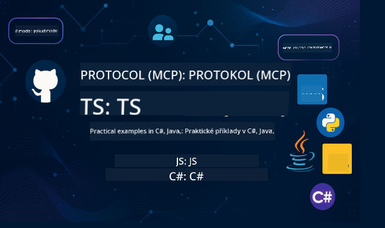

<!--
CO_OP_TRANSLATOR_METADATA:
{
  "original_hash": "292f96c64f54ba097daea9598111ed82",
  "translation_date": "2025-07-02T05:45:42+00:00",
  "source_file": "README.md",
  "language_code": "cs"
}
-->
 

Postupujte podle těchto kroků, abyste začali používat tyto zdroje:
1. **Vytvořte Fork repozitáře**: Klikněte na 
2. **Naklonujte repozitář**:   `git clone https://github.com/microsoft/mcp-for-beginners.git`
3. [**Připojte se na Azure AI Foundry Discord a potkejte odborníky a další vývojáře**](https://discord.com/invite/ByRwuEEgH4)

### 🌐 Podpora více jazyků

#### Podporováno pomocí GitHub Action (automaticky a vždy aktuální)

# 🚀 Kurikulum Model Context Protocol (MCP) pro začátečníky

## **Naučte se MCP s praktickými příklady v C#, Java, JavaScript, Python a TypeScript**

## 🧠 Přehled kurikula Model Context Protocol

**Model Context Protocol (MCP)** je špičkový rámec navržený pro standardizaci interakcí mezi AI modely a klientskými aplikacemi. Toto open-source kurikulum nabízí strukturovanou cestu učení, včetně praktických kódových příkladů a reálných případů použití v populárních programovacích jazycích jako C#, Java, JavaScript, TypeScript a Python.

Ať už jste vývojář AI, systémový architekt nebo softwarový inženýr, tento průvodce je vaším komplexním zdrojem pro zvládnutí základů MCP a strategií jeho implementace.

## 🔗 Oficiální zdroje MCP

- 📘 [MCP Dokumentace](https://modelcontextprotocol.io/) – Podrobné návody a uživatelské příručky  
- 📜 [MCP Specifikace](https://spec.modelcontextprotocol.io/) – Architektura protokolu a technické reference  
- 🧑‍💻 [MCP GitHub Repository](https://github.com/modelcontextprotocol) – Open-source SDK, nástroje a ukázky kódu  

## 🧭 Přehled kurikula MCP

### Základy Model Context Protocol  

  
<strong> Lekce 1-3: Základy Model Context Protocol</strong>

- **00. Úvod do MCP**  
  Přehled Model Context Protocol a jeho význam v AI pipelinech. [Číst více](./00-Introduction/README.md)
- **01. Vysvětlení základních konceptů**  
  Hloubkový průzkum základních konceptů MCP. [Číst více](./01-CoreConcepts/README.md)
- **02. Bezpečnost v MCP**  
  Bezpečnostní hrozby a nejlepší postupy. [Číst více](./02-Security/README.md)
- **03. Začínáme s MCP**  
  Nastavení prostředí, základní servery/klienti, integrace. [Číst více](./03-GettingStarted/README.md)

### Vytvoření a nasazení vašeho prvního MCP serveru a klienta, praktická cvičení a scénáře  

  
<strong> Lekce 3: Vytvoření a nasazení prvního MCP serveru a klienta</strong>

- **3.1. První server** – [Průvodce](./03-GettingStarted/01-first-server/README.md)
- **3.2. První klient** – [Průvodce](./03-GettingStarted/02-client/README.md)
- **3.3. Klient s LLM** – [Průvodce](./03-GettingStarted/03-llm-client/README.md)
- **3.4. Používání serveru ve Visual Studio Code** – [Průvodce](./03-GettingStarted/04-vscode/README.md)
- **3.5. Vytvoření serveru pomocí SSE** – [Průvodce](./03-GettingStarted/05-sse-server/README.md)
- **3.6. HTTP Streaming** – [Průvodce](./03-GettingStarted/06-http-streaming/README.md)
- **3.7. Použití AI Toolkit** – [Průvodce](./03-GettingStarted/07-aitk/README.md)
- **3.8. Testování vašeho serveru** – [Průvodce](./03-GettingStarted/08-testing/README.md)
- **3.9. Nasazení vašeho serveru** – [Průvodce](./03-GettingStarted/09-deployment/README.md)

### Praktické implementace a pokročilý obsah Model Context Protocol  

  
<strong> Lekce 4-5: Praktické a pokročilé</strong>

- **04. Praktická implementace**  
  SDK, ladění, testování, znovupoužitelné šablony promptů. [Číst více](./04-PracticalImplementation/README.md)
- **05. Pokročilá témata v MCP**  
  Multimodální AI, škálování, podnikové využití. [Číst více](./05-AdvancedTopics/README.md)
- **5.1. MCP integrace s Azure** – [Průvodce](./05-AdvancedTopics/mcp-integration/README.md)
- **5.2. Multimodalita** – [Průvodce](./05-AdvancedTopics/mcp-multi-modality/README.md)
- **5.3. MCP OAuth2 Demo** – [Průvodce](./05-AdvancedTopics/mcp-oauth2-demo/README.md)
- **5.4. Root Contexts** – [Průvodce](./05-AdvancedTopics/mcp-root-contexts/README.md)
- **5.5. Směrování** – [Průvodce](./05-AdvancedTopics/mcp-routing/README.md)
- **5.6. Sampling** – [Průvodce](./05-AdvancedTopics/mcp-sampling/README.md)
- **5.7. Škálování** – [Průvodce](./05-AdvancedTopics/mcp-scaling/README.md)
- **5.8. Bezpečnost** – [Průvodce](./05-AdvancedTopics/mcp-security/README.md)
- **5.9. Webové vyhledávání MCP** – [Průvodce](./05-AdvancedTopics/web-search-mcp/README.md)
- **5.10. Realtime Streaming** – [Průvodce](./05-AdvancedTopics/mcp-realtimestreaming/README.md)
- **5.11. Realtime Webové vyhledávání** – [Průvodce](./05-AdvancedTopics/mcp-realtimesearch/README.md)
- **5.12. Entra ID autentizace pro Model Context Protocol servery** – [Průvodce](./05-AdvancedTopics/mcp-security-entra/README.md)

### Nejlepší praktiky Model Context Protocol  

  
<strong> Lekce 6-9: Komunita, nejlepší praktiky a laboratoře</strong>

- **06. Příspěvky komunity** – [Průvodce](./06-CommunityContributions/README.md)
- **07. Zkušenosti z rané adopce** – [Průvodce](./07-LessonsFromEarlyAdoption/README.md)
- **08. Nejlepší postupy pro MCP** – [Průvodce](./08-BestPractices/README.md)
- **09. Případové studie MCP** – [Průvodce](./09-CaseStudy/README.md)

### Praktické cvičení Model Context Protocol s AI Toolkit pro VScode

  
<strong>Lekce 10: Praktické cvičení – Vytvoření MCP serveru s AI Toolkit pro VScode</strong>

    
- **10. Zefektivnění AI pracovních toků: Vytvoření MCP serveru s AI Toolkit** – [Praktické cvičení](./10-StreamliningAIWorkflowsBuildingAnMCPServerWithAIToolkit/README.md)

## Ukázkové projekty Model Context Protocol – Vytvoření MCP kalkulačky v Java, C#, JavaScript, TypeScript a Pythonu

### 🧮 Ukázkové projekty MCP kalkulačky v Java, C#, JavaScript, TypeScript a Pythonu

  
<strong>Prozkoumejte implementace kódu podle jazyka</strong>

  - [Příklad MCP serveru v C#](./03-GettingStarted/samples/csharp/README.md)
  - [MCP kalkulačka v Java](./03-GettingStarted/samples/java/calculator/README.md)
  - [MCP demo v JavaScriptu](./03-GettingStarted/samples/javascript/README.md)
  - [MCP server v Pythonu](../../03-GettingStarted/samples/python/mcp_calculator_server.py)
  - [Příklad MCP v TypeScriptu](./03-GettingStarted/samples/typescript/README.md)

### 💡 Pokročilé příklady MCP: Kalkulační projekty v C#, Java, JavaScript, TypeScript a Pythonu

  
<strong>Prozkoumejte pokročilé ukázky</strong>

  - [Pokročilý příklad v C#](./04-PracticalImplementation/samples/csharp/README.md)
  - [Příklad kontejnerové aplikace v Java](./04-PracticalImplementation/samples/java/containerapp/README.md)
  - [Pokročilý příklad v JavaScriptu](./04-PracticalImplementation/samples/javascript/README.md)
  - [Složitá implementace v Pythonu](../../04-PracticalImplementation/samples/python/mcp_sample.py)
  - [Kontejnerový příklad v TypeScriptu](./04-PracticalImplementation/samples/typescript/README.md)

## 🎯 Předpoklady pro studium MCP

Abyste z tohoto kurzu vytěžili co nejvíce, měli byste mít:

- Základní znalosti C#, Java nebo Pythonu  
- Pochopení modelu klient-server a API  
- (Volitelné) Základní povědomí o strojovém učení  

## 📚 Studijní průvodce

K dispozici je podrobný [Studijní průvodce](./study_guide.md), který vám pomůže efektivně procházet tento repozitář. Průvodce obsahuje:

- Vizualizaci osnovy s přehledem všech témat  
- Podrobný rozpis jednotlivých částí repozitáře  
- Návody, jak používat ukázkové projekty  
- Doporučené studijní cesty pro různé úrovně dovedností  
- Další zdroje pro doplnění vašeho studia  

## 🛠️ Jak efektivně využít tento kurz

Každá lekce v tomto průvodci obsahuje:

1. Jasná vysvětlení konceptů MCP  
2. Ukázky kódu v několika programovacích jazycích  
3. Cvičení na tvorbu skutečných MCP aplikací  
4. Další materiály pro pokročilé uživatele  

## 🌟 Poděkování komunitě

Děkujeme Microsoft Valued Professional [Shivam Goyal](https://www.linkedin.com/in/shivam2003/) za přispění důležitých ukázek kódu.

## 📜 Informace o licenci

Tento obsah je licencován pod **MIT licencí**. Podmínky najdete v souboru [LICENSE](../../LICENSE).

## 🤝 Pravidla pro přispívání

Tento projekt vítá příspěvky a návrhy. Většina příspěvků vyžaduje souhlas s Contributor License Agreement (CLA), ve kterém deklarujete, že máte právo a skutečně udělujete práva k použití vašeho příspěvku. Podrobnosti najdete na <https://cla.opensource.microsoft.com>.

Po odeslání pull requestu automatický CLA bot zjistí, zda je potřeba CLA poskytnout, a označí PR příslušným způsobem (např. kontrola stavu, komentář). Stačí postupovat podle pokynů bota. Tento proces je potřeba provést jen jednou pro všechny repozitáře používající naši CLA.

Tento projekt přijal [Microsoft Open Source Code of Conduct](https://opensource.microsoft.com/codeofconduct/). Více informací najdete v [FAQ k Code of Conduct](https://opensource.microsoft.com/codeofconduct/faq/) nebo kontaktujte [opencode@microsoft.com](mailto:opencode@microsoft.com) s případnými dotazy či připomínkami.

## 🎒 Další kurzy
Náš tým vytváří i další kurzy! Podívejte se na:

- [AI Agents For Beginners](https://github.com/microsoft/ai-agents-for-beginners?WT.mc_id=academic-105485-koreyst)
- [Generative AI for Beginners using .NET](https://github.com/microsoft/Generative-AI-for-beginners-dotnet?WT.mc_id=academic-105485-koreyst)
- [Generative AI for Beginners using JavaScript](https://github.com/microsoft/generative-ai-with-javascript?WT.mc_id=academic-105485-koreyst)
- [Generative AI for Beginners](https://github.com/microsoft/generative-ai-for-beginners?WT.mc_id=academic-105485-koreyst)
- [ML for Beginners](https://aka.ms/ml-beginners?WT.mc_id=academic-105485-koreyst)
- [Data Science for Beginners](https://aka.ms/datascience-beginners?WT.mc_id=academic-105485-koreyst)
- [AI for Beginners](https://aka.ms/ai-beginners?WT.mc_id=academic-105485-koreyst)
- [Cybersecurity for Beginners](https://github.com/microsoft/Security-101??WT.mc_id=academic-96948-sayoung)
- [Web Dev for Beginners](https://aka.ms/webdev-beginners?WT.mc_id=academic-105485-koreyst)
- [IoT pro začátečníky](https://aka.ms/iot-beginners?WT.mc_id=academic-105485-koreyst)
- [Vývoj XR pro začátečníky](https://github.com/microsoft/xr-development-for-beginners?WT.mc_id=academic-105485-koreyst)
- [Ovládnutí GitHub Copilot pro AI párové programování](https://aka.ms/GitHubCopilotAI?WT.mc_id=academic-105485-koreyst)
- [Ovládnutí GitHub Copilot pro vývojáře C#/.NET](https://github.com/microsoft/mastering-github-copilot-for-dotnet-csharp-developers?WT.mc_id=academic-105485-koreyst)
- [Vyberte si vlastní Copilot dobrodružství](https://github.com/microsoft/CopilotAdventures?WT.mc_id=academic-105485-koreyst)

## ™️ Upozornění na ochrannou známku

Tento projekt může obsahovat ochranné známky nebo loga projektů, produktů či služeb. Autorizované používání ochranných známek nebo log Microsoftu podléhá a musí dodržovat
[Pravidla používání ochranných známek a značek Microsoftu](https://www.microsoft.com/legal/intellectualproperty/trademarks/usage/general).
Používání ochranných známek nebo log Microsoftu v upravených verzích tohoto projektu nesmí způsobovat záměnu ani naznačovat sponzorství Microsoftem.
Jakékoli použití ochranných známek nebo log třetích stran podléhá zásadám těchto třetích stran.

**Prohlášení o vyloučení odpovědnosti**:  
Tento dokument byl přeložen pomocí AI překladatelské služby [Co-op Translator](https://github.com/Azure/co-op-translator). Přestože usilujeme o přesnost, mějte prosím na paměti, že automatické překlady mohou obsahovat chyby nebo nepřesnosti. Původní dokument v jeho mateřském jazyce by měl být považován za autoritativní zdroj. Pro kritické informace se doporučuje profesionální lidský překlad. Nejsme odpovědní za jakékoli nedorozumění nebo nesprávné interpretace vyplývající z použití tohoto překladu.