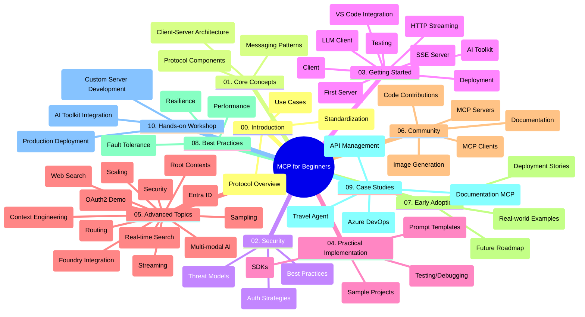

<!--
CO_OP_TRANSLATOR_METADATA:
{
  "original_hash": "5f321ea583cf087a94e47ee74c62b504",
  "translation_date": "2025-07-17T10:35:54+00:00",
  "source_file": "study_guide.md",
  "language_code": "cs"
}
-->
# Model Context Protocol (MCP) pro začátečníky – studijní průvodce

Tento studijní průvodce poskytuje přehled struktury a obsahu repozitáře pro kurz „Model Context Protocol (MCP) pro začátečníky“. Použijte tento průvodce k efektivní orientaci v repozitáři a maximálnímu využití dostupných zdrojů.

## Přehled repozitáře

Model Context Protocol (MCP) je standardizovaný rámec pro interakce mezi AI modely a klientskými aplikacemi. Původně vytvořený společností Anthropic, MCP je nyní spravován širší komunitou MCP prostřednictvím oficiální organizace na GitHubu. Tento repozitář nabízí komplexní kurz s praktickými ukázkami kódu v jazycích C#, Java, JavaScript, Python a TypeScript, určený pro vývojáře AI, systémové architekty a softwarové inženýry.

## Vizualizace kurikula

## Struktura repozitáře

Repozitář je rozdělen do deseti hlavních sekcí, z nichž každá se zaměřuje na různé aspekty MCP:

1. **Úvod (00-Introduction/)**
   - Přehled Model Context Protocol
   - Proč je standardizace důležitá v AI pipelinech
   - Praktické případy použití a přínosy

2. **Základní koncepty (01-CoreConcepts/)**
   - Klient-server architektura
   - Klíčové komponenty protokolu
   - Vzory zpráv v MCP

3. **Bezpečnost (02-Security/)**
   - Hrozby bezpečnosti v systémech založených na MCP
   - Nejlepší postupy pro zabezpečení implementací
   - Strategie autentizace a autorizace

4. **Začínáme (03-GettingStarted/)**
   - Nastavení a konfigurace prostředí
   - Vytvoření základních MCP serverů a klientů
   - Integrace s existujícími aplikacemi
   - Obsahuje sekce pro:
     - První implementaci serveru
     - Vývoj klienta
     - Integraci LLM klienta
     - Integraci ve VS Code
     - Server-Sent Events (SSE) server
     - HTTP streaming
     - Integraci AI Toolkit
     - Testovací strategie
     - Pokyny pro nasazení

5. **Praktická implementace (04-PracticalImplementation/)**
   - Použití SDK v různých programovacích jazycích
   - Ladění, testování a ověřování
   - Tvorba znovupoužitelných šablon promptů a workflow
   - Ukázkové projekty s příklady implementace

6. **Pokročilá témata (05-AdvancedTopics/)**
   - Techniky kontextového inženýrství
   - Integrace Foundry agenta
   - Multimodální AI workflow
   - Ukázky OAuth2 autentizace
   - Funkce vyhledávání v reálném čase
   - Streaming v reálném čase
   - Implementace root kontextů
   - Směrovací strategie
   - Techniky vzorkování
   - Přístupy k škálování
   - Bezpečnostní aspekty
   - Integrace bezpečnosti Entra ID
   - Integrace webového vyhledávání

7. **Příspěvky komunity (06-CommunityContributions/)**
   - Jak přispívat kódem a dokumentací
   - Spolupráce přes GitHub
   - Vylepšení a zpětná vazba řízená komunitou
   - Používání různých MCP klientů (Claude Desktop, Cline, VSCode)
   - Práce s populárními MCP servery včetně generování obrázků

8. **Lekce z raného přijetí (07-LessonsfromEarlyAdoption/)**
   - Reálné implementace a úspěšné příběhy
   - Budování a nasazení řešení založených na MCP
   - Trendy a budoucí plán vývoje

9. **Nejlepší postupy (08-BestPractices/)**
   - Ladění výkonu a optimalizace
   - Návrh odolných MCP systémů
   - Testování a strategie odolnosti

10. **Případové studie (09-CaseStudy/)**
    - Případová studie: integrace Azure API Management
    - Případová studie: implementace cestovní agentury
    - Případová studie: integrace Azure DevOps s YouTube
    - Příklady implementací s podrobnou dokumentací

11. **Praktický workshop (10-StreamliningAIWorkflowsBuildingAnMCPServerWithAIToolkit/)**
    - Komplexní praktický workshop spojující MCP s AI Toolkit
    - Vytváření inteligentních aplikací propojujících AI modely s reálnými nástroji
    - Praktické moduly pokrývající základy, vývoj vlastního serveru a strategie nasazení do produkce
    - Výuka založená na laboratorních cvičeních s podrobnými instrukcemi

## Další zdroje

Repozitář obsahuje podpůrné zdroje:

- **Složka obrázků**: Obsahuje diagramy a ilustrace používané v celém kurikulu
- **Překlady**: Podpora více jazyků s automatizovanými překlady dokumentace
- **Oficiální MCP zdroje**:
  - [MCP Dokumentace](https://modelcontextprotocol.io/)
  - [MCP Specifikace](https://spec.modelcontextprotocol.io/)
  - [MCP GitHub Repozitář](https://github.com/modelcontextprotocol)

## Jak používat tento repozitář

1. **Sekvenční učení**: Projděte kapitoly v pořadí (00 až 10) pro strukturované studium.
2. **Jazykové zaměření**: Pokud vás zajímá konkrétní programovací jazyk, prozkoumejte složky se vzorovými projekty ve vámi preferovaném jazyce.
3. **Praktická implementace**: Začněte sekcí „Začínáme“ pro nastavení prostředí a vytvoření prvního MCP serveru a klienta.
4. **Pokročilé prozkoumání**: Jakmile zvládnete základy, ponořte se do pokročilých témat pro rozšíření znalostí.
5. **Zapojení komunity**: Připojte se ke komunitě MCP přes GitHub diskuze a Discord kanály, kde můžete komunikovat s odborníky a dalšími vývojáři.

## MCP klienti a nástroje

Kurikulum pokrývá různé MCP klienty a nástroje:

1. **Oficiální klienti**:
   - Visual Studio Code
   - MCP ve Visual Studio Code
   - Claude Desktop
   - Claude ve VSCode
   - Claude API

2. **Klienti komunity**:
   - Cline (terminálový klient)
   - Cursor (editor kódu)
   - ChatMCP
   - Windsurf

3. **Nástroje pro správu MCP**:
   - MCP CLI
   - MCP Manager
   - MCP Linker
   - MCP Router

## Populární MCP servery

Repozitář představuje různé MCP servery, včetně:

1. **Oficiální referenční servery**:
   - Filesystem
   - Fetch
   - Memory
   - Sequential Thinking

2. **Generování obrázků**:
   - Azure OpenAI DALL-E 3
   - Stable Diffusion WebUI
   - Replicate

3. **Vývojové nástroje**:
   - Git MCP
   - Terminal Control
   - Code Assistant

4. **Specializované servery**:
   - Salesforce
   - Microsoft Teams
   - Jira & Confluence

## Přispívání

Tento repozitář vítá příspěvky od komunity. Viz sekce Příspěvky komunity pro pokyny, jak efektivně přispívat do ekosystému MCP.

## Změny

| Datum | Změny |
|-------|--------|
| 16. července 2025 | - Aktualizovaná struktura repozitáře odpovídající aktuálnímu obsahu - Přidána sekce MCP klienti a nástroje - Přidána sekce populární MCP servery - Aktualizovaná vizualizace kurikula se všemi aktuálními tématy - Rozšířená sekce pokročilá témata o všechny specializované oblasti - Aktualizované případové studie s reálnými příklady - Upřesnění původu MCP jako projektu vytvořeného Anthropic |
| 11. června 2025 | - První vytvoření studijního průvodce - Přidána vizualizace kurikula - Nastíněna struktura repozitáře - Zařazeny ukázkové projekty a další zdroje |

---

*Tento studijní průvodce byl aktualizován 16. července 2025 a poskytuje přehled repozitáře k tomuto datu. Obsah repozitáře může být po tomto datu aktualizován.*

**Prohlášení o vyloučení odpovědnosti**:  
Tento dokument byl přeložen pomocí AI překladatelské služby [Co-op Translator](https://github.com/Azure/co-op-translator). I když usilujeme o přesnost, mějte prosím na paměti, že automatizované překlady mohou obsahovat chyby nebo nepřesnosti. Původní dokument v jeho mateřském jazyce by měl být považován za závazný zdroj. Pro důležité informace se doporučuje profesionální lidský překlad. Nejsme odpovědní za jakékoliv nedorozumění nebo nesprávné výklady vyplývající z použití tohoto překladu.