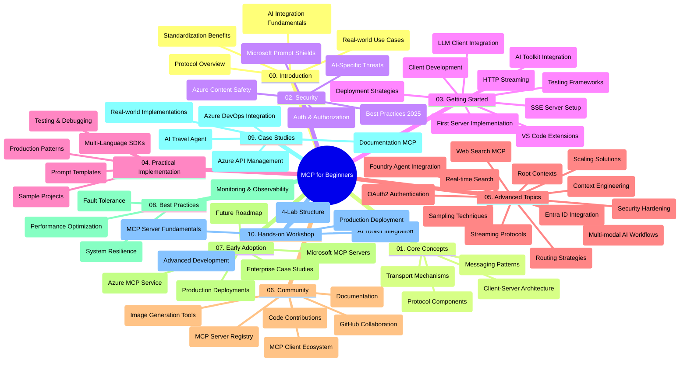

<!--
CO_OP_TRANSLATOR_METADATA:
{
  "original_hash": "e2c6ed897fa98fa08e0146101776c7ff",
  "translation_date": "2025-07-18T10:19:25+00:00",
  "source_file": "study_guide.md",
  "language_code": "cs"
}
-->
# Model Context Protocol (MCP) pro začátečníky – studijní průvodce

Tento studijní průvodce nabízí přehled struktury a obsahu repozitáře pro kurz „Model Context Protocol (MCP) pro začátečníky“. Použijte ho k efektivní orientaci v repozitáři a maximálnímu využití dostupných zdrojů.

## Přehled repozitáře

Model Context Protocol (MCP) je standardizovaný rámec pro interakce mezi AI modely a klientskými aplikacemi. Původně vytvořený společností Anthropic, je MCP nyní spravován širší komunitou MCP prostřednictvím oficiální organizace na GitHubu. Tento repozitář nabízí komplexní kurz s praktickými ukázkami kódu v jazycích C#, Java, JavaScript, Python a TypeScript, určený pro vývojáře AI, systémové architekty a softwarové inženýry.

## Vizualizace osnovy kurzu

## Struktura repozitáře

Repozitář je rozdělen do deseti hlavních sekcí, z nichž každá se zaměřuje na různé aspekty MCP:

1. **Úvod (00-Introduction/)**
   - Přehled Model Context Protocol
   - Proč je standardizace důležitá v AI pipelinech
   - Praktické případy použití a přínosy

2. **Základní koncepty (01-CoreConcepts/)**
   - Klient-server architektura
   - Klíčové komponenty protokolu
   - Vzory zpráv v MCP

3. **Bezpečnost (02-Security/)**
   - Hrozby bezpečnosti v systémech založených na MCP
   - Nejlepší postupy pro zabezpečení implementací
   - Strategie autentizace a autorizace
   - **Komplexní dokumentace bezpečnosti**:
     - MCP Security Best Practices 2025
     - Azure Content Safety Implementation Guide
     - MCP Security Controls and Techniques
     - MCP Best Practices Quick Reference
   - **Klíčová bezpečnostní témata**:
     - Útoky typu prompt injection a tool poisoning
     - Únos relace a problémy confused deputy
     - Zranitelnosti při průchodu tokenů
     - Nadměrná oprávnění a kontrola přístupu
     - Bezpečnost dodavatelského řetězce AI komponent
     - Integrace Microsoft Prompt Shields

4. **Začínáme (03-GettingStarted/)**
   - Nastavení a konfigurace prostředí
   - Vytvoření základních MCP serverů a klientů
   - Integrace do stávajících aplikací
   - Obsahuje sekce pro:
     - První implementaci serveru
     - Vývoj klienta
     - Integraci LLM klienta
     - Integraci ve VS Code
     - Server-Sent Events (SSE) server
     - HTTP streaming
     - Integraci AI Toolkit
     - Testovací strategie
     - Pokyny pro nasazení

5. **Praktická implementace (04-PracticalImplementation/)**
   - Použití SDK v různých programovacích jazycích
   - Ladění, testování a ověřování
   - Tvorba znovupoužitelných šablon promptů a workflow
   - Ukázkové projekty s příklady implementace

6. **Pokročilá témata (05-AdvancedTopics/)**
   - Techniky kontextového inženýrství
   - Integrace Foundry agenta
   - Multimodální AI workflow
   - Ukázky autentizace OAuth2
   - Realtime vyhledávání
   - Realtime streaming
   - Implementace root kontextů
   - Směrovací strategie
   - Techniky vzorkování
   - Přístupy k škálování
   - Bezpečnostní aspekty
   - Integrace bezpečnosti Entra ID
   - Integrace webového vyhledávání

7. **Příspěvky komunity (06-CommunityContributions/)**
   - Jak přispívat kódem a dokumentací
   - Spolupráce přes GitHub
   - Vylepšení a zpětná vazba řízená komunitou
   - Používání různých MCP klientů (Claude Desktop, Cline, VSCode)
   - Práce s populárními MCP servery včetně generování obrázků

8. **Zkušenosti z raného nasazení (07-LessonsfromEarlyAdoption/)**
   - Reálné implementace a úspěšné příběhy
   - Budování a nasazení řešení založených na MCP
   - Trendy a budoucí plán rozvoje
   - **Průvodce Microsoft MCP servery**: Komplexní přehled 10 produkčně připravených Microsoft MCP serverů včetně:
     - Microsoft Learn Docs MCP Server
     - Azure MCP Server (15+ specializovaných konektorů)
     - GitHub MCP Server
     - Azure DevOps MCP Server
     - MarkItDown MCP Server
     - SQL Server MCP Server
     - Playwright MCP Server
     - Dev Box MCP Server
     - Azure AI Foundry MCP Server
     - Microsoft 365 Agents Toolkit MCP Server

9. **Nejlepší postupy (08-BestPractices/)**
   - Ladění výkonu a optimalizace
   - Návrh odolných MCP systémů
   - Testování a strategie odolnosti

10. **Případové studie (09-CaseStudy/)**
    - Ukázka integrace Azure API Management
    - Ukázka implementace cestovní agentury
    - Integrace Azure DevOps s aktualizacemi YouTube
    - Příklady implementace MCP v dokumentaci
    - Implementační příklady s podrobnou dokumentací

11. **Praktický workshop (10-StreamliningAIWorkflowsBuildingAnMCPServerWithAIToolkit/)**
    - Komplexní praktický workshop kombinující MCP s AI Toolkit
    - Vytváření inteligentních aplikací propojujících AI modely s reálnými nástroji
    - Praktické moduly pokrývající základy, vývoj vlastního serveru a strategie produkčního nasazení
    - **Struktura laboratoří**:
      - Laboratoř 1: Základy MCP serveru
      - Laboratoř 2: Pokročilý vývoj MCP serveru
      - Laboratoř 3: Integrace AI Toolkit
      - Laboratoř 4: Produkční nasazení a škálování
    - Výuka založená na laboratořích s podrobnými instrukcemi krok za krokem

## Další zdroje

Repozitář obsahuje podpůrné zdroje:

- **Složka obrázků**: Obsahuje diagramy a ilustrace používané v kurzu
- **Překlady**: Podpora více jazyků s automatizovanými překlady dokumentace
- **Oficiální MCP zdroje**:
  - [MCP Documentation](https://modelcontextprotocol.io/)
  - [MCP Specification](https://spec.modelcontextprotocol.io/)
  - [MCP GitHub Repository](https://github.com/modelcontextprotocol)

## Jak používat tento repozitář

1. **Sekvenční učení**: Projděte kapitoly v pořadí (00 až 10) pro strukturované studium.
2. **Jazykové zaměření**: Pokud vás zajímá konkrétní programovací jazyk, prozkoumejte složky se vzory implementací ve vámi preferovaném jazyce.
3. **Praktická implementace**: Začněte sekcí „Začínáme“ pro nastavení prostředí a vytvoření prvního MCP serveru a klienta.
4. **Pokročilé prozkoumání**: Jakmile zvládnete základy, ponořte se do pokročilých témat pro rozšíření znalostí.
5. **Zapojení komunity**: Připojte se ke komunitě MCP přes diskuse na GitHubu a kanály Discord, kde můžete komunikovat s odborníky a dalšími vývojáři.

## MCP klienti a nástroje

Kurz pokrývá různé MCP klienty a nástroje:

1. **Oficiální klienti**:
   - Visual Studio Code
   - MCP ve Visual Studio Code
   - Claude Desktop
   - Claude ve VSCode
   - Claude API

2. **Klienti komunity**:
   - Cline (terminálový)
   - Cursor (editor kódu)
   - ChatMCP
   - Windsurf

3. **Nástroje pro správu MCP**:
   - MCP CLI
   - MCP Manager
   - MCP Linker
   - MCP Router

## Populární MCP servery

Repozitář představuje různé MCP servery, včetně:

1. **Oficiální Microsoft MCP servery**:
   - Microsoft Learn Docs MCP Server
   - Azure MCP Server (15+ specializovaných konektorů)
   - GitHub MCP Server
   - Azure DevOps MCP Server
   - MarkItDown MCP Server
   - SQL Server MCP Server
   - Playwright MCP Server
   - Dev Box MCP Server
   - Azure AI Foundry MCP Server
   - Microsoft 365 Agents Toolkit MCP Server

2. **Oficiální referenční servery**:
   - Filesystem
   - Fetch
   - Memory
   - Sequential Thinking

3. **Generování obrázků**:
   - Azure OpenAI DALL-E 3
   - Stable Diffusion WebUI
   - Replicate

4. **Vývojové nástroje**:
   - Git MCP
   - Terminal Control
   - Code Assistant

5. **Specializované servery**:
   - Salesforce
   - Microsoft Teams
   - Jira & Confluence

## Přispívání

Tento repozitář vítá příspěvky od komunity. Viz sekce Příspěvky komunity pro pokyny, jak efektivně přispívat do ekosystému MCP.

## Změny

| Datum | Změny |
|-------|--------|
| 18. července 2025 | - Aktualizovaná struktura repozitáře zahrnující Průvodce Microsoft MCP servery - Přidán komplexní seznam 10 produkčně připravených Microsoft MCP serverů - Rozšířená sekce Populární MCP servery o Oficiální Microsoft MCP servery - Aktualizace Případových studií o skutečné příklady souborů - Přidány detaily struktury laboratoří pro Praktický workshop |
| 16. července 2025 | - Aktualizace struktury repozitáře podle aktuálního obsahu - Přidána sekce MCP klienti a nástroje - Přidána sekce Populární MCP servery - Aktualizace Vizualizace osnovy kurzu o všechna aktuální témata - Rozšíření sekce Pokročilá témata o všechny specializované oblasti - Aktualizace Případových studií s reálnými příklady - Upřesnění původu MCP jako projektu vytvořeného Anthropic |
| 11. června 2025 | - První vytvoření studijního průvodce - Přidána Vizualizace osnovy kurzu - Vymezení struktury repozitáře - Zařazení ukázkových projektů a dalších zdrojů |

---

*Tento studijní průvodce byl aktualizován 18. července 2025 a poskytuje přehled repozitáře k tomuto datu. Obsah repozitáře může být po tomto datu aktualizován.*

**Prohlášení o vyloučení odpovědnosti**:  
Tento dokument byl přeložen pomocí AI překladatelské služby [Co-op Translator](https://github.com/Azure/co-op-translator). I když usilujeme o přesnost, mějte prosím na paměti, že automatizované překlady mohou obsahovat chyby nebo nepřesnosti. Původní dokument v jeho mateřském jazyce by měl být považován za autoritativní zdroj. Pro důležité informace se doporučuje profesionální lidský překlad. Nejsme odpovědní za jakékoliv nedorozumění nebo nesprávné výklady vyplývající z použití tohoto překladu.