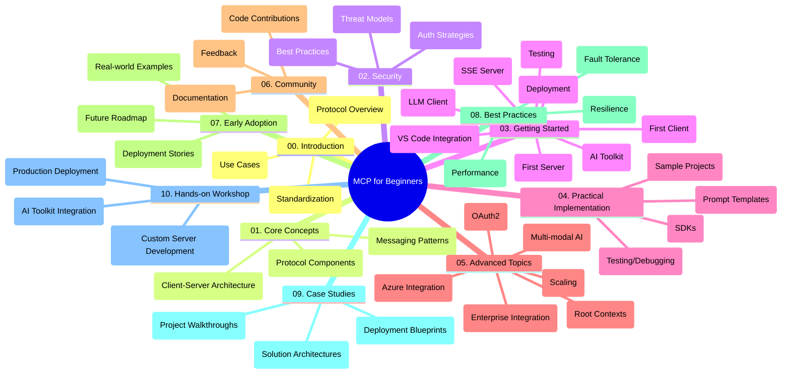

<!--
CO_OP_TRANSLATOR_METADATA:
{
  "original_hash": "a607d4febc94caee9a12b77795f7fc9a",
  "translation_date": "2025-06-11T16:49:57+00:00",
  "source_file": "study_guide.md",
  "language_code": "cs"
}
-->
# Model Context Protocol (MCP) для начинающих - учебное пособие

Это учебное пособие предоставляет обзор структуры и содержимого репозитория для учебного курса "Model Context Protocol (MCP) для начинающих". Используйте его для эффективной навигации по репозиторию и максимального использования доступных ресурсов.

## Обзор репозитория

Model Context Protocol (MCP) — это стандартизированная платформа для взаимодействия между AI-моделями и клиентскими приложениями. Этот репозиторий содержит комплексный учебный курс с практическими примерами кода на C#, Java, JavaScript, Python и TypeScript, предназначенный для разработчиков AI, системных архитекторов и инженеров-программистов.

## Визуальная карта курса

## Структура репозитория

Репозиторий разделён на десять основных разделов, каждый из которых посвящён разным аспектам MCP:

1. **Введение (00-Introduction/)**
   - Обзор Model Context Protocol
   - Почему стандартизация важна в AI-пайплайнах
   - Практические примеры и преимущества

2. **Основные концепции (01-CoreConcepts/)**
   - Клиент-серверная архитектура
   - Ключевые компоненты протокола
   - Паттерны обмена сообщениями в MCP

3. **Безопасность (02-Security/)**
   - Угрозы безопасности в системах на базе MCP
   - Лучшие практики по защите реализаций
   - Стратегии аутентификации и авторизации

4. **Начало работы (03-GettingStarted/)**
   - Настройка и конфигурация окружения
   - Создание базовых MCP серверов и клиентов
   - Интеграция с существующими приложениями
   - Подразделы для первого сервера, первого клиента, LLM клиента, интеграции с VS Code, SSE сервера, AI Toolkit, тестирования и деплоя

5. **Практическая реализация (04-PracticalImplementation/)**
   - Использование SDK на разных языках программирования
   - Отладка, тестирование и методы валидации
   - Создание переиспользуемых шаблонов запросов и рабочих процессов
   - Примеры проектов с реализациями

6. **Продвинутые темы (05-AdvancedTopics/)**
   - Мультимодальные AI рабочие процессы и расширяемость
   - Безопасное масштабирование
   - MCP в корпоративных экосистемах
   - Специализированные темы: интеграция с Azure, мультимодальность, OAuth2, корневые контексты, маршрутизация, сэмплирование, масштабирование, безопасность, интеграция веб-поиска и стриминг.

7. **Вклад сообщества (06-CommunityContributions/)**
   - Как вносить код и документацию
   - Совместная работа через GitHub
   - Улучшения и отзывы от сообщества

8. **Уроки раннего внедрения (07-LessonsfromEarlyAdoption/)**
   - Реальные реализации и истории успеха
   - Создание и развёртывание решений на базе MCP
   - Тенденции и планы на будущее

9. **Лучшие практики (08-BestPractices/)**
   - Оптимизация производительности и настройка
   - Проектирование отказоустойчивых MCP систем
   - Стратегии тестирования и повышения устойчивости

10. **Кейсы (09-CaseStudy/)**
    - Глубокий разбор архитектур решений MCP
    - Схемы развёртывания и советы по интеграции
    - Аннотированные диаграммы и пошаговые обзоры проектов

11. **Практический воркшоп (10-StreamliningAIWorkflowsBuildingAnMCPServerWithAIToolkit/)**
    - Комплексный практический воркшоп по сочетанию MCP с AI Toolkit от Microsoft для VS Code
    - Создание интеллектуальных приложений, связывающих AI-модели с реальными инструментами
    - Практические модули по основам, разработке кастомных серверов и стратегиям продакшн-развёртывания

## Примеры проектов

В репозитории представлены несколько проектов-примеров, демонстрирующих реализацию MCP на разных языках программирования:

### Примеры базового MCP калькулятора
- C# MCP сервер пример
- Java MCP калькулятор
- JavaScript MCP демо
- Python MCP сервер
- TypeScript MCP пример

### Продвинутые проекты MCP калькулятора
- Продвинутый пример на C#
- Java контейнерное приложение
- Продвинутый пример на JavaScript
- Сложная реализация на Python
- Контейнерный пример на TypeScript

## Дополнительные ресурсы

В репозитории доступны вспомогательные ресурсы:

- **Папка Images**: содержит диаграммы и иллюстрации, используемые в курсе
- **Переводы**: поддержка нескольких языков с автоматическим переводом документации
- **Официальные ресурсы MCP**:
  - [MCP Documentation](https://modelcontextprotocol.io/)
  - [MCP Specification](https://spec.modelcontextprotocol.io/)
  - [MCP GitHub Repository](https://github.com/modelcontextprotocol)

## Как использовать этот репозиторий

1. **Пошаговое обучение**: проходите главы последовательно (с 00 по 10) для структурированного изучения.
2. **Фокус на языке программирования**: если вас интересует конкретный язык, изучайте папки с примерами для выбранного языка.
3. **Практическая реализация**: начните с раздела "Начало работы" для настройки окружения и создания первого MCP сервера и клиента.
4. **Продвинутый уровень**: после освоения основ переходите к продвинутым темам для расширения знаний.
5. **Вовлечение сообщества**: присоединяйтесь к [Azure AI Foundry Discord](https://discord.com/invite/ByRwuEEgH4), чтобы общаться с экспертами и другими разработчиками.

## Вклад в проект

Репозиторий приветствует вклады от сообщества. Ознакомьтесь с разделом Вклад сообщества для инструкций по участию.

---

*Это учебное пособие создано 11 июня 2025 года и отражает состояние репозитория на эту дату. Содержимое репозитория могло обновиться с тех пор.*

**Prohlášení o vyloučení odpovědnosti**:  
Tento dokument byl přeložen pomocí AI překladatelské služby [Co-op Translator](https://github.com/Azure/co-op-translator). I když usilujeme o přesnost, mějte prosím na paměti, že automatizované překlady mohou obsahovat chyby nebo nepřesnosti. Původní dokument v jeho rodném jazyce by měl být považován za autoritativní zdroj. Pro důležité informace se doporučuje profesionální lidský překlad. Nejsme odpovědní za jakékoliv nedorozumění nebo nesprávné výklady vyplývající z použití tohoto překladu.