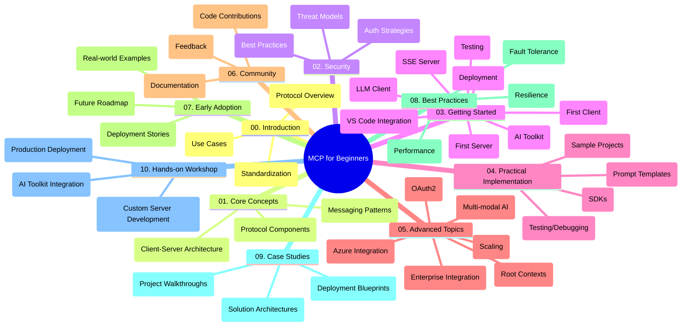

<!--
CO_OP_TRANSLATOR_METADATA:
{
  "original_hash": "a607d4febc94caee9a12b77795f7fc9a",
  "translation_date": "2025-07-13T15:17:47+00:00",
  "source_file": "study_guide.md",
  "language_code": "cs"
}
-->
# Model Context Protocol (MCP) pro začátečníky – studijní průvodce

Tento studijní průvodce nabízí přehled struktury a obsahu repozitáře pro kurz „Model Context Protocol (MCP) pro začátečníky“. Použijte ho k efektivní orientaci v repozitáři a maximálnímu využití dostupných zdrojů.

## Přehled repozitáře

Model Context Protocol (MCP) je standardizovaný rámec pro interakce mezi AI modely a klientskými aplikacemi. Tento repozitář poskytuje komplexní kurz s praktickými ukázkami kódu v jazycích C#, Java, JavaScript, Python a TypeScript, určený pro vývojáře AI, systémové architekty a softwarové inženýry.

## Vizualizace kurikula

## Struktura repozitáře

Repozitář je rozdělen do deseti hlavních sekcí, z nichž každá se zaměřuje na různé aspekty MCP:

1. **Úvod (00-Introduction/)**
   - Přehled Model Context Protocol
   - Proč je standardizace důležitá v AI pipelinech
   - Praktické případy použití a přínosy

2. **Základní koncepty (01-CoreConcepts/)**
   - Klient-server architektura
   - Klíčové komponenty protokolu
   - Vzory zpráv v MCP

3. **Bezpečnost (02-Security/)**
   - Hrozby bezpečnosti v systémech založených na MCP
   - Nejlepší postupy pro zabezpečení implementací
   - Strategie autentizace a autorizace

4. **Začínáme (03-GettingStarted/)**
   - Nastavení a konfigurace prostředí
   - Vytvoření základních MCP serverů a klientů
   - Integrace s existujícími aplikacemi
   - Podsekce pro první server, první klient, LLM klienta, integraci s VS Code, SSE server, AI Toolkit, testování a nasazení

5. **Praktická implementace (04-PracticalImplementation/)**
   - Použití SDK v různých programovacích jazycích
   - Ladění, testování a ověřování
   - Tvorba znovupoužitelných šablon promptů a pracovních postupů
   - Ukázkové projekty s příklady implementace

6. **Pokročilá témata (05-AdvancedTopics/)**
   - Multimodální AI pracovní postupy a rozšiřitelnost
   - Bezpečné škálování
   - MCP v podnikových ekosystémech
   - Specializovaná témata včetně integrace Azure, multimodality, OAuth2, root kontextů, směrování, vzorkování, škálování, bezpečnosti, integrace webového vyhledávání a streamování.

7. **Příspěvky komunity (06-CommunityContributions/)**
   - Jak přispívat kódem a dokumentací
   - Spolupráce přes GitHub
   - Vylepšení a zpětná vazba řízená komunitou

8. **Lekce z raného nasazení (07-LessonsfromEarlyAdoption/)**
   - Reálné implementace a úspěšné příběhy
   - Budování a nasazení řešení založených na MCP
   - Trendy a budoucí plán

9. **Nejlepší postupy (08-BestPractices/)**
   - Ladění výkonu a optimalizace
   - Návrh odolných MCP systémů
   - Testování a strategie odolnosti

10. **Případové studie (09-CaseStudy/)**
    - Hloubkové analýzy architektur MCP řešení
    - Plány nasazení a tipy na integraci
    - Anotované diagramy a průchody projekty

11. **Praktický workshop (10-StreamliningAIWorkflowsBuildingAnMCPServerWithAIToolkit/)**
    - Komplexní praktický workshop spojující MCP s Microsoft AI Toolkit pro VS Code
    - Vytváření inteligentních aplikací propojujících AI modely s reálnými nástroji
    - Praktické moduly pokrývající základy, vývoj vlastního serveru a strategie produkčního nasazení

## Ukázkové projekty

Repozitář obsahuje několik ukázkových projektů demonstrujících implementaci MCP v různých programovacích jazycích:

### Základní ukázky MCP kalkulačky
- C# MCP server – příklad
- Java MCP kalkulačka
- JavaScript MCP demo
- Python MCP server
- TypeScript MCP příklad

### Pokročilé projekty MCP kalkulačky
- Pokročilý C# příklad
- Java kontejnerová aplikace – příklad
- Pokročilý JavaScript příklad
- Python složitá implementace
- TypeScript kontejnerový příklad

## Další zdroje

Repozitář obsahuje podpůrné zdroje:

- **Složka obrázků**: Obsahuje diagramy a ilustrace používané v kurikulu
- **Překlady**: Podpora více jazyků s automatizovanými překlady dokumentace
- **Oficiální MCP zdroje**:
  - [MCP dokumentace](https://modelcontextprotocol.io/)
  - [MCP specifikace](https://spec.modelcontextprotocol.io/)
  - [MCP GitHub repozitář](https://github.com/modelcontextprotocol)

## Jak používat tento repozitář

1. **Sekvenční učení**: Projděte kapitoly v pořadí (00 až 10) pro strukturované studium.
2. **Zaměření na konkrétní jazyk**: Pokud vás zajímá určitý programovací jazyk, prozkoumejte složky s ukázkami pro implementace ve vámi preferovaném jazyce.
3. **Praktická implementace**: Začněte sekcí „Začínáme“ pro nastavení prostředí a vytvoření prvního MCP serveru a klienta.
4. **Pokročilé prozkoumání**: Jakmile zvládnete základy, ponořte se do pokročilých témat a rozšiřte své znalosti.
5. **Zapojení komunity**: Připojte se k [Azure AI Foundry Discord](https://discord.com/invite/ByRwuEEgH4) a spojte se s odborníky a dalšími vývojáři.

## Přispívání

Tento repozitář vítá příspěvky od komunity. Podívejte se do sekce Příspěvky komunity pro informace, jak přispívat.

---

*Tento studijní průvodce byl vytvořen 11. června 2025 a poskytuje přehled repozitáře k tomuto datu. Obsah repozitáře mohl být od té doby aktualizován.*

**Prohlášení o vyloučení odpovědnosti**:  
Tento dokument byl přeložen pomocí AI překladatelské služby [Co-op Translator](https://github.com/Azure/co-op-translator). I když usilujeme o přesnost, mějte prosím na paměti, že automatizované překlady mohou obsahovat chyby nebo nepřesnosti. Původní dokument v jeho mateřském jazyce by měl být považován za autoritativní zdroj. Pro důležité informace se doporučuje profesionální lidský překlad. Nejsme odpovědní za jakékoliv nedorozumění nebo nesprávné výklady vyplývající z použití tohoto překladu.