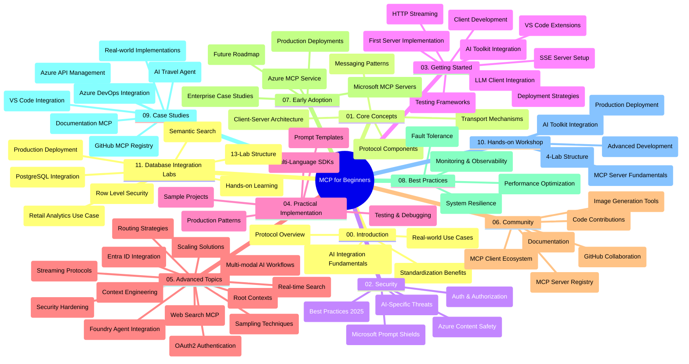

<!--
CO_OP_TRANSLATOR_METADATA:
{
  "original_hash": "aa1ce97bc694b08faf3018bab6d275b9",
  "translation_date": "2025-09-30T21:34:35+00:00",
  "source_file": "study_guide.md",
  "language_code": "cs"
}
-->
# Protokol Model Context (MCP) pro začátečníky - Průvodce studiem

Tento průvodce studiem poskytuje přehled struktury a obsahu repozitáře pro kurikulum "Protokol Model Context (MCP) pro začátečníky". Použijte tento průvodce k efektivní navigaci v repozitáři a maximálnímu využití dostupných zdrojů.

## Přehled repozitáře

Protokol Model Context (MCP) je standardizovaný rámec pro interakce mezi AI modely a klientskými aplikacemi. Původně vytvořený společností Anthropic, MCP je nyní spravován širší komunitou MCP prostřednictvím oficiální organizace na GitHubu. Tento repozitář poskytuje komplexní kurikulum s praktickými příklady kódu v C#, Java, JavaScript, Python a TypeScript, určené pro AI vývojáře, systémové architekty a softwarové inženýry.

## Vizualizovaná mapa kurikula

## Struktura repozitáře

Repozitář je organizován do jedenácti hlavních sekcí, z nichž každá se zaměřuje na různé aspekty MCP:

1. **Úvod (00-Introduction/)**
   - Přehled protokolu Model Context
   - Proč je standardizace důležitá v AI pipelinech
   - Praktické případy použití a přínosy

2. **Základní koncepty (01-CoreConcepts/)**
   - Architektura klient-server
   - Klíčové komponenty protokolu
   - Vzory zpráv v MCP

3. **Bezpečnost (02-Security/)**
   - Hrozby bezpečnosti v systémech založených na MCP
   - Nejlepší postupy pro zabezpečení implementací
   - Strategie autentizace a autorizace
   - **Komplexní dokumentace bezpečnosti**:
     - Nejlepší bezpečnostní postupy MCP 2025
     - Průvodce implementací Azure Content Safety
     - Kontroly a techniky bezpečnosti MCP
     - Rychlý referenční průvodce nejlepšími postupy MCP
   - **Klíčová témata bezpečnosti**:
     - Útoky na injekci promptů a otravu nástrojů
     - Únos relací a problémy zmateného zástupce
     - Zranitelnosti při předávání tokenů
     - Nadměrná oprávnění a kontrola přístupu
     - Bezpečnost dodavatelského řetězce pro AI komponenty
     - Integrace Microsoft Prompt Shields

4. **Začínáme (03-GettingStarted/)**
   - Nastavení a konfigurace prostředí
   - Vytvoření základních MCP serverů a klientů
   - Integrace do stávajících aplikací
   - Obsahuje sekce:
     - První implementace serveru
     - Vývoj klienta
     - Integrace klienta LLM
     - Integrace VS Code
     - Server-Sent Events (SSE) server
     - HTTP streaming
     - Integrace AI Toolkit
     - Testovací strategie
     - Pokyny k nasazení

5. **Praktická implementace (04-PracticalImplementation/)**
   - Použití SDK v různých programovacích jazycích
   - Techniky ladění, testování a validace
   - Tvorba opakovaně použitelných šablon promptů a pracovních postupů
   - Ukázkové projekty s příklady implementace

6. **Pokročilá témata (05-AdvancedTopics/)**
   - Techniky kontextového inženýrství
   - Integrace agentů Foundry
   - Multimodální AI pracovní postupy
   - Ukázky autentizace OAuth2
   - Schopnosti vyhledávání v reálném čase
   - Streaming v reálném čase
   - Implementace root kontextů
   - Strategie směrování
   - Techniky vzorkování
   - Přístupy ke škálování
   - Bezpečnostní úvahy
   - Integrace bezpečnosti Entra ID
   - Integrace webového vyhledávání

7. **Příspěvky komunity (06-CommunityContributions/)**
   - Jak přispívat kódem a dokumentací
   - Spolupráce prostřednictvím GitHubu
   - Vylepšení a zpětná vazba řízená komunitou
   - Použití různých MCP klientů (Claude Desktop, Cline, VSCode)
   - Práce s populárními MCP servery včetně generování obrázků

8. **Poučení z raného přijetí (07-LessonsfromEarlyAdoption/)**
   - Implementace v reálném světě a úspěšné příběhy
   - Vytváření a nasazení řešení založených na MCP
   - Trendy a budoucí plán
   - **Průvodce Microsoft MCP servery**: Komplexní průvodce 10 produkčně připravenými Microsoft MCP servery včetně:
     - Microsoft Learn Docs MCP Server
     - Azure MCP Server (15+ specializovaných konektorů)
     - GitHub MCP Server
     - Azure DevOps MCP Server
     - MarkItDown MCP Server
     - SQL Server MCP Server
     - Playwright MCP Server
     - Dev Box MCP Server
     - Azure AI Foundry MCP Server
     - Microsoft 365 Agents Toolkit MCP Server

9. **Nejlepší postupy (08-BestPractices/)**
   - Ladění výkonu a optimalizace
   - Návrh odolných MCP systémů
   - Testovací a rezilienční strategie

10. **Případové studie (09-CaseStudy/)**
    - **Sedm komplexních případových studií** demonstrujících všestrannost MCP v různých scénářích:
    - **Azure AI Travel Agents**: Orchestrace více agentů s Azure OpenAI a AI Search
    - **Integrace Azure DevOps**: Automatizace pracovních procesů s aktualizacemi dat z YouTube
    - **Získávání dokumentace v reálném čase**: Python konzolový klient s HTTP streamingem
    - **Interaktivní generátor studijních plánů**: Webová aplikace Chainlit s konverzační AI
    - **Dokumentace v editoru**: Integrace VS Code s pracovními postupy GitHub Copilot
    - **Správa API Azure**: Integrace podnikových API s vytvořením MCP serveru
    - **GitHub MCP Registry**: Vývoj ekosystému a platforma pro agentickou integraci
    - Příklady implementace zahrnující podnikové integrace, produktivitu vývojářů a rozvoj ekosystému

11. **Praktický workshop (10-StreamliningAIWorkflowsBuildingAnMCPServerWithAIToolkit/)**
    - Komplexní praktický workshop kombinující MCP s AI Toolkit
    - Vytváření inteligentních aplikací propojujících AI modely s reálnými nástroji
    - Praktické moduly pokrývající základy, vývoj vlastního serveru a strategie nasazení do produkce
    - **Struktura laboratoří**:
      - Laboratoř 1: Základy MCP serveru
      - Laboratoř 2: Pokročilý vývoj MCP serveru
      - Laboratoř 3: Integrace AI Toolkit
      - Laboratoř 4: Nasazení do produkce a škálování
    - Výukový přístup založený na laboratořích s podrobnými pokyny

12. **Laboratoře integrace MCP serveru s databází (11-MCPServerHandsOnLabs/)**
    - **Komplexní 13-laboratorní vzdělávací cesta** pro vytváření produkčně připravených MCP serverů s integrací PostgreSQL
    - **Implementace maloobchodní analytiky v reálném světě** pomocí případu Zava Retail
    - **Vzory na podnikové úrovni** včetně Row Level Security (RLS), sémantického vyhledávání a přístupu k datům pro více nájemců
    - **Kompletní struktura laboratoří**:
      - **Laboratoře 00-03: Základy** - Úvod, Architektura, Bezpečnost, Nastavení prostředí
      - **Laboratoře 04-06: Vytváření MCP serveru** - Návrh databáze, Implementace MCP serveru, Vývoj nástrojů
      - **Laboratoře 07-09: Pokročilé funkce** - Sémantické vyhledávání, Testování a ladění, Integrace VS Code
      - **Laboratoře 10-12: Produkce a nejlepší postupy** - Nasazení, Monitoring, Optimalizace
    - **Pokryté technologie**: FastMCP framework, PostgreSQL, Azure OpenAI, Azure Container Apps, Application Insights
    - **Výukové výsledky**: Produkčně připravené MCP servery, vzory integrace databází, analytika poháněná AI, podniková bezpečnost

## Další zdroje

Repozitář obsahuje podpůrné zdroje:

- **Složka obrázků**: Obsahuje diagramy a ilustrace použité v celém kurikulu
- **Překlady**: Podpora více jazyků s automatizovanými překlady dokumentace
- **Oficiální MCP zdroje**:
  - [MCP Dokumentace](https://modelcontextprotocol.io/)
  - [MCP Specifikace](https://spec.modelcontextprotocol.io/)
  - [MCP GitHub Repozitář](https://github.com/modelcontextprotocol)

## Jak používat tento repozitář

1. **Sekvenční učení**: Sledujte kapitoly postupně (00 až 11) pro strukturovaný vzdělávací zážitek.
2. **Zaměření na konkrétní jazyk**: Pokud vás zajímá konkrétní programovací jazyk, prozkoumejte adresáře s ukázkami implementací ve vašem preferovaném jazyce.
3. **Praktická implementace**: Začněte sekcí "Začínáme" pro nastavení prostředí a vytvoření prvního MCP serveru a klienta.
4. **Pokročilé zkoumání**: Jakmile zvládnete základy, ponořte se do pokročilých témat pro rozšíření znalostí.
5. **Zapojení komunity**: Připojte se ke komunitě MCP prostřednictvím diskusí na GitHubu a kanálů na Discordu, abyste se spojili s odborníky a dalšími vývojáři.

## MCP klienti a nástroje

Kurikulum pokrývá různé MCP klienty a nástroje:

1. **Oficiální klienti**:
   - Visual Studio Code 
   - MCP ve Visual Studio Code
   - Claude Desktop
   - Claude ve VSCode 
   - Claude API

2. **Komunitní klienti**:
   - Cline (založený na terminálu)
   - Cursor (editor kódu)
   - ChatMCP
   - Windsurf

3. **Nástroje pro správu MCP**:
   - MCP CLI
   - MCP Manager
   - MCP Linker
   - MCP Router

## Populární MCP servery

Repozitář představuje různé MCP servery, včetně:

1. **Oficiální Microsoft MCP servery**:
   - Microsoft Learn Docs MCP Server
   - Azure MCP Server (15+ specializovaných konektorů)
   - GitHub MCP Server
   - Azure DevOps MCP Server
   - MarkItDown MCP Server
   - SQL Server MCP Server
   - Playwright MCP Server
   - Dev Box MCP Server
   - Azure AI Foundry MCP Server
   - Microsoft 365 Agents Toolkit MCP Server

2. **Oficiální referenční servery**:
   - Filesystem
   - Fetch
   - Memory
   - Sequential Thinking

3. **Generování obrázků**:
   - Azure OpenAI DALL-E 3
   - Stable Diffusion WebUI
   - Replicate

4. **Vývojové nástroje**:
   - Git MCP
   - Terminal Control
   - Code Assistant

5. **Specializované servery**:
   - Salesforce
   - Microsoft Teams
   - Jira & Confluence

## Přispívání

Tento repozitář vítá příspěvky od komunity. Viz sekce Příspěvky komunity pro pokyny, jak efektivně přispívat do ekosystému MCP.

## Změny

| Datum | Změny |
|------|---------||
| 29. září 2025 | - Přidána sekce 11-MCPServerHandsOnLabs s komplexní 13-laboratorní vzdělávací cestou integrace databází - Aktualizována vizualizovaná mapa kurikula o laboratoře integrace databází - Vylepšena struktura repozitáře, aby odrážela jedenáct hlavních sekcí - Přidán podrobný popis integrace PostgreSQL, případu maloobchodní analytiky a podnikových vzorů - Aktualizovány pokyny k navigaci, aby zahrnovaly sekce 00-11 |
| 26. září 2025 | - Přidána případová studie GitHub MCP Registry do sekce 09-CaseStudy - Aktualizovány případové studie, aby odrážely sedm komplexních případových studií - Vylepšeny popisy případových studií konkrétními detaily implementace - Aktualizována vizualizovaná mapa kurikula o GitHub MCP Registry - Revidována struktura průvodce studiem, aby odrážela zaměření na rozvoj ekosystému |
| 18. července 2025 | - Aktualizována struktura repozitáře o Průvodce Microsoft MCP servery - Přidán komplexní seznam 10 produkčně připravených Microsoft MCP serverů - Vylepšena sekce Populární MCP servery o Oficiální Microsoft MCP servery - Aktualizována sekce Případové studie o skutečné příklady souborů - Přidány detaily struktury laboratoří pro praktický workshop |
| 16. července 2025 | - Aktualizována struktura repozitáře, aby odrážela aktuální obsah - Přidána sekce MCP klienti a nástroje - Přidána sekce Populární MCP servery - Aktualizována vizualizovaná mapa kurikula o všechny aktuální témata - Vylepšena sekce Pokročilá témata o všechny specializované oblasti - Aktualizovány případové studie, aby odrážely skutečné příklady - Ujasněn původ MCP jako vytvořený společností Anthropic |
| 11. června 2025 | - Počáteční vytvoření průvodce studiem - Přidána vizualizovaná mapa kurikula - Nastíněna struktura repozitáře - Zahrnuty ukázkové projekty a další zdroje |

---

*Tento průvodce studiem byl aktualizován 29. září 2025 a poskytuje přehled repozitáře k tomuto datu. Obsah repozitáře může být po tomto datu aktualizován.*

---

**Prohlášení**:  
Tento dokument byl přeložen pomocí služby AI pro překlady [Co-op Translator](https://github.com/Azure/co-op-translator). I když se snažíme o přesnost, mějte prosím na paměti, že automatizované překlady mohou obsahovat chyby nebo nepřesnosti. Původní dokument v jeho původním jazyce by měl být považován za autoritativní zdroj. Pro důležité informace doporučujeme profesionální lidský překlad. Neodpovídáme za žádná nedorozumění nebo nesprávné interpretace vyplývající z použití tohoto překladu.