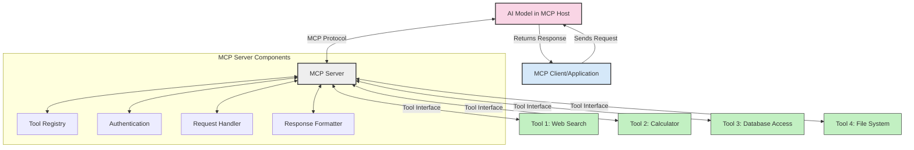
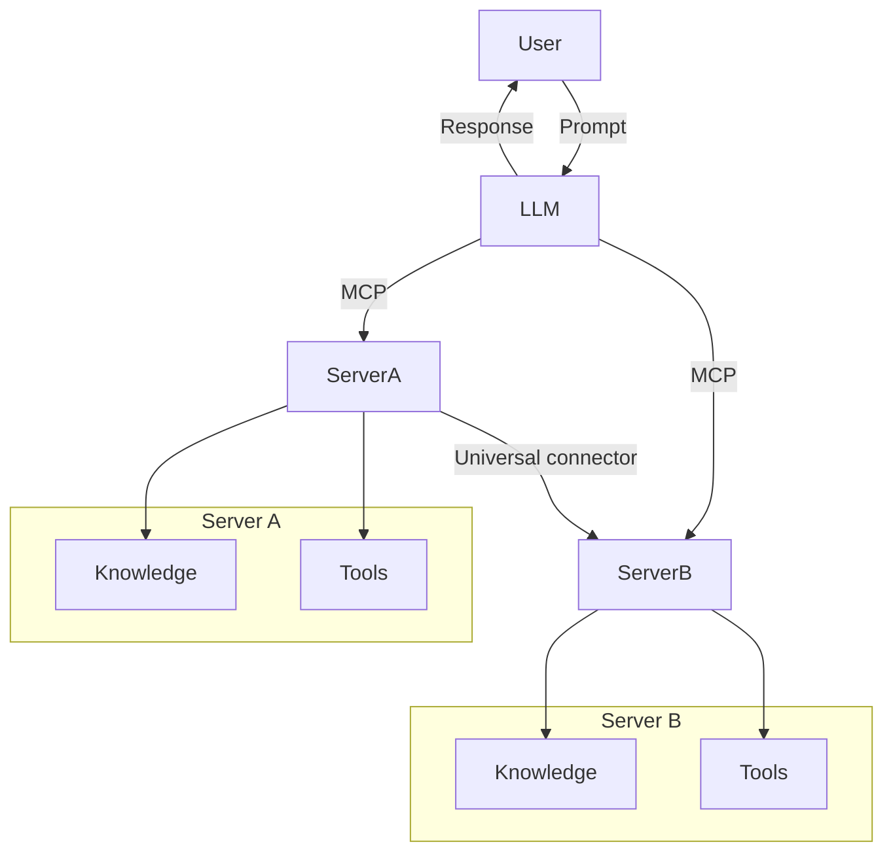

<!--
CO_OP_TRANSLATOR_METADATA:
{
  "original_hash": "02301140adbd807ecf0f17720fa307bc",
  "translation_date": "2025-05-17T06:02:24+00:00",
  "source_file": "00-Introduction/README.md",
  "language_code": "da"
}
-->
# Introduktion til Model Context Protocol (MCP): Hvorfor det er vigtigt for skalerbare AI-applikationer

Generative AI-applikationer er et stort fremskridt, da de ofte tillader brugeren at interagere med appen ved hjælp af naturlige sprogprompter. Men når der investeres mere tid og ressourcer i sådanne apps, vil du sikre, at du nemt kan integrere funktionaliteter og ressourcer på en måde, der gør det let at udvide, at din app kan håndtere mere end én model, der anvendes, og dens detaljer. Kort sagt, det er nemt at begynde at bygge Gen AI-apps, men efterhånden som de vokser og bliver mere komplekse, skal du begynde at definere en arkitektur og sandsynligvis læne dig op ad en standard for at sikre, at dine apps er bygget på en konsistent måde. Her kommer MCP ind for at organisere tingene og give en standard.

---

## **🔍 Hvad er Model Context Protocol (MCP)?**

**Model Context Protocol (MCP)** er en **åben, standardiseret grænseflade**, der tillader store sprogmodeller (LLM'er) at interagere problemfrit med eksterne værktøjer, API'er og datakilder. Det giver en konsistent arkitektur til at forbedre AI-modellens funktionalitet ud over deres træningsdata, hvilket muliggør smartere, skalerbare og mere lydhøre AI-systemer.

---

## **🎯 Hvorfor standardisering i AI er vigtig**

Efterhånden som generative AI-applikationer bliver mere komplekse, er det vigtigt at vedtage standarder, der sikrer **skalerbarhed, udvidelighed** og **vedligeholdelse**. MCP adresserer disse behov ved at:

- Forene model-værktøjsintegrationer
- Reducere skrøbelige, engangs tilpassede løsninger
- Tillade flere modeller at sameksistere i ét økosystem

---

## **📚 Læringsmål**

Ved slutningen af denne artikel vil du kunne:

- Definere **Model Context Protocol (MCP)** og dens anvendelsesområder
- Forstå, hvordan MCP standardiserer model-til-værktøj kommunikation
- Identificere de centrale komponenter i MCP-arkitektur
- Udforske virkelige anvendelser af MCP i virksomheders og udviklingskontekster

---

## **💡 Hvorfor Model Context Protocol (MCP) er en game-changer**

### **🔗 MCP løser fragmentering i AI-interaktioner**

Før MCP krævede integration af modeller med værktøjer:

- Tilpasset kode for hvert værktøj-model par
- Ikke-standardiserede API'er for hver leverandør
- Hyppige afbrydelser på grund af opdateringer
- Dårlig skalerbarhed med flere værktøjer

### **✅ Fordele ved MCP-standardisering**

| **Fordel**                | **Beskrivelse**                                                               |
|---------------------------|-------------------------------------------------------------------------------|
| Interoperabilitet         | LLM'er arbejder problemfrit med værktøjer på tværs af forskellige leverandører|
| Konsistens                | Ensartet adfærd på tværs af platforme og værktøjer                           |
| Genanvendelighed          | Værktøjer bygget én gang kan bruges på tværs af projekter og systemer        |
| Fremskyndet udvikling     | Reducer udviklingstid ved at bruge standardiserede, plug-and-play grænseflader|

---

## **🧱 Overblik over MCP-arkitektur på højt niveau**

MCP følger en **klient-server model**, hvor:

- **MCP Hosts** kører AI-modellerne
- **MCP Clients** initierer forespørgsler
- **MCP Servers** leverer kontekst, værktøjer og kapaciteter

### **Nøglekomponenter:**

- **Ressourcer** – Statisk eller dynamisk data til modeller  
- **Prompter** – Foruddefinerede arbejdsprocesser til guidet generering  
- **Værktøjer** – Udførbare funktioner som søgning, beregninger  
- **Sampling** – Agent-adfærd via rekursive interaktioner

---

## Hvordan MCP-servere fungerer

MCP-servere opererer på følgende måde:

- **Forespørgselsflow**: 
    1. MCP-klienten sender en forespørgsel til AI-modellen, der kører i en MCP-vært.
    2. AI-modellen identificerer, når den har brug for eksterne værktøjer eller data.
    3. Modellen kommunikerer med MCP-serveren ved hjælp af den standardiserede protokol.

- **MCP-serverfunktionalitet**:
    - Værktøjsregister: Vedligeholder en katalog over tilgængelige værktøjer og deres kapaciteter.
    - Godkendelse: Verificerer tilladelser til værktøjsadgang.
    - Forespørgselshåndtering: Behandler indkommende værktøjsanmodninger fra modellen.
    - Responsformatter: Strukturerer værktøjsoutput i et format, modellen kan forstå.

- **Værktøjsudførelse**: 
    - Serveren ruter forespørgsler til de relevante eksterne værktøjer
    - Værktøjer udfører deres specialiserede funktioner (søgning, beregning, databaseforespørgsler osv.)
    - Resultater returneres til modellen i et konsistent format.

- **Responsfuldførelse**: 
    - AI-modellen inkorporerer værktøjsoutput i sin respons.
    - Den endelige respons sendes tilbage til klientapplikationen.

## 👨‍💻 Hvordan man bygger en MCP-server (med eksempler)

MCP-servere giver dig mulighed for at udvide LLM-kapaciteter ved at levere data og funktionalitet. 

Klar til at prøve det? Her er eksempler på, hvordan man opretter en simpel MCP-server i forskellige sprog:

- **Python Eksempel**: https://github.com/modelcontextprotocol/python-sdk

- **TypeScript Eksempel**: https://github.com/modelcontextprotocol/typescript-sdk

- **Java Eksempel**: https://github.com/modelcontextprotocol/java-sdk

- **C#/.NET Eksempel**: https://github.com/modelcontextprotocol/csharp-sdk

## 🌍 Virkelige anvendelser af MCP

MCP muliggør en bred vifte af applikationer ved at udvide AI-kapaciteter:

| **Applikation**                | **Beskrivelse**                                                               |
|--------------------------------|-------------------------------------------------------------------------------|
| Enterprise Data Integration    | Forbind LLM'er til databaser, CRM'er eller interne værktøjer                  |
| Agentic AI-systemer            | Muliggør autonome agenter med værktøjsadgang og beslutningsarbejdsgange       |
| Multi-modal applikationer      | Kombiner tekst, billede og lydværktøjer i en enkelt samlet AI-app             |
| Real-time Data Integration     | Bring live data ind i AI-interaktioner for mere nøjagtige, aktuelle output    |

### 🧠 MCP = Universel standard for AI-interaktioner

Model Context Protocol (MCP) fungerer som en universel standard for AI-interaktioner, ligesom USB-C standardiserede fysiske forbindelser for enheder. I AI-verdenen giver MCP en konsistent grænseflade, der tillader modeller (klienter) at integrere problemfrit med eksterne værktøjer og dataleverandører (servere). Dette eliminerer behovet for forskellige, tilpassede protokoller for hver API eller datakilde.

Under MCP følger et MCP-kompatibelt værktøj (kaldet en MCP-server) en samlet standard. Disse servere kan liste de værktøjer eller handlinger, de tilbyder, og udføre disse handlinger, når de anmodes af en AI-agent. AI-agentplatforme, der understøtter MCP, er i stand til at opdage tilgængelige værktøjer fra serverne og kalde dem gennem denne standardprotokol.

### 💡 Giver adgang til viden

Udover at tilbyde værktøjer, faciliterer MCP også adgang til viden. Det gør det muligt for applikationer at give kontekst til store sprogmodeller (LLM'er) ved at forbinde dem til forskellige datakilder. For eksempel kan en MCP-server repræsentere en virksomheds dokumentarkiv, der tillader agenter at hente relevant information efter behov. En anden server kunne håndtere specifikke handlinger som at sende e-mails eller opdatere poster. Fra agentens perspektiv er disse blot værktøjer, den kan bruge—nogle værktøjer returnerer data (videns kontekst), mens andre udfører handlinger. MCP håndterer begge effektivt.

En agent, der forbinder til en MCP-server, lærer automatisk serverens tilgængelige kapaciteter og tilgængelige data gennem et standardformat. Denne standardisering muliggør dynamisk værktøjstilgængelighed. For eksempel, ved at tilføje en ny MCP-server til en agents system, bliver dens funktioner straks brugbare uden at kræve yderligere tilpasning af agentens instruktioner.

Denne strømlinede integration stemmer overens med det flow, der er afbildet i mermaid-diagrammet, hvor servere leverer både værktøjer og viden, hvilket sikrer problemfrit samarbejde på tværs af systemer. 

### 👉 Eksempel: Skalerbar agentsløsning

## 🔐 Praktiske fordele ved MCP

Her er nogle praktiske fordele ved at bruge MCP:

- **Friskhed**: Modeller kan få adgang til opdateret information ud over deres træningsdata
- **Kapacitetsudvidelse**: Modeller kan udnytte specialiserede værktøjer til opgaver, de ikke er trænet til
- **Reducerede hallucinationer**: Eksterne datakilder giver faktuel forankring
- **Privatliv**: Følsomme data kan forblive inden for sikre miljøer i stedet for at blive indlejret i prompter

## 📌 Nøglepunkter

Følgende er nøglepunkter for brugen af MCP:

- **MCP** standardiserer, hvordan AI-modeller interagerer med værktøjer og data
- Fremmer **udvidelighed, konsistens og interoperabilitet**
- MCP hjælper med at **reducere udviklingstid, forbedre pålidelighed og udvide modelkapaciteter**
- Klient-server arkitekturen **muliggør fleksible, udvidelige AI-applikationer**

## 🧠 Øvelse

Tænk på en AI-applikation, du er interesseret i at bygge.

- Hvilke **eksterne værktøjer eller data** kunne forbedre dens kapaciteter?
- Hvordan kunne MCP gøre integration **enklere og mere pålidelig?**

## Yderligere ressourcer

- [MCP GitHub Repository](https://github.com/modelcontextprotocol)

## Hvad er det næste

Næste: [Kapitel 1: Kernekoncepter](/01-CoreConcepts/README.md)

**Ansvarsfraskrivelse**:  
Dette dokument er blevet oversat ved hjælp af AI-oversættelsestjenesten [Co-op Translator](https://github.com/Azure/co-op-translator). Mens vi bestræber os på nøjagtighed, skal du være opmærksom på, at automatiserede oversættelser kan indeholde fejl eller unøjagtigheder. Det originale dokument på dets oprindelige sprog bør betragtes som den autoritative kilde. For kritisk information anbefales professionel menneskelig oversættelse. Vi er ikke ansvarlige for eventuelle misforståelser eller fejltolkninger, der opstår som følge af brugen af denne oversættelse.