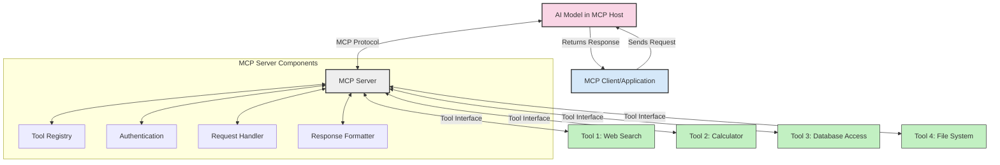
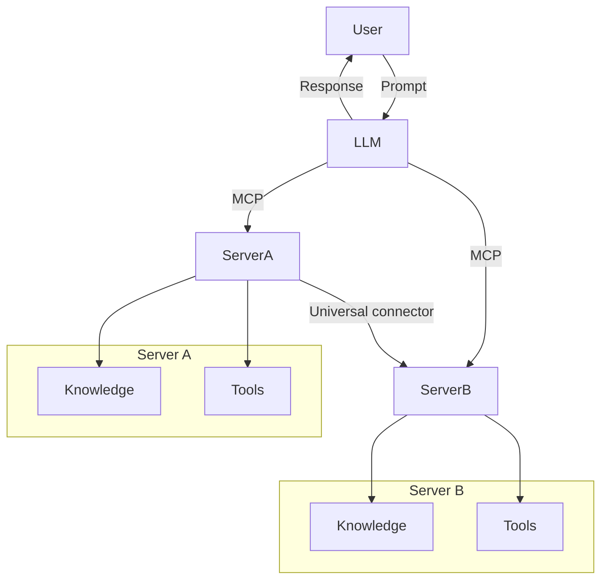

<!--
CO_OP_TRANSLATOR_METADATA:
{
  "original_hash": "cf84f987e1b771d2201408e110dfd2db",
  "translation_date": "2025-05-20T17:19:36+00:00",
  "source_file": "00-Introduction/README.md",
  "language_code": "da"
}
-->
# Introduktion til Model Context Protocol (MCP): Hvorfor det er vigtigt for skalerbare AI-applikationer

Generative AI-applikationer er et stort skridt fremad, da de ofte giver brugeren mulighed for at interagere med appen ved hjælp af naturlige sprogkommandoer. Men efterhånden som der investeres mere tid og ressourcer i sådanne apps, vil du sikre dig, at du nemt kan integrere funktioner og ressourcer på en måde, der gør det let at udvide, at din app kan håndtere mere end én model og dens kompleksiteter. Kort sagt er det nemt at komme i gang med at bygge Gen AI-apps, men efterhånden som de vokser og bliver mere komplekse, skal du begynde at definere en arkitektur og sandsynligvis støtte dig til en standard for at sikre, at dine apps bygges på en ensartet måde. Her kommer MCP ind i billedet for at organisere tingene og tilbyde en standard.

---

## **🔍 Hvad er Model Context Protocol (MCP)?**

**Model Context Protocol (MCP)** er en **åben, standardiseret grænseflade**, der gør det muligt for Large Language Models (LLMs) at interagere gnidningsfrit med eksterne værktøjer, API’er og datakilder. Den tilbyder en ensartet arkitektur, der forbedrer AI-modellers funktionalitet ud over deres træningsdata, hvilket muliggør smartere, skalerbare og mere responsive AI-systemer.

---

## **🎯 Hvorfor standardisering i AI er vigtigt**

Efterhånden som generative AI-applikationer bliver mere komplekse, er det afgørende at anvende standarder, der sikrer **skalerbarhed, udvidelsesmuligheder** og **vedligeholdelse**. MCP imødekommer disse behov ved at:

- Samle integrationer mellem modeller og værktøjer
- Mindske skrøbelige, engangsløsninger
- Tillade flere modeller at eksistere i samme økosystem

---

## **📚 Læringsmål**

Når du er færdig med denne artikel, vil du kunne:

- Definere **Model Context Protocol (MCP)** og dets anvendelsesområder
- Forstå hvordan MCP standardiserer kommunikation mellem model og værktøj
- Identificere de centrale komponenter i MCP-arkitekturen
- Udforske virkelige anvendelser af MCP i erhvervslivet og udviklingsmiljøer

---

## **💡 Hvorfor Model Context Protocol (MCP) er en banebryder**

### **🔗 MCP løser fragmentering i AI-interaktioner**

Før MCP krævede integration af modeller med værktøjer:

- Tilpasset kode for hvert værktøj-model-par
- Ikke-standardiserede API’er for hver leverandør
- Hyppige brud ved opdateringer
- Dårlig skalerbarhed ved flere værktøjer

### **✅ Fordele ved MCP-standardisering**

| **Fordel**                | **Beskrivelse**                                                               |
|---------------------------|-------------------------------------------------------------------------------|
| Interoperabilitet         | LLM’er fungerer gnidningsfrit med værktøjer fra forskellige leverandører     |
| Konsistens                | Ensartet adfærd på tværs af platforme og værktøjer                            |
| Genanvendelighed          | Værktøjer bygget én gang kan bruges på tværs af projekter og systemer         |
| Hurtigere udvikling       | Reducer udviklingstid ved at bruge standardiserede, plug-and-play grænseflader|

---

## **🧱 Overordnet MCP-arkitektur**

MCP følger en **client-server-model**, hvor:

- **MCP Hosts** kører AI-modellerne
- **MCP Clients** initierer forespørgsler
- **MCP Servers** leverer kontekst, værktøjer og kapabiliteter

### **Nøglekomponenter:**

- **Resources** – Statisk eller dynamisk data til modeller  
- **Prompts** – Foruddefinerede workflows til guidet generering  
- **Tools** – Eksekverbare funktioner som søgning, beregninger  
- **Sampling** – Agentisk adfærd via rekursive interaktioner

---

## Hvordan MCP Servers fungerer

MCP servers fungerer på følgende måde:

- **Forespørgselsflow**:  
    1. MCP Client sender en forespørgsel til AI-modellen, der kører i en MCP Host.  
    2. AI-modellen identificerer, hvornår den har brug for eksterne værktøjer eller data.  
    3. Modellen kommunikerer med MCP Serveren ved hjælp af den standardiserede protokol.

- **MCP Server-funktionalitet**:  
    - Tool Registry: Vedligeholder en katalog over tilgængelige værktøjer og deres kapabiliteter.  
    - Authentication: Verificerer tilladelser til værktøjsadgang.  
    - Request Handler: Behandler indkommende værktøjsforespørgsler fra modellen.  
    - Response Formatter: Strukturerer værktøjsoutput i et format, modellen kan forstå.

- **Værktøjseksekvering**:  
    - Serveren sender forespørgsler videre til de relevante eksterne værktøjer  
    - Værktøjerne udfører deres specialiserede funktioner (søgning, beregning, databaseforespørgsler osv.)  
    - Resultater returneres til modellen i et ensartet format.

- **Færdiggørelse af svar**:  
    - AI-modellen indarbejder værktøjsoutput i sit svar.  
    - Det endelige svar sendes tilbage til klientapplikationen.

## 👨‍💻 Sådan bygger du en MCP Server (med eksempler)

MCP servers giver dig mulighed for at udvide LLM’s kapabiliteter ved at levere data og funktionalitet.

Klar til at prøve? Her er eksempler på at oprette en simpel MCP server i forskellige sprog:

- **Python-eksempel**: https://github.com/modelcontextprotocol/python-sdk

- **TypeScript-eksempel**: https://github.com/modelcontextprotocol/typescript-sdk

- **Java-eksempel**: https://github.com/modelcontextprotocol/java-sdk

- **C#/.NET-eksempel**: https://github.com/modelcontextprotocol/csharp-sdk

## 🌍 Virkelige anvendelsestilfælde for MCP

MCP muliggør en bred vifte af applikationer ved at udvide AI’s kapabiliteter:

| **Anvendelse**               | **Beskrivelse**                                                               |
|-----------------------------|-------------------------------------------------------------------------------|
| Enterprise Data Integration | Forbind LLM’er til databaser, CRM-systemer eller interne værktøjer            |
| Agentiske AI-systemer        | Muliggør autonome agenter med adgang til værktøjer og beslutningsworkflows    |
| Multi-modale applikationer   | Kombiner tekst-, billede- og lydværktøjer i én samlet AI-app                  |
| Real-time Data Integration   | Bring live data ind i AI-interaktioner for mere præcise og aktuelle output    |

### 🧠 MCP = Universel standard for AI-interaktioner

Model Context Protocol (MCP) fungerer som en universel standard for AI-interaktioner, på samme måde som USB-C standardiserede fysiske forbindelser for enheder. I AI-verdenen tilbyder MCP en ensartet grænseflade, der gør det muligt for modeller (clients) at integrere gnidningsfrit med eksterne værktøjer og dataleverandører (servers). Det eliminerer behovet for forskellige, tilpassede protokoller for hver API eller datakilde.

Under MCP følger et MCP-kompatibelt værktøj (kaldet en MCP server) en samlet standard. Disse servere kan oplyse om de værktøjer eller handlinger, de tilbyder, og udføre disse handlinger, når de anmodes af en AI-agent. AI-agentplatforme, der understøtter MCP, kan opdage tilgængelige værktøjer fra serverne og kalde dem via denne standardprotokol.

### 💡 Letter adgang til viden

Ud over at tilbyde værktøjer letter MCP også adgang til viden. Det gør det muligt for applikationer at give kontekst til store sprogmodeller (LLMs) ved at forbinde dem til forskellige datakilder. For eksempel kan en MCP server repræsentere en virksomheds dokumentarkiv, hvilket gør det muligt for agenter at hente relevant information efter behov. En anden server kan håndtere specifikke handlinger som at sende e-mails eller opdatere poster. Fra agentens perspektiv er det blot værktøjer, den kan bruge – nogle værktøjer returnerer data (videns-kontekst), mens andre udfører handlinger. MCP håndterer begge effektivt.

En agent, der forbinder til en MCP server, lærer automatisk serverens tilgængelige kapabiliteter og tilgængelige data gennem et standardformat. Denne standardisering muliggør dynamisk tilgængelighed af værktøjer. For eksempel gør tilføjelsen af en ny MCP server til en agents system dens funktioner straks brugbare uden yderligere tilpasning af agentens instruktioner.

Denne strømlinede integration stemmer overens med flowet vist i mermaid-diagrammet, hvor servere leverer både værktøjer og viden og sikrer gnidningsfrit samarbejde på tværs af systemer.

### 👉 Eksempel: Skalerbar agentløsning

## 🔐 Praktiske fordele ved MCP

Her er de praktiske fordele ved at bruge MCP:

- **Aktualitet**: Modeller kan få adgang til opdateret information ud over deres træningsdata  
- **Udvidelse af kapabiliteter**: Modeller kan benytte specialiserede værktøjer til opgaver, de ikke er trænet til  
- **Reduceret hallucination**: Eksterne datakilder giver faktuel forankring  
- **Privatliv**: Følsomme data kan forblive i sikre miljøer i stedet for at blive indlejret i prompts

## 📌 Vigtige pointer

Her er de vigtigste pointer ved brug af MCP:

- **MCP** standardiserer, hvordan AI-modeller interagerer med værktøjer og data  
- Fremmer **udvidelsesmuligheder, konsistens og interoperabilitet**  
- MCP hjælper med at **forkorte udviklingstid, forbedre pålidelighed og udvide modelkapabiliteter**  
- Client-server-arkitekturen **muliggør fleksible, udvidelige AI-applikationer**

## 🧠 Øvelse

Tænk på en AI-applikation, du gerne vil bygge.

- Hvilke **eksterne værktøjer eller data** kunne forbedre dens kapabiliteter?  
- Hvordan kan MCP gøre integrationen **enklere og mere pålidelig?**

## Yderligere ressourcer

- [MCP GitHub Repository](https://github.com/modelcontextprotocol)

## Hvad er næste skridt

Næste: [Chapter 1: Core Concepts](/01-CoreConcepts/README.md)

**Ansvarsfraskrivelse**:  
Dette dokument er blevet oversat ved hjælp af AI-oversættelsestjenesten [Co-op Translator](https://github.com/Azure/co-op-translator). Selvom vi bestræber os på nøjagtighed, bedes du være opmærksom på, at automatiserede oversættelser kan indeholde fejl eller unøjagtigheder. Det oprindelige dokument på dets modersmål bør betragtes som den autoritative kilde. For kritisk information anbefales professionel menneskelig oversættelse. Vi påtager os intet ansvar for misforståelser eller fejltolkninger, der opstår som følge af brugen af denne oversættelse.