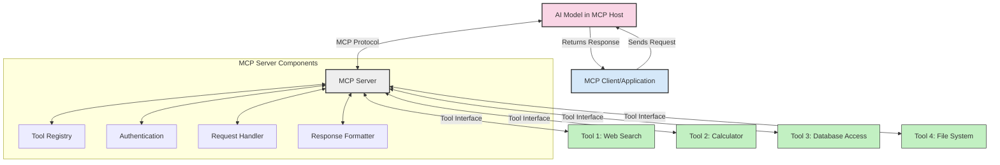
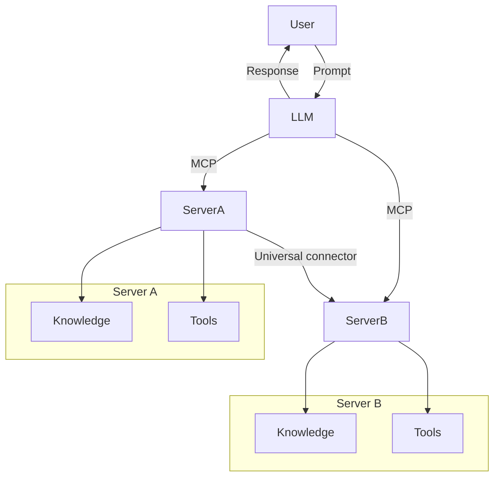
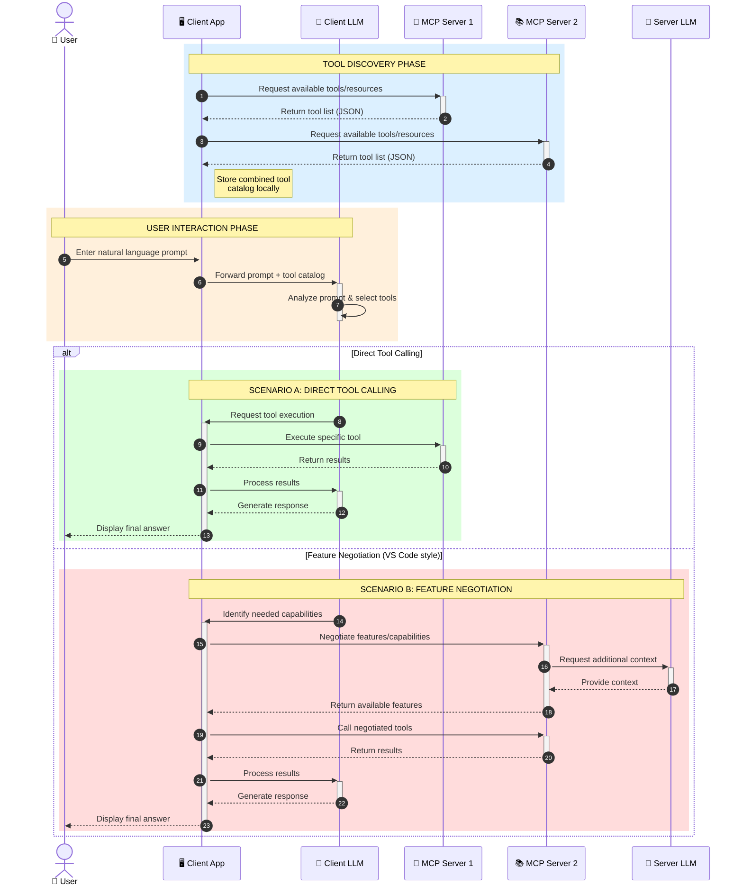

<!--
CO_OP_TRANSLATOR_METADATA:
{
  "original_hash": "25a94c681cf43612ff394d8cf78a74de",
  "translation_date": "2025-05-27T16:06:03+00:00",
  "source_file": "00-Introduction/README.md",
  "language_code": "da"
}
-->
# Introduktion til Model Context Protocol (MCP): Hvorfor det er vigtigt for skalerbare AI-applikationer

Generative AI-applikationer er et stort fremskridt, da de ofte lader brugeren interagere med appen via naturlige sprogkommandoer. Men efterhånden som der investeres mere tid og ressourcer i sådanne apps, vil du sikre, at du nemt kan integrere funktionaliteter og ressourcer på en måde, der gør det let at udvide, at din app kan håndtere mere end én model, og at den kan håndtere forskellige modelkompleksiteter. Kort sagt er det nemt at komme i gang med at bygge Gen AI-apps, men efterhånden som de vokser og bliver mere komplekse, skal du begynde at definere en arkitektur og sandsynligvis bruge en standard for at sikre, at dine apps bliver bygget på en ensartet måde. Det er her MCP kommer ind og organiserer tingene og leverer en standard.

---

## **🔍 Hvad er Model Context Protocol (MCP)?**

**Model Context Protocol (MCP)** er et **åbent, standardiseret interface**, der gør det muligt for store sprogmodeller (LLMs) at interagere gnidningsfrit med eksterne værktøjer, API’er og datakilder. Det giver en ensartet arkitektur, der forbedrer AI-modellers funktionalitet ud over deres træningsdata, hvilket muliggør smartere, skalerbare og mere responsive AI-systemer.

---

## **🎯 Hvorfor standardisering inden for AI er vigtigt**

Efterhånden som generative AI-applikationer bliver mere komplekse, er det afgørende at anvende standarder, der sikrer **skalerbarhed, udvidelsesmuligheder** og **vedligeholdelse**. MCP imødekommer disse behov ved at:

- Samle model-værktøjsintegrationer
- Reducere skrøbelige, engangs-tilpassede løsninger
- Muliggøre, at flere modeller kan eksistere i ét økosystem

---

## **📚 Læringsmål**

Når du har læst denne artikel, vil du kunne:

- Definere **Model Context Protocol (MCP)** og dets anvendelser
- Forstå hvordan MCP standardiserer kommunikation mellem model og værktøj
- Identificere de centrale komponenter i MCP-arkitekturen
- Udforske virkelige anvendelser af MCP i erhvervs- og udviklingssammenhænge

---

## **💡 Hvorfor Model Context Protocol (MCP) er en game-changer**

### **🔗 MCP løser fragmentering i AI-interaktioner**

Før MCP krævede integration af modeller med værktøjer:

- Tilpasset kode for hvert værktøj-model-par
- Ikke-standardiserede API’er for hver leverandør
- Hyppige fejl ved opdateringer
- Dårlig skalerbarhed med flere værktøjer

### **✅ Fordele ved MCP-standardisering**

| **Fordel**               | **Beskrivelse**                                                                 |
|--------------------------|--------------------------------------------------------------------------------|
| Interoperabilitet        | LLM’er arbejder gnidningsfrit med værktøjer fra forskellige leverandører       |
| Konsistens               | Ensartet adfærd på tværs af platforme og værktøjer                             |
| Genanvendelighed         | Værktøjer bygget én gang kan bruges på tværs af projekter og systemer          |
| Hurtigere udvikling      | Reducer udviklingstid ved at bruge standardiserede plug-and-play interfaces    |

---

## **🧱 Overordnet MCP-arkitektur**

MCP følger en **client-server-model**, hvor:

- **MCP Hosts** kører AI-modellerne  
- **MCP Clients** initierer forespørgsler  
- **MCP Servers** leverer kontekst, værktøjer og funktioner  

### **Nøglekomponenter:**

- **Resources** – Statisk eller dynamisk data til modeller  
- **Prompts** – Foruddefinerede workflows til styret generering  
- **Tools** – Eksekverbare funktioner som søgning, beregninger  
- **Sampling** – Agent-lignende adfærd via rekursive interaktioner  

---

## Hvordan MCP-servers fungerer

MCP-servers fungerer på følgende måde:

- **Forespørgselsflow**:  
    1. MCP Client sender en forespørgsel til AI-modellen, der kører i en MCP Host.  
    2. AI-modellen identificerer, hvornår den har brug for eksterne værktøjer eller data.  
    3. Modellen kommunikerer med MCP Serveren via den standardiserede protokol.

- **MCP Server funktionalitet**:  
    - Tool Registry: Vedligeholder en katalog over tilgængelige værktøjer og deres funktioner.  
    - Autentifikation: Bekræfter tilladelser til adgang til værktøjer.  
    - Request Handler: Behandler indkommende værktøjsforespørgsler fra modellen.  
    - Response Formatter: Strukturerer værktøjsoutput i et format, som modellen kan forstå.

- **Værktøjseksekvering**:  
    - Serveren sender forespørgsler til de relevante eksterne værktøjer  
    - Værktøjerne udfører deres specialiserede funktioner (søgning, beregning, databaseforespørgsler osv.)  
    - Resultater returneres til modellen i et konsistent format.

- **Svarafslutning**:  
    - AI-modellen indarbejder værktøjsoutput i sit svar.  
    - Det endelige svar sendes tilbage til klientapplikationen.

## 👨‍💻 Sådan bygger du en MCP-server (med eksempler)

MCP-servers giver dig mulighed for at udvide LLM-funktionaliteter ved at levere data og funktionalitet.

Klar til at prøve? Her er eksempler på, hvordan man opretter en simpel MCP-server i forskellige sprog:

- **Python-eksempel**: https://github.com/modelcontextprotocol/python-sdk

- **TypeScript-eksempel**: https://github.com/modelcontextprotocol/typescript-sdk

- **Java-eksempel**: https://github.com/modelcontextprotocol/java-sdk

- **C#/.NET-eksempel**: https://github.com/modelcontextprotocol/csharp-sdk

## 🌍 Virkelige anvendelsestilfælde for MCP

MCP muliggør en bred vifte af applikationer ved at udvide AI’s muligheder:

| **Anvendelse**             | **Beskrivelse**                                                                |
|----------------------------|--------------------------------------------------------------------------------|
| Enterprise Data Integration | Forbind LLM’er til databaser, CRM-systemer eller interne værktøjer            |
| Agentic AI Systems          | Muliggør autonome agenter med adgang til værktøjer og beslutningsworkflows    |
| Multi-modale applikationer  | Kombiner tekst-, billede- og lydværktøjer i én samlet AI-app                  |
| Real-time Data Integration  | Integrer live data i AI-interaktioner for mere præcise og aktuelle resultater |

### 🧠 MCP = Universal standard for AI-interaktioner

Model Context Protocol (MCP) fungerer som en universel standard for AI-interaktioner, ligesom USB-C standardiserede fysiske forbindelser for enheder. I AI-verdenen leverer MCP et ensartet interface, der gør det muligt for modeller (clients) at integrere gnidningsfrit med eksterne værktøjer og dataleverandører (servers). Dette eliminerer behovet for mange forskellige, tilpassede protokoller for hver API eller datakilde.

Under MCP følger et MCP-kompatibelt værktøj (kaldet en MCP-server) en fælles standard. Disse servere kan liste de værktøjer eller handlinger, de tilbyder, og udføre disse handlinger, når en AI-agent anmoder om det. AI-agentplatforme, der understøtter MCP, kan opdage tilgængelige værktøjer fra serverne og kalde dem gennem denne standardiserede protokol.

### 💡 Muliggør adgang til viden

Ud over at tilbyde værktøjer muliggør MCP også adgang til viden. Det gør det muligt for applikationer at give kontekst til store sprogmodeller (LLMs) ved at forbinde dem til forskellige datakilder. For eksempel kan en MCP-server repræsentere en virksomheds dokumentarkiv, så agenter kan hente relevant information efter behov. En anden server kan håndtere specifikke handlinger som at sende e-mails eller opdatere poster. Fra agentens perspektiv er disse blot værktøjer, den kan bruge – nogle værktøjer returnerer data (videns-kontekst), mens andre udfører handlinger. MCP håndterer begge dele effektivt.

En agent, der forbinder til en MCP-server, lærer automatisk serverens tilgængelige funktioner og tilgængelige data via et standardformat. Denne standardisering muliggør dynamisk tilgængelighed af værktøjer. For eksempel kan tilføjelsen af en ny MCP-server til en agents system gøre dens funktioner straks brugbare uden yderligere tilpasning af agentens instruktioner.

Denne strømlinede integration følger flowet vist i mermaid-diagrammet, hvor servere leverer både værktøjer og viden, hvilket sikrer gnidningsfrit samarbejde på tværs af systemer.

### 👉 Eksempel: Skalerbar agentløsning

### 🔄 Avancerede MCP-scenarier med klient-side LLM-integration

Ud over den grundlæggende MCP-arkitektur findes der avancerede scenarier, hvor både klient og server indeholder LLM’er, hvilket muliggør mere sofistikerede interaktioner:

## 🔐 Praktiske fordele ved MCP

Her er de praktiske fordele ved at bruge MCP:

- **Aktualitet**: Modeller kan få adgang til opdateret information ud over deres træningsdata  
- **Udvidelse af kapabiliteter**: Modeller kan bruge specialiserede værktøjer til opgaver, de ikke er trænet til  
- **Reduceret hallucination**: Eksterne datakilder giver faktuel forankring  
- **Privatliv**: Følsomme data kan forblive i sikre miljøer i stedet for at være indlejret i prompts  

## 📌 Vigtige pointer

Her er de vigtigste pointer om brugen af MCP:

- **MCP** standardiserer, hvordan AI-modeller interagerer med værktøjer og data  
- Fremmer **udvidelsesmuligheder, konsistens og interoperabilitet**  
- MCP hjælper med at **forkorte udviklingstid, forbedre pålidelighed og udvide modelkapaciteter**  
- Client-server-arkitekturen **muliggør fleksible, udvidelige AI-applikationer**

## 🧠 Øvelse

Tænk på en AI-applikation, du gerne vil bygge.

- Hvilke **eksterne værktøjer eller data** kunne forbedre dens kapaciteter?  
- Hvordan kan MCP gøre integrationen **nemmere og mere pålidelig?**

## Yderligere ressourcer

- [MCP GitHub Repository](https://github.com/modelcontextprotocol)

## Hvad nu?

Næste: [Kapitel 1: Kernebegreber](/01-CoreConcepts/README.md)

**Ansvarsfraskrivelse**:  
Dette dokument er blevet oversat ved hjælp af AI-oversættelsestjenesten [Co-op Translator](https://github.com/Azure/co-op-translator). Selvom vi bestræber os på nøjagtighed, bedes du være opmærksom på, at automatiserede oversættelser kan indeholde fejl eller unøjagtigheder. Det oprindelige dokument på dets oprindelige sprog bør betragtes som den autoritative kilde. For kritisk information anbefales professionel menneskelig oversættelse. Vi påtager os intet ansvar for misforståelser eller fejltolkninger, der opstår som følge af brugen af denne oversættelse.