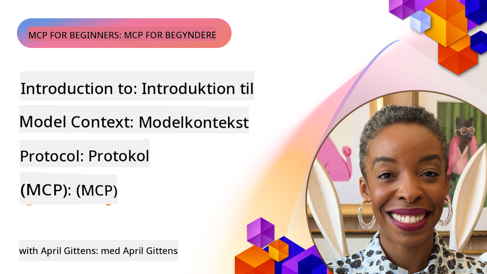
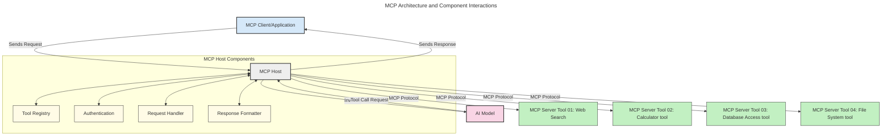
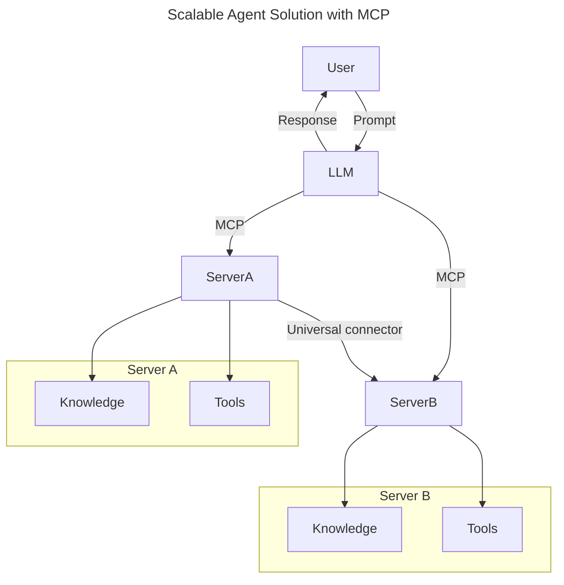
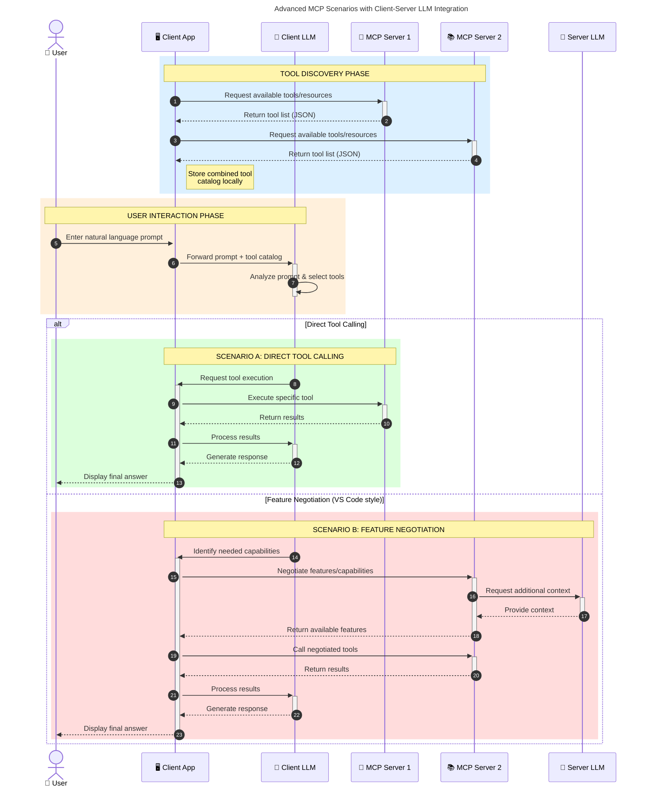

<!--
CO_OP_TRANSLATOR_METADATA:
{
  "original_hash": "0df1ee78a6dd8300f3a040ca5b411c2e",
  "translation_date": "2025-08-18T15:25:54+00:00",
  "source_file": "00-Introduction/README.md",
  "language_code": "da"
}
-->
# Introduktion til Model Context Protocol (MCP): Hvorfor Det Er Vigtigt for Skalerbare AI-applikationer

_(Klik på billedet ovenfor for at se videoen til denne lektion)_

Generative AI-applikationer er et stort skridt fremad, da de ofte giver brugeren mulighed for at interagere med appen ved hjælp af naturlige sprogkommandoer. Men efterhånden som der investeres mere tid og ressourcer i sådanne apps, vil du gerne sikre dig, at du nemt kan integrere funktioner og ressourcer på en måde, der gør det let at udvide, at din app kan understøtte flere modeller, og håndtere forskellige modeldetaljer. Kort sagt, det er nemt at komme i gang med at bygge Gen AI-apps, men når de vokser og bliver mere komplekse, skal du begynde at definere en arkitektur og sandsynligvis bruge en standard for at sikre, at dine apps bygges på en konsistent måde. Her kommer MCP ind i billedet for at organisere tingene og tilbyde en standard.

---

## **🔍 Hvad er Model Context Protocol (MCP)?**

**Model Context Protocol (MCP)** er en **åben, standardiseret grænseflade**, der gør det muligt for store sprogmodeller (LLMs) at interagere problemfrit med eksterne værktøjer, API'er og datakilder. Den tilbyder en konsistent arkitektur, der forbedrer AI-modellers funktionalitet ud over deres træningsdata, hvilket muliggør smartere, skalerbare og mere responsive AI-systemer.

---

## **🎯 Hvorfor Standardisering i AI Er Vigtigt**

Efterhånden som generative AI-applikationer bliver mere komplekse, er det afgørende at vedtage standarder, der sikrer **skalerbarhed, udvidelsesmuligheder, vedligeholdelse** og **undgåelse af leverandørbinding**. MCP adresserer disse behov ved at:

- Forene integrationen mellem modeller og værktøjer
- Reducere skrøbelige, engangsløsninger
- Muliggøre, at flere modeller fra forskellige leverandører kan eksistere i ét økosystem

**Note:** Selvom MCP præsenterer sig som en åben standard, er der ingen planer om at standardisere MCP gennem eksisterende standardiseringsorganer som IEEE, IETF, W3C, ISO eller andre.

---

## **📚 Læringsmål**

Ved slutningen af denne artikel vil du kunne:

- Definere **Model Context Protocol (MCP)** og dens anvendelsesområder
- Forstå, hvordan MCP standardiserer kommunikation mellem modeller og værktøjer
- Identificere de centrale komponenter i MCP-arkitekturen
- Udforske virkelige anvendelser af MCP i erhvervs- og udviklingskontekster

---

## **💡 Hvorfor Model Context Protocol (MCP) Er Banebrydende**

### **🔗 MCP Løser Fragmentering i AI-interaktioner**

Før MCP krævede integration af modeller med værktøjer:

- Skræddersyet kode for hvert værktøj-model-par
- Ikke-standardiserede API'er for hver leverandør
- Hyppige fejl på grund af opdateringer
- Dårlig skalerbarhed med flere værktøjer

### **✅ Fordele ved MCP-standardisering**

| **Fordel**                | **Beskrivelse**                                                                |
|---------------------------|--------------------------------------------------------------------------------|
| Interoperabilitet         | LLM'er fungerer problemfrit med værktøjer fra forskellige leverandører         |
| Konsistens                | Ensartet adfærd på tværs af platforme og værktøjer                             |
| Genanvendelighed          | Værktøjer bygget én gang kan bruges på tværs af projekter og systemer          |
| Hurtigere udvikling       | Reducer udviklingstid med standardiserede, plug-and-play-grænseflader          |

---

## **🧱 Overblik over MCP-arkitektur på højt niveau**

MCP følger en **klient-server-model**, hvor:

- **MCP Hosts** kører AI-modellerne
- **MCP Clients** initierer forespørgsler
- **MCP Servers** leverer kontekst, værktøjer og funktioner

### **Nøglekomponenter:**

- **Ressourcer** – Statisk eller dynamisk data til modeller  
- **Prompter** – Foruddefinerede workflows til guidet generering  
- **Værktøjer** – Udførbare funktioner som søgning, beregninger  
- **Sampling** – Agentisk adfærd via rekursive interaktioner

---

## Hvordan MCP-servers fungerer

MCP-servers opererer på følgende måde:

- **Forespørgselsflow**:
    1. En forespørgsel initieres af en slutbruger eller software, der handler på deres vegne.
    2. **MCP Client** sender forespørgslen til en **MCP Host**, som administrerer AI-modelens runtime.
    3. **AI-modellen** modtager brugerens prompt og kan anmode om adgang til eksterne værktøjer eller data via en eller flere værktøjsopkald.
    4. **MCP Host**, ikke modellen direkte, kommunikerer med de relevante **MCP Server(s)** ved hjælp af den standardiserede protokol.
- **MCP Host-funktionalitet**:
    - **Værktøjsregister**: Vedligeholder en katalog over tilgængelige værktøjer og deres funktioner.
    - **Autentifikation**: Bekræfter tilladelser til værktøjsadgang.
    - **Forespørgselsbehandler**: Behandler indkommende værktøjsforespørgsler fra modellen.
    - **Responsformatter**: Strukturerer værktøjsoutput i et format, modellen kan forstå.
- **MCP Server-udførelse**:
    - **MCP Host** videresender værktøjsopkald til en eller flere **MCP Servers**, som hver eksponerer specialiserede funktioner (f.eks. søgning, beregninger, databaseforespørgsler).
    - **MCP Servers** udfører deres respektive operationer og returnerer resultater til **MCP Host** i et konsistent format.
    - **MCP Host** formaterer og videresender disse resultater til **AI-modellen**.
- **Responsafslutning**:
    - **AI-modellen** integrerer værktøjsoutput i et endeligt svar.
    - **MCP Host** sender dette svar tilbage til **MCP Client**, som leverer det til slutbrugeren eller den kaldende software.

## 👨‍💻 Hvordan man bygger en MCP-server (med eksempler)

MCP-servers giver dig mulighed for at udvide LLM-funktionalitet ved at levere data og funktioner. 

Klar til at prøve det? Her er sprog- og/eller stack-specifikke SDK'er med eksempler på oprettelse af simple MCP-servers i forskellige sprog/stacks:

- **Python SDK**: https://github.com/modelcontextprotocol/python-sdk

- **TypeScript SDK**: https://github.com/modelcontextprotocol/typescript-sdk

- **Java SDK**: https://github.com/modelcontextprotocol/java-sdk

- **C#/.NET SDK**: https://github.com/modelcontextprotocol/csharp-sdk

---

## 🌍 Virkelige anvendelser af MCP

MCP muliggør en bred vifte af applikationer ved at udvide AI-funktionalitet:

| **Applikation**              | **Beskrivelse**                                                                |
|------------------------------|--------------------------------------------------------------------------------|
| Integration af virksomhedsdata | Forbind LLM'er til databaser, CRM-systemer eller interne værktøjer             |
| Agentiske AI-systemer         | Muliggør autonome agenter med værktøjsadgang og beslutningsarbejdsflows        |
| Multimodale applikationer     | Kombiner tekst-, billede- og lydværktøjer i én samlet AI-app                   |
| Integration af realtidsdata   | Bring live-data ind i AI-interaktioner for mere præcise, aktuelle outputs      |

### 🧠 MCP = Universel standard for AI-interaktioner

Model Context Protocol (MCP) fungerer som en universel standard for AI-interaktioner, ligesom USB-C standardiserede fysiske forbindelser for enheder. I AI-verdenen tilbyder MCP en konsistent grænseflade, der gør det muligt for modeller (klienter) at integrere problemfrit med eksterne værktøjer og dataleverandører (servers). Dette eliminerer behovet for diverse, skræddersyede protokoller for hver API eller datakilde.

Under MCP følger et MCP-kompatibelt værktøj (kaldet en MCP-server) en ensartet standard. Disse servers kan liste de værktøjer eller handlinger, de tilbyder, og udføre disse handlinger, når de anmodes af en AI-agent. AI-agentplatforme, der understøtter MCP, er i stand til at opdage tilgængelige værktøjer fra servers og kalde dem via denne standardprotokol.

### 💡 Muliggør adgang til viden

Ud over at tilbyde værktøjer muliggør MCP også adgang til viden. Det gør det muligt for applikationer at give kontekst til store sprogmodeller (LLMs) ved at forbinde dem til forskellige datakilder. For eksempel kan en MCP-server repræsentere en virksomheds dokumentarkiv, hvilket gør det muligt for agenter at hente relevant information efter behov. En anden server kunne håndtere specifikke handlinger som at sende e-mails eller opdatere poster. Fra agentens perspektiv er disse blot værktøjer, den kan bruge—nogle værktøjer returnerer data (videnskontekst), mens andre udfører handlinger. MCP administrerer begge dele effektivt.

En agent, der forbinder til en MCP-server, lærer automatisk serverens tilgængelige funktioner og tilgængelige data gennem et standardformat. Denne standardisering muliggør dynamisk værktøjstilgængelighed. For eksempel gør tilføjelsen af en ny MCP-server til en agents system dens funktioner straks anvendelige uden yderligere tilpasning af agentens instruktioner.

Denne strømlinede integration stemmer overens med flowet vist i det følgende diagram, hvor servers leverer både værktøjer og viden, hvilket sikrer problemfri samarbejde på tværs af systemer.

### 👉 Eksempel: Skalerbar agentløsning

### 🔄 Avancerede MCP-scenarier med klient-side LLM-integration

Ud over den grundlæggende MCP-arkitektur er der avancerede scenarier, hvor både klient og server indeholder LLM'er, hvilket muliggør mere sofistikerede interaktioner. I det følgende diagram kunne **Client App** være en IDE med en række MCP-værktøjer tilgængelige for brug af LLM:

---

## 🔐 Praktiske fordele ved MCP

Her er de praktiske fordele ved at bruge MCP:

- **Aktualitet**: Modeller kan få adgang til opdateret information ud over deres træningsdata
- **Udvidelse af funktionalitet**: Modeller kan udnytte specialiserede værktøjer til opgaver, de ikke er trænet til
- **Reducerede hallucinationer**: Eksterne datakilder giver faktuel forankring
- **Privatliv**: Følsomme data kan forblive inden for sikre miljøer i stedet for at blive indlejret i prompts

---

## 📌 Vigtige pointer

De følgende er vigtige pointer for brugen af MCP:

- **MCP** standardiserer, hvordan AI-modeller interagerer med værktøjer og data
- Fremmer **udvidelsesmuligheder, konsistens og interoperabilitet**
- MCP hjælper med at **reducere udviklingstid, forbedre pålidelighed og udvide modelkapaciteter**
- Klient-server-arkitekturen **muliggør fleksible, udvidelige AI-applikationer**

---

## 🧠 Øvelse

Tænk på en AI-applikation, du er interesseret i at bygge.

- Hvilke **eksterne værktøjer eller data** kunne forbedre dens funktionalitet?
- Hvordan kunne MCP gøre integrationen **simplere og mere pålidelig?**

---

## Yderligere ressourcer

- [MCP GitHub Repository](https://github.com/modelcontextprotocol)

---

## Hvad er næste skridt

Næste: [Kapitel 1: Kernekoncepter](../01-CoreConcepts/README.md)

**Ansvarsfraskrivelse**:  
Dette dokument er blevet oversat ved hjælp af AI-oversættelsestjenesten [Co-op Translator](https://github.com/Azure/co-op-translator). Selvom vi bestræber os på nøjagtighed, skal det bemærkes, at automatiserede oversættelser kan indeholde fejl eller unøjagtigheder. Det originale dokument på dets oprindelige sprog bør betragtes som den autoritative kilde. For kritisk information anbefales professionel menneskelig oversættelse. Vi påtager os ikke ansvar for eventuelle misforståelser eller fejltolkninger, der måtte opstå som følge af brugen af denne oversættelse.